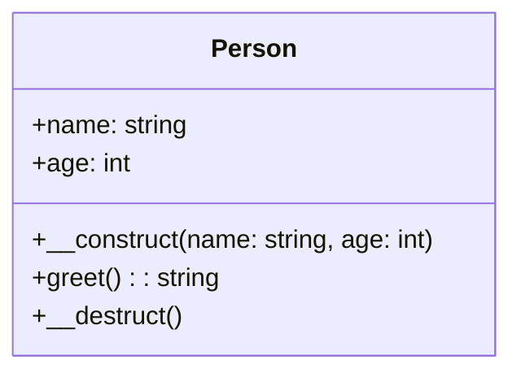
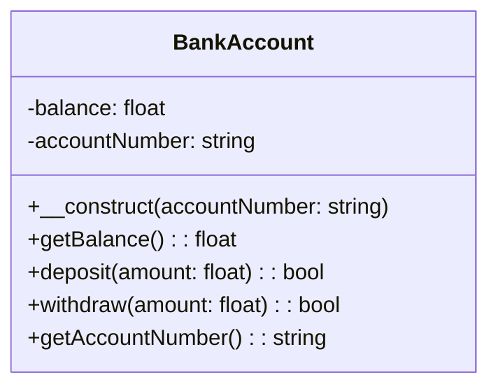
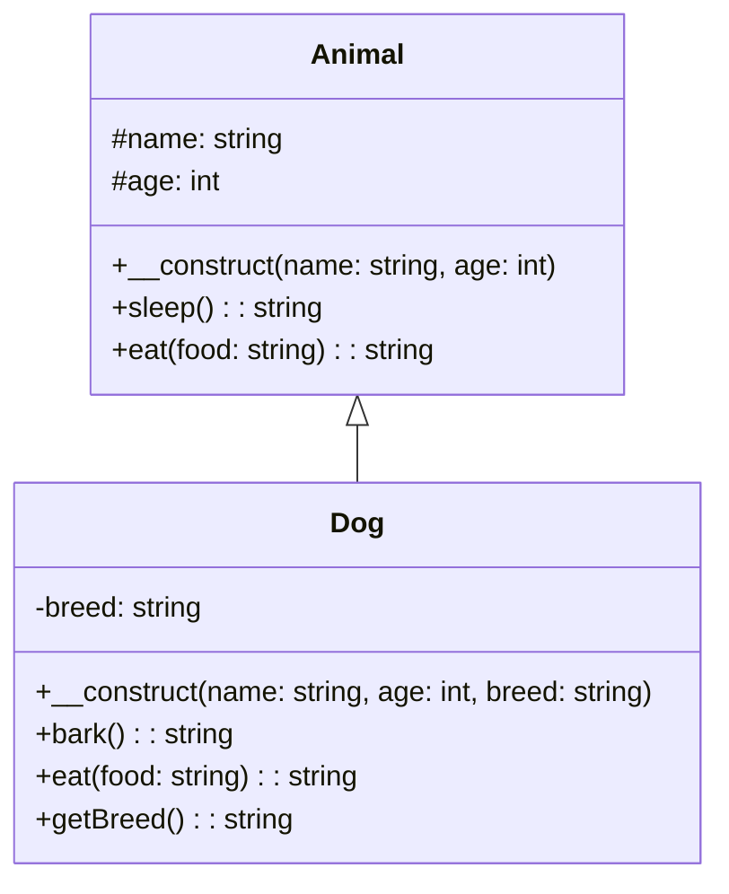
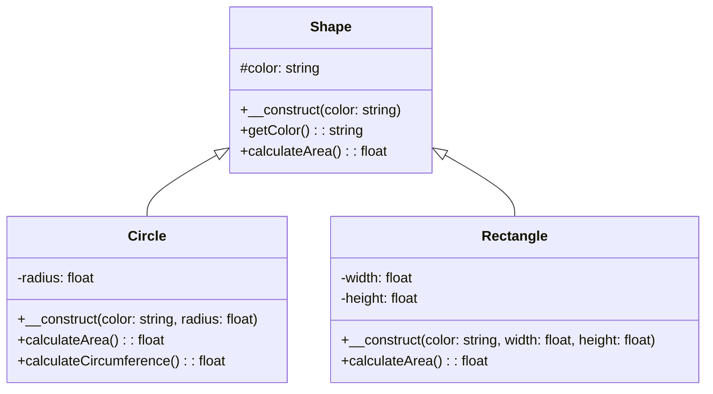
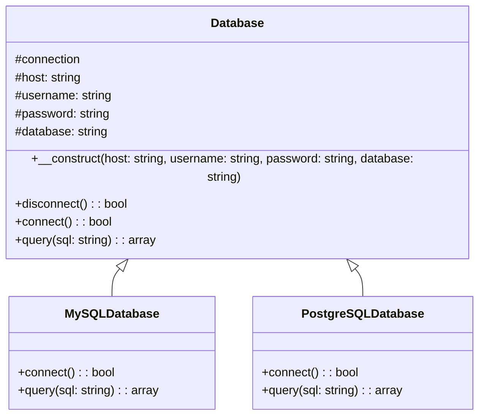
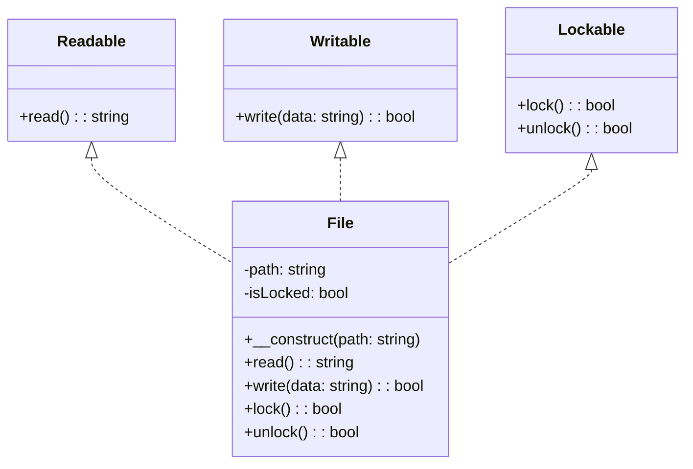
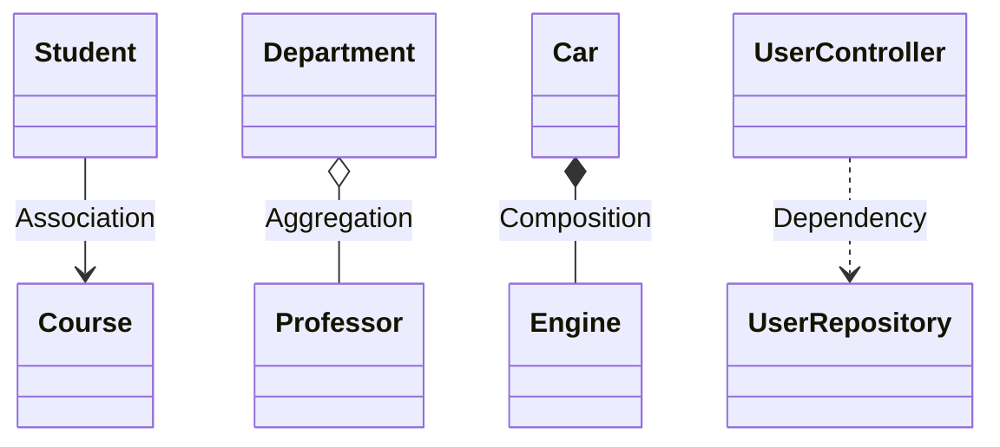

# 📑 PHP OOP Cheat Sheet

> **💡 Pro Tip:** "Keep this cheat sheet handy when working with PHP OOP - it's your quick reference guide to all the essential concepts and syntax patterns you need!"

This cheat sheet provides a quick reference for all the Object-Oriented Programming concepts in PHP with simple code examples and visual diagrams.

## 📋 Table of Contents

| Emoji | Topic | Description |
|:---:|---|---|
| 🏛️ | [Classes and Objects](#classes-and-objects) | The building blocks of OOP |
| 📊 | [Properties and Methods](#properties-and-methods) | Working with class data and behaviors |
| 🔒 | [Encapsulation](#encapsulation) | Controlling access to data |
| 🧬 | [Inheritance](#inheritance) | Creating parent-child relationships |
| 🔄 | [Polymorphism](#polymorphism) | Using objects of different classes interchangeably |
| 🧠 | [Abstraction](#abstraction) | Hiding complexity with abstract classes |
| 🔌 | [Interfaces](#interfaces) | Defining contracts between classes |
| 🔖 | [Namespaces](#namespaces) | Organizing code and avoiding conflicts |
| 🔗 | [OOP Relationships](#oop-relationships) | Understanding how classes relate to each other |
| 🔢 | [PHP Version Compatibility](#php-version-compatibility) | OOP features by PHP version |
| 🧪 | [OOP Design Principles](#oop-design-principles) | Best practices for effective OOP design |
| 🗂️ | [Quick Syntax Reference](#quick-syntax-reference) | Common OOP syntax patterns at a glance |

<a id="classes-and-objects"></a>
## 🏛️ Classes and Objects

### Basic Class Definition

```php
<?php
class Person {
    // Properties (attributes)
    public $name;
    public $age;
    
    // Constructor - called when object is created
    public function __construct(string $name, int $age = 30) {
        $this->name = $name;
        $this->age = $age;
    }
    
    // Method (behavior)
    public function greet() {
        return "Hello, my name is {$this->name} and I am {$this->age} years old.";
    }
    
    // Destructor - called when object is destroyed
    public function __destruct() {
        // Cleanup code here
    }
}

// Creating an object (instance)
$person = new Person("John");
echo $person->greet(); // Output: "Hello, my name is John and I am 30 years old."
```

### Class Diagram



> **💡 Key Point:** Classes are blueprints, while objects are instances of those blueprints with their own state.

<a id="properties-and-methods"></a>
## 📊 Properties and Methods

### Property Types

```php
<?php
class Product {
    // Property visibility levels
    public $name;           // Accessible from anywhere
    protected $price;       // Accessible within this class and child classes
    private $cost;          // Accessible only within this class
    
    // Static property (belongs to the class, not objects)
    public static $count = 0;
    
    // Property with default value
    public $inStock = true;
    
    // Type declaration (PHP 7.4+)
    public string $category;
    
    // Nullable type (PHP 7.4+)
    public ?string $description = null;
    
    // Readonly property (PHP 8.1+)
    public readonly string $id;
    
    // Class constants
    public const STATUS_ACTIVE = 'active';
    public const STATUS_INACTIVE = 'inactive';
    protected const TAX_RATE = 0.2; // With visibility (PHP 7.1+)
}
```

### Method Types

```php
<?php
class Calculator {
    // Regular method
    public function add($a, $b) {
        return $a + $b;
    }
    
    // Method with type declarations (PHP 7+)
    public function multiply(float $a, float $b): float {
        return $a * $b;
    }
    
    // Static method (called on the class, not objects)
    public static function square(int $num): int {
        return $num * $num;
    }
    
    // Method with default parameter
    public function divide($a, $b = 1): float {
        return $a / $b;
    }
    
    // Method with variable number of arguments
    public function sum(...$numbers): float {
        return array_sum($numbers);
    }
}

// Using methods
$calc = new Calculator();
echo $calc->add(5, 3);         // 8
echo $calc->multiply(2.5, 3);  // 7.5
echo Calculator::square(4);    // 16
echo $calc->divide(10);        // 10 (using default parameter)
echo $calc->sum(1, 2, 3, 4);   // 10
```

<a id="encapsulation"></a>
## 🔒 Encapsulation

### Using Getters and Setters

```php
<?php
class BankAccount {
    private $balance = 0;
    private $accountNumber;
    
    public function __construct(string $accountNumber) {
        $this->accountNumber = $accountNumber;
    }
    
    // Getter - provides controlled access to private property
    public function getBalance(): float {
        return $this->balance;
    }
    
    // Setter equivalent - with validation logic
    public function deposit(float $amount): bool {
        if ($amount <= 0) {
            return false;
        }
        $this->balance += $amount;
        return true;
    }
    
    public function withdraw(float $amount): bool {
        if ($amount <= 0 || $amount > $this->balance) {
            return false;
        }
        $this->balance -= $amount;
        return true;
    }
    
    // Read-only property (getter without setter)
    public function getAccountNumber(): string {
        return $this->accountNumber;
    }
}

$account = new BankAccount("12345");
$account->deposit(500);
echo $account->getBalance(); // 500
$account->withdraw(200);
echo $account->getBalance(); // 300
// $account->balance = 1000; // Error - private property
```

### Encapsulation Diagram



<a id="inheritance"></a>
## 🧬 Inheritance

### Basic Inheritance

```php
<?php
class Animal {
    protected $name;
    protected $age;
    
    public function __construct(string $name, int $age) {
        $this->name = $name;
        $this->age = $age;
    }
    
    public function sleep(): string {
        return "{$this->name} is sleeping.";
    }
    
    public function eat(string $food): string {
        return "{$this->name} is eating {$food}.";
    }
}

class Dog extends Animal {
    private $breed;
    
    public function __construct(string $name, int $age, string $breed) {
        parent::__construct($name, $age); // Call parent constructor
        $this->breed = $breed;
    }
    
    public function bark(): string {
        return "{$this->name} is barking!";
    }
    
    // Override parent method
    public function eat(string $food): string {
        return parent::eat($food) . " It's eating dog food.";
    }
    
    // Getter
    public function getBreed(): string {
        return $this->breed;
    }
}

$dog = new Dog("Buddy", 3, "Golden Retriever");
echo $dog->eat("kibble");   // "Buddy is eating kibble. It's eating dog food."
echo $dog->sleep(); // "Buddy is sleeping."
echo $dog->bark();  // "Buddy is barking!"
```

### Inheritance Diagram



<a id="polymorphism"></a>
## 🔄 Polymorphism

### Method Overriding

```php
<?php
abstract class Shape {
    protected $color;
    
    public function __construct(string $color) {
        $this->color = $color;
    }
    
    // Abstract method to be implemented by child classes
    abstract public function calculateArea(): float;
    
    public function getColor(): string {
        return $this->color;
    }
}

class Circle extends Shape {
    private $radius;
    
    public function __construct(string $color, float $radius) {
        parent::__construct($color);
        $this->radius = $radius;
    }
    
    // Implementation of abstract method
    public function calculateArea(): float {
        return pi() * $this->radius * $this->radius;
    }
    
    // Circle-specific method
    public function calculateCircumference(): float {
        return 2 * pi() * $this->radius;
    }
}

class Rectangle extends Shape {
    private $width;
    private $height;
    
    public function __construct(string $color, float $width, float $height) {
        parent::__construct($color);
        $this->width = $width;
        $this->height = $height;
    }
    
    // Implementation of abstract method
    public function calculateArea(): float {
        return $this->width * $this->height;
    }
}

// Polymorphic behavior
function displayArea(Shape $shape) {
    echo "Area: " . $shape->calculateArea() . " (Color: " . $shape->getColor() . ")";
}

$circle = new Circle("red", 5);
$rectangle = new Rectangle("blue", 4, 6);

displayArea($circle);     // Area: 78.54 (Color: red)
displayArea($rectangle);  // Area: 24 (Color: blue)
```

### Interface-based Polymorphism

```php
<?php
interface Drawable {
    public function draw(): string;
}

class Circle implements Drawable {
    private $radius;
    
    public function __construct(float $radius) {
        $this->radius = $radius;
    }
    
    public function draw(): string {
        return "Drawing circle with radius {$this->radius}";
    }
}

class Square implements Drawable {
    private $side;
    
    public function __construct(float $side) {
        $this->side = $side;
    }
    
    public function draw(): string {
        return "Drawing square with side {$this->side}";
    }
}

// Works with any Drawable object
function render(Drawable $shape) {
    echo $shape->draw();
}

render(new Circle(5));
render(new Square(10));
```

### Polymorphism Diagram



<a id="abstraction"></a>
## 🧠 Abstraction

### Abstract Class

```php
<?php
abstract class Database {
    protected $connection;
    protected $host;
    protected $username;
    protected $password;
    protected $database;
    
    public function __construct(string $host, string $username, string $password, string $database) {
        $this->host = $host;
        $this->username = $username;
        $this->password = $password;
        $this->database = $database;
    }
    
    // Common method for all database types
    public function disconnect(): bool {
        $this->connection = null;
        return true;
    }
    
    // Abstract methods that must be implemented by child classes
    abstract public function connect(): bool;
    abstract public function query(string $sql): array;
}

class MySQLDatabase extends Database {
    public function connect(): bool {
        // MySQL-specific connection code
        $this->connection = new PDO(
            "mysql:host={$this->host};dbname={$this->database}",
            $this->username,
            $this->password
        );
        return true;
    }
    
    public function query(string $sql): array {
        // MySQL-specific query execution
        $statement = $this->connection->prepare($sql);
        $statement->execute();
        return $statement->fetchAll(PDO::FETCH_ASSOC);
    }
}

class PostgreSQLDatabase extends Database {
    public function connect(): bool {
        // PostgreSQL-specific connection code
        $this->connection = new PDO(
            "pgsql:host={$this->host};dbname={$this->database}",
            $this->username,
            $this->password
        );
        return true;
    }
    
    public function query(string $sql): array {
        // PostgreSQL-specific query execution
        $statement = $this->connection->prepare($sql);
        $statement->execute();
        return $statement->fetchAll(PDO::FETCH_ASSOC);
    }
}
```

### Abstraction Diagram



<a id="interfaces"></a>
## 🔌 Interfaces

### Basic Interface

```php
<?php
interface Logger {
    // Method signatures only (no implementation)
    public function log(string $message): void;
    public function info(string $message): void;
    public function error(string $message): void;
}

class FileLogger implements Logger {
    private $logFile;
    
    public function __construct(string $logFile) {
        $this->logFile = $logFile;
    }
    
    public function log(string $message): void {
        $this->writeToFile("LOG", $message);
    }
    
    public function info(string $message): void {
        $this->writeToFile("INFO", $message);
    }
    
    public function error(string $message): void {
        $this->writeToFile("ERROR", $message);
    }
    
    private function writeToFile(string $level, string $message): void {
        $log = date('Y-m-d H:i:s') . " [$level] $message" . PHP_EOL;
        file_put_contents($this->logFile, $log, FILE_APPEND);
    }
}

// Using the interface
function logMessage(Logger $logger, string $message) {
    $logger->info($message);
}

$logger = new FileLogger("app.log");
logMessage($logger, "Application started");
```

### Multiple Interfaces

```php
<?php
interface Readable {
    public function read(): string;
}

interface Writable {
    public function write(string $data): bool;
}

interface Lockable {
    public function lock(): bool;
    public function unlock(): bool;
}

// Class implementing multiple interfaces
class File implements Readable, Writable, Lockable {
    private $path;
    private $isLocked = false;
    
    public function __construct(string $path) {
        $this->path = $path;
    }
    
    // From Readable interface
    public function read(): string {
        return file_get_contents($this->path);
    }
    
    // From Writable interface
    public function write(string $data): bool {
        return file_put_contents($this->path, $data) !== false;
    }
    
    // From Lockable interface
    public function lock(): bool {
        $this->isLocked = true;
        return true;
    }
    
    public function unlock(): bool {
        $this->isLocked = false;
        return true;
    }
}
```

### Interface Diagram



<a id="namespaces"></a>
## 🔖 Namespaces

### Basic Namespace

```php
<?php
namespace App\Models;

class User {
    private $username;
    private $email;
    
    public function __construct(string $username, string $email) {
        $this->username = $username;
        $this->email = $email;
    }
    
    // Methods...
}
```

### Using Namespaces

```php
<?php
// Using fully qualified name
$user = new \App\Models\User('johndoe', 'john@example.com');

// Using "use" statement
use App\Models\User;
$user = new User('johndoe', 'john@example.com');

// Using alias
use App\Models\User as UserModel;
$user = new UserModel('johndoe', 'john@example.com');

// Using function from namespace
use function App\Utilities\formatCurrency;
echo formatCurrency(29.99);

// Using constant from namespace
use const App\Config\API_KEY;
echo API_KEY;

// Using multiple classes from same namespace (PHP 7+)
use App\Models\{User, Product, Order};
```

<a id="oop-relationships"></a>
## 🔗 OOP Relationships

### Association, Aggregation, and Composition

```php
<?php
// Association - objects are related but exist independently
class Student {
    public function attendClass(Course $course) {
        // Student attends course but both exist independently
    }
}

// Aggregation - "has-a" relationship (weak ownership)
class Department {
    private $professors = []; // Department has professors
    
    public function addProfessor(Professor $prof) {
        $this->professors[] = $prof;
    }
    // Professors can exist without the department
}

// Composition - "owns-a" relationship (strong ownership)
class Car {
    private $engine; // Car owns an engine
    
    public function __construct() {
        $this->engine = new Engine(); // Engine created with car
    }
    // Engine cannot exist without the car
}
```

### Dependency

```php
<?php
// Class A depends on Class B
class UserController {
    public function store(Request $request) {
        // UserController depends on UserRepository
        $repository = new UserRepository();
        $repository->save($request->getData());
    }
}

// Better: Dependency Injection
class UserController {
    private $repository;
    
    public function __construct(UserRepository $repository) {
        $this->repository = $repository;
    }
    
    public function store(Request $request) {
        $this->repository->save($request->getData());
    }
}
```

### UML Relationship Diagram



<a id="php-version-compatibility"></a>
## 🔢 PHP Version Compatibility

| Feature | Minimum PHP Version | Description |
|---------|---------------------|-------------|
| Basic OOP | 5.0+ | Classes, objects, inheritance |
| Namespaces | 5.3+ | Organizing code into namespaces |
| Late static binding | 5.3+ | Static:: vs self:: |
| Traits | 5.4+ | Code reuse mechanism |
| Return type hints | 7.0+ | Declare method return types |
| Scalar type hints | 7.0+ | Type hints for primitives |
| Anonymous classes | 7.0+ | Classes without names |
| Nullable types | 7.1+ | Type hint with ? prefix |
| Visibility for constants | 7.1+ | public/protected/private constants |
| Typed properties | 7.4+ | Type declarations for properties |
| Union types | 8.0+ | Multiple possible types |
| Constructor property promotion | 8.0+ | Simplified property initialization |
| Match expression | 8.0+ | Switch statement upgrade |
| Readonly properties | 8.1+ | Properties that can't change |
| Enumerations | 8.1+ | First-class enums |
| Readonly classes | 8.2+ | Immutable classes |
| Constructor attribute | 8.2+ | Constructor tagging |

<a id="oop-design-principles"></a>
## 🧪 OOP Design Principles

### SOLID Principles

| Principle | Description | Example |
|-----------|-------------|---------|
| **S**ingle Responsibility | A class should have only one reason to change | Split User into UserAuthenticator and UserProfileManager |
| **O**pen/Closed | Open for extension, closed for modification | Add new payment methods without changing existing code |
| **L**iskov Substitution | Subtypes must be substitutable for their base types | Any Shape should work in displayArea() function |
| **I**nterface Segregation | Many specific interfaces are better than one general interface | Split Logger into ErrorLogger and ActivityLogger |
| **D**ependency Inversion | Depend on abstractions, not concrete implementations | Accept StorageInterface instead of MySQLStorage |

### Other Key Principles

| Principle | Description |
|-----------|-------------|
| DRY (Don't Repeat Yourself) | Avoid code duplication |
| KISS (Keep It Simple, Stupid) | Avoid unnecessary complexity |
| YAGNI (You Aren't Gonna Need It) | Don't add features until necessary |
| Composition over Inheritance | Favor object composition over class inheritance |
| Tell, Don't Ask | Tell objects what to do, don't ask for their data |
| Law of Demeter | Only talk to your immediate friends |

<a id="quick-syntax-reference"></a>
## 🗂️ Quick Syntax Reference

### Class Declaration

```php
<?php
class ClassName {
    // Properties and methods
}

// Abstract class
abstract class AbstractClassName {
    // Properties and methods
    abstract public function abstractMethod();
}

// Final class (cannot be extended)
final class FinalClassName {
    // Properties and methods
}
```

### Interface Declaration

```php
<?php
interface InterfaceName {
    // Method signatures only
    public function methodName();
}

// Interface inheritance
interface ChildInterface extends ParentInterface {
    // Additional method signatures
}
```

### Trait Declaration

```php
<?php
trait TraitName {
    // Properties and methods
    private $property;
    
    public function method() {
        // Implementation
    }
}

// Using a trait
class ClassName {
    use TraitName;
}

// Using multiple traits
class ClassName {
    use Trait1, Trait2;
}

// Resolving conflict with insteadof and as
class ClassName {
    use Trait1, Trait2 {
        Trait1::method insteadof Trait2;
        Trait2::method as methodAlias;
    }
}
```

### Inheritance & Implementation

```php
<?php
// Extending a class
class Child extends Parent {
    // Properties and methods
}

// Implementing an interface
class MyClass implements MyInterface {
    // Implementation of interface methods
}

// Extending and implementing
class MyClass extends ParentClass implements Interface1, Interface2 {
    // Properties and methods
}
```

### Magic Methods

| Method | Purpose |
|--------|---------|
| `__construct()` | Called when object is created |
| `__destruct()` | Called when object is destroyed |
| `__get($name)` | Accessing inaccessible properties |
| `__set($name, $value)` | Setting inaccessible properties |
| `__isset($name)` | Checking if inaccessible property exists |
| `__unset($name)` | Unsetting inaccessible property |
| `__call($name, $arguments)` | Calling inaccessible methods |
| `__callStatic($name, $arguments)` | Calling inaccessible static methods |
| `__toString()` | Converting object to string |
| `__clone()` | Cloning an object |
| `__sleep()` | Preparing for serialization |
| `__wakeup()` | Reconstructing after unserialization |
| `__invoke()` | Using object as function |
| `__debugInfo()` | var_dump() behavior |

---

[Back to Fundamentals](./README.md) | [Previous: Namespaces](./08-namespaces.md) | [Next: Advanced OOP Concepts](../02-advanced-oop/README.md)
