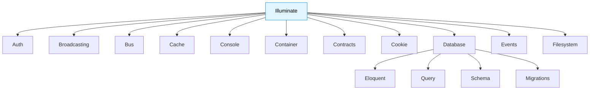

# 🔖 Advanced Namespaces in PHP

> **💡 Pro Tip:** "Well-structured namespaces are the backbone of maintainable PHP applications, especially as they grow in size and complexity."

## 📋 Table of Contents

| Emoji | Topic | Description |
|:---:|---|---|
| 🔄 | [Review & Beyond](#review--beyond) | Quick review and advancement from fundamentals |
| 🏗️ | [Namespace Architecture](#namespace-architecture) | Designing namespace structures for large applications |
| 🧪 | [Advanced Autoloading](#advanced-autoloading) | Beyond basic PSR-4 implementation |
| 🧩 | [Namespace Resolution Strategy](#namespace-resolution-strategy) | How PHP resolves names in detail |
| 🌐 | [Namespaces in Libraries](#namespaces-in-libraries) | Best practices for package developers |
| 📊 | [Testing & Namespaces](#testing--namespaces) | Mocking and testing namespace-heavy code |
| 💼 | [Real-world Architecture](#real-world-architecture) | How major frameworks organize namespaces |

<a id="review--beyond"></a>
## 🔄 Review & Beyond

If you're not already familiar with namespace basics, please review [Basic Namespaces](../01-fundamentals/08-namespaces.md) first.

In this advanced guide, we'll build on those fundamentals and explore how namespaces are used in professional-grade PHP applications.

<a id="namespace-architecture"></a>
## 🏗️ Namespace Architecture

### Domain-Driven Design (DDD) Approach

In large applications, namespaces often reflect the domain structure:

```php
<?php
// Customer bounded context
namespace App\Customer\Entity;
namespace App\Customer\Repository;
namespace App\Customer\Service;

// Order bounded context
namespace App\Order\Entity;
namespace App\Order\Repository;
namespace App\Order\Service;
```

> **🔑 Key Concept:** Organizing by domain/feature first, then by component type creates more cohesive code than organizing primarily by technical role.

### Framework-specific Conventions

Popular frameworks have established namespace patterns:

| Framework | Namespace Pattern | Example |
|-----------|------------------|---------|
| Laravel   | `App\Http\Controllers` | `App\Http\Controllers\UserController` |
| Symfony   | `App\Controller` | `App\Controller\UserController` |
| Slim      | `App\Action` | `App\Action\UserAction` |

<a id="advanced-autoloading"></a>
## 🧪 Advanced Autoloading

### Multiple Namespace Roots

Composer allows mapping multiple namespace prefixes to different directories:

```json
{
    "autoload": {
        "psr-4": {
            "App\\": "src/",
            "Legacy\\": "legacy/",
            "Tests\\": "tests/"
        }
    }
}
```

### Classmap Autoloading

For libraries without proper namespaces:

```json
{
    "autoload": {
        "classmap": [
            "third-party/library/",
            "database/migrations/"
        ]
    }
}
```

### Autoloading Files

For functions and global helpers:

```json
{
    "autoload": {
        "files": [
            "src/helpers.php"
        ]
    }
}
```

<a id="namespace-resolution-strategy"></a>
## 🧩 Namespace Resolution Strategy

PHP follows these steps to resolve a class name:

1. **Current namespace**:
   ```php
   <?php
   namespace App\Services;
   
   // PHP first looks for App\Services\DateTime
   $date = new DateTime(); 
   ```

2. **Import statements**:
   ```php
   <?php
   namespace App\Services;
   
   use DateTime; // Import from global namespace
   
   // Now uses the imported \DateTime
   $date = new DateTime();
   ```

3. **Global namespace** (with leading backslash):
   ```php
   <?php
   namespace App\Services;
   
   // Always uses global namespace
   $date = new \DateTime();
   ```

> **🧠 Advanced Tip:** In performance-critical applications, using fully qualified names can be marginally faster as PHP doesn't need to perform namespace resolution at runtime.

<a id="namespaces-in-libraries"></a>
## 🌐 Namespaces in Libraries

When creating shareable packages:

### Vendor Namespace Recommendation

```php
<?php
// Good: Uses vendor name (prevents collisions)
namespace YourCompany\PaymentGateway;

// Bad: Too generic, collision likely
namespace PaymentGateway;
```

### Namespace Depth Trade-offs

```php
<?php
// Too shallow - limited organization:
namespace Acme\Utilities;

class StringFormatter {}
class ArrayFormatter {}
class DateFormatter {}

// Too deep - cumbersome to use:
namespace Acme\Utilities\Formatting\Types\Date\Converters\Regional;

class IsoDateConverter {}
```

> **⚖️ Balance:** Aim for 2-4 levels of namespace depth for most applications.

<a id="testing--namespaces"></a>
## 📊 Testing & Namespaces

### Mocking Namespaced Classes

Using PHPUnit:

```php
<?php
use PHPUnit\Framework\TestCase;
use App\Services\PaymentProcessor;

class PaymentTest extends TestCase
{
    public function testPayment()
    {
        // Create a mock of the namespaced class
        $mock = $this->createMock(PaymentProcessor::class);
        
        $mock->method('process')
             ->willReturn(true);
             
        $this->assertTrue($mock->process(100));
    }
}
```

### Testing Namespace Organization

```
project/
├── src/
│   └── App/
│       └── Services/
└── tests/
    └── App/
        └── Services/
            └── PaymentProcessorTest.php
```

> **💡 Pro Tip:** Mirror your application's namespace structure in your test directory for clear organization.

<a id="real-world-architecture"></a>
## 💼 Real-world Architecture

Here's how Laravel organizes its core namespaces:



### Symfony Component Structure

Symfony uses a tiered namespace approach for its components:

```php
<?php
// Component namespace
namespace Symfony\Component\HttpFoundation;

// Bridge namespace (integration between components)
namespace Symfony\Bridge\Doctrine;

// Bundle namespace (plugins)
namespace Symfony\Bundle\FrameworkBundle;
```

## 🏋️ Advanced Practice Exercise

Create a library with a properly structured namespace that includes:

1. A primary service class
2. Event classes dispatched by the service 
3. Exception classes for error handling
4. Interface definitions for dependency injection
5. Value objects for immutable data

**Sample Solution Structure**

```php
<?php
// src/YourVendor/PackageName/Service/EmailService.php
namespace YourVendor\PackageName\Service;

use YourVendor\PackageName\Event\EmailSentEvent;
use YourVendor\PackageName\Exception\EmailDeliveryException;
use YourVendor\PackageName\Contract\TransportInterface;
use YourVendor\PackageName\ValueObject\EmailAddress;
use YourVendor\PackageName\ValueObject\EmailContent;

class EmailService {
    private $transport;
    
    public function __construct(TransportInterface $transport) {
        $this->transport = $transport;
    }
    
    public function send(EmailAddress $to, EmailContent $content) {
        try {
            $success = $this->transport->deliver($to, $content);
            
            if ($success) {
                return new EmailSentEvent($to, time());
            }
            
            throw new EmailDeliveryException("Failed to deliver email");
        } catch (\Exception $e) {
            throw new EmailDeliveryException("Error: " . $e->getMessage(), 0, $e);
        }
    }
}
```

## Up Next

Now that you've mastered advanced namespace techniques, learn about [Traits](./02-traits.md) - another powerful way to organize and reuse code.

[Back to Advanced OOP](./README.md) | [Next: Traits](./02-traits.md)
