# 🧩 Traits in PHP

> **💡 Pro Tip:** "Traits are PHP's solution to the multiple inheritance problem - they let you reuse code horizontally across your class hierarchy."

## 📋 Table of Contents

| Emoji | Topic | Description |
|:---:|---|---|
| 🌟 | [Introduction](#introduction) | What traits are and why they exist |
| 📝 | [Basic Syntax](#basic-syntax) | How to define and use traits |
| 🔀 | [Multiple Traits](#using-multiple-traits) | Combining several traits in one class |
| ⚔️ | [Conflict Resolution](#resolving-method-conflicts) | Handling method name collisions between traits |
| 🔒 | [Visibility Modification](#changing-method-visibility-in-traits) | Changing access levels of trait methods |
| 🧩 | [Abstract Methods](#abstract-methods-in-traits) | Requiring implementing classes to define methods |
| 🔄 | [Trait Composition](#traits-using-other-traits) | Using traits within other traits |
| ⚡ | [Static Members](#static-methods-and-properties-in-traits) | Static methods and properties in traits |
| 📊 | [Properties](#properties-in-traits) | Working with trait properties |
| 🏆 | [Benefits](#benefits-of-traits) | Advantages of using traits |
| ⚖️ | [Comparison](#traits-vs-other-code-reuse-mechanisms) | How traits compare to other solutions |
| ✅ | [Best Practices](#best-practices) | Recommended approaches for using traits |
| 🏋️ | [Practice Exercise](#practice-exercise) | Hands-on trait implementation |

<a id="introduction"></a>
## 🌟 Introduction

Traits are a mechanism for code reuse in single inheritance languages like PHP. They allow developers to share methods across different class hierarchies without requiring inheritance relationships between those classes.

> **🔑 Key Concept:** Unlike inheritance which creates an "is-a" relationship, traits create a "has-behavior" relationship, allowing classes from completely different hierarchies to share common functionality.

<a id="why-traits-exist"></a>
### 🤔 Why Do We Need Traits?

PHP, like many object-oriented languages, supports only single inheritance - a class can extend only one parent class. This creates limitations when you need functionality from multiple sources:

```mermaid
graph TD
    A[Problem: Need functionality from multiple sources] -->|Single Inheritance| B["❌ Can't extend multiple classes"]
    A -->|Solution 1| C["🔄 Deep inheritance hierarchies<br>(gets messy quickly)"]
    A -->|Solution 2| D["🧩 Traits<br>(horizontal code reuse)"]
    
    style A fill:#f9f9f9,stroke:#999,color:black
    style B fill:#ffebee,stroke:#d32f2f,color:black
    style C fill:#fff8e1,stroke:#ff8f00,color:black
    style D fill:#e8f5e9,stroke:#2e7d32,color:black
```



<a id="basic-syntax"></a>
## 📝 Basic Syntax

Defining a trait is similar to defining a class, but you use the `trait` keyword instead:

```php
<?php
// Define a trait
trait Logger {
    protected function log($message) {
        echo date('Y-m-d H:i:s') . ": $message\n";
    }
    
    public function info($message) {
        $this->log("[INFO] $message");
    }
    
    public function error($message) {
        $this->log("[ERROR] $message");
    }
}

// Use the trait in a class
class UserService {
    use Logger;  // This makes all Logger methods available in UserService
    
    public function createUser($username) {
        // Creating user logic
        $this->info("User $username created successfully");
    }
    
    public function deleteUser($userId) {
        // Deletion logic
        if (!$success) {
            $this->error("Failed to delete user $userId");
        }
    }
}

// Create and use the class
$service = new UserService();
$service->createUser("john_doe");  // Outputs: 2023-04-15 14:30:25: [INFO] User john_doe created successfully
```

> **💡 Pro Tip:** Use traits for cross-cutting concerns like logging, timestamping, or data serialization that aren't specific to a single class hierarchy.

<a id="using-multiple-traits"></a>
## 🔀 Using Multiple Traits

One of the powerful features of traits is the ability to use multiple traits in a single class:

```php
<?php
trait Logger {
    public function log($message) {
        echo "[LOG] $message\n";
    }
}

trait Timestampable {
    private $createdAt;
    private $updatedAt;
    
    public function getCreatedAt() {
        return $this->createdAt;
    }
    
    public function setCreatedAt() {
        $this->createdAt = new DateTime();
    }
    
    public function getUpdatedAt() {
        return $this->updatedAt;
    }
    
    public function setUpdatedAt() {
        $this->updatedAt = new DateTime();
    }
}

class User {
    // Use multiple traits by comma-separating them
    use Logger, Timestampable;
    
    private $name;
    
    public function __construct($name) {
        $this->name = $name;
        $this->setCreatedAt();
        $this->log("User {$this->name} created at " . $this->getCreatedAt()->format('Y-m-d H:i:s'));
    }
    
    public function updateProfile() {
        $this->setUpdatedAt();
        $this->log("User {$this->name} updated at " . $this->getUpdatedAt()->format('Y-m-d H:i:s'));
    }
}

$user = new User("Alice");  // Outputs: [LOG] User Alice created at 2023-04-15 14:35:10
$user->updateProfile();     // Outputs: [LOG] User Alice updated at 2023-04-15 14:35:15
```

> **🚫 Common Mistake:** Using traits doesn't create inheritance relationships. The class doesn't "extend" the trait, and `instanceof` will not work with traits.

<a id="resolving-method-conflicts"></a>
## ⚔️ Resolving Method Conflicts

When using multiple traits that contain methods with the same name, PHP will raise a fatal error unless you explicitly resolve the conflict:

```mermaid
graph TD
    A[Method Conflict Resolution] --> B["✅ Use insteadof Operator<br>Choose one implementation over another"]
    A --> C["🔄 Use as Operator<br>Create aliases for methods"]
    
    B --> D["trait A, trait B {<br>A::method insteadof B<br>}"]
    C --> E["trait A, trait B {<br>B::method as alternativeMethod<br>}"]
    
    style A fill:#f8f9fa,stroke:#495057,color:black
    style B fill:#e9ecef,stroke:#495057,color:black
    style C fill:#e9ecef,stroke:#495057,color:black
    style D fill:#e9ecef,stroke:#495057,color:black
    style E fill:#e9ecef,stroke:#495057,color:black
```



### 💻 Code Example

```php
<?php
trait FileLogger {
    public function log($message) {
        file_put_contents('app.log', $message . PHP_EOL, FILE_APPEND);
    }
}

trait ConsoleLogger {
    public function log($message) {
        echo $message . PHP_EOL;
    }
}

class Service {
    // Method 1: Use insteadof to choose one implementation
    use FileLogger, ConsoleLogger {
        // Use FileLogger's log method instead of ConsoleLogger's
        FileLogger::log insteadof ConsoleLogger;
    }
}

class AnotherService {
    // Method 2: Use as to alias a method
    use FileLogger, ConsoleLogger {
        // Use FileLogger's log method instead of ConsoleLogger's
        FileLogger::log insteadof ConsoleLogger;
        // Create an alias for ConsoleLogger's log method
        ConsoleLogger::log as consoleLog;
    }
    
    public function doSomething() {
        $this->log("Logged to file");           // Uses FileLogger::log
        $this->consoleLog("Logged to console");  // Uses ConsoleLogger::log
    }
}

$service = new AnotherService();
$service->log("This goes to file");         // Writes to app.log
$service->consoleLog("This goes to screen"); // Outputs to console
```

> **🔑 Key Point:** The `insteadof` operator permanently chooses one trait's method implementation over another, while the `as` operator creates an alias allowing access to both implementations.

<a id="changing-method-visibility-in-traits"></a>
## 🔒 Changing Method Visibility in Traits

You can change the visibility (public, protected, private) of trait methods when using them:

```php
<?php
trait Helper {
    public function helperMethod() {
        return "I'm helping!";
    }
}

class Service {
    // Make the trait method protected instead of public
    use Helper {
        helperMethod as protected;
    }
    
    public function doWork() {
        // We can use helperMethod because it's protected, not private
        return "Work done with: " . $this->helperMethod();
    }
}

class AnotherService {
    // Rename and change visibility
    use Helper {
        helperMethod as private myHelper;
    }
    
    public function doSpecialWork() {
        return "Special work with: " . $this->myHelper();
    }
}

$service = new Service();
// $service->helperMethod(); // Error! Method is now protected
echo $service->doWork();      // Works fine: "Work done with: I'm helping!"

$another = new AnotherService();
echo $another->doSpecialWork(); // "Special work with: I'm helping!"
```

> **💡 Pro Tip:** Changing visibility is useful when you want to use a trait's functionality internally but don't want to expose it as part of your class's public API.

<a id="abstract-methods-in-traits"></a>
## 🧩 Abstract Methods in Traits

Traits can define abstract methods that must be implemented by the classes using the trait:

```php
<?php
trait Notifiable {
    // Define requirements for classes using this trait
    abstract protected function getEmail();
    abstract protected function getName();
    
    public function sendNotification($message) {
        $email = $this->getEmail();
        $name = $this->getName();
        echo "Sending '$message' to $name ($email)";
    }
}

class User {
    use Notifiable;
    
    private $email;
    private $name;
    
    public function __construct($name, $email) {
        $this->name = $name;
        $this->email = $email;
    }
    
    // Implement the abstract methods required by the trait
    protected function getEmail() {
        return $this->email;
    }
    
    protected function getName() {
        return $this->name;
    }
}

$user = new User("John Doe", "john@example.com");
$user->sendNotification("Your account has been created");
// Output: Sending 'Your account has been created' to John Doe (john@example.com)
```

> **🔑 Key Concept:** Abstract methods in traits create a kind of "contract" that classes must fulfill to use the trait, similar to interfaces but with the added benefit of shared implementation code.

<a id="traits-using-other-traits"></a>
## 🔄 Traits Using Other Traits

Since PHP 5.4, traits can also use other traits, enabling trait composition:

```mermaid
graph TD
    A[🔧 Formatter Trait] --> B[📋 Logger Trait]
    B --> C[⚙️ Service Class]
    
    style A fill:#ffe0b2,stroke:#ff9800,color:black
    style B fill:#b3e5fc,stroke:#03a9f4,color:black
    style C fill:#c8e6c9,stroke:#4caf50,color:black
```



### 💻 Code Example

```php
<?php
trait Formatter {
    public function formatDate($date) {
        return $date->format('Y-m-d H:i:s');
    }
    
    public function formatCurrency($amount) {
        return '$' . number_format($amount, 2);
    }
}

trait Logger {
    // Logger trait uses the Formatter trait
    use Formatter;
    
    public function log($message, $date = null) {
        $date = $date ?: new DateTime();
        echo "[" . $this->formatDate($date) . "] $message\n";
    }
    
    public function logTransaction($amount, $description) {
        $formattedAmount = $this->formatCurrency($amount);
        $this->log("Transaction: $formattedAmount - $description");
    }
}

class PaymentService {
    // This class gets both Logger and Formatter methods
    use Logger;
    
    public function processPayment($amount, $description) {
        // Process the payment...
        $this->logTransaction($amount, $description);
    }
}

$service = new PaymentService();
$service->processPayment(99.95, "Monthly subscription");
// Output: [2023-04-15 15:22:45] Transaction: $99.95 - Monthly subscription
```

> **💡 Pro Tip:** Trait composition helps create modular, reusable pieces of functionality that can be combined in various ways without creating complex inheritance hierarchies.

<a id="static-methods-and-properties-in-traits"></a>
## ⚡ Static Methods and Properties in Traits

Traits can contain both static methods and static properties:

```php
<?php
trait Counter {
    private static $count = 0;
    
    public function increment() {
        self::$count++;
    }
    
    public static function getCount() {
        return self::$count;
    }
    
    public static function resetCount() {
        self::$count = 0;
    }
}

class Usage {
    use Counter;
}

class AnotherUsage {
    use Counter;
}

$usage = new Usage();
$usage->increment();
$usage->increment();
echo "Count: " . Usage::getCount() . "\n"; // Count: 2

$another = new AnotherUsage();
$another->increment();
echo "Count: " . AnotherUsage::getCount() . "\n"; // Count: 1 (not 3!)

// Each class using the trait gets its own copy of static properties
```

> **⚠️ Important:** Each class using a trait gets its own copy of the trait's static properties. They are not shared across all classes using the trait.

<a id="properties-in-traits"></a>
## 📊 Properties in Traits

Traits can define properties that will be added to the classes using them:

```php
<?php
trait HasTimestamps {
    private $createdAt;
    private $updatedAt;
    
    public function create() {
        $this->createdAt = new DateTime();
        $this->updatedAt = new DateTime();
        return $this;
    }
    
    public function update() {
        $this->updatedAt = new DateTime();
        return $this;
    }
    
    public function getCreatedAt() {
        return $this->createdAt;
    }
    
    public function getUpdatedAt() {
        return $this->updatedAt();
    }
}

class Article {
    use HasTimestamps;
    
    private $title;
    private $content;
    
    public function __construct($title, $content) {
        $this->title = $title;
        $this->content = $content;
        $this->create();
    }
}

$article = new Article("PHP Traits", "Traits are awesome...");
echo "Article created at: " . $article->getCreatedAt()->format('Y-m-d H:i:s');
```

> **⚠️ Warning:** If a class defines a property with the same name as a property in a trait, it will cause a fatal error unless the property has the same visibility and initial value.

<a id="benefits-of-traits"></a>
## 🌟 Benefits of Traits

```mermaid
graph TD
    A[🏆 Benefits of Traits] --> B["🔀 Horizontal code reuse<br>Share code across unrelated classes"]
    A --> C["🌲 Avoid deep inheritance trees<br>Keep class hierarchies flat"]
    A --> D["💎 Solve the diamond problem<br>No ambiguity in multiple inheritance"]
    A --> E["🔄 Keep code DRY<br>Define behavior once, use everywhere"]
    A --> F["📋 Organize code by behavior<br>Group related functionality"]
    
    style A fill:#e3f2fd,stroke:#1976d2,color:black
    style B fill:#f1f8e9,stroke:#7cb342,color:black
    style C fill:#f1f8e9,stroke:#7cb342,color:black
    style D fill:#f1f8e9,stroke:#7cb342,color:black
    style E fill:#f1f8e9,stroke:#7cb342,color:black
    style F fill:#f1f8e9,stroke:#7cb342,color:black
```



<a id="traits-vs-other-code-reuse-mechanisms"></a>
## ⚖️ Traits vs. Other Code Reuse Mechanisms

| Feature | Traits | Abstract Classes | Interfaces | Composition |
|---------|--------|------------------|------------|-------------|
| **📚 Code Reuse** | ✅ Yes | ✅ Yes | ❌ No (only signatures) | ✅ Yes |
| **🔄 Multiple Sources** | ✅ Yes (multiple traits) | ❌ No (single inheritance) | ✅ Yes (multiple interfaces) | ✅ Yes (multiple objects) |
| **📊 State (Properties)** | ✅ Yes | ✅ Yes | ❌ No | ✅ Yes |
| **📝 Required Methods** | ✅ Can define abstract methods | ✅ Can define abstract methods | ✅ All methods are abstract | ❌ No |
| **🏗️ Construction** | ❌ No constructors | ✅ Has constructors | ❌ No constructors | ✅ Has constructors |
| **🔍 Runtime Type Checking** | ❌ No `instanceof` | ✅ Works with `instanceof` | ✅ Works with `instanceof` | ✅ Can check contained objects |

<a id="best-practices"></a>
## ✅ Best Practices

1. **✂️ Use traits for cross-cutting concerns**: Features like logging, timestamps, serialization that cut across class hierarchies
2. **🎯 Keep traits focused**: Each trait should represent a single, coherent piece of functionality
3. **📛 Name traits descriptively**: Use adjectives or abilities (`Notifiable`, `Sortable`, `Timestampable`)
4. **📝 Document trait requirements**: Make it clear what a class needs to use a trait successfully
5. **⚠️ Be careful with property names**: Traits share the same namespace as the class, so property name conflicts can occur
6. **🏗️ Consider composition first**: If you can use composition instead, it's often clearer and more explicit
7. **🧪 Test traits in isolation**: Write tests for trait functionality separate from the classes that use them
8. **🔬 Avoid trait overuse**: Don't use traits just to avoid typing—they should represent meaningful shared behaviors
9. **📌 Use abstract methods sparingly**: Define only what's absolutely necessary for the trait to function
10. **🔍 Prefer explicit over implicit**: Make trait usage clear to improve code readability

<a id="practice-exercise"></a>
## 🏋️ Practice Exercise

Create a trait system for an e-commerce application with:

1. A `Discountable` trait that adds discount-related functionality
2. A `Taxable` trait for tax calculations
3. A `PriceFormatter` trait for consistent price formatting
4. Product classes that use these traits appropriately

**Sample Solution**

```php
<?php
// Price formatter trait
trait PriceFormatter {
    public function formatPrice($price) {
        return '$' . number_format($price, 2);
    }
}

// Discountable trait
trait Discountable {
    use PriceFormatter;
    
    private $discountRate = 0;
    
    public function setDiscountRate($rate) {
        if ($rate < 0 || $rate > 1) {
            throw new InvalidArgumentException("Discount rate must be between 0 and 1");
        }
        $this->discountRate = $rate;
    }
    
    public function getDiscountedPrice($price) {
        $discounted = $price * (1 - $this->discountRate);
        return $discounted;
    }
    
    public function getFormattedDiscountedPrice($price) {
        return $this->formatPrice($this->getDiscountedPrice($price));
    }
}

// Taxable trait
trait Taxable {
    use PriceFormatter;
    
    private $taxRate = 0;
    
    public function setTaxRate($rate) {
        if ($rate < 0) {
            throw new InvalidArgumentException("Tax rate cannot be negative");
        }
        $this->taxRate = $rate;
    }
    
    public function getPriceWithTax($price) {
        return $price * (1 + $this->taxRate);
    }
    
    public function getFormattedPriceWithTax($price) {
        return $this->formatPrice($this->getPriceWithTax($price));
    }
}

// Product class
class Product {
    use Discountable, Taxable {
        // If both traits had a formatPrice method, we would resolve conflicts here
    }
    
    private $name;
    private $price;
    
    public function __construct($name, $price, $discountRate = 0, $taxRate = 0.1) {
        $this->name = $name;
        $this->price = $price;
        $this->setDiscountRate($discountRate);
        $this->setTaxRate($taxRate);
    }
    
    public function getName() {
        return $this->name;
    }
    
    public function getPrice() {
        return $this->price;
    }
    
    public function getFormattedPrice() {
        return $this->formatPrice($this->price);
    }
    
    public function getFinalPrice() {
        // Apply discount first, then tax
        $discounted = $this->getDiscountedPrice($this->price);
        return $this->getPriceWithTax($discounted);
    }
    
    public function getFormattedFinalPrice() {
        return $this->formatPrice($this->getFinalPrice());
    }
    
    public function getProductSummary() {
        return sprintf(
            "Product: %s\nOriginal Price: %s\nDiscounted Price: %s\nFinal Price (with tax): %s",
            $this->name,
            $this->getFormattedPrice(),
            $this->getFormattedDiscountedPrice($this->price),
            $this->getFormattedFinalPrice()
        );
    }
}

// Usage example
$product = new Product("Smartphone", 499.99, 0.1, 0.08);  // 10% discount, 8% tax
echo $product->getProductSummary();

/*
Output:
Product: Smartphone
Original Price: $499.99
Discounted Price: $449.99
Final Price (with tax): $485.99
*/
```

## Up Next

Now that you understand traits, learn about [Anonymous Classes](./03-anonymous-classes.md) Creating one-off class instances 

[Back to Advanced OOP](./README.md) | [Previous: Namespaces](./01-namespaces.md) | [Next: Anonymous Classes](./03-anonymous-classes.md)
