# 🎭 Anonymous Classes in PHP

> **💡 Pro Tip:** "Anonymous classes are perfect for creating one-time-use objects without cluttering your codebase with named class declarations."

## 📋 Table of Contents

| Emoji | Topic | Description |
|:---:|---|---|
| 🌟 | [Introduction](#introduction) | What are anonymous classes and why use them |
| 📝 | [Basic Syntax](#basic-syntax) | How to define and use anonymous classes |
| 🏗️ | [Constructors & Parameters](#constructors-and-parameters) | Initializing anonymous classes |
| 🔗 | [Inheritance & Interfaces](#extending-classes-and-implementing-interfaces) | Using inheritance with anonymous classes |
| 💼 | [Use Cases](#use-cases) | Practical applications |
| 🔄 | [Variable Capture](#capturing-variables-in-anonymous-classes) | Using outside variables inside anonymous classes |
| ⚖️ | [Anonymous vs Closures](#anonymous-classes-vs-closures) | Comparing different approaches |
| ⚡ | [Performance](#performance-considerations) | Runtime efficiency |
| ✅ | [Best Practices](#best-practices) | When and how to use anonymous classes |
| ⛔ | [When to Avoid](#when-not-to-use-anonymous-classes) | Situations where named classes are better |
| 🏋️ | [Practice Exercise](#practice-exercise) | Hands-on learning |

<a id="introduction"></a>
## 🌟 Introduction

Anonymous classes, introduced in PHP 7.0, allow you to define and instantiate a class in a single expression without having to explicitly name it. They are useful for creating one-off objects that you need to use immediately and don't need to reference elsewhere in your code.

> **🔑 Key Concept:** Anonymous classes are fully functional PHP classes that exist without a name. They're defined and instantiated in a single step, making them perfect for temporary, local usage.

### 📊 When to Consider Anonymous Classes

```mermaid
graph TD
    A[🎭 Anonymous Classes] --> B["⏱️ Temporary one-time use classes"]
    A --> C["📛 No explicit class name required"]
    A --> D["⚡ Instantiated immediately"]
    A --> E["🔌 Can extend classes and implement interfaces"]
    
    style A fill:#e3f2fd,stroke:#1976d2,color:black
    style B fill:#e8f5e9,stroke:#388e3c,color:black
    style C fill:#e8f5e9,stroke:#388e3c,color:black
    style D fill:#e8f5e9,stroke:#388e3c,color:black
    style E fill:#e8f5e9,stroke:#388e3c,color:black
```



> **🔍 Real-world analogy:** Anonymous classes are like disposable containers—useful for a specific task, then discarded. You don't need to give a name to a paper cup you'll use once and throw away.

<a id="basic-syntax"></a>
## 📝 Basic Syntax

Creating an anonymous class is straightforward using the `new class` syntax:

```php
<?php
// Creating an anonymous class instance
$logger = new class {
    public function log($message) {
        echo date('Y-m-d H:i:s') . ": $message\n";
    }
};

// Using the instance
$logger->log("This is a message from an anonymous class");
// Output: 2023-04-15 10:23:45: This is a message from an anonymous class
```

> **💡 Pro Tip:** While anonymous classes don't have names you can reference, the variable that holds the instance becomes your way to access and use the class.

<a id="constructors-and-parameters"></a>
## 🏗️ Constructors and Parameters

Like regular classes, anonymous classes can have constructors that accept parameters:

```php
<?php
$formatter = new class("Y-m-d H:i:s") {
    private $format;
    
    public function __construct($format) {
        $this->format = $format;
    }
    
    public function formatDate($date) {
        return $date->format($this->format);
    }
};

echo $formatter->formatDate(new DateTime());
// Output: 2023-04-15 10:30:25 (based on current date/time)

// You can create another with different parameters
$shortFormatter = new class("m/d/Y") {
    private $format;
    
    public function __construct($format) {
        $this->format = $format;
    }
    
    public function formatDate($date) {
        return $date->format($this->format);
    }
};

echo $shortFormatter->formatDate(new DateTime());
// Output: 04/15/2023 (based on current date)
```

> **⚠️ Important:** Parameters for the anonymous class constructor go between the parentheses immediately following the `new class` keywords, before the opening brace.

<a id="extending-classes-and-implementing-interfaces"></a>
## 🔗 Extending Classes and Implementing Interfaces

Anonymous classes can extend other classes and implement interfaces, just like named classes:

```php
<?php
interface Logger {
    public function log($message);
}

abstract class BaseLogger implements Logger {
    protected function getTimestamp() {
        return date('Y-m-d H:i:s');
    }
}

$logger = new class extends BaseLogger {
    // We must implement log() because it's defined in the Logger interface
    // that BaseLogger implements
    public function log($message) {
        echo $this->getTimestamp() . ": $message\n";
    }
    
    // We can also add additional methods
    public function logError($message) {
        $this->log("ERROR: " . $message);
    }
};

$logger->log("Operation completed successfully");
$logger->logError("Something went wrong");
// Output:
// 2023-04-15 10:45:30: Operation completed successfully
// 2023-04-15 10:45:30: ERROR: Something went wrong
```

> **🔑 Key Point:** Anonymous classes follow the same inheritance and implementation rules as named classes, making them fully capable of participating in your object hierarchy.

<a id="use-cases"></a>
## 💼 Use Cases

Anonymous classes shine in several practical scenarios:

### 🧪 1. Mock Objects for Testing

```php
<?php
function testUserRepository() {
    // Create a mock user repository without defining a separate class
    $mockRepo = new class {
        public function findById($id) {
            return [
                'id' => $id,
                'name' => 'Test User',
                'email' => 'test@example.com'
            ];
        }
    };
    
    $user = $mockRepo->findById(1);
    assert($user['name'] === 'Test User');
    echo "Test passed!\n";
}

testUserRepository();
```

### 📢 2. Simple Event Listeners

```php
<?php
class EventDispatcher {
    private $listeners = [];
    
    public function addListener($event, $listener) {
        $this->listeners[$event][] = $listener;
    }
    
    public function dispatch($event, $data) {
        if (!isset($this->listeners[$event])) {
            return;
        }
        
        foreach ($this->listeners[$event] as $listener) {
            $listener($data);
        }
    }
}

$dispatcher = new EventDispatcher();

// Add an anonymous class as a listener
$dispatcher->addListener('user.created', new class {
    public function __invoke($data) {
        echo "User {$data['name']} was created with ID {$data['id']}\n";
    }
});

$dispatcher->dispatch('user.created', [
    'id' => 1,
    'name' => 'John Doe'
]);
// Output: User John Doe was created with ID 1
```

### 🔄 3. Strategy Pattern Implementation

```php
<?php
interface SortingStrategy {
    public function sort(array $data): array;
}

function sortData(array $data, SortingStrategy $strategy) {
    return $strategy->sort($data);
}

$data = [5, 3, 9, 1, 7];

// Using anonymous class to implement a specific sorting strategy
$sortedAsc = sortData($data, new class implements SortingStrategy {
    public function sort(array $data): array {
        sort($data);
        return $data;
    }
});

$sortedDesc = sortData($data, new class implements SortingStrategy {
    public function sort(array $data): array {
        rsort($data);
        return $data;
    }
});

print_r($sortedAsc);  // [1, 3, 5, 7, 9]
print_r($sortedDesc); // [9, 7, 5, 3, 1]
```

### 🎮 4. Fluent Interface Builder

```php
<?php
$query = new class {
    private $table;
    private $conditions = [];
    private $orderBy;
    
    public function from($table) {
        $this->table = $table;
        return $this;
    }
    
    public function where($field, $operator, $value) {
        $this->conditions[] = [
            'field' => $field,
            'operator' => $operator,
            'value' => $value
        ];
        return $this;
    }
    
    public function orderBy($field, $direction = 'ASC') {
        $this->orderBy = [
            'field' => $field,
            'direction' => $direction
        ];
        return $this;
    }
    
    public function toSql() {
        $sql = "SELECT * FROM {$this->table}";
        
        if (!empty($this->conditions)) {
            $sql .= " WHERE ";
            $whereClauses = [];
            
            foreach ($this->conditions as $condition) {
                $whereClauses[] = "{$condition['field']} {$condition['operator']} '{$condition['value']}'";
            }
            
            $sql .= implode(' AND ', $whereClauses);
        }
        
        if ($this->orderBy) {
            $sql .= " ORDER BY {$this->orderBy['field']} {$this->orderBy['direction']}";
        }
        
        return $sql . ";";
    }
};

$sql = $query->from('users')
    ->where('age', '>', 18)
    ->where('status', '=', 'active')
    ->orderBy('created_at', 'DESC')
    ->toSql();
    
echo $sql;
// Output: SELECT * FROM users WHERE age > '18' AND status = 'active' ORDER BY created_at DESC;
```

<a id="capturing-variables-in-anonymous-classes"></a>
## 🔄 Capturing Variables in Anonymous Classes

You can pass outside variables into an anonymous class through the constructor:

```php
<?php
$prefix = "LOG";
$logLevel = "INFO";

$logger = new class($prefix, $logLevel) {
    private $prefix;
    private $level;
    
    public function __construct($prefix, $level) {
        $this->prefix = $prefix;
        $this->level = $level;
    }
    
    public function log($message) {
        $timestamp = date('Y-m-d H:i:s');
        echo "[$timestamp] [{$this->level}] [{$this->prefix}] $message\n";
    }
};

$logger->log("System initialized");
// Output: [2023-04-15 11:15:20] [INFO] [LOG] System initialized
```

> **🚫 Common Mistake:** Unlike closures, anonymous classes don't automatically inherit variables from the parent scope. You need to explicitly pass them to the constructor.

<a id="anonymous-classes-vs-closures"></a>
## ⚖️ Anonymous Classes vs. Closures

Both anonymous classes and closures allow for creating one-off functionalities, but they have different use cases:

```php
<?php
// Using a closure
$loggerClosure = function($message) {
    echo date('Y-m-d H:i:s') . ": $message\n";
};

// Using an anonymous class
$loggerClass = new class {
    public function __invoke($message) {
        echo date('Y-m-d H:i:s') . ": $message\n";
    }
};

// Both can be called similarly
$loggerClosure("Message from closure");
$loggerClass("Message from anonymous class");
```

### When to Choose What

| Feature | Closures | Anonymous Classes |
|---------|----------|-------------------|
| **🔄 Complexity** | Simple, single function | Multiple methods/properties |
| **📊 State** | Limited, captured variables | Full object state |
| **🧩 Interfaces** | Cannot implement interfaces | Can implement interfaces |
| **🔄 Inheritance** | Not possible | Can extend classes |
| **💾 Memory** | Generally lighter weight | Slightly heavier |
| **🛠️ Use case** | Simple callbacks | Complex one-off objects |
| **📝 Syntax** | More compact | More verbose |
| **🔍 Variable capture** | Automatic with `use` | Manual via constructor |

> **💡 Pro Tip:** Use closures for simple callbacks and lambda functions. Use anonymous classes when you need multiple methods, properties, or object-oriented features like inheritance.

<a id="performance-considerations"></a>
## ⚡ Performance Considerations

Anonymous classes are compiled once and then reused, similar to named classes. However, there are some performance aspects to consider:

```php
<?php
// This creates a new class definition every time the script runs
$obj = new class { /* ... */ };

// This reuses an existing class definition
class NamedClass { /* ... */ }
$obj = new NamedClass();
```

Performance impacts:

1. **🔄 Definition overhead:** Anonymous classes are defined at runtime, adding a small performance cost.
2. **🧠 Memory usage:** Each anonymous class is stored in memory as a unique class.
3. **⚡ Reuse:** Within a single request, instances of the same anonymous class definition reuse the same class structure.
4. **🔍 Opcache impact:** Anonymous classes benefit from opcache just like regular classes.

> **🧠 Advanced Tip:** For extremely performance-critical applications, prefer named classes that can be autoloaded and optimized by opcache more effectively.

<a id="best-practices"></a>
## ✅ Best Practices

1. **📏 Keep anonymous classes small:** If you need complex functionality, consider using a named class
2. **⏱️ Use for one-off implementations:** Ideal for situations where you need to use a class only once
3. **📚 Consider readability:** Make sure your anonymous class doesn't make code harder to understand
4. **♻️ Use named classes for reusability:** If you need to reuse the class, give it a name
5. **🧩 Use for simple interface implementations:** Particularly useful for quick implementation of interfaces
6. **🏢 Dependency injection:** Anonymous classes can be great for creating test doubles in unit tests
7. **📦 Encapsulation:** Use them to encapsulate temporary functionality without exposing unnecessary classes

<a id="when-not-to-use-anonymous-classes"></a>
## ⛔ When Not to Use Anonymous Classes

1. When you need to reuse the class elsewhere in your code
2. When the class is large or complex
3. When you need to extend the class later
4. When you need to use the class name for type hinting
5. In your public API where consumers might need to reference specific types

<a id="practice-exercise"></a>
## 🏋️ Practice Exercise

Create an interface `Validator` with a method `validate($data)` that returns true or false. Then implement three different anonymous class validators:

1. A string length validator
2. An email validator
3. A number range validator

Use these validators in a form validation scenario.

**Sample Solution**

```php
<?php
// Define the validator interface
interface Validator {
    public function validate($data): bool;
    public function getMessage(): string;
}

// Create a validator registry
class ValidatorRegistry {
    private $validators = [];
    
    public function register($field, Validator $validator) {
        $this->validators[$field] = $validator;
    }
    
    public function validate($data) {
        $errors = [];
        
        foreach ($this->validators as $field => $validator) {
            if (isset($data[$field]) && !$validator->validate($data[$field])) {
                $errors[$field] = $validator->getMessage();
            }
        }
        
        return $errors;
    }
}

// Create the registry
$registry = new ValidatorRegistry();

// Register validators using anonymous classes
$registry->register('username', new class implements Validator {
    private $minLength = 5;
    private $maxLength = 20;
    
    public function validate($data): bool {
        $length = strlen($data);
        return $length >= $this->minLength && $length <= $this->maxLength;
    }
    
    public function getMessage(): string {
        return "Username must be between {$this->minLength} and {$this->maxLength} characters.";
    }
});

$registry->register('email', new class implements Validator {
    public function validate($data): bool {
        return filter_var($data, FILTER_VALIDATE_EMAIL) !== false;
    }
    
    public function getMessage(): string {
        return "Please provide a valid email address.";
    }
});

$registry->register('age', new class implements Validator {
    private $min = 18;
    private $max = 120;
    
    public function validate($data): bool {
        return is_numeric($data) && $data >= $this->min && $data <= $this->max;
    }
    
    public function getMessage(): string {
        return "Age must be between {$this->min} and {$this->max}.";
    }
});

// Test form data
$formData = [
    'username' => 'joe',          // too short
    'email' => 'not-an-email',    // invalid email
    'age' => 17                  // too young
];

$errors = $registry->validate($formData);

// Display errors
if (!empty($errors)) {
    echo "Form validation errors:\n";
    foreach ($errors as $field => $message) {
        echo "- {$field}: {$message}\n";
    }
}

/*
Output:
Form validation errors:
- username: Username must be between 5 and 20 characters.
- email: Please provide a valid email address.
- age: Age must be between 18 and 120.
*/
```

## Up Next

Now that you understand anonymous classes, learn about [🔗 Late Static Binding](./04-late-static-binding.md).

[Back to Advanced OOP](./README.md) | [Previous: 🧩 Traits](./02-traits.md) | [Next: 🔗 Late Static Binding](./04-late-static-binding.md)
