# 🔗 Late Static Binding in PHP

> **💡 Pro Tip:** "Late Static Binding unlocks the true potential of inheritance with static methods, allowing for polymorphic behavior that's resolved at runtime."

## 📋 Table of Contents

| Emoji | Topic | Description |
|:---:|---|---|
| 🌟 | [Introduction](#introduction) | What is Late Static Binding and why it matters |
| ❌ | [The Problem](#the-problem-with-self) | Limitations of the `self::` keyword |
| ✅ | [The Solution](#the-solution-static) | How `static::` solves the problem |
| 🧠 | [How It Works](#how-late-static-binding-works) | The mechanics behind LSB |
| 🛠️ | [Use Cases](#use-cases-for-late-static-binding) | Practical applications |
| ⚖️ | [Comparison](#static-vs-self-vs-this) | Understanding the differences |
| 🔀 | [Non-Static Contexts](#static-in-non-static-contexts) | Using LSB in object methods |
| 🔄 | [Forward Static Calls](#forward-static-calls) | Advanced technique for private methods |
| ✅ | [Best Practices](#best-practices) | Guidelines for effective use |
| ❗ | [Limitations](#limitations) | Important restrictions to know |
| 🏋️ | [Practice Exercise](#practice-exercise) | Hands-on coding challenge |

<a id="introduction"></a>
## 🌟 Introduction

Late Static Binding (LSB) is a feature introduced in PHP 5.3 that provides a way to reference the called class in a context of static inheritance. It resolves a critical limitation in PHP's object model, allowing static methods to be truly polymorphic.

> **🔑 Key Concept:** Late Static Binding lets a parent class "know" which child class was actually called at runtime, even when using static methods and properties.

```mermaid
graph TD
    A[🔗 Late Static Binding] --> B["🎯 References the called class<br>rather than the defined class"]
    A --> C["🔄 Uses 'static::' instead of 'self::'"]
    A --> D["⏱️ Resolves at runtime<br>not compile time"]
    A --> E["🔀 Enables polymorphism<br>for static methods"]
    
    style A fill:#e3f2fd,stroke:#1976d2,color:black
    style B fill:#e8f5e9,stroke:#388e3c,color:black
    style C fill:#e8f5e9,stroke:#388e3c,color:black
    style D fill:#e8f5e9,stroke:#388e3c,color:black
    style E fill:#e8f5e9,stroke:#388e3c,color:black
```



<a id="the-problem-with-self"></a>
## ❌ The Problem with `self::`

When using `self::` in a parent class method, it always refers to the class where the method is defined, not the class that was actually called. This limits polymorphism with static methods:

```php
<?php
class ParentClass {
    public static function who() {
        echo __CLASS__;
    }
    
    public static function test() {
        self::who(); // Always calls ParentClass::who(), regardless of which class called test()
    }
}

class ChildClass extends ParentClass {
    public static function who() {
        echo __CLASS__;
    }
}

// Output will be "ParentClass" not "ChildClass"
ChildClass::test(); // Outputs: ParentClass
```

> **🚫 Common Mistake:** Expecting `self::` to refer to the current class in the inheritance chain. It doesn't - it always refers to the class where the method is defined.

<a id="the-solution-static"></a>
## ✅ The Solution: `static::`

The `static::` keyword was introduced to solve this problem. It refers to the class that was initially called, not the one where the method is defined:

```mermaid
graph TD
    A[👨 ParentClass] --> B[👶 ChildClass]
    
    C[ParentClass::test] --> D["❌ self::who()"]
    D --> E["ParentClass::who()"]
    
    F[ParentClass::test] --> G["✅ static::who()"]
    G --> H["ChildClass::who()"]
    
    style A fill:#ffecb3,stroke:#ff9800,color:black
    style B fill:#c8e6c9,stroke:#4caf50,color:black
    style D fill:#ffccbc,stroke:#ff5722,color:black
    style G fill:#b2ebf2,stroke:#00acc1,color:black
```



### 💻 Code Example

```php
<?php
class ParentClass {
    public static function who() {
        echo __CLASS__;
    }
    
    public static function test() {
        static::who(); // Uses Late Static Binding - calls the version from the called class
    }
}

class ChildClass extends ParentClass {
    public static function who() {
        echo __CLASS__;
    }
}

// Now the output will be "ChildClass"
ChildClass::test(); // Outputs: ChildClass
```

> **💡 Pro Tip:** Think of `static::` as "the class in the variable on the left side of the :: when the method was called."

<a id="how-late-static-binding-works"></a>
## 🧠 How Late Static Binding Works

When you use `static::` instead of `self::`, PHP doesn't resolve the method call at compile time. Instead:

1. PHP keeps track of the original class that was called
2. When it encounters `static::`, it uses that original class to look up the method
3. This happens at runtime, not during compilation
4. This is why it's called "late" binding - the binding of method to class happens later

```php
<?php
class A {
    public static function who() {
        echo "A";
    }
    
    public static function test() {
        echo "Called from: ";
        static::who(); // This will be resolved at runtime
    }
}

class B extends A {
    public static function who() {
        echo "B";
    }
}

class C extends B {
    public static function who() {
        echo "C";
    }
}

A::test(); // Outputs: Called from: A
B::test(); // Outputs: Called from: B
C::test(); // Outputs: Called from: C
```

> **🔍 Under the Hood:** PHP maintains an internal "late static binding" class name that tracks which class was used on the left side of the `::` operator. The `static` keyword references this internal class name.

<a id="use-cases-for-late-static-binding"></a>
## 🛠️ Use Cases for Late Static Binding

### 1. 🏭 Creating Factory Methods

One of the most common uses for LSB is implementing reusable factory methods in a base class:

```php
<?php
abstract class Model {
    protected static $tableName = '';
    
    public static function create(array $attributes) {
        $model = new static(); // Use LSB to instantiate the called class
        // Set attributes
        return $model;
    }
    
    public static function findById($id) {
        $tableName = static::$tableName; // Use LSB to get the correct tableName
        echo "Finding in table: $tableName with ID: $id\n";
        // Query database using $tableName
        return new static(); // Return instance of the called class
    }
}

class User extends Model {
    protected static $tableName = 'users';
}

class Post extends Model {
    protected static $tableName = 'posts';
}

// Usage:
$user = User::create(['name' => 'John']);
$post = Post::findById(1); // Outputs: Finding in table: posts with ID: 1
```

> **💡 Pro Tip:** Without LSB, you'd have to duplicate the factory methods in each subclass or use complex workarounds.

### 2. ⛓️ Method Chaining with Static Methods

LSB enables fluent interfaces with inheritance:

```php
<?php
class QueryBuilder {
    protected static $query = [];
    
    public static function select($columns) {
        $instance = new static();
        static::$query['select'] = $columns;
        return $instance;
    }
    
    public function where($condition) {
        static::$query['where'] = $condition;
        return $this;
    }
    
    public function limit($limit) {
        static::$query['limit'] = $limit;
        return $this;
    }
    
    public function getQuery() {
        return static::$query;
    }
}

class UserQuery extends QueryBuilder {
    // Customizations for user queries
    protected static $query = ['from' => 'users'];
}

// Usage:
$query = UserQuery::select('*')->where('active = 1')->limit(10)->getQuery();
print_r($query);
// Output: Array ( [from] => users [select] => * [where] => active = 1 [limit] => 10 )
```

### 3. 📋 Template Method Pattern

LSB makes the Template Method pattern possible with static methods:

```mermaid
graph TD
    A[📑 Abstract Report Class] --> B[📊 PdfReport]
    A --> C[📈 CsvReport]
    
    A --> D["🔄 generate()"]
    D --> E["📥 fetchData()"]
    E --> F["⚙️ processData()"]
    F --> G["📤 formatOutput()"]
    
    B --> H["📊 formatOutput() Override"]
    C --> I["📈 formatOutput() Override"]
    
    style A fill:#bbdefb,stroke:#1976d2,color:black
    style B fill:#c8e6c9,stroke:#388e3c,color:black
    style C fill:#ffe0b2,stroke:#ff9800,color:black
    style D fill:#e1bee7,stroke:#8e24aa,color:black
    style G fill:#ffcdd2,stroke:#e57373,color:black
    style H fill:#c8e6c9,stroke:#4caf50,color:black
    style I fill:#ffe0b2,stroke:#ffa726,color:black
```



### 💻 Code Example

```php
<?php
abstract class Report {
    // Template method
    public static function generate() {
        echo "Generating report...\n";
        static::fetchData();
        static::processData();
        return static::formatOutput();
    }
    
    protected static function fetchData() {
        echo "Fetching generic data...\n";
    }
    
    protected static function processData() {
        echo "Processing data...\n";
    }
    
    protected static function formatOutput() {
        return "Generic formatted report";
    }
}

class PdfReport extends Report {
    protected static function fetchData() {
        echo "Fetching PDF-specific data...\n";
    }
    
    protected static function formatOutput() {
        return "📊 PDF formatted report";
    }
}

class CsvReport extends Report {
    protected static function formatOutput() {
        return "📈 CSV formatted report";
    }
}

// Usage:
echo "PDF REPORT:\n";
$pdfOutput = PdfReport::generate();
echo "Output: $pdfOutput\n\n";

echo "CSV REPORT:\n";
$csvOutput = CsvReport::generate();
echo "Output: $csvOutput\n";

/* Output:
PDF REPORT:
Generating report...
Fetching PDF-specific data...
Processing data...
Output: 📊 PDF formatted report

CSV REPORT:
Generating report...
Fetching generic data...
Processing data...
Output: 📈 CSV formatted report
*/
```

<a id="static-vs-self-vs-this"></a>
## ⚖️ `static::` vs `self::` vs `$this->`

Understanding when to use each reference type is crucial for effective PHP programming:

| Keyword | Refers to | Use When |
|---------|-----------|----------|
| `$this->` | 🧑‍💼 Current object instance | Accessing instance methods/properties |
| `self::` | 🏢 Class where the code is defined | Accessing static methods/properties in current class |
| `static::` | 🔍 Class that was initially called | Accessing potentially overridden static methods/properties |
| `parent::` | 👨‍👦 Parent class | Explicitly calling parent class methods |

### 💻 Code Example

```php
<?php
class Base {
    public function instanceMethod() {
        echo "Instance method called\n";
    }
    
    public static function staticMethod() {
        echo "Static method in Base\n";
    }
    
    public function test() {
        $this->instanceMethod(); // Call instance method on current object
        self::staticMethod();    // Call static method defined in this class
        static::staticMethod();  // Call static method that might be overridden
    }
}

class Derived extends Base {
    public static function staticMethod() {
        echo "Static method in Derived\n";
    }
}

$obj = new Derived();
$obj->test();

// Outputs:
// Instance method called
// Static method in Base
// Static method in Derived
```

> **🔑 Key Concept:** `self::` is resolved at compile-time and is hardcoded to the class where it appears. `static::` is resolved at runtime based on what class is actually being used.

<a id="static-in-non-static-contexts"></a>
## 🔀 `static::` in Non-Static Contexts

You can also use `static::` in non-static methods to achieve polymorphic behavior:


### 💻 Code Example

```php
<?php
class Base {
    protected function getValue() {
        return "Base";
    }
    
    public function printValue() {
        echo static::getValue() . "\n";
    }
}

class Derived extends Base {
    protected function getValue() {
        return "Derived";
    }
}

$base = new Base();
$derived = new Derived();

$base->printValue();    // Outputs: Base
$derived->printValue(); // Outputs: Derived
```

> **💡 Pro Tip:** This is a powerful technique for creating "template methods" that can vary their behavior based on which class is instantiated.

<a id="forward-static-calls"></a>
## 🔄 Forward Static Calls

The `static::` approach only works for methods that are visible to the calling class. If the method is private in the parent class, you can use `forward_static_call()`:

```php
<?php
class A {
    private static function foo() {
        echo "Success!\n";
    }
    
    public static function test() {
        forward_static_call(['static', 'foo']);
    }
}

class B extends A {
    // No implementation of foo() here, but test() will still work
    // Even though foo() is private in A, it can still be called via forward_static_call
}

B::test(); // Outputs: Success!
```

> **🧠 Advanced Tip:** `forward_static_call()` is especially useful in traits where you need to call private or protected methods from the class using the trait.

<a id="best-practices"></a>
## ✅ Best Practices

```mermaid
graph TD
    A[🔗 Late Static Binding<br>Best Practices] --> B["🎯 Use for polymorphic static methods"]
    A --> C["📌 Use self:: for explicit class reference"]
    A --> D["⚠️ Be aware of static property inheritance"]
    A --> E["🚫 Avoid complex static inheritance"]
    A --> F["🧠 Remember static state is shared"]
    
    style A fill:#e3f2fd,stroke:#1976d2,color:black
    style B fill:#f1f8e9,stroke:#7cb342,color:black
    style C fill:#f1f8e9,stroke:#7cb342,color:black
    style D fill:#f1f8e9,stroke:#7cb342,color:black
    style E fill:#f1f8e9,stroke:#7cb342,color:black
    style F fill:#f1f8e9,stroke:#7cb342,color:black
```



1. **🎯 Use `static::` when you want polymorphic behavior** with static methods
2. **📌 Use `self::` when you explicitly want to call** the method in the current class
3. **⚠️ Be aware of static property inheritance**: Static properties are not inherited in the same way as methods
4. **🚫 Avoid complex static inheritance**: It can lead to confusing code paths
5. **🧠 Remember static state is shared**: All instances share the same static properties
6. **📝 Document expected overrides**: If a method uses `static::`, document that subclasses may need to implement those methods
7. **🧪 Test inheritance chains**: When using LSB, test all inheritance paths to ensure correct behavior

<a id="limitations"></a>
## ❗ Limitations

1. **🚫 Cannot use `$this` in static methods**: Static methods cannot access object instances
2. **🔄 Static properties are shared**: All instances share the same static properties values
3. **🚫 Cannot implement interfaces with static methods**: PHP interfaces can't define static methods
4. **🚫 Cannot use `parent::` with LSB**: `parent::` behaves like `self::` and doesn't take advantage of LSB
5. **⚠️ Not compatible with traits in older PHP versions**: In PHP < 5.4, traits didn't fully support LSB

<a id="practice-exercise"></a>
## 🏋️ Practice Exercise

Create a hierarchy of shape classes that use Late Static Binding to calculate and format areas:

1. Create a base `Shape` class with static methods to calculate and format areas
2. Create `Circle` and `Rectangle` subclasses that override the calculation method
3. Use LSB to make sure the correct calculation is used
4. Add a static method to create shapes with random dimensions

**Sample Solution**

```php
<?php
abstract class Shape {
    // Static factory method that uses LSB
    public static function random() {
        return new static();
    }
    
    // Template method that uses LSB
    public static function getFormattedArea($units = 'cm²') {
        $area = static::calculateArea();
        return static::formatArea($area, $units);
    }
    
    // To be overridden by subclasses
    protected static function calculateArea() {
        return 0;
    }
    
    // Shared formatting logic
    protected static function formatArea($area, $units) {
        return sprintf("Area: %.2f %s", $area, $units);
    }
}

class Circle extends Shape {
    private static $radius = 5;
    
    public static function random() {
        self::$radius = rand(1, 10);
        return parent::random();
    }
    
    protected static function calculateArea() {
        return pi() * pow(self::$radius, 2);
    }
    
    protected static function formatArea($area, $units) {
        return sprintf("Circle with radius %d has %s", 
            self::$radius, 
            parent::formatArea($area, $units)
        );
    }
}

class Rectangle extends Shape {
    private static $width = 4;
    private static $height = 6;
    
    public static function random() {
        self::$width = rand(1, 10);
        self::$height = rand(1, 10);
        return parent::random();
    }
    
    protected static function calculateArea() {
        return self::$width * self::$height;
    }
    
    protected static function formatArea($area, $units) {
        return sprintf("Rectangle %d×%d has %s", 
            self::$width, 
            self::$height, 
            parent::formatArea($area, $units)
        );
    }
}

// Usage
$circle = Circle::random();
echo Circle::getFormattedArea() . "\n";

$rectangle = Rectangle::random();
echo Rectangle::getFormattedArea('m²') . "\n";

/*
Sample output:
Circle with radius 7 has Area: 153.94 cm²
Rectangle 8×3 has Area: 24.00 m²
*/
```

## Up Next

Now that you understand late static binding, learn about [👯 Object Cloning and Comparison](./05-object-cloning-comparison.md).

[Back to Advanced OOP](./README.md) | [Previous: 🎭 Anonymous Classes](./03-anonymous-classes.md) | [Next: 👯 Object Cloning and Comparison](./05-object-cloning-comparison.md)
