# 👯 Object Cloning and Comparison in PHP

> **💡 Pro Tip:** "When working with objects, understanding how cloning and comparison work is essential - what looks like a simple copy operation might just be creating another reference to the same data!"

## 📋 Table of Contents

| Emoji | Topic | Description |
|:---:|---|---|
| 🌟 | [Introduction](#introduction) | Why object cloning and comparison matters |
| 📋 | [Basic Cloning](#basic-object-cloning) | Creating copies of objects |
| 🔄 | [Shallow vs Deep Cloning](#shallow-vs-deep-cloning) | Understanding different copy levels |
| ✨ | [Custom Cloning](#customizing-the-cloning-process) | Using the `__clone()` magic method |
| ⚖️ | [Object Comparison](#object-comparison-in-php) | How PHP compares objects |
| 📊 | [Equality vs Identity](#equality-vs-identity) | Understanding `==` vs `===` |
| 🛠️ | [Custom Comparison](#custom-comparison-logic) | Creating your own comparison methods |
| 🧠 | [Advanced Scenarios](#advanced-cloning-scenarios) | Complex cloning situations |
| 📦 | [Collections](#cloning-collections-of-objects) | Cloning groups of objects |
| 🔁 | [Circular References](#handling-circular-references) | Avoiding infinite loops |
| ✅ | [Best Practices](#best-practices) | Guidelines for effective cloning |
| 🏋️ | [Practice Exercise](#practice-exercise) | Hands-on coding challenge |

<a id="introduction"></a>
## 🌟 Introduction

In PHP, objects are passed by reference, not by value. This means when you assign an object to a new variable, both variables point to the same object in memory. Object cloning provides a way to create a separate copy of an object, and understanding how PHP compares objects is crucial for working with multiple object instances.

> **🔑 Key Concept:** Without cloning, any change to an object through one variable will affect all variables referencing that object.

<a id="basic-object-cloning"></a>
## 📋 Basic Object Cloning

PHP provides the `clone` keyword to create a copy of an existing object:

```mermaid
graph LR
    A[🔵 Original Object] -- "clone" --> B[🟢 New Object Copy]
    
    style A fill:#bbdefb,stroke:#1976d2,color:black
    style B fill:#c8e6c9,stroke:#4caf50,color:black
```



### 📝 Simple Cloning Example

```php
<?php
class User {
    public $name;
    public $email;
    
    public function __construct($name, $email) {
        $this->name = $name;
        $this->email = $email;
    }
}

// Create original object
$user1 = new User('John', 'john@example.com');

// Without cloning - both variables reference the same object
$userReference = $user1;
$userReference->name = 'Jane';
echo $user1->name; // Outputs: Jane (original is modified!)

// With cloning - creates a new, separate object
$user2 = clone $user1;
$user2->name = 'Alice';
echo $user1->name; // Outputs: Jane (original unchanged)
echo $user2->name; // Outputs: Alice
```

> **💡 Pro Tip:** Use cloning when you need to make changes to an object without affecting the original.

<a id="shallow-vs-deep-cloning"></a>
## 🔄 Shallow vs. Deep Cloning

By default, PHP performs a **shallow clone**, which means:

| Type of Property | Cloning Behavior |
|---|---|
| 📝 **Primitive values** (string, int, etc.) | ✅ Full copy created |
| 🧩 **Objects** (nested objects within the main object) | ❌ Only references copied (both objects share same nested objects) |
| 📊 **Arrays** | ✅ Full copy of the array, but if array contains objects, only references to those objects are copied |


### 💻 Shallow Cloning Example

```php
<?php
class Address {
    public $street;
    public $city;
    
    public function __construct($street, $city) {
        $this->street = $street;
        $this->city = $city;
    }
}

class Person {
    public $name;
    public $address; // Object reference
    
    public function __construct($name, Address $address) {
        $this->name = $name;
        $this->address = $address;
    }
}

// Create original object with nested object
$address = new Address('123 Main St', 'Boston');
$person1 = new Person('John', $address);

// Clone the person (shallow clone)
$person2 = clone $person1;
$person2->name = 'Jane'; // This is fine - primitive value copied

// Problem: Both objects share the same Address object
$person2->address->street = '456 Elm St';

// Both show the changed address!
echo $person1->address->street; // Outputs: 456 Elm St
echo $person2->address->street; // Outputs: 456 Elm St
```

> **🚫 Common Mistake:** Assuming that `clone` automatically creates deep copies of all nested objects.

<a id="customizing-the-cloning-process"></a>
## ✨ Customizing the Cloning Process

PHP provides the `__clone()` magic method that you can implement to customize what happens when an object is cloned. This is particularly useful for creating a deep clone:

```mermaid
graph TD
    subgraph "🔵 Original Object"
        A[Person] --> B[name: 'John']
        A --> C[address]
        C --> D[street: '123 Main St']
        C --> E[city: 'Boston']
    end
    
    subgraph "🟢 Deep Clone with __clone()"
        F[Person Clone] --> G[name: 'Jane']
        F --> H[address clone]
        H --> I[street: '456 Elm St']
        H --> J[city: 'Boston']
    end
    
    style A fill:#bbdefb,stroke:#1976d2,color:black
    style C fill:#ffecb3,stroke:#ff9800,color:black
    style F fill:#c8e6c9,stroke:#4caf50,color:black
    style H fill:#ffe0b2,stroke:#ff9800,color:black
```



### 💻 Deep Cloning with `__clone()`

```php
<?php
class Address {
    public $street;
    public $city;
    
    public function __construct($street, $city) {
        $this->street = $street;
        $this->city = $city;
    }
}

class Person {
    public $name;
    public $address; // Object reference
    
    public function __construct($name, Address $address) {
        $this->name = $name;
        $this->address = $address;
    }
    
    // Called automatically when the object is cloned
    public function __clone() {
        // Create a deep copy of Address
        $this->address = clone $this->address;
        echo "Person clone complete with deep copy of address\n";
    }
}

// Create original object
$person1 = new Person('John', new Address('123 Main St', 'Boston'));
$person2 = clone $person1;
$person2->name = 'Jane';

// Now they have separate Address objects
$person2->address->street = '456 Elm St';

echo $person1->address->street; // Outputs: 123 Main St
echo $person2->address->street; // Outputs: 456 Elm St
```

> **🔑 Key Point:** The `__clone()` method is called on the new object after the shallow clone is created, allowing you to perform additional operations on the cloned object.

<a id="object-comparison-in-php"></a>
## ⚖️ Object Comparison in PHP

PHP provides two operators for comparing objects:

| Operator | Name | Description |
|:---:|---|---|
| `==` | Equality | Compares if objects have the same attribute values and are instances of the same class |
| `===` | Identity | Compares if two variables reference exactly the same object instance in memory |

```mermaid
graph TD
    A[⚖️ Object Comparison] --> B["🟰 == (Equality)"]
    A --> C["🔍 === (Identity)"]
    
    B --> D["Same class and<br>same property values"]
    C --> E["Same object instance<br>(same reference)"]
    
    style A fill:#e3f2fd,stroke:#1976d2,color:black
    style B fill:#f1f8e9,stroke:#7cb342,color:black
    style C fill:#fff8e1,stroke:#ffca28,color:black
    style D fill:#f1f8e9,stroke:#7cb342,color:black
    style E fill:#fff8e1,stroke:#ffca28,color:black
```



<a id="equality-vs-identity"></a>
## 📊 Equality vs. Identity

```php
<?php
class Point {
    public $x;
    public $y;
    
    public function __construct($x, $y) {
        $this->x = $x;
        $this->y = $y;
    }
}

// Create two separate objects with the same values
$p1 = new Point(10, 20);
$p2 = new Point(10, 20);

// Create a third reference to the first object
$p3 = $p1;

// Equality comparison (==)
var_dump($p1 == $p2);  // bool(true) - same values
var_dump($p1 == $p3);  // bool(true) - same values

// Identity comparison (===)
var_dump($p1 === $p2); // bool(false) - different instances
var_dump($p1 === $p3); // bool(true) - same instance

// Demonstration with changes
$p3->x = 30;  // Changes $p1 too (same object)
var_dump($p1->x); // int(30) - changed!
```

> **💡 Pro Tip:** Use `===` when you need to verify that two variables point to exactly the same object instance, not just similar objects.

<a id="custom-comparison-logic"></a>
## 🛠️ Custom Comparison Logic

Sometimes the default comparison behavior isn't enough. You may want to define your own rules for what makes objects "equal":

```php
<?php
class User {
    private $id;
    private $name;
    private $email;
    
    public function __construct($id, $name, $email) {
        $this->id = $id;
        $this->name = $name;
        $this->email = $email;
    }
    
    // Getters
    public function getId() { return $this->id; }
    public function getName() { return $this->name; }
    public function getEmail() { return $this->email; }
    
    // Custom comparison method
    public function equals(User $other): bool {
        // We consider users equal if they have the same ID
        return $this->id === $other->id;
    }
}

$user1 = new User(1, 'John', 'john@example.com');
$user2 = new User(1, 'John Doe', 'john.doe@example.com'); // Same ID but different details
$user3 = new User(2, 'John', 'john@example.com'); // Same details but different ID

// Standard comparison would consider them different
var_dump($user1 == $user2); // bool(false) - different values

// But our custom comparison treats them as equal
var_dump($user1->equals($user2)); // bool(true) - same ID
var_dump($user1->equals($user3)); // bool(false) - different ID
```

> **🔑 Key Concept:** Custom comparison methods allow you to define business-specific rules about what makes two objects functionally equivalent.

<a id="advanced-cloning-scenarios"></a>
## 🧠 Advanced Cloning Scenarios

<a id="cloning-collections-of-objects"></a>
### 📦 Cloning Collections of Objects

When working with arrays or collections of objects, you need to manually clone each object in the collection:

```php
<?php
class PostCollection {
    private $posts = [];
    
    public function addPost(Post $post) {
        $this->posts[] = $post;
    }
    
    public function getPosts() {
        return $this->posts;
    }
    
    public function __clone() {
        // Clone each Post in the collection
        foreach ($this->posts as $key => $post) {
            $this->posts[$key] = clone $post;
        }
    }
}

class Post {
    public $title;
    public $content;
    
    public function __construct($title, $content) {
        $this->title = $title;
        $this->content = $content;
    }
}

// Original collection
$collection = new PostCollection();
$collection->addPost(new Post('First Post', 'Content 1'));
$collection->addPost(new Post('Second Post', 'Content 2'));

// Clone the collection
$clonedCollection = clone $collection;

// Modify a post in the cloned collection
$clonedCollection->getPosts()[0]->title = 'Modified Post';

// Verify the original collection is unchanged
foreach ($collection->getPosts() as $post) {
    echo $post->title . "\n"; // Still "First Post" and "Second Post"
}
```

<a id="handling-circular-references"></a>
### 🔁 Handling Circular References

Circular references occur when objects reference each other in a loop. This requires special handling to avoid infinite recursion during cloning:

```php
<?php
class Person {
    public $name;
    public $friends = [];
    
    public function __construct($name) {
        $this->name = $name;
    }
    
    public function addFriend(Person $friend) {
        $this->friends[] = $friend;
    }
    
    public function __clone() {
        // Without tracking, this will cause an infinite loop
        // if there are circular references
    }
}

// Create circular reference
$alice = new Person('Alice');
$bob = new Person('Bob');
$alice->addFriend($bob);
$bob->addFriend($alice);
```

A safer approach using a tracker:

```php
<?php
class DeepCloneHelper {
    private static $objectsCloned = [];
    
    public static function deepClone($object) {
        // Reset the tracking array for each new cloning operation
        self::$objectsCloned = [];
        
        return self::cloneObject($object);
    }
    
    private static function cloneObject($object) {
        // If not an object, return as is
        if (!is_object($object)) {
            return $object;
        }
        
        // Get object hash
        $hash = spl_object_hash($object);
        
        // If this object was already cloned, return the clone
        if (isset(self::$objectsCloned[$hash])) {
            return self::$objectsCloned[$hash];
        }
        
        // Create a new clone
        $clone = clone $object;
        
        // Store it in the tracking array
        self::$objectsCloned[$hash] = $clone;
        
        // Get all properties of the clone
        $reflectionObject = new ReflectionObject($clone);
        $reflectionProperties = $reflectionObject->getProperties();
        
        foreach ($reflectionProperties as $property) {
            $property->setAccessible(true);
            $propertyValue = $property->getValue($clone);
            
            // If the property is an object, clone it recursively
            if (is_object($propertyValue)) {
                $property->setValue($clone, self::cloneObject($propertyValue));
            } elseif (is_array($propertyValue)) {
                // If it's an array, check for objects inside
                $property->setValue($clone, self::cloneArray($propertyValue));
            }
        }
        
        return $clone;
    }
    
    private static function cloneArray(array $array) {
        $result = [];
        
        foreach ($array as $key => $value) {
            if (is_object($value)) {
                $result[$key] = self::cloneObject($value);
            } elseif (is_array($value)) {
                $result[$key] = self::cloneArray($value);
            } else {
                $result[$key] = $value;
            }
        }
        
        return $result;
    }
}

// Usage with circular references
$alice = new Person('Alice');
$bob = new Person('Bob');
$alice->addFriend($bob);
$bob->addFriend($alice);

// Safe deep clone with circular reference handling
$aliceClone = DeepCloneHelper::deepClone($alice);
```

> **⚠️ Warning:** Recursive cloning without tracking processed objects can lead to infinite loops and memory exhaustion.

<a id="best-practices"></a>
## ✅ Best Practices

```mermaid
graph TD
    A[👯 Cloning Best Practices] --> B["📝 Implement __clone() for<br>objects with references"]
    A --> C["📚 Document cloning behavior"]
    A --> D["⚠️ Be careful with circular references"]
    A --> E["🔄 Consider dedicated clone methods"]
    A --> F["⚖️ Use custom comparison logic<br>when needed"]
    
    style A fill:#e3f2fd,stroke:#1976d2,color:black
    style B fill:#f1f8e9,stroke:#7cb342,color:black
    style C fill:#f1f8e9,stroke:#7cb342,color:black
    style D fill:#f1f8e9,stroke:#7cb342,color:black
    style E fill:#f1f8e9,stroke:#7cb342,color:black
    style F fill:#f1f8e9,stroke:#7cb342,color:black
```



1. **📝 Always implement the `__clone()` method** for objects with reference properties to ensure proper deep cloning
2. **📚 Document your cloning behavior** so other developers know whether they get a deep or shallow copy
3. **⚠️ Be cautious with circular references** to avoid infinite recursion during cloning
4. **🔄 Consider creating a dedicated clone method** with a clearer name than the built-in `clone` keyword
5. **⚖️ Use custom comparison logic** when standard object comparison doesn't suit your needs
6. **🧪 Test your cloning behavior** thoroughly, especially with nested objects
7. **🔍 Be aware of performance implications** when cloning large object graphs

<a id="practice-exercise"></a>
## 🏋️ Practice Exercise

Create a `ShoppingCart` class with:
1. A collection of `Product` objects
2. Each `Product` has a name, price, and optionally a `Discount` object
3. Implement proper cloning so that when a cart is cloned:
   - All products are deep-cloned
   - Discounts are also deep-cloned
4. Add a method to compare two shopping carts to check if they contain the same products (regardless of order)

**Sample Solution**

```php
<?php
class Discount {
    public $percentage;
    public $code;
    
    public function __construct($percentage, $code) {
        $this->percentage = $percentage;
        $this->code = $code;
    }
}

class Product {
    public $name;
    public $price;
    public $discount;
    
    public function __construct($name, $price, Discount $discount = null) {
        $this->name = $name;
        $this->price = $price;
        $this->discount = $discount;
    }
    
    public function __clone() {
        // Deep clone the discount object if it exists
        if ($this->discount !== null) {
            $this->discount = clone $this->discount;
        }
    }
    
    public function getPrice() {
        if ($this->discount) {
            return $this->price * (1 - $this->discount->percentage / 100);
        }
        return $this->price;
    }
    
    public function equals(Product $other) {
        return $this->name === $other->name && $this->price === $other->price;
    }
}

class ShoppingCart {
    private $products = [];
    
    public function addProduct(Product $product) {
        $this->products[] = $product;
    }
    
    public function getProducts() {
        return $this->products;
    }
    
    public function getTotal() {
        $total = 0;
        foreach ($this->products as $product) {
            $total += $product->getPrice();
        }
        return $total;
    }
    
    public function __clone() {
        // Deep clone all products in the cart
        foreach ($this->products as $key => $product) {
            $this->products[$key] = clone $product;
        }
    }
    
    public function equals(ShoppingCart $other) {
        $otherProducts = $other->getProducts();
        
        // If they have different numbers of products, they're not equal
        if (count($this->products) !== count($otherProducts)) {
            return false;
        }
        
        // Check if each product in this cart exists in the other cart
        foreach ($this->products as $product) {
            $found = false;
            foreach ($otherProducts as $otherProduct) {
                if ($product->equals($otherProduct)) {
                    $found = true;
                    break;
                }
            }
            if (!$found) {
                return false;
            }
        }
        
        return true;
    }
}

// Test the implementation
$discount = new Discount(10, 'SUMMER10');
$cart = new ShoppingCart();
$cart->addProduct(new Product('Keyboard', 99.99, $discount));
$cart->addProduct(new Product('Mouse', 49.99));

$clonedCart = clone $cart;

// Modify the cloned cart's discount
$clonedCart->getProducts()[0]->discount->percentage = 20;

echo "Original cart discount: " . $cart->getProducts()[0]->discount->percentage . "%\n";
echo "Cloned cart discount: " . $clonedCart->getProducts()[0]->discount->percentage . "%\n";

// Create a cart with the same products in different order
$sameProductsCart = new ShoppingCart();
$sameProductsCart->addProduct(new Product('Mouse', 49.99));
$sameProductsCart->addProduct(new Product('Keyboard', 99.99, new Discount(10, 'SUMMER10')));

echo "Carts have same products: " . ($cart->equals($sameProductsCart) ? "Yes" : "No") . "\n";
```

## Up Next

Now that you understand object cloning and comparison, learn about [🔍 Reflection](./06-reflection.md).

[Back to Advanced OOP](./README.md) | [Previous: 🔗 Late Static Binding](./04-late-static-binding.md) | [Next: 🔍 Reflection](./06-reflection.md)
