# 🔍 Reflection in PHP

> **💡 Pro Tip:** "Reflection is like x-ray vision for your code - it lets you peek inside classes and methods at runtime, enabling powerful dynamic behaviors that would otherwise be impossible."

## 📋 Table of Contents

| Emoji | Topic | Description |
|:---:|---|---|
| 🌟 | [Introduction](#introduction) | What is Reflection and why it matters |
| 📚 | [Reflection API](#the-reflection-api) | Overview of reflection classes |
| 🛠️ | [Basic Usage](#basic-usage) | Getting started with reflection |
| 📖 | [Examining Classes](#examining-a-class) | Inspecting class structure |
| 🔍 | [Examining Methods](#examining-and-invoking-methods) | Working with methods at runtime |
| 🔓 | [Accessing Private Members](#accessing-private-members) | Bypassing access restrictions |
| 📝 | [Method Parameters](#working-with-method-parameters) | Examining function parameters |
| 🏗️ | [Creating Objects](#creating-objects-dynamically) | Dynamic object instantiation |
| 🔄 | [Type Reflection](#examining-function-parameters-and-return-types) | Working with parameter and return types |
| 🎯 | [Practical Use Cases](#practical-use-cases) | Real-world applications |
| ⚡ | [Performance](#reflection-and-performance) | Understanding the costs |
| 📊 | [Class Hierarchy](#class-hierarchy) | Reflection class relationships |
| ✅ | [Best Practices](#best-practices) | Guidelines for effective use |
| 🏋️ | [Practice Exercise](#practice-exercise) | Hands-on coding challenge |

<a id="introduction"></a>
## 🌟 Introduction

Reflection is a powerful feature in PHP that allows you to inspect, analyze, and manipulate classes, interfaces, methods, properties, and functions at runtime. It provides a way to examine code structure and behavior dynamically, without knowing the exact implementation details in advance.

> **🔑 Key Concept:** Reflection gives your code the ability to "reflect" upon itself, examining its own structure and modifying its behavior at runtime based on that information.

Reflection is particularly useful for:

- 🏗️ Building flexible frameworks and libraries
- 💉 Creating dependency injection containers
- 🧪 Developing testing tools and mocks
- 📚 Generating documentation automatically
- 🔌 Creating plugins and extensions systems
- 📦 Working with serialization and ORM systems

<a id="the-reflection-api"></a>
## 📚 The Reflection API

PHP's Reflection API consists of several specialized classes, each designed to examine a specific aspect of your code:

```mermaid
graph TD
    A[🔍 Reflection API] --> B[ReflectionClass]
    A --> C[ReflectionMethod]
    A --> D[ReflectionProperty]
    A --> E[ReflectionParameter]
    A --> F[ReflectionFunction]
    A --> G[ReflectionExtension]
    A --> H[Other Reflection Classes]
    
    style A fill:#bbdefb,stroke:#1976d2,color:black
    style B fill:#c8e6c9,stroke:#4caf50,color:black
    style C fill:#ffecb3,stroke:#ff9800,color:black
    style D fill:#f8bbd0,stroke:#e91e63,color:black
    style E fill:#d1c4e9,stroke:#673ab7,color:black
    style F fill:#b2dfdb,stroke:#009688,color:black
    style G fill:#ffccbc,stroke:#ff5722,color:black
    style H fill:#e1bee7,stroke:#8e24aa,color:black
```



| Reflection Class | Purpose | Common Methods |
|------------------|---------|---------------|
| `ReflectionClass` | Examine classes and interfaces | `getName()`, `getMethods()`, `getProperties()`, `isAbstract()` |
| `ReflectionMethod` | Examine class methods | `invoke()`, `getParameters()`, `isPublic()`, `getReturnType()` |
| `ReflectionProperty` | Examine class properties | `getValue()`, `setValue()`, `isPrivate()`, `isStatic()` |
| `ReflectionParameter` | Examine function parameters | `getName()`, `getType()`, `isOptional()`, `getDefaultValue()` |
| `ReflectionFunction` | Examine functions | `invoke()`, `getParameters()`, `getReturnType()` |
| `ReflectionNamedType` | Examine data types | `getName()`, `isBuiltin()`, `allowsNull()` |

> **💡 Pro Tip:** Each reflection class inherits from the base `Reflector` interface, which requires implementation of the `__toString()` and `export()` methods for consistent string representation.

<a id="basic-usage"></a>
## 🛠️ Basic Usage

Using the Reflection API typically follows these steps:

1. Create a reflection object for the element you want to examine
2. Call methods on that reflection object to get information
3. Optionally use that information to modify behavior at runtime

<a id="examining-a-class"></a>
## 📖 Examining a Class

Let's start by examining a simple class structure:

```php
<?php
class User {
    private $id;
    protected $name;
    public $email;
    
    public function __construct($id, $name, $email) {
        $this->id = $id;
        $this->name = $name;
        $this->email = $email;
    }
    
    private function generateSecretKey() {
        return md5($this->id . $this->name);
    }
    
    public function getName() {
        return $this->name;
    }
}

// Create a reflection of the User class
$reflectionClass = new ReflectionClass(User::class);

// Get class name
echo "Class: " . $reflectionClass->getName() . "\n";
// Output: Class: User

// Check if it's a built-in class
echo "Is built-in: " . ($reflectionClass->isBuiltin() ? "Yes" : "No") . "\n";
// Output: Is built-in: No

// Get properties
echo "\nProperties:\n";
$properties = $reflectionClass->getProperties();
foreach ($properties as $property) {
    echo "- " . $property->getName() . " (" .
        ($property->isPublic() ? "public" : 
            ($property->isProtected() ? "protected" : "private")) . ")\n";
}
// Output:
// Properties:
// - id (private)
// - name (protected)
// - email (public)

// Get methods
echo "\nMethods:\n";
$methods = $reflectionClass->getMethods();
foreach ($methods as $method) {
    echo "- " . $method->getName() . " (" .
        ($method->isPublic() ? "public" : 
            ($method->isProtected() ? "protected" : "private")) . ")\n";
}
// Output:
// Methods:
// - __construct (public)
// - generateSecretKey (private)
// - getName (public)
```

> **🔍 Real-world Analogy:** Think of `ReflectionClass` as an X-ray machine for your classes - it can see through access modifiers and reveal the internal structure!

<a id="examining-and-invoking-methods"></a>
## 🔍 Examining and Invoking Methods

Reflection allows you to not just examine methods but also to call them dynamically:

```php
<?php
// Create an instance of User
$user = new User(1, 'John', 'john@example.com');

// Create a reflection of the User class
$reflectionClass = new ReflectionClass(User::class);

// Get a specific method
$getNameMethod = $reflectionClass->getMethod('getName');
echo "Method: " . $getNameMethod->getName() . "\n";
// Output: Method: getName

echo "Is public: " . ($getNameMethod->isPublic() ? "Yes" : "No") . "\n";
// Output: Is public: Yes

// Invoke the method
$result = $getNameMethod->invoke($user);
echo "Result of getName(): " . $result . "\n";
// Output: Result of getName(): John

// Access private methods
$secretMethod = $reflectionClass->getMethod('generateSecretKey');
$secretMethod->setAccessible(true); // Allow access to private method
$secretKey = $secretMethod->invoke($user);
echo "Secret key: " . $secretKey . "\n";
// Output: Secret key: c4ca4238a0b923820dcc509a6f75849b (actual hash will vary)
```

> **⚠️ Important:** The `setAccessible(true)` method allows you to bypass access restrictions, which can be powerful but should be used with caution, especially in production code.

<a id="accessing-private-members"></a>
## 🔓 Accessing Private Members

One of the most powerful (and potentially dangerous) features of Reflection is the ability to access and modify private and protected properties:

```php
<?php
// Create an instance of User
$user = new User(1, 'John', 'john@example.com');

// Create a reflection of the User class
$reflectionClass = new ReflectionClass(User::class);

// Get a specific property
$nameProperty = $reflectionClass->getProperty('name');
$nameProperty->setAccessible(true); // Allow access to protected property

// Read the property value
echo "Current name: " . $nameProperty->getValue($user) . "\n";
// Output: Current name: John

// Change the property value
$nameProperty->setValue($user, 'Jane');
echo "New name: " . $nameProperty->getValue($user) . "\n";
// Output: New name: Jane

echo "Using getter: " . $user->getName() . "\n";
// Output: Using getter: Jane

// Access completely private property
$idProperty = $reflectionClass->getProperty('id');
$idProperty->setAccessible(true);
echo "User ID: " . $idProperty->getValue($user) . "\n";
// Output: User ID: 1
```

> **🚫 Common Mistake:** Forgetting to call `setAccessible(true)` before accessing private or protected members will result in a fatal error.

<a id="working-with-method-parameters"></a>
## 📝 Working with Method Parameters

Examining method parameters can be useful for documentation or creating adaptable function calls:

```php
<?php
class Calculator {
    public function add(int $a, int $b = 0): int {
        return $a + $b;
    }
    
    public function multiply(int $a, int $b): int {
        return $a * $b;
    }
}

// Create reflection
$reflectionClass = new ReflectionClass(Calculator::class);
$addMethod = $reflectionClass->getMethod('add');

// Get parameters
$parameters = $addMethod->getParameters();

echo "Parameters of add method:\n";
foreach ($parameters as $param) {
    echo "- " . $param->getName();
    echo " (Type: " . $param->getType() . ")";
    
    if ($param->isDefaultValueAvailable()) {
        echo " [Default: " . $param->getDefaultValue() . "]";
    }
    
    echo "\n";
}
// Output:
// Parameters of add method:
// - a (Type: int)
// - b (Type: int) [Default: 0]

// Get return type
echo "Return type: " . $addMethod->getReturnType() . "\n";
// Output: Return type: int
```

<a id="creating-objects-dynamically"></a>
## 🏗️ Creating Objects Dynamically

Reflection provides several ways to instantiate objects dynamically:

```php
<?php
class Product {
    private $name;
    private $price;
    
    public function __construct($name, $price) {
        $this->name = $name;
        $this->price = $price;
    }
    
    public function getInfo() {
        return "{$this->name}: \${$this->price}";
    }
}

// Create reflection class
$reflectionClass = new ReflectionClass(Product::class);

// Method 1: Create new instance with constructor parameters
$product = $reflectionClass->newInstance('Laptop', 999.99);

// Method 2: newInstanceArgs with an array of arguments
$product2 = $reflectionClass->newInstanceArgs(['Smartphone', 699.99]);

// Method 3: Create without calling constructor (useful for serialization)
$product3 = $reflectionClass->newInstanceWithoutConstructor();
// Need to set properties manually
$nameProperty = $reflectionClass->getProperty('name');
$nameProperty->setAccessible(true);
$nameProperty->setValue($product3, 'Tablet');

$priceProperty = $reflectionClass->getProperty('price');
$priceProperty->setAccessible(true);
$priceProperty->setValue($product3, 299.99);

echo $product->getInfo() . "\n";  
// Output: Laptop: $999.99

echo $product2->getInfo() . "\n"; 
// Output: Smartphone: $699.99

echo $product3->getInfo() . "\n"; 
// Output: Tablet: $299.99
```

> **💡 Pro Tip:** `newInstanceWithoutConstructor()` is particularly useful when working with serialization or when you need to create an object but initialize it in a custom way.

<a id="examining-function-parameters-and-return-types"></a>
## 🔄 Examining Function Parameters and Return Types

Reflection can examine standalone functions as well as class methods:

```php
<?php
function processUserData(User $user, array $data, bool $validate = true): ?array {
    // Function implementation...
    return $data;
}

// Create reflection function
$reflectionFunction = new ReflectionFunction('processUserData');

// Get parameters
$parameters = $reflectionFunction->getParameters();

echo "Parameters of processUserData function:\n";
foreach ($parameters as $param) {
    echo "- " . $param->getName() . " (";
    
    if ($param->hasType()) {
        echo "Type: " . $param->getType();
    }
    
    if ($param->isDefaultValueAvailable()) {
        echo ", Default: " . ($param->getDefaultValue() ? 'true' : 'false');
    }
    
    echo ")\n";
}
// Output:
// Parameters of processUserData function:
// - user (Type: User)
// - data (Type: array)
// - validate (Type: bool, Default: true)

// Get return type
echo "Return type: ";
$returnType = $reflectionFunction->getReturnType();
echo $returnType . ' ';
echo "Is nullable: " . ($returnType->allowsNull() ? "Yes" : "No") . "\n";
// Output: Return type: array Is nullable: Yes
```

<a id="practical-use-cases"></a>
## 🎯 Practical Use Cases

Reflection is widely used in modern PHP frameworks and libraries. Here are some practical applications:

<a id="dependency-injection"></a>
### 1. 💉 Dependency Injection Container

DI containers use reflection to automatically resolve and inject dependencies:

```mermaid
graph TD
    A[💉 DIContainer] --> B["register service"]
    A --> C["get service"]
    
    C --> D[Check if service exists]
    D --> E[Create reflection of class]
    E --> F[Get constructor]
    F --> G[Resolve dependencies recursively]
    G --> H[Create new instance with dependencies]
    
    style A fill:#bbdefb,stroke:#1976d2,color:black
    style B fill:#c8e6c9,stroke:#4caf50,color:black
    style C fill:#ffecb3,stroke:#ff9800,color:black
    style D fill:#e1bee7,stroke:#8e24aa,color:black
    style E fill:#b2dfdb,stroke:#009688,color:black
    style F fill:#f8bbd0,stroke:#e91e63,color:black
    style G fill:#d1c4e9,stroke:#673ab7,color:black
    style H fill:#ffccbc,stroke:#ff5722,color:black
```



```php
<?php
class DIContainer {
    private $services = [];
    
    public function register($name, $className, array $dependencies = []) {
        $this->services[$name] = [
            'class' => $className,
            'dependencies' => $dependencies
        ];
    }
    
    public function get($name) {
        if (!isset($this->services[$name])) {
            throw new Exception("Service '{$name}' not registered");
        }
        
        $service = $this->services[$name];
        $className = $service['class'];
        $dependencies = $service['dependencies'];
        
        // Use reflection to create an instance with dependencies
        $reflectionClass = new ReflectionClass($className);
        $constructor = $reflectionClass->getConstructor();
        
        if (!$constructor || count($dependencies) === 0) {
            return $reflectionClass->newInstance();
        }
        
        $params = [];
        foreach ($dependencies as $dependency) {
            $params[] = $this->get($dependency);
        }
        
        return $reflectionClass->newInstanceArgs($params);
    }
}

// Usage
class Database {
    // No dependencies
}

class UserRepository {
    private $db;
    
    public function __construct(Database $db) {
        $this->db = $db;
    }
}

class UserController {
    private $repository;
    
    public function __construct(UserRepository $repository) {
        $this->repository = $repository;
    }
}

// Register services
$container = new DIContainer();
$container->register('database', Database::class);
$container->register('userRepository', UserRepository::class, ['database']);
$container->register('userController', UserController::class, ['userRepository']);

// Get fully constructed controller with dependencies
$controller = $container->get('userController');
// Output: Creates a UserController with nested dependencies (UserRepository and Database)
```

> **🔑 Key Concept:** Modern frameworks like Laravel, Symfony, and PHP-DI use reflection-based dependency injection to automatically resolve constructor parameters.

<a id="documentation-generator"></a>
### 2. 📚 Creating API Documentation Generator

Reflection can automatically extract class, method, and property information to build documentation:

```mermaid
flowchart TD
    A[📚 DocGenerator] --> B[generateForClass]
    B --> C[Create ReflectionClass]
    C --> D[Get class documentation]
    C --> E[Get public methods]
    E --> F[Filter methods with @api tag]
    F --> G[Document each method]
    G --> H[Get parameters]
    G --> I[Get return type]
    
    style A fill:#bbdefb,stroke:#1976d2,color:black
    style B fill:#c8e6c9,stroke:#4caf50,color:black
    style C fill:#ffecb3,stroke:#ff9800,color:black
    style D fill:#e1bee7,stroke:#8e24aa,color:black
    style E fill:#b2dfdb,stroke:#009688,color:black
    style F fill:#f8bbd0,stroke:#e91e63,color:black
    style G fill:#d1c4e9,stroke:#673ab7,color:black
    style H fill:#ffccbc,stroke:#ff5722,color:black
    style I fill:#ffe0b2,stroke:#ffa726,color:black
```



```php
<?php
/**
 * User entity
 * 
 * @api
 */
class User {
    /**
     * User ID
     * @var int
     */
    private $id;
    
    /**
     * User name
     * @var string
     */
    private $name;
    
    /**
     * User email
     * @var string
     */
    private $email;
    
    /**
     * Create a new user
     * 
     * @param int $id User ID
     * @param string $name User name
     * @param string $email User email
     */
    public function __construct($id, $name, $email) {
        $this->id = $id;
        $this->name = $name;
        $this->email = $email;
    }
    
    /**
     * Get user name
     * 
     * @return string The user's name
     * @api
     */
    public function getName() {
        return $this->name;
    }
    
    /**
     * Set user name
     * 
     * @param string $name The new name
     * @return void
     * @api
     */
    public function setName($name) {
        $this->name = $name;
    }
}

class DocGenerator {
    public function generateForClass($className) {
        $reflection = new ReflectionClass($className);
        $docComment = $reflection->getDocComment();
        
        $docs = [
            'class' => $className,
            'description' => $this->parseDocComment($docComment),
            'isApi' => strpos($docComment, '@api') !== false,
            'methods' => [],
            'properties' => []
        ];
        
        // Get public methods marked with @api
        foreach ($reflection->getMethods(ReflectionMethod::IS_PUBLIC) as $method) {
            $methodDoc = $method->getDocComment();
            
            // Only include methods marked with @api
            if (strpos($methodDoc, '@api') !== false) {
                $docs['methods'][$method->getName()] = [
                    'description' => $this->parseDocComment($methodDoc),
                    'parameters' => $this->getMethodParams($method),
                    'returnType' => $this->getReturnType($method, $methodDoc)
                ];
            }
        }
        
        return $docs;
    }
    
    // Helper methods...
    private function parseDocComment($docComment) {
        // Implementation details...
        return "Parsed comment"; // Simplified for brevity
    }
    
    private function getMethodParams(ReflectionMethod $method) {
        // Implementation details...
        return []; // Simplified for brevity
    }
    
    private function getReturnType(ReflectionMethod $method, $docComment) {
        // Implementation details...
        return "string"; // Simplified for brevity
    }
}

// Usage
$generator = new DocGenerator();
$docs = $generator->generateForClass(User::class);

// Output as JSON for API documentation
echo json_encode($docs, JSON_PRETTY_PRINT);
// Output: JSON document containing class information, methods, parameters, etc.
```

> **💡 Pro Tip:** Popular tools like PHPDoc and Swagger use reflection to generate API documentation automatically.

<a id="mock-object-generator"></a>
### 3. 🧪 Mock Object Generator for Testing

```php
<?php
class MockGenerator {
    public function createMock($className) {
        $reflection = new ReflectionClass($className);
        
        // Create class code on the fly
        $mockClassName = 'Mock' . $reflection->getShortName();
        
        $code = "class $mockClassName";
        
        // If it's an interface, implement it, if it's a class, extend it
        if ($reflection->isInterface()) {
            $code .= " implements $className";
        } else {
            $code .= " extends $className";
        }
        
        $code .= " {\n";
        $code .= "    private \$calls = [];\n";
        $code .= "    private \$returns = [];\n\n";
        
        // Define method to record calls
        $code .= "    public function __call(\$method, \$args) {\n";
        $code .= "        \$this->calls[\$method][] = \$args;\n";
        $code .= "        if (isset(\$this->returns[\$method])) {\n";
        $code .= "            \$return = \$this->returns[\$method];\n";
        $code .= "            if (is_callable(\$return)) {\n";
        $code .= "                return call_user_func_array(\$return, \$args);\n";
        $code .= "            }\n";
        $code .= "            return \$return;\n";
        $code .= "        }\n";
        $code .= "    }\n\n";
        
        // Define method to set return values
        $code .= "    public function setReturnValue(\$method, \$value) {\n";
        $code .= "        \$this->returns[\$method] = \$value;\n";
        $code .= "        return \$this;\n";
        $code .= "    }\n\n";
        
        // Define method to check if a method was called
        $code .= "    public function wasCalled(\$method) {\n";
        $code .= "        return isset(\$this->calls[\$method]) && !empty(\$this->calls[\$method]);\n";
        $code .= "    }\n\n";
        
        // Define method to get call count
        $code .= "    public function getCallCount(\$method) {\n";
        $code .= "        return isset(\$this->calls[\$method]) ? count(\$this->calls[\$method]) : 0;\n";
        $code .= "    }\n";
        
        $code .= "}";
        
        // Evaluate the code to create the class
        eval($code);
        
        // Create and return an instance
        return new $mockClassName();
    }
}

// Usage example
interface UserRepository {
    public function findById($id);
    public function save(User $user);
}

$mockGenerator = new MockGenerator();
$mockRepo = $mockGenerator->createMock(UserRepository::class);

// Setup mock
$mockRepo->setReturnValue('findById', function($id) {
    return new User($id, 'Test User', 'test@example.com');
});

// Use mock
$user = $mockRepo->findById(123);
echo $user->getName(); 
// Output: Test User

// Verify calls
var_dump($mockRepo->wasCalled('findById')); 
// Output: bool(true)

var_dump($mockRepo->getCallCount('findById')); 
// Output: int(1)

var_dump($mockRepo->wasCalled('save')); 
// Output: bool(false)
```

> **🧪 Real-world Example:** Testing libraries like PHPUnit use reflection to create mock objects and analyze code coverage.

<a id="reflection-and-performance"></a>
## ⚡ Reflection and Performance

While powerful, reflection comes with performance costs you should consider:

| Aspect | Performance Impact | Recommendation |
|--------|-------------------|----------------|
| **🚀 Initialization** | High overhead | Cache reflection objects |
| **🏎️ Method Invocation** | 5-10x slower | Use direct calls in critical paths |
| **🔄 Property Access** | 3-5x slower | Use direct access in critical paths |
| **🔍 Use Case** | Best for | |
| | ✅ Framework initialization | ❌ Inner loops |
| | ✅ Development tools | ❌ Performance-critical code |
| | ✅ Code generation | ❌ High-frequency operations |

> **💡 Pro Tip:** Many frameworks use reflection during an initial "warm-up" phase and then cache the results to avoid runtime reflection costs.

<a id="class-hierarchy"></a>
## 📊 Class Hierarchy

The Reflection API has a well-structured class hierarchy:


<a id="best-practices"></a>
## ✅ Best Practices

```mermaid
graph TD
    A[🔍 Reflection Best Practices] --> B["💾 Cache reflection objects"]
    A --> C["🚫 Avoid in performance-critical code"]
    A --> D["🔒 Use with caution on private members"]
    A --> E["📚 Use for framework/tool development"]
    A --> F["🧪 Great for testing/mocking"]
    
    style A fill:#e3f2fd,stroke:#1976d2,color:black
    style B fill:#f1f8e9,stroke:#7cb342,color:black
    style C fill:#f1f8e9,stroke:#7cb342,color:black
    style D fill:#f1f8e9,stroke:#7cb342,color:black
    style E fill:#f1f8e9,stroke:#7cb342,color:black
    style F fill:#f1f8e9,stroke:#7cb342,color:black
```



1. **💾 Cache reflection objects** when you need to use them multiple times
2. **🚫 Avoid using reflection in performance-critical code paths**
3. **🔒 Be careful when manipulating private properties** - it can break encapsulation
4. **📚 Use reflection primarily for framework development and tools**
5. **🧪 Great for testing frameworks** to create mocks and inspect code
6. **🔄 Consider generating code** at build-time rather than using reflection at runtime
7. **📝 Document your use of reflection** so other developers understand what's happening
8. **⚠️ Remember that PHP's internal optimizations** may be bypassed when using reflection

<a id="practice-exercise"></a>
## 🏋️ Practice Exercise

Create a simple annotation processor that reads custom PHP doc annotations from class methods and generates a routing table for a RESTful API.

1. Define a class with methods that have "@Route" annotations
2. Create an AnnotationReader class using Reflection to extract these routes
3. Generate an array of routes with their HTTP methods and handler information

**Sample Solution**

```php
<?php
/**
 * A simple API controller with route annotations
 */
class ProductController {
    /**
     * Get all products
     * 
     * @Route("/products", methods={"GET"})
     */
    public function getProducts() {
        return "List of all products";
    }
    
    /**
     * Get a single product
     * 
     * @Route("/products/{id}", methods={"GET"})
     */
    public function getProduct($id) {
        return "Details for product $id";
    }
    
    /**
     * Create a product
     * 
     * @Route("/products", methods={"POST"})
     */
    public function createProduct() {
        return "Product created";
    }
    
    /**
     * Update a product
     * 
     * @Route("/products/{id}", methods={"PUT"})
     */
    public function updateProduct($id) {
        return "Product $id updated";
    }
    
    /**
     * Internal method - not a route
     */
    private function validateProduct($data) {
        // Validation logic
    }
}

class RouteAnnotationReader {
    public function getRoutes($controllerClass) {
        $routes = [];
        $reflection = new ReflectionClass($controllerClass);
        
        foreach ($reflection->getMethods(ReflectionMethod::IS_PUBLIC) as $method) {
            $docComment = $method->getDocComment();
            $route = $this->parseRouteAnnotation($docComment);
            
            if ($route) {
                $routes[] = [
                    'path' => $route['path'],
                    'methods' => $route['methods'],
                    'handler' => [
                        'class' => $controllerClass,
                        'method' => $method->getName()
                    ],
                    'parameters' => $this->getMethodParameters($method)
                ];
            }
        }
        
        return $routes;
    }
    
    private function parseRouteAnnotation($docComment) {
        if (!$docComment) {
            return null;
        }
        
        // Look for @Route annotation
        if (!preg_match('/@Route\("([^"]+)"(?:, methods=(\{.*?\}))?/', $docComment, $matches)) {
            return null;
        }
        
        $path = $matches[1];
        $methods = isset($matches[2]) ? json_decode(str_replace("'", '"', $matches[2])) : ['GET'];
        
        return [
            'path' => $path,
            'methods' => $methods
        ];
    }
    
    private function getMethodParameters(ReflectionMethod $method) {
        $params = [];
        foreach ($method->getParameters() as $param) {
            $params[] = [
                'name' => $param->getName(),
                'required' => !$param->isOptional()
            ];
        }
        return $params;
    }
}

// Usage
$reader = new RouteAnnotationReader();
$routes = $reader->getRoutes(ProductController::class);

// Print the routes
echo "API Routes:\n";
foreach ($routes as $route) {
    echo "• " . implode(', ', $route['methods']) . " " . $route['path'] . "\n";
    echo "  → " . $route['handler']['class'] . "::" . $route['handler']['method'] . "()\n";
    
    if (!empty($route['parameters'])) {
        echo "  Parameters:\n";
        foreach ($route['parameters'] as $param) {
            echo "    - " . $param['name'] . ($param['required'] ? " (required)" : " (optional)") . "\n";
        }
    }
    echo "\n";
}

/*
Output:
API Routes:
• GET /products
  → ProductController::getProducts()

• GET /products/{id}
  → ProductController::getProduct()
  Parameters:
    - id (required)

• POST /products
  → ProductController::createProduct()

• PUT /products/{id}
  → ProductController::updateProduct()
  Parameters:
    - id (required)
*/
```

## Up Next

Now that you understand reflection, learn about [✨ Magic Methods](./07-magic-methods.md).

[Back to Advanced OOP](./README.md) | [Previous: 👯 Object Cloning and Comparison](./05-object-cloning-comparison.md) | [Next: ✨ Magic Methods](./07-magic-methods.md)
