# ✨ Magic Methods in PHP

> **💡 Pro Tip:** "Magic methods give your objects special powers - they're PHP's way of letting you hook into core language features and customize how your objects behave in different contexts."

## 📋 Table of Contents

| Emoji | Topic | Description |
|:---:|---|---|
| 🌟 | [Introduction](#introduction) | What magic methods are and why they matter |
| 📋 | [Available Magic Methods](#available-magic-methods) | Complete list of PHP magic methods |
| 🏗️ | [Construction & Destruction](#construction-and-destruction) | Object lifecycle management with `__construct` and `__destruct` |
| 🔑 | [Property Access](#property-access-magic-methods) | Dynamic properties with `__get`, `__set`, `__isset`, and `__unset` |
| 📞 | [Method Invocation](#method-call-magic-methods) | Method overloading with `__call` and `__callStatic` |
| 💾 | [Serialization](#serialization-magic-methods) | Object serialization with `__sleep`, `__wakeup`, `__serialize`, and `__unserialize` |
| 🔡 | [String Conversion](#string-representation) | String conversion with `__toString` |
| 📲 | [Callable Objects](#object-as-function) | Making objects callable with `__invoke` |
| 🐞 | [Debugging](#debug-information) | Custom debug output with `__debugInfo` |
| 📤 | [Object Export](#export) | Code export with `__set_state` |
| 🧬 | [Cloning](#cloning) | Object duplication with `__clone` |
| 🏆 | [Best Practices](#best-practices) | Using magic methods effectively |
| 💡 | [Use Cases](#common-use-cases) | Real-world applications |
| 🏋️ | [Practice Exercise](#practice-exercise) | Hands-on coding challenge |

<a id="introduction"></a>
## 🌟 Introduction

Magic methods in PHP are special methods with names that begin with a double underscore (`__`). They allow your classes to hook into specific PHP events and language features. These methods are "magical" because they're automatically called by PHP in response to certain actions on objects, without you explicitly invoking them.

> **🔑 Key Concept:** Magic methods let you intercept and customize core behaviors in PHP objects, from property access to string conversion.

```mermaid
graph TD
    A[✨ Magic Methods] --> B[🏗️ Construction/Destruction]
    A --> C[🔑 Property Access]
    A --> D[📞 Method Call]
    A --> E[💾 Serialization]
    A --> F[🔄 String Conversion]
    A --> G[🧩 Other Special Methods]
    
    B --> B1["__construct()"]
    B --> B2["__destruct()"]
    
    C --> C1["__get()"]
    C --> C2["__set()"]
    C --> C3["__isset()"]
    C --> C4["__unset()"]
    
    D --> D1["__call()"]
    D --> D2["__callStatic()"]
    
    E --> E1["__sleep()/__serialize()"]
    E --> E2["__wakeup()/__unserialize()"]
    
    F --> F1["__toString()"]
    
    G --> G1["__invoke()"]
    G --> G2["__clone()"]
    G --> G3["__debugInfo()"]
    G --> G4["__set_state()"]
```



<a id="available-magic-methods"></a>
## 📋 Available Magic Methods

PHP provides a set of magic methods that trigger on specific events:

| Method | Triggered by | Purpose | PHP Version |
|--------|-------------|---------|-------------|
| `__construct()` | `new ClassName()` | Initialize a new object | All |
| `__destruct()` | End of scope/unset | Clean up resources | All |
| `__call()` | Calling inaccessible methods | Method overloading | All |
| `__callStatic()` | Calling inaccessible static methods | Static method overloading | PHP 5.3+ |
| `__get()` | Reading inaccessible properties | Property overloading | All |
| `__set()` | Writing to inaccessible properties | Property overloading | All |
| `__isset()` | `isset()` on inaccessible properties | Property existence check | All |
| `__unset()` | `unset()` on inaccessible properties | Property removal | All |
| `__sleep()` | `serialize()` | Prepare for serialization | All |
| `__wakeup()` | `unserialize()` | Reconstruct after unserialization | All |
| `__serialize()` | `serialize()` | Modern serialization | PHP 7.4+ |
| `__unserialize()` | `unserialize()` | Modern unserialization | PHP 7.4+ |
| `__toString()` | String conversion | Object to string conversion | All |
| `__invoke()` | Call as function | Callable objects | PHP 5.3+ |
| `__set_state()` | `var_export()` | Static creation from exported value | PHP 5.1+ |
| `__clone()` | `clone` | Customize cloning | All |
| `__debugInfo()` | `var_dump()` | Customize debug output | PHP 5.6+ |

<a id="construction-and-destruction"></a>
## 🏗️ Construction and Destruction

Magic methods that handle object lifecycle:

<a id="construct"></a>
### `__construct()` - The Constructor

The constructor is automatically called when a new object is created, allowing you to initialize properties and perform setup tasks.

```php
<?php
class User {
    private $name;
    private $email;
    private $createdAt;
    
    public function __construct($name, $email) {
        $this->name = $name;
        $this->email = $email;
        $this->createdAt = new DateTime();
        echo "User object for {$name} created at {$this->createdAt->format('Y-m-d H:i:s')}\n";
    }
    
    public function getName() {
        return $this->name;
    }
}

$user = new User('John', 'john@example.com'); 
// Output: User object for John created at 2023-04-15 14:30:25
```

> **💡 Pro Tip:** Constructor parameters can have default values and type hints, just like regular methods.

<a id="destruct"></a>
### `__destruct()` - The Destructor

The destructor is called automatically when an object is no longer referenced or when the script ends. It's perfect for cleanup tasks.

```php
<?php
class Connection {
    private $resource;
    
    public function __construct() {
        echo "Opening connection\n";
        $this->resource = "DB Connection"; // In real code, this would be a resource
    }
    
    public function __destruct() {
        echo "Closing connection\n";
        $this->resource = null;
    }
}

function test() {
    $conn = new Connection(); 
    // Output: Opening connection
    
    // Do something with $conn
    echo "Working with connection\n";
} // $conn goes out of scope here
// Output: Closing connection

test();
```

> **⚠️ Warning:** Don't rely on `__destruct()` for critical cleanup as PHP doesn't guarantee when garbage collection will run. For resources like file handles, close them explicitly when done.

<a id="property-access-magic-methods"></a>
## 🔑 Property Access Magic Methods

These magic methods let you intercept property access and create dynamic properties:

<a id="get-set"></a>
### `__get()` and `__set()`

These methods handle access to inaccessible (private/protected) or non-existent properties.

```php
<?php
class DynamicProperties {
    private $data = [];
    private $allowedProperties = ['title', 'description', 'price'];
    
    public function __get($name) {
        if (array_key_exists($name, $this->data)) {
            echo "Getting '{$name}' property\n";
            return $this->data[$name];
        }
        
        echo "Property '{$name}' doesn't exist\n";
        return null;
    }
    
    public function __set($name, $value) {
        if (in_array($name, $this->allowedProperties)) {
            echo "Setting '{$name}' to '{$value}'\n";
            $this->data[$name] = $value;
        } else {
            echo "Cannot set '{$name}' - not in allowed properties list\n";
        }
    }
}

$obj = new DynamicProperties();
$obj->title = 'Hello World'; 
// Output: Setting 'title' to 'Hello World'

$obj->author = 'John Doe'; 
// Output: Cannot set 'author' - not in allowed properties list

echo $obj->title;  
// Output: Getting 'title' property
//         Hello World

echo $obj->nonExistent;  
// Output: Property 'nonExistent' doesn't exist
```

> **🔍 Real-world analogy:** Think of `__get()` and `__set()` as a gatekeeper for a building. The gatekeeper can check IDs (validate property names), redirect visitors (transform values), or even fabricate information for questions (generate dynamic properties).

<a id="isset-unset"></a>
### `__isset()` and `__unset()`

These methods are triggered by the `isset()` and `unset()` functions on inaccessible properties.

```php
<?php
class User {
    private $data = [];
    
    public function __isset($name) {
        echo "Checking if '{$name}' is set\n";
        return isset($this->data[$name]);
    }
    
    public function __unset($name) {
        echo "Unsetting '{$name}'\n";
        unset($this->data[$name]);
    }
    
    public function __set($name, $value) {
        $this->data[$name] = $value;
    }
    
    public function __get($name) {
        return isset($this->data[$name]) ? $this->data[$name] : null;
    }
}

$user = new User();
$user->name = "John";

var_dump(isset($user->name));  
// Output: Checking if 'name' is set
//         bool(true)

var_dump(isset($user->email)); 
// Output: Checking if 'email' is set
//         bool(false)

unset($user->name);            
// Output: Unsetting 'name'

var_dump(isset($user->name));  
// Output: Checking if 'name' is set
//         bool(false)
```

> **💡 Pro Tip:** Always implement `__isset()` if you implement `__get()`, as many PHP functions (like `empty()`) use `isset()` internally.

<a id="method-call-magic-methods"></a>
## 📞 Method Call Magic Methods

These magic methods handle calls to non-existent or inaccessible methods:

<a id="call"></a>
### `__call()` and `__callStatic()`

```php
<?php
class Service {
    private $methods = [
        'calculateTax' => 0.15,
        'calculateShipping' => 10.00
    ];
    
    // For instance methods
    public function __call($name, $arguments) {
        if (array_key_exists($name, $this->methods)) {
            $rate = $this->methods[$name];
            $amount = $arguments[0] ?? 0;
            
            echo "Calling dynamic method: {$name}\n";
            return $amount * $rate;
        }
        
        throw new BadMethodCallException("Method {$name} does not exist");
    }
    
    // For static methods
    public static function __callStatic($name, $arguments) {
        echo "Calling static dynamic method: {$name}\n";
        
        if ($name === 'version') {
            return '1.0.0';
        }
        
        throw new BadMethodCallException("Static method {$name} does not exist");
    }
}

$service = new Service();
echo $service->calculateTax(100) . "\n";      
// Output: Calling dynamic method: calculateTax
//         15

echo $service->calculateShipping(1) . "\n";   
// Output: Calling dynamic method: calculateShipping
//         10

echo Service::version() . "\n";               
// Output: Calling static dynamic method: version
//         1.0.0

try {
    $service->unknownMethod();         
} catch (BadMethodCallException $e) {
    echo $e->getMessage() . "\n";             
    // Output: Method unknownMethod does not exist
}
```

> **🔑 Key Concept:** `__call()` is perfect for implementing fluent interfaces, proxy patterns, or command routers where method names can be dynamic.

<a id="serialization-magic-methods"></a>
## 💾 Serialization Magic Methods

These methods control how objects are converted to strings for storage and recreated later:

<a id="sleep-wakeup"></a>
### `__sleep()` and `__wakeup()`

`__sleep()` is called before serialization to determine which properties to serialize, and `__wakeup()` after unserialization to rebuild the object.

```php
<?php
class User {
    public $username;
    public $email;
    private $token;
    private $lastLogin;
    
    public function __construct($username, $email) {
        $this->username = $username;
        $this->email = $email;
        $this->token = $this->generateToken();
        $this->lastLogin = time();
    }
    
    private function generateToken() {
        return md5(rand(1, 10000)); // Simple token for demonstration
    }
    
    // Specify which properties to serialize (return array of property names)
    public function __sleep() {
        echo "Preparing object for serialization\n";
        return ['username', 'email', 'lastLogin']; // token will not be serialized
    }
    
    // Reconnect or rebuild anything after unserialization
    public function __wakeup() {
        echo "Object unserialized, reconstructing state\n";
        $this->token = $this->generateToken(); // Generate a new token
    }
    
    public function getToken() {
        return $this->token;
    }
    
    public function getLastLogin() {
        return date('Y-m-d H:i:s', $this->lastLogin);
    }
}

$user = new User('john', 'john@example.com');
$originalToken = $user->getToken();
echo "Original token: {$originalToken}\n";

$serialized = serialize($user);  // Calls __sleep()
echo "Serialized: {$serialized}\n";

$newUser = unserialize($serialized);  // Calls __wakeup()
$newToken = $newUser->getToken();
echo "New token: {$newToken}\n";

// The tokens will be different because __wakeup() generated a new one
```

> **💡 Pro Tip:** Use `__sleep()` to exclude sensitive data (like passwords) or transient state (like database connections) from serialization.

<a id="serialize-unserialize"></a>
### `__serialize()` and `__unserialize()`

These newer methods (PHP 7.4+) provide a more robust alternative to `__sleep()` and `__wakeup()`.

```php
<?php
class User {
    public $username;
    public $email;
    private $token;
    private $lastLogin;
    
    public function __construct($username, $email) {
        $this->username = $username;
        $this->email = $email;
        $this->token = md5(rand(1, 10000));
        $this->lastLogin = time();
    }
    
    // Return array for serialization (more flexible than __sleep)
    public function __serialize(): array {
        echo "Serializing with __serialize()\n";
        return [
            'username' => $this->username,
            'email' => $this->email,
            'lastLogin' => $this->lastLogin
            // token is intentionally omitted
        ];
    }
    
    // Rebuild object from serialized data
    public function __unserialize(array $data): void {
        echo "Unserializing with __unserialize()\n";
        $this->username = $data['username'];
        $this->email = $data['email'];
        $this->lastLogin = $data['lastLogin'];
        $this->token = md5(rand(1, 10000)); // Generate a new token
    }
    
    public function getToken() {
        return $this->token;
    }
}

// If __serialize() is defined, it will be used instead of __sleep()
$user = new User('john', 'john@example.com');
$serialized = serialize($user);
$newUser = unserialize($serialized);
```

> **📈 Evolution:** `__serialize()` and `__unserialize()` were introduced in PHP 7.4 and are preferred over the older methods because they're more flexible and less error-prone.

<a id="string-representation"></a>
## 🔡 String Representation

<a id="tostring"></a>
### `__toString()`

This method is called when an object is used in a string context, such as `echo $object;`.

```php
<?php
class Article {
    private $title;
    private $content;
    private $author;
    
    public function __construct($title, $content, $author) {
        $this->title = $title;
        $this->content = $content;
        $this->author = $author;
    }
    
    public function __toString() {
        return "Article: '{$this->title}' by {$this->author} (" . strlen($this->content) . " chars)";
    }
}

$article = new Article(
    "PHP Magic Methods Explained", 
    "PHP magic methods are special methods...", 
    "John Doe"
);

// __toString() is called automatically in string context
echo $article . "\n"; 
// Output: Article: 'PHP Magic Methods Explained' by John Doe (33 chars)

// Also works in string concatenation
$message = "New content: " . $article;
echo $message . "\n";
// Output: New content: Article: 'PHP Magic Methods Explained' by John Doe (33 chars)
```

> **⚠️ Warning:** `__toString()` cannot throw exceptions in PHP versions before 7.4, and it must return a string (not null or other types).

<a id="object-as-function"></a>
## 📲 Object as Function

<a id="invoke"></a>
### `__invoke()`

This method is called when an object is used as a function, allowing objects to be "callable".

```php
<?php
class Calculator {
    private $operation;
    
    public function __construct($operation) {
        $this->operation = $operation;
    }
    
    // Called when the object is used as a function: $calc(1, 2, 3)
    public function __invoke(...$args) {
        switch ($this->operation) {
            case 'add':
                return array_sum($args);
            case 'multiply':
                return array_product($args);
            case 'average':
                return array_sum($args) / count($args);
            default:
                throw new InvalidArgumentException("Unknown operation: {$this->operation}");
        }
    }
}

// Create calculator objects for different operations
$add = new Calculator('add');
$multiply = new Calculator('multiply');
$average = new Calculator('average');

// Use them as functions
echo $add(1, 2, 3, 4) . "\n";     // Output: 10
echo $multiply(2, 3, 4) . "\n";    // Output: 24
echo $average(10, 20, 30) . "\n";  // Output: 20

// Check if object is callable
echo is_callable($add) ? "Calculator is callable\n" : "Not callable\n";
// Output: Calculator is callable
```

> **🔑 Key Concept:** `__invoke()` makes objects behave like functions (callable), which is perfect for callback functions, closures, or functional-style programming.

<a id="debug-information"></a>
## 🐞 Debug Information

<a id="debuginfo"></a>
### `__debugInfo()`

This method is called by `var_dump()` when inspecting an object, allowing you to customize what information is shown.

```php
<?php
class User {
    private $username;
    private $password; // Sensitive!
    private $email;
    private $lastLogin;
    private $sessionData = [];
    
    public function __construct($username, $password, $email) {
        $this->username = $username;
        $this->password = $password; // In real code, this would be hashed
        $this->email = $email;
        $this->lastLogin = time();
        $this->sessionData = [
            'ip' => '192.168.1.1',
            'userAgent' => 'Mozilla/5.0...',
            'sessionId' => md5(rand())
        ];
    }
    
    // Customize var_dump() output
    public function __debugInfo() {
        return [
            'username' => $this->username,
            'email' => $this->email,
            'lastLogin' => date('Y-m-d H:i:s', $this->lastLogin),
            'password' => '******', // Hide actual password
            'sessionData' => '[Summary: ' . count($this->sessionData) . ' items]'
        ];
    }
}

$user = new User('john', 'secretpassword', 'john@example.com');

// Without __debugInfo(), var_dump would show all properties including the password
var_dump($user);

/* Output:
object(User)#1 (5) {
  ["username"]=> string(4) "john"
  ["email"]=> string(16) "john@example.com"
  ["lastLogin"]=> string(19) "2023-04-15 15:30:45"
  ["password"]=> string(6) "******"
  ["sessionData"]=> string(16) "[Summary: 3 items]"
}
*/
```

> **💡 Pro Tip:** Use `__debugInfo()` to hide sensitive data, format complex properties, and make debugging output more readable.

<a id="export"></a>
## 📤 Object Export

<a id="set-state"></a>
### `__set_state()`

This static method is called for classes exported with `var_export()`, allowing proper recreation of objects.

```php
<?php
class Point {
    public $x;
    public $y;
    
    public function __construct($x, $y) {
        $this->x = $x;
        $this->y = $y;
    }
    
    public static function __set_state($array) {
        return new Point($array['x'], $array['y']);
    }
    
    public function __toString() {
        return "Point({$this->x}, {$this->y})";
    }
}

$point = new Point(10, 20);
$code = var_export($point, true);
echo "Generated code:\n$code\n";
// Output: 
// Generated code:
// Point::__set_state(array(
//   'x' => 10,
//   'y' => 20,
// ))

// The following eval creates a new Point object using __set_state()
eval('$newPoint = ' . $code . ';');
echo "New point: $newPoint\n"; 
// Output: New point: Point(10, 20)
```

> **🔍 Real-world usage:** `__set_state()` is useful for code generation, configuration export, or creating fixture data for tests.

<a id="cloning"></a>
## 🧬 Cloning

<a id="clone"></a>
### `__clone()`

This method is called after an object has been cloned, allowing you to customize the cloning process.

```php
<?php
class Document {
    public $title;
    public $content;
    private $id;
    private $created;
    private $modified;
    
    public function __construct($title, $content) {
        $this->title = $title;
        $this->content = $content;
        $this->id = uniqid('doc_');
        $this->created = new DateTime();
        $this->modified = new DateTime();
    }
    
    public function __clone() {
        // Give the cloned document a new ID
        $this->id = uniqid('doc_');
        // Keep the same creation date
        // But update the modified date
        $this->modified = new DateTime();
        // Add "Copy of" to the title
        $this->title = "Copy of " . $this->title;
    }
    
    public function getInfo() {
        return [
            'id' => $this->id,
            'title' => $this->title,
            'created' => $this->created->format('Y-m-d H:i:s'),
            'modified' => $this->modified->format('Y-m-d H:i:s')
        ];
    }
}

$original = new Document("Original Title", "Some content");
// Wait a moment to see different timestamps
sleep(1);
$copy = clone $original; // Calls __clone()

echo "Original:\n";
print_r($original->getInfo());
echo "Copy:\n";
print_r($copy->getInfo());

/* Output might look like:
Original:
Array
(
    [id] => doc_6075d9ef12345
    [title] => Original Title
    [created] => 2023-04-15 15:45:03
    [modified] => 2023-04-15 15:45:03
)
Copy:
Array
(
    [id] => doc_6075d9ef67890
    [title] => Copy of Original Title
    [created] => 2023-04-15 15:45:03
    [modified] => 2023-04-15 15:45:04
)
*/
```

> **🔑 Key Concept:** `__clone()` is perfect for managing unique identifiers, timestamps, or performing deep copies of nested objects.

<a id="best-practices"></a>
## 🏆 Best Practices

```mermaid
graph TD
    A[✨ Magic Methods Best Practices] --> B["🚫 Don't abuse magic methods"]
    A --> C["📝 Document their usage"]
    A --> D["⚡ Consider performance"]
    A --> E["✅ Validate inputs"]
    A --> F["🔍 Keep them simple"]
    A --> G["🔄 Be consistent"]
    
    style A fill:#e3f2fd,stroke:#1976d2,color:black
    style B fill:#f1f8e9,stroke:#7cb342,color:black
    style C fill:#f1f8e9,stroke:#7cb342,color:black
    style D fill:#f1f8e9,stroke:#7cb342,color:black
    style E fill:#f1f8e9,stroke:#7cb342,color:black
    style F fill:#f1f8e9,stroke:#7cb342,color:black
    style G fill:#f1f8e9,stroke:#7cb342,color:black
```



1. **🚫 Don't abuse magic methods**: Use them only when they provide clear benefits
2. **📝 Document their usage**: Magic methods can make code harder to understand
3. **⚡ Consider performance**: Magic methods are slower than direct property/method access
4. **✅ Validate inputs**: Especially in `__set()` and `__call()` to prevent unexpected behavior
5. **🔍 Keep them simple**: Avoid complex logic in magic methods
6. **🔄 Be consistent**: If you implement `__get()`, also implement `__isset()` and related methods
7. **📚 Remember that magic methods are case-insensitive**: `__CONSTRUCT()` and `__construct()` are the same
8. **🔒 Don't make magic methods `private`**: Most need to be `public` to work properly
9. **⛔ Beware of infinite recursion**: Calling the same property or method inside its magic handler

<a id="common-use-cases"></a>
## 💡 Common Use Cases

| Magic Method | Use Case | Example |
|--------------|----------|---------|
| `__construct()` | Object initialization | Database connection setup |
| `__destruct()` | Resource cleanup | Close file handles, network connections |
| `__get()/__set()` | Dynamic properties | ORMs, data mappers |
| `__call()` | Method delegation | Proxy pattern, facades |
| `__toString()` | String representation | User-friendly object output |
| `__invoke()` | Callable objects | Strategy pattern, callbacks |
| `__clone()` | Deep copying | Creating exact duplicates of complex objects |

<a id="practice-exercise"></a>
## 🏋️ Practice Exercise

Create a simple `PropertyBag` class that:

1. Stores properties dynamically using `__set()` and `__get()`
2. Validates property values with `__set()` based on property type rules
3. Supports property existence checking with `__isset()`
4. Can return a list of defined properties and their values with `__debugInfo()`
5. Converts to a JSON string when used in string context with `__toString()`

**Sample Solution**

```php
<?php
class PropertyBag {
    private $properties = [];
    private $typeRules = [];
    
    // Define a type validation rule for a property
    public function defineProperty($name, $type) {
        $this->typeRules[$name] = $type;
        return $this;
    }
    
    // Set properties dynamically
    public function __set($name, $value) {
        // Check if there's a type rule for this property
        if (isset($this->typeRules[$name])) {
            $type = $this->typeRules[$name];
            
            // Perform type validation
            switch ($type) {
                case 'int':
                    if (!is_int($value)) {
                        throw new InvalidArgumentException("Property '{$name}' must be an integer.");
                    }
                    break;
                case 'string':
                    if (!is_string($value)) {
                        throw new InvalidArgumentException("Property '{$name}' must be a string.");
                    }
                    break;
                case 'email':
                    if (!filter_var($value, FILTER_VALIDATE_EMAIL)) {
                        throw new InvalidArgumentException("Property '{$name}' must be a valid email.");
                    }
                    break;
                case 'array':
                    if (!is_array($value)) {
                        throw new InvalidArgumentException("Property '{$name}' must be an array.");
                    }
                    break;
            }
        }
        
        // Store the valid property
        $this->properties[$name] = $value;
    }
    
    // Get properties dynamically
    public function __get($name) {
        if (array_key_exists($name, $this->properties)) {
            return $this->properties[$name];
        }
        
        return null; // Property doesn't exist
    }
    
    // Check property existence
    public function __isset($name) {
        return isset($this->properties[$name]);
    }
    
    // Remove a property
    public function __unset($name) {
        unset($this->properties[$name]);
    }
    
    // Customize debugging output
    public function __debugInfo() {
        return [
            'properties' => $this->properties,
            'typeRules' => $this->typeRules,
            'propertyCount' => count($this->properties)
        ];
    }
    
    // Convert to string (JSON)
    public function __toString() {
        return json_encode($this->properties);
    }
}

// Usage example
$user = new PropertyBag();
$user->defineProperty('id', 'int')
     ->defineProperty('name', 'string')
     ->defineProperty('email', 'email');

// Set properties
$user->id = 123;
$user->name = "John Smith";
$user->email = "john@example.com";

// Try to set invalid property
try {
    $user->id = "not-an-integer";
} catch (InvalidArgumentException $e) {
    echo "Error: " . $e->getMessage() . "\n";
}

// Check if property exists
echo isset($user->name) ? "Name is set\n" : "Name is not set\n";

// Print as string (JSON)
echo "User data: $user\n";

// Debug info
var_dump($user);
```

## Up Next

Now that you understand magic methods, learn about [📝 Type Declarations](./08-type-declarations.md).

[Back to Advanced OOP](./README.md) | [Previous: 🔍 Reflection](./06-reflection.md) | [Next: 📝 Type Declarations](./08-type-declarations.md)
