# 📝 Type Declarations in PHP

> **💡 Pro Tip:** "Type declarations are your code's immune system - they catch type-related problems early and make your codebase more robust and self-documenting."

## 📋 Table of Contents

| Emoji | Topic | Description |
|:---:|---|---|
| 🌟 | [Introduction](#introduction) | What are type declarations and why they matter |
| 🔤 | [Basic Type Declarations](#basic-parameter-type-declarations) | Simple parameter and return types |
| 📊 | [Available Types](#available-type-declarations) | Complete list of PHP's supported types |
| 🔄 | [Type Strictness](#type-declaration-strictness) | Coercive vs strict type checking |
| ❓ | [Nullable Types](#nullable-types-php-71) | Making types optional with `?` |
| 🔀 | [Union Types](#union-types-php-80) | Accepting multiple types with `\|` |
| 🔗 | [Intersection Types](#intersection-types-php-81) | Requiring multiple interfaces with `&` |
| ↩️ | [Return Types](#return-type-declarations) | Declaring function output types |
| 🏠 | [Property Types](#property-type-declarations-php-74) | Adding types to class properties |
| 🏗️ | [Constructor Promotion](#constructor-property-promotion-php-80) | Simplified property initialization |
| 🧩 | [Mixed Type](#mixed-type-php-80) | The all-encompassing type |
| 🔄 | [Static Return Type](#static-return-type-php-80) | Late static binding with return types |
| 📈 | [Benefits](#benefits-of-type-declarations) | Why use type declarations |
| 🐞 | [Common Issues](#common-type-related-issues-and-solutions) | Solving type-related problems |
| 🧐 | [Type vs. Validation](#type-declaration-vs-type-validation) | Understanding the differences |
| 🧬 | [Type Compatibility](#type-compatibility) | How types work with inheritance |
| 📊 | [Visualizing Types](#visualizing-types) | Type system overview |
| 📅 | [Type Evolution](#type-evolution-in-php) | History of PHP's type system |
| ✅ | [Best Practices](#best-practices) | Recommendations for effective typing |
| 🏋️ | [Practice Exercise](#practice-exercise) | Hands-on coding challenge |

<a id="introduction"></a>
## 🌟 Introduction

Type declarations (also known as type hints) allow you to specify what kind of data should be passed to and returned from functions and methods. They serve as both documentation and enforcement mechanisms, helping catch bugs early and making your code more self-explanatory.

> **🔑 Key Concept:** Type declarations create a contract that enforces what kinds of values your functions and methods accept and return.


> **🔍 Real-world analogy:** Think of type declarations as TSA security checkpoints at an airport. Only the correct "type" of passenger (with valid ID and boarding pass) is allowed past security into the terminal (your function).

<a id="basic-parameter-type-declarations"></a>
## 🔤 Basic Parameter Type Declarations

Type declarations appear before parameter names and after colons for return types:

```php
<?php
// Function with type declarations
function add(int $a, int $b): int {
    return $a + $b;
}

// Class method with type declarations
class Calculator {
    public function multiply(float $a, float $b): float {
        return $a * $b;
    }
}

// This works
echo add(5, 10); // Output: 15

// This will cause a TypeError
try {
    echo add("5", "10"); 
    // Expected: TypeError message (PHP 7+ strict if enabled)
} catch (TypeError $e) {
    echo $e->getMessage();
}
```

> **⚠️ Important:** When type checking fails, PHP throws a `TypeError`. In production environments, you might want to handle these gracefully.

<a id="available-type-declarations"></a>
## 📊 Available Type Declarations

PHP has dramatically expanded its type system over the years. Here's what you can use:

### Scalar Types (PHP 7.0+)

These represent single values:

```php
<?php
function example(int $num, float $decimal, string $text, bool $flag): void {
    // Function body
}
```

| Type | Description | Example Values |
|------|-------------|----------------|
| `int` | Integer numbers | `42`, `-7`, `0` |
| `float` | Floating-point numbers | `3.14`, `-0.01`, `1.0` |
| `string` | Text values | `"hello"`, `'PHP'`, `""` |
| `bool` | Boolean values | `true`, `false` |

### Compound Types

These represent collections or complex values:

```php
<?php
function processData(array $items, object $data, callable $callback, iterable $list): void {
    // Function body
}
```

| Type | Description | Since | Example |
|------|-------------|-------|---------|
| `array` | Array values | PHP 5.1 | `[1, 2, 3]`, `['a' => 'b']` |
| `object` | Any object | PHP 7.2 | `new stdClass()` |
| `callable` | Anything that can be called | PHP 5.4 | `function() {}`, `[$obj, 'method']` |
| `iterable` | Arrays or objects implementing Traversable | PHP 7.1 | `[1, 2, 3]`, `new ArrayIterator()` |

### Class/Interface Type Declarations

You can use any class or interface name as a type:

```php
<?php
// Class type declaration
function savePerson(Person $person): void {
    // Only accepts Person objects or child classes
}

// Interface type declaration
function display(JsonSerializable $data): void {
    // Only accepts objects implementing JsonSerializable
}

// Self-referential types
class Container {
    public function add(self $item): void {
        // Only accepts Container objects
    }
    
    public function getParent(): parent {
        // Returns parent class type
    }
}
```

### Special Types (PHP 7.1+)

PHP offers special types for specific use cases:

```php
<?php
// No return value
function logMessage(string $message): void {
    echo "Log: $message";
    // No return statement needed (or use empty return)
}

// Function that never returns normally (PHP 8.1+)
function fail(string $message): never {
    throw new Exception($message);
    // Code after this is unreachable
}

// Any type (PHP 8.0+)
function process(mixed $data): mixed {
    // Accepts and returns any type
}
```

<a id="type-declaration-strictness"></a>
## 🔄 Type Declaration Strictness

PHP provides two modes for type checking: coercive (default) and strict.

### Coercive Mode (Default)

```php
<?php
// Without strict_types, PHP tries to convert values
function sum(int $a, int $b): int {
    return $a + $b;
}

echo sum(5, "10");    // 15 (string "10" converted to int 10)
echo sum(5, "10.5");  // 15 (string "10.5" converted to int 10)
echo sum(5, true);    // 6 (bool true converted to int 1)
```

> **🚫 Common Mistake:** Relying on PHP's type coercion can lead to unexpected results. For example, `"10.5"` becomes `10`, silently truncating the decimal.

### Strict Mode

```php
<?php
// Enable strict typing - MUST be the very first line in the file
declare(strict_types=1);

function sum(int $a, int $b): int {
    return $a + $b;
}

echo sum(5, 10);      // 15
echo sum(5, "10");    // TypeError: must be of type int, string given
```

> **💡 Pro Tip:** Using `declare(strict_types=1);` at the top of all your files is generally recommended for more predictable behavior and to catch type-related bugs early.

<a id="nullable-types-php-71"></a>
## ❓ Nullable Types (PHP 7.1+)

The `?` prefix indicates a parameter can also be `null`:

```php
<?php
function greet(?string $name): string {
    if ($name === null) {
        return "Hello, guest!";
    }
    return "Hello, $name!";
}

echo greet("John");   // "Hello, John!"
echo greet(null);     // "Hello, guest!"
// echo greet(123);   // TypeError: must be of type ?string, int given
```

> **🔑 Key Concept:** Nullable types (`?string`) are different from optional parameters. A nullable parameter is still required but can be null, while optional parameters have default values.

```php
<?php
// Nullable but required parameter
function test1(?string $param): void {}

// Optional parameter (may be omitted from call)
function test2(string $param = "default"): void {}

// Nullable AND optional
function test3(?string $param = null): void {}

test1(null);     // OK - parameter is null
test1();        // Error - missing required parameter

test2();        // OK - uses default value
test2("value"); // OK - uses provided value

test3();        // OK - uses default null
test3(null);    // OK - explicitly null
test3("value"); // OK - uses provided value
```

<a id="union-types-php-80"></a>
## 🔀 Union Types (PHP 8.0+)

When a parameter or return value can accept multiple types, use union types with the `|` operator:


```php
<?php
// Accept either string or int
function process(string|int $value): string {
    if (is_string($value)) {
        return "Text: $value";
    }
    return "Number: $value";
}

echo process("hello"); // "Text: hello"
echo process(42);      // "Number: 42"
// echo process(true); // TypeError: must be of type string|int, bool given

// Return different types based on input
function getValue(string $key): string|int|float|bool|null {
    $data = [
        "name" => "John",
        "age" => 30,
        "height" => 1.85,
        "active" => true,
    ];
    
    return $data[$key] ?? null;
}
```

> **💡 Pro Tip:** Union types are particularly useful when working with functions that can return multiple types of values, like database results that might be an array, object, or null.

<a id="intersection-types-php-81"></a>
## 🔗 Intersection Types (PHP 8.1+)

Intersection types require values to satisfy all the specified types simultaneously:

```php
<?php
interface Serializable {
    public function serialize(): string;
}

interface JsonSerializable {
    public function jsonSerialize(): mixed;
}

// The parameter must implement BOTH interfaces
function save(Serializable&JsonSerializable $data): string {
    // We can safely call methods from both interfaces
    $json = json_encode($data->jsonSerialize());
    $serialized = $data->serialize();
    
    return $json . "\n" . $serialized;
}

class Data implements Serializable, JsonSerializable {
    private $value;
    
    public function __construct($value) {
        $this->value = $value;
    }
    
    public function serialize(): string {
        return serialize($this->value);
    }
    
    public function jsonSerialize(): mixed {
        return $this->value;
    }
}

$data = new Data(["name" => "Test"]);
echo save($data);
```

> **🔍 Important Detail:** Intersection types only work with interfaces and classes, not with scalar types like `int&string` (which would be impossible to satisfy anyway).

<a id="return-type-declarations"></a>
## ↩️ Return Type Declarations

Return types appear after the parameter list, prefixed by a colon:

```php
<?php
// Basic return type
function getName(): string {
    return "John Doe";
}

// Void - no return value
function logMessage(string $message): void {
    echo "LOG: $message\n";
    // No return statement, or just `return;`
}

// Never - function doesn't return normally (PHP 8.1+)
function terminate(string $message): never {
    echo "CRITICAL ERROR: $message\n";
    exit(1); // Or throw an exception
    // Code after this point is unreachable
}

// Union return types (PHP 8.0+)
function fetchData(string $id): array|null {
    // Return array if found, null otherwise
}
```

> **⚠️ Warning:** If your function has multiple return statements, all of them must match the declared return type.

<a id="property-type-declarations-php-74"></a>
## 🏠 Property Type Declarations (PHP 7.4+)

Class properties can also have type declarations:


```php
<?php
class User {
    public int $id;
    public string $name;
    public ?string $email = null; // Nullable with default value
    private array $roles = [];
    
    public function __construct(int $id, string $name, ?string $email = null) {
        $this->id = $id;
        $this->name = $name;
        $this->email = $email;
    }
    
    public function addRole(string $role): void {
        $this->roles[] = $role;
    }
}

$user = new User(1, "John");
$user->id = 2; // OK - int type
// $user->id = "2"; // TypeError - string to int not allowed
```

> **💡 Pro Tip:** Property types are checked at assignment time, not just initialization. This provides ongoing type safety throughout the object's lifecycle.

<a id="constructor-property-promotion-php-80"></a>
## 🏗️ Constructor Property Promotion (PHP 8.0+)

This feature combines property declaration, type declarations, and constructor parameter assignment into a single syntax:

```php
<?php
// Before PHP 8.0 - more verbose
class Product {
    private string $name;
    private float $price;
    
    public function __construct(string $name, float $price) {
        $this->name = $name;
        $this->price = $price;
    }
}

// With PHP 8.0+ property promotion - more concise
class ProductV2 {
    // Properties are declared and initialized in the constructor signature
    public function __construct(
        private string $name,
        private float $price,
        public ?string $description = null
    ) {}
    
    public function getPrice(): float {
        return $this->price;
    }
}

// Usage is identical
$product = new ProductV2("Laptop", 999.99);
echo $product->getPrice(); // 999.99
echo $product->description; // null (public and can be accessed directly)
```

> **🔑 Key Concept:** Constructor property promotion reduces boilerplate code while maintaining full type safety. The visibility modifier (`public`, `protected`, `private`) signals that a property should be created.

<a id="mixed-type-php-80"></a>
## 🧩 Mixed Type (PHP 8.0+)

The `mixed` type accepts any value (including `null`):

```php
<?php
function handleValue(mixed $value): mixed {
    if (is_string($value)) {
        return "String: $value";
    } elseif (is_int($value) || is_float($value)) {
        return $value * 2;
    } elseif (is_array($value)) {
        return array_sum($value);
    } elseif (is_null($value)) {
        return "null value provided";
    } else {
        return $value;
    }
}

echo handleValue("hello");    // "String: hello"
echo handleValue(42);         // 84
echo handleValue([1, 2, 3]);  // 6
echo handleValue(null);       // "null value provided"
```

> **🔍 Important Detail:** `mixed` is equivalent to `array|bool|callable|int|float|object|resource|string|null`. Use it when you need to accept absolutely any type of value.

<a id="static-return-type-php-80"></a>
## 🔄 Static Return Type (PHP 8.0+)

The `static` return type represents the class of the called object, which is useful for method chaining with inheritance:

```php
<?php
class Base {
    protected string $value = '';
    
    public function setValue(string $value): static {
        $this->value = $value;
        return $this;
    }
    
    public function getValue(): string {
        return $this->value;
    }
}

class Extended extends Base {
    public function appendValue(string $addition): static {
        $this->value .= $addition;
        return $this;
    }
}

$base = new Base();
$base->setValue("Hello"); // Returns Base instance

$extended = new Extended();
// Method chaining works with proper types
$result = $extended
    ->setValue("Hello")     // This returns Extended instance, not Base
    ->appendValue(" World") // So we can call Extended methods
    ->getValue();           // "Hello World"
```

> **💡 Pro Tip:** `static` is more specific than `self` as a return type - `self` always refers to the class where the method is defined, while `static` refers to the class that was actually called.

<a id="benefits-of-type-declarations"></a>
## 📈 Benefits of Type Declarations

```mermaid
graph TD
    A[Benefits of Type Declarations] --> B["📄 Better documentation"]
    A --> C["🐞 Earlier error detection"]
    A --> D["🧠 Improved IDE support"]
    A --> E["🔄 Easier refactoring"]
    A --> F["📚 Self-documenting code"]
    A --> G["⚡ Better performance"]
    
    style A fill:#e3f2fd,stroke:#1976d2,color:black
    style B fill:#f1f8e9,stroke:#7cb342,color:black
    style C fill:#f1f8e9,stroke:#7cb342,color:black
    style D fill:#f1f8e9,stroke:#7cb342,color:black
    style E fill:#f1f8e9,stroke:#7cb342,color:black
    style F fill:#f1f8e9,stroke:#7cb342,color:black
    style G fill:#f1f8e9,stroke:#7cb342,color:black
```



1. **📄 Better documentation**: Types clearly communicate what values are expected
2. **🐞 Earlier error detection**: Type errors are caught at call time rather than deep in the function logic
3. **🧠 Improved IDE support**: IDEs provide better autocompletion and help
4. **🔄 Easier refactoring**: Types make it safer to rename and modify code
5. **📚 Self-documenting code**: Types reduce the need for extensive documentation
6. **⚡ Better performance**: In some cases, PHP can optimize typed code better
7. **🛡️ Extra safety**: Prevents a whole category of bugs related to incorrect types

> **📈 Real-world Impact:** Many development teams report 30-40% fewer bugs after adopting strict type declarations across their codebases.

<a id="common-type-related-issues-and-solutions"></a>
## 🐞 Common Type-Related Issues and Solutions

### Issue 1: Working with Legacy Code

When integrating with untyped legacy code:

```php
<?php
// Legacy function that returns mixed data
function legacy_get_user() {
    // Sometimes returns array, sometimes object, sometimes null
    // ...
}

// Type-safe wrapper
function getUser(): ?array {
    $user = legacy_get_user();
    
    if (is_array($user)) {
        return $user;
    } elseif (is_object($user)) {
        // Convert object to array safely
        return (array) $user;
    } else {
        return null;
    }
}
```

### Issue 2: Type Coercion Surprises

```php
<?php
// Without strict_types
function process(int $value) {
    echo "Processing: $value\n";
}

// These all work without strict_types but may give unexpected results
process(5);      // Works: Integer 5
process("5");    // Works: Coerced to Integer 5
process("5.7");  // Works: Coerced to Integer 5 (truncated!)
process(true);   // Works: Coerced to Integer 1
// process([]);     // Fatal Error: Cannot convert array to int

// Solution: always enable strict mode
declare(strict_types=1);
```

### Issue 3: Optional Parameters with Types

```php
<?php
// Optional parameters with default values
function createUser(string $name, ?string $email = null, array $roles = []): User {
    $user = new User($name);
    
    if ($email !== null) {
        $user->setEmail($email);
    }
    
    foreach ($roles as $role) {
        $user->addRole($role);
    }
    
    return $user;
}

createUser("John");                          // OK
createUser("John", "john@example.com");      // OK
createUser("John", "john@example.com", ["admin"]); // OK
createUser("John", null, ["admin"]);         // OK
```

> **🚫 Common Mistake:** Making parameters nullable but not providing a default value. This forces callers to explicitly pass `null` rather than being able to omit the parameter.

<a id="type-declaration-vs-type-validation"></a>
## 🧐 Type Declaration vs. Type Validation

Type declarations enforce types at the function boundary, but they don't replace runtime validation:

```php
<?php
function updateUserEmail(int $userId, string $email): bool {
    // Type declaration ensures $email is a string,
    // but doesn't validate it's a properly formatted email
    
    if (!filter_var($email, FILTER_VALIDATE_EMAIL)) {
        throw new InvalidArgumentException("Invalid email format");
    }
    
    if ($userId <= 0) {
        throw new InvalidArgumentException("User ID must be positive");
    }
    
    // Proceed with update...
    return true;
}
```

> **🔑 Key Concept:** Type declarations verify the data type, while validation verifies data content. Both are necessary for robust code.

<a id="type-compatibility"></a>
## 🧬 Type Compatibility

Understanding type compatibility is crucial when working with inheritance:

```php
<?php
interface Animal {
    public function makeSound(): string;
}

class Dog implements Animal {
    public function makeSound(): string {
        return "Woof!";
    }
}

class Cat implements Animal {
    public function makeSound(): string {
        return "Meow!";
    }
}

// Animal type accepts any class implementing the Animal interface
function petSound(Animal $pet): string {
    return $pet->makeSound();
}

echo petSound(new Dog()); // Woof!
echo petSound(new Cat()); // Meow!
```

> **🧠 Advanced Concept:** PHP uses a concept called "contravariance" for parameters (accepting more general types is OK) and "covariance" for return values (returning more specific types is OK) in inherited methods.

<a id="visualizing-types"></a>
## 📊 Visualizing Types

```mermaid
graph TD
    A[PHP Types] --> B[Scalar Types]
    A --> C[Compound Types]
    A --> D[Special Types]
    A --> E[Class Types]
    
    B --> B1[int]
    B --> B2[float]
    B --> B3[string]
    B --> B4[bool]
    
    C --> C1[array]
    C --> C2[object]
    C --> C3[callable]
    C --> C4[iterable]
    
    D --> D1[void]
    D --> D2[mixed]
    D --> D3[never]
    D --> D4[null]
    
    E --> E1[Any class/interface]
    E --> E2[self]
    E --> E3[static]
    E --> E4[parent]
    
    F[Type Combinations PHP 8.0+] --> F1[Union Types]
    F --> F2[Intersection Types]
    
    F1 --> G1[string|int]
    F1 --> G2[array|object|null]
    
    F2 --> H1[Traversable&Countable]
    F2 --> H2[JsonSerializable&Stringable]
```

<a id="type-evolution-in-php"></a>
## 📅 Type Evolution in PHP


> **🔍 Historical Context:** PHP started as a loosely typed language and has gradually added more type safety features over time, with the most significant improvements coming in PHP 7.0 and 8.0.

<a id="best-practices"></a>
## ✅ Best Practices

1. **📝 Use strict typing** (`declare(strict_types=1)`) in all files for consistent behavior
2. **🔒 Add types to all parameters and return values** to maximize type safety
3. **⚠️ Use nullable types** (`?string`) instead of default `null` values without types
4. **🔀 Use union types** to cover multiple valid types rather than skipping type declarations
5. **📚 Document complex types** with PHPDoc comments for additional context
6. **🏠 Type both properties and parameters** for complete type safety
7. **🔍 Start with broad types** during development and refine as code stabilizes
8. **🧪 Test edge cases** for proper type handling
9. **🧩 Use intersection types** when you need guarantees about interface implementation
10. **📏 Aim for consistency** in your type declaration style across the project

<a id="practice-exercise"></a>
## 🏋️ Practice Exercise

Create a `ShoppingCart` class with type declarations that:

1. Has strictly typed properties for items and customer information
2. Uses union types where appropriate
3. Has a method for calculating totals with return type
4. Validates item quantities while respecting type declarations

**Sample Solution**

```php
<?php
declare(strict_types=1);

class Product {
    public function __construct(
        public readonly string $id,
        public readonly string $name,
        public readonly float $price
    ) {}
}

class Customer {
    public function __construct(
        public readonly string $name,
        public readonly ?string $email = null
    ) {}
}

class ShoppingCart {
    /** @var array<string, array{product: Product, quantity: int}> */
    private array $items = [];
    private ?Customer $customer = null;
    
    public function addCustomer(Customer $customer): self {
        $this->customer = $customer;
        return $this;
    }
    
    public function addItem(Product $product, int $quantity): self {
        if ($quantity <= 0) {
            throw new InvalidArgumentException("Quantity must be positive");
        }
        
        $productId = $product->id;
        
        if (isset($this->items[$productId])) {
            // Increase quantity if product already in cart
            $this->items[$productId]['quantity'] += $quantity;
        } else {
            // Add new product
            $this->items[$productId] = [
                'product' => $product,
                'quantity' => $quantity
            ];
        }
        
        return $this;
    }
    
    public function removeItem(string $productId, ?int $quantity = null): self {
        if (!isset($this->items[$productId])) {
            return $this;  // Nothing to remove
        }
        
        if ($quantity === null || $quantity >= $this->items[$productId]['quantity']) {
            // Remove completely
            unset($this->items[$productId]);
        } else {
            // Reduce quantity
            $this->items[$productId]['quantity'] -= $quantity;
        }
        
        return $this;
    }
    
    /**
     * Get cart total
     */
    public function getTotal(): float {
        $total = 0.0;
        
        foreach ($this->items as $item) {
            $total += $item['product']->price * $item['quantity'];
        }
        
        return $total;
    }
    
    /**
     * Get cart summary
     */
    public function getSummary(): array {
        return [
            'customer' => $this->customer?->name ?? 'Guest',
            'items' => count($this->items),
            'total' => $this->getTotal()
        ];
    }
    
    /**
     * Check if cart has specific product
     */
    public function hasProduct(string|Product $product): bool {
        $productId = $product instanceof Product ? $product->id : $product;
        return isset($this->items[$productId]);
    }
}

// Usage example
$laptop = new Product('1', 'Laptop', 999.99);
$mouse = new Product('2', 'Mouse', 24.99);
$keyboard = new Product('3', 'Keyboard', 59.99);

$customer = new Customer('John Doe', 'john@example.com');

$cart = new ShoppingCart();
$cart->addCustomer($customer)
     ->addItem($laptop, 1)
     ->addItem($mouse, 2)
     ->addItem($keyboard, 1);

echo "Cart total: $" . number_format($cart->getTotal(), 2) . "\n";
// Output: Cart total: $1109.96

$cart->removeItem($mouse->id);

$summary = $cart->getSummary();
print_r($summary);
/* Output:
Array
(
    [customer] => John Doe
    [items] => 2
    [total] => 1059.98
)
*/
```

## Up Next

Now that you understand type declarations, learn about [Iterators and Generators](./09-iterators-generators.md).

[Back to Advanced OOP](./README.md) | [Previous: Magic Methods](./07-magic-methods.md) | [Next: Iterators and Generators](./09-iterators-generators.md)
