# 🔄 Iterators and Generators in PHP

> **💡 Pro Tip:** "Iterators and generators are powerful tools for efficiently working with collections of data - they help you process large datasets with minimal memory usage and write cleaner code."

## 📋 Table of Contents

| Emoji | Topic | Description |
|:---:|---|---|
| 🌟 | [Introduction](#introduction) | What iteration means in PHP |
| 🧭 | [Array Iteration](#built-in-array-iteration) | Working with PHP arrays |
| 🔄 | [Iterator Interface](#iterator-interface) | Creating custom iterators |
| 🔀 | [IteratorAggregate](#iteratoraggregate-interface) | Simplified iteration implementation |
| 📚 | [SPL Iterators](#predefined-iterators) | PHP's built-in iterator classes |
| 🌱 | [Generators](#generators) | Simple iterators using yield |
| 💾 | [Memory Benefits](#memory-benefits-of-generators) | Why generators are memory efficient |
| 🗄️ | [Database Iteration](#using-iterators-with-databases) | Working with large database results |
| 🚿 | [Generator Pipelines](#generator-delegation-for-complex-operations) | Chaining generators |
| 🏁 | [Generator Returns](#generator-return-values-php-7) | Getting final values from generators |
| 🤝 | [Coroutines](#coroutines-with-generators-php-7) | Two-way communication with generators |
| 🔍 | [When to Use What](#when-to-use-what) | Choosing the right iteration approach |
| ✅ | [Best Practices](#best-practices) | Tips for effective iterator use |
| 🏋️ | [Practice Exercise](#practice-exercise) | Hands-on coding challenge |

<a id="introduction"></a>
## 🌟 Introduction

Iteration is a fundamental concept in programming that allows you to sequentially access elements in a collection. While PHP offers simple ways to iterate over arrays, the language provides more powerful tools for working with both arrays and objects through specialized interfaces and the concept of generators.

> **🔑 Key Concept:** Iteration means processing elements in a collection one at a time, which is essential for working with lists, data sets, and search results.

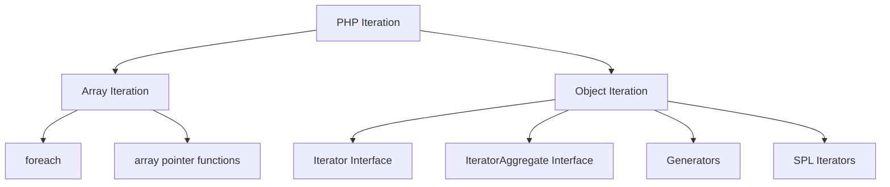

> **🔍 Real-world Analogy:** Think of iteration like going through a photo album page by page - you're viewing one photo (element) at a time in a specific order, rather than looking at all photos simultaneously.

<a id="built-in-array-iteration"></a>
## 🧭 Built-in Array Iteration

PHP provides several ways to iterate over arrays, with `foreach` being the most common and convenient:

```php
<?php
$fruits = ['apple', 'banana', 'cherry'];

// Basic foreach loop - the most common way
foreach ($fruits as $key => $value) {
    echo "$key: $value\n"; 
    // Output:
    // 0: apple
    // 1: banana
    // 2: cherry
}

// Alternative: Using internal array pointer functions
reset($fruits); // Reset the internal pointer to the first element
while (($value = current($fruits)) !== false) {
    $key = key($fruits);
    echo "$key: $value\n";
    next($fruits); // Move the pointer to the next element
}
```

> **💡 Pro Tip:** Always prefer `foreach` for array iteration - it's cleaner, less error-prone, and internally optimized in PHP.

<a id="iterator-interface"></a>
## 🔄 Iterator Interface

The `Iterator` interface allows you to create objects that can be iterated using a `foreach` loop, giving you precise control over how the iteration behaves.

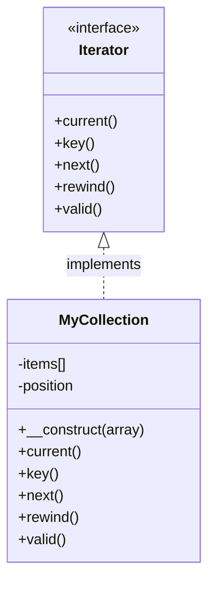

> **🔑 Key Concept:** The Iterator interface defines a contract of 5 methods that must be implemented to make an object work with `foreach` loops.

```php
<?php
class MyCollection implements Iterator {
    private $items = [];
    private $position = 0;
    
    public function __construct(array $items) {
        $this->items = $items;
    }
    
    // Required Iterator methods
    
    // Return the current element
    public function current() {
        return $this->items[$this->position];
    }
    
    // Return the key of the current element
    public function key() {
        return $this->position;
    }
    
    // Move forward to next element
    public function next() {
        $this->position++;
    }
    
    // Rewind the iterator to the first element
    public function rewind() {
        $this->position = 0;
    }
    
    // Check if current position is valid
    public function valid() {
        return isset($this->items[$this->position]);
    }
}

$collection = new MyCollection(['apple', 'banana', 'cherry']);

// Now we can use it in a foreach loop!
foreach ($collection as $key => $value) {
    echo "$key: $value\n";
}
// Output:
// 0: apple
// 1: banana
// 2: cherry
```

> **⚠️ Important:** The `foreach` loop automatically calls these methods in a specific sequence: `rewind()`, then repeatedly `valid()`, `current()`, `key()`, and `next()` until `valid()` returns false.

<a id="iteratoraggregate-interface"></a>
## 🔀 IteratorAggregate Interface

When you don't need complete control over iteration, the `IteratorAggregate` interface offers a simpler alternative by only requiring you to implement a single method.

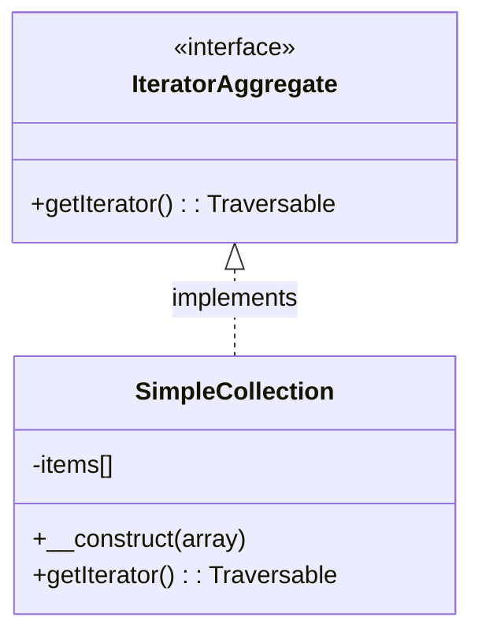

```php
<?php
class SimpleCollection implements IteratorAggregate {
    private $items = [];
    
    public function __construct(array $items) {
        $this->items = $items;
    }
    
    // Only one method required!
    public function getIterator(): Traversable {
        return new ArrayIterator($this->items);
    }
    
    // You can add your regular class methods...
    public function addItem($item) {
        $this->items[] = $item;
    }
}

$collection = new SimpleCollection(['apple', 'banana', 'cherry']);
$collection->addItem('dragon fruit');

// Works with foreach just like the Iterator example
foreach ($collection as $key => $value) {
    echo "$key: $value\n";
}
// Output:
// 0: apple
// 1: banana
// 2: cherry
// 3: dragon fruit
```

> **💡 Pro Tip:** Use `IteratorAggregate` when you want a class to be iterable but don't need custom iteration logic. It's less code and often more maintainable.

<a id="predefined-iterators"></a>
## 📚 Predefined Iterators

PHP's Standard PHP Library (SPL) provides many useful predefined iterators that solve common iteration problems:

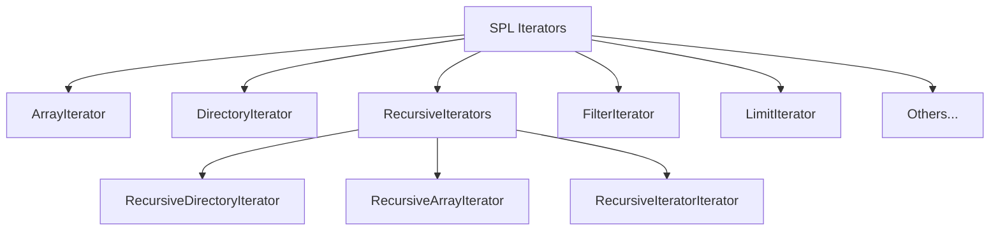

### ArrayIterator

Allows iteration and modification of arrays and objects as if they were arrays:

```php
<?php
$array = ['apple', 'banana', 'cherry'];
$iterator = new ArrayIterator($array);

foreach ($iterator as $key => $value) {
    echo "$key: $value\n";
}

// You can also modify elements while iterating
$iterator[1] = 'blueberry'; // Modifies element at index 1
```

### DirectoryIterator

Iterate over files and directories:

```php
<?php
$dir = new DirectoryIterator(__DIR__); // Current directory

foreach ($dir as $fileInfo) {
    if ($fileInfo->isDot()) continue; // Skip . and .. entries
    
    $type = $fileInfo->isDir() ? 'Directory' : 'File';
    $size = $fileInfo->getSize();
    
    echo "{$fileInfo->getFilename()} - $type: $size bytes\n";
}
```

### RecursiveDirectoryIterator with RecursiveIteratorIterator

Recursively iterate through directories and subdirectories:

```php
<?php
// Get all PHP files recursively
$directory = new RecursiveDirectoryIterator(__DIR__);
$iterator = new RecursiveIteratorIterator($directory);
$phpFiles = new RegexIterator($iterator, '/\.php$/');

foreach ($phpFiles as $file) {
    echo $file->getPathname() . "\n";
}
```

> **🔑 Key Concept:** SPL iterators are specialized classes that handle common iteration patterns, saving you from writing the same iterator code repeatedly.

<a id="generators"></a>
## 🌱 Generators

Generators provide an easy way to implement iterators without the complexity of the Iterator interface. They use the `yield` keyword to return values one by one, pausing execution between yields.


### Basic Generator

```php
<?php
function countTo(int $max) {
    for ($i = 1; $i <= $max; $i++) {
        yield $i;
    }
}

// Using the generator
foreach (countTo(5) as $number) {
    echo "$number\n";
}
// Output:
// 1
// 2
// 3
// 4
// 5
```

> **💡 Pro Tip:** The function's state is preserved between yields, so local variables retain their values between iterations - something not possible with regular functions.

### Using Keys with Generators

You can also specify keys when yielding values:

```php
<?php
function namesWithKeys() {
    yield 'first' => 'John';
    yield 'last' => 'Doe';
    yield 'email' => 'john@example.com';
}

foreach (namesWithKeys() as $key => $value) {
    echo "$key: $value\n";
}
// Output:
// first: John
// last: Doe
// email: john@example.com
```

### Using `yield from`

`yield from` allows you to delegate to another generator or traversable object:

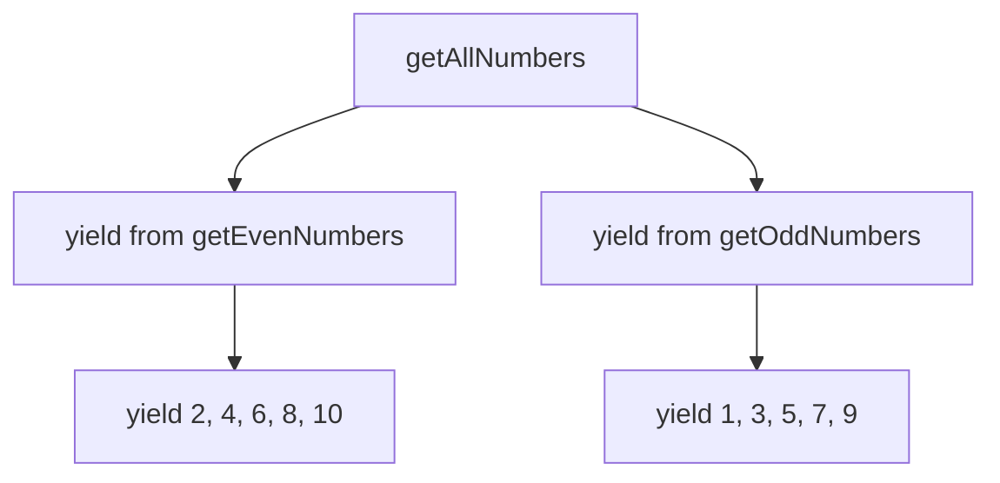

```php
<?php
function getEvenNumbers(int $max) {
    for ($i = 2; $i <= $max; $i += 2) {
        yield $i;
    }
}

function getOddNumbers(int $max) {
    for ($i = 1; $i <= $max; $i += 2) {
        yield $i;
    }
}

function getAllNumbers(int $max) {
    yield from getEvenNumbers($max);
    yield from getOddNumbers($max);
}

foreach (getAllNumbers(10) as $number) {
    echo "$number ";
}
// Output: 2 4 6 8 10 1 3 5 7 9
```

> **🔍 Real-world Analogy:** Think of generators like a factory line that produces one item at a time, only when needed. Normal functions are like a warehouse that produces and stores all items at once, even if you only need a few.

<a id="memory-benefits-of-generators"></a>
## 💾 Memory Benefits of Generators

One of the biggest advantages of generators is their memory efficiency. They compute values on-demand rather than storing an entire collection in memory:

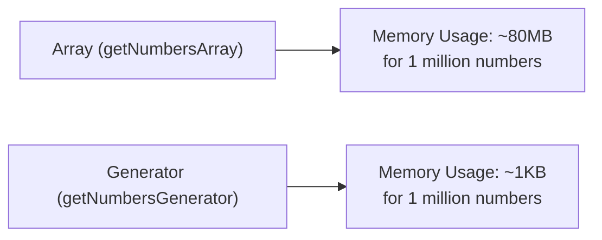

```php
<?php
// This creates an array with all numbers from 1 to $max
// For large values of $max, this requires a lot of memory
function getNumbersArray(int $max) {
    $numbers = [];
    for ($i = 1; $i <= $max; $i++) {
        $numbers[] = $i;
    }
    return $numbers;
}

// This generates each number only when needed
// Memory usage stays minimal regardless of $max
function getNumbersGenerator(int $max) {
    for ($i = 1; $i <= $max; $i++) {
        yield $i;
    }
}

// Memory comparison for 1 million numbers
// $numbers = getNumbersArray(1000000); // Uses ~80MB memory
$numbers = getNumbersGenerator(1000000); // Uses ~1KB memory

$sum = 0;
foreach ($numbers as $number) {
    $sum += $number;
    if ($number > 10) break; // Only process the first 10
}
echo "Sum of first 10 numbers: $sum\n";
```

> **💡 Pro Tip:** Use generators when working with large datasets, especially when you don't need all items at once or might not need to process the entire collection.

<a id="using-iterators-with-databases"></a>
## 🗄️ Using Iterators with Databases

Iterators are particularly valuable when working with database results, as they allow you to process large result sets efficiently:

```php
<?php
class DatabaseIterator implements Iterator {
    private $statement;
    private $key = 0;
    private $current;
    
    public function __construct(PDOStatement $statement) {
        $this->statement = $statement;
    }
    
    public function current() {
        return $this->current;
    }
    
    public function key() {
        return $this->key;
    }
    
    public function next() {
        $this->current = $this->statement->fetch(PDO::FETCH_ASSOC);
        $this->key++;
    }
    
    public function rewind() {
        $this->statement->execute();
        $this->key = 0;
        $this->next();
    }
    
    public function valid() {
        return $this->current !== false;
    }
}

// Usage
$pdo = new PDO('mysql:host=localhost;dbname=test', 'user', 'password');
$stmt = $pdo->prepare('SELECT id, name FROM users LIMIT 1000000');
$iterator = new DatabaseIterator($stmt);

foreach ($iterator as $user) {
    echo "{$user['id']}: {$user['name']}\n";
    // Process one row at a time without loading all rows into memory
}
```

### Generator Example for Database Rows

An even simpler approach using generators:

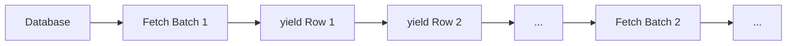

```php
<?php
function getUsers(PDO $pdo, int $batchSize = 1000) {
    $offset = 0;
    
    do {
        $stmt = $pdo->prepare('SELECT * FROM users LIMIT ? OFFSET ?');
        $stmt->execute([$batchSize, $offset]);
        $results = $stmt->fetchAll(PDO::FETCH_ASSOC);
        
        // If no results, we'll exit the loop
        if (empty($results)) {
            break;
        }
        
        foreach ($results as $row) {
            yield $row;
        }
        
        $offset += $batchSize;
    } while (true);
}

$pdo = new PDO('mysql:host=localhost;dbname=test', 'user', 'password');

// Process millions of rows efficiently
foreach (getUsers($pdo) as $user) {
    echo "{$user['id']}: {$user['name']}\n";
    // Process user data...
}
```

> **🔑 Key Concept:** This pattern is called "batched processing" - instead of loading millions of rows at once (which would exhaust memory), we fetch them in manageable batches while presenting a single continuous iteration interface to the code that consumes the data.

<a id="generator-delegation-for-complex-operations"></a>
## 🚿 Generator Delegation for Complex Operations

Generators can be chained together to create data processing pipelines, similar to the Unix pipe system:

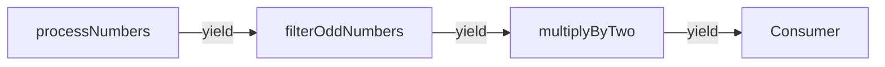

```php
<?php
function filterOddNumbers($numbers) {
    foreach ($numbers as $number) {
        if ($number % 2 !== 0) {
            yield $number;
        }
    }
}

function multiplyByTwo($numbers) {
    foreach ($numbers as $number) {
        yield $number * 2;
    }
}

function processNumbers($max) {
    // Generate numbers
    for ($i = 1; $i <= $max; $i++) {
        yield $i;
    }
}

// Build the pipeline: generate numbers -> filter odd numbers -> multiply by 2
$numbers = processNumbers(10);  // 1,2,3,4,5,6,7,8,9,10
$oddNumbers = filterOddNumbers($numbers);  // 1,3,5,7,9
$result = multiplyByTwo($oddNumbers);  // 2,6,10,14,18

// Consume the final results
foreach ($result as $number) {
    echo "$number ";
}
// Output: 2 6 10 14 18
```

> **💡 Pro Tip:** This approach allows you to separate data processing into discrete steps without creating intermediate arrays, making your code more modular and memory-efficient.

<a id="generator-return-values-php-7"></a>
## 🏁 Generator Return Values (PHP 7+)

In addition to yielding values, generators can also return a final value using the `return` statement:

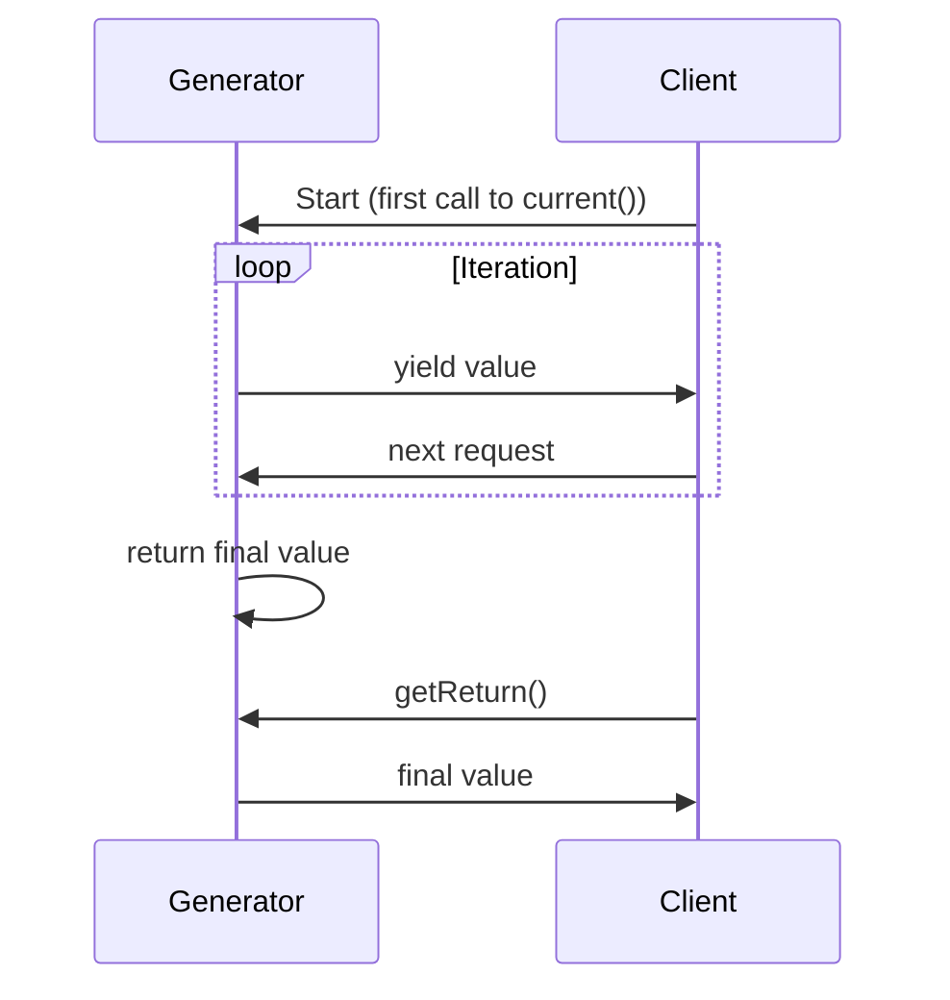

```php
<?php
function generateAndCount(int $max) {
    $count = 0;
    
    for ($i = 1; $i <= $max; $i++) {
        yield $i;
        $count++;
    }
    
    // This return value is only accessible after iteration is complete
    return "Generated $count numbers";
}

$generator = generateAndCount(5);

// Iterate through the generator
foreach ($generator as $value) {
    echo "$value ";
}
// Output: 1 2 3 4 5

// Get the return value AFTER the generator is fully iterated
$returnValue = $generator->getReturn();
echo "\nReturn value: $returnValue";
// Output: Return value: Generated 5 numbers
```

> **⚠️ Important:** The return value is only available after the generator has been completely iterated. Calling `getReturn()` before complete iteration will throw an exception.

<a id="coroutines-with-generators-php-7"></a>
## 🤝 Coroutines with Generators (PHP 7+)

Generators can act as coroutines, allowing for two-way communication where values can be both sent to and received from a generator:

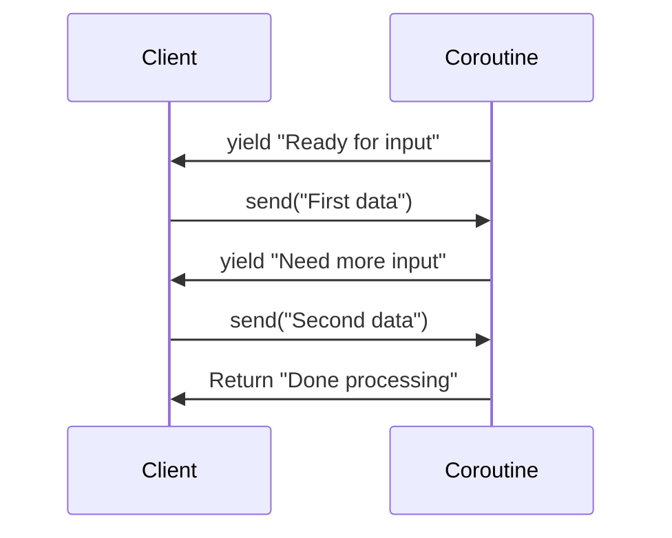

```php
<?php
function coroutine() {
    // Yield a value and wait for something to be sent back
    $input = yield "Ready for input";
    echo "Received: $input\n";
    
    // Yield another value and wait again
    $secondInput = yield "Need more input";
    echo "Also received: $secondInput\n";
    
    // Return a final value
    return "Done processing";
}

$coroutine = coroutine();

// Start the coroutine (it runs until the first yield)
$message = $coroutine->current();
echo "Coroutine says: $message\n";
// Output: Coroutine says: Ready for input

// Send data to the coroutine (it runs until the next yield)
$message = $coroutine->send("First data");
echo "Coroutine says: $message\n";
// Output:
// Received: First data
// Coroutine says: Need more input

// Send more data (it runs until the end)
$coroutine->send("Second data");
// Output: Also received: Second data

// Check if the coroutine is done
var_dump($coroutine->valid()); // bool(false)

// Get the return value
echo "Final result: " . $coroutine->getReturn() . "\n";
// Output: Final result: Done processing
```

> **🔍 Advanced Concept:** Coroutines are a form of cooperative multitasking where functions voluntarily yield control back to the caller and can later resume from that point. They're useful for implementing state machines, asynchronous programming patterns, and more.

<a id="when-to-use-what"></a>
## 🔍 When to Use What

With so many iteration options, it's important to know which one to choose for a given situation:

| Approach | When to Use | Advantages | Disadvantages |
|----------|-------------|------------|--------------|
| **Simple foreach** | Small arrays | Simple, direct | Not for objects |
| **Iterator interface** | Custom iteration logic | Complete control | More code to write |
| **IteratorAggregate** | Simple object collections | Less code | Limited control |
| **Generators** | Large data sets | Memory efficient, simple | Can't rewind easily |
| **SPL iterators** | Common iteration patterns | Pre-built functionality | Learning curve |

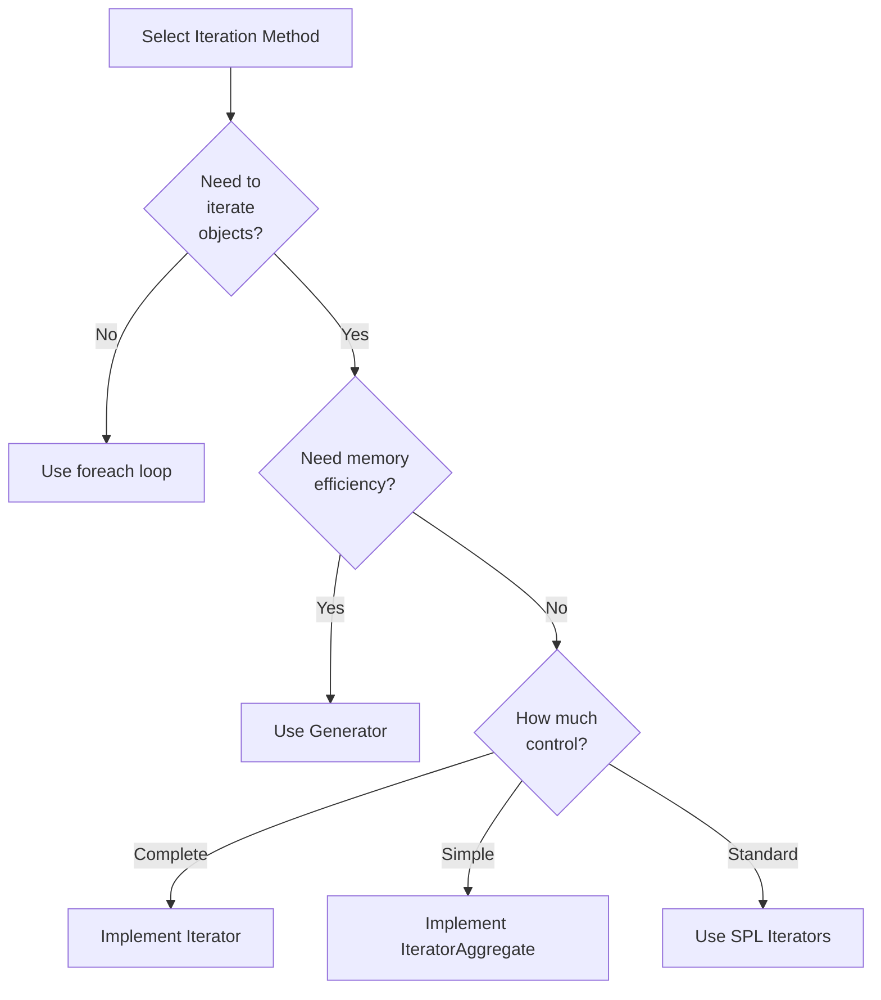

<a id="best-practices"></a>
## ✅ Best Practices

1. **💾 Use generators for large datasets** to minimize memory usage
2. **🚿 Chain generators for pipeline operations** instead of creating intermediate arrays
3. **🔧 Implement `Iterator` only when you need full control** over iteration behavior
4. **🧩 Use `IteratorAggregate` for simple object collections** when you just need basic iteration
5. **🏁 Consider memory usage** when processing large datasets or file operations
6. **📚 Use SPL iterators** when they fit your use case instead of reinventing the wheel
7. **🧪 Test your iterators and generators** with both small and large datasets
8. **📈 Profile memory usage** when working with very large collections

<a id="practice-exercise"></a>
## 🏋️ Practice Exercise

Create a CSV file processor that:

1. Uses a generator to read a potentially large CSV file line by line
2. Filters rows based on a specific column value
3. Transforms the data in some way
4. Outputs the processed data

**Sample Solution**

```php
<?php
/**
 * CSV Processor using generators for memory efficiency
 */
class CsvProcessor {
    /**
     * Read CSV file line by line
     */
    public function readCsv(string $filename, bool $hasHeader = true): Generator {
        $file = fopen($filename, 'r');
        
        if (!$file) {
            throw new Exception("Cannot open file: $filename");
        }
        
        try {
            // Process header if present
            $header = null;
            if ($hasHeader) {
                $header = fgetcsv($file);
            }
            
            // Process data rows
            $rowNumber = 1;
            while (($row = fgetcsv($file)) !== false) {
                // If we have a header, associate column names with values
                if ($header) {
                    $associativeRow = array_combine($header, $row);
                    yield $rowNumber => $associativeRow;
                } else {
                    yield $rowNumber => $row;
                }
                $rowNumber++;
            }
        } finally {
            // Always close the file
            fclose($file);
        }
    }
    
    /**
     * Filter rows based on a condition
     */
    public function filter(iterable $rows, callable $filterFn): Generator {
        foreach ($rows as $index => $row) {
            if ($filterFn($row, $index)) {
                yield $index => $row;
            }
        }
    }
    
    /**
     * Transform row data
     */
    public function transform(iterable $rows, callable $transformFn): Generator {
        foreach ($rows as $index => $row) {
            yield $index => $transformFn($row, $index);
        }
    }
}

// Usage example
$processor = new CsvProcessor();

// Create a sample CSV file for testing
$sampleCsv = __DIR__ . '/sample.csv';
file_put_contents($sampleCsv, "name,age,city\nJohn,30,New York\nAlice,25,Boston\nBob,35,Chicago\nEva,28,Boston");

try {
    // 1. Read the CSV file
    $rows = $processor->readCsv($sampleCsv);
    
    // 2. Filter rows (only people from Boston)
    $filteredRows = $processor->filter($rows, function($row) {
        return $row['city'] === 'Boston';
    });
    
    // 3. Transform data (format as string)
    $formattedRows = $processor->transform($filteredRows, function($row) {
        return "{$row['name']} is {$row['age']} years old and lives in {$row['city']}";
    });
    
    // 4. Output results
    foreach ($formattedRows as $index => $formattedRow) {
        echo "Row $index: $formattedRow\n";
    }
    // Output:
    // Row 2: Alice is 25 years old and lives in Boston
    // Row 4: Eva is 28 years old and lives in Boston
} finally {
    // Clean up
    unlink($sampleCsv);
}
```

## Up Next

Now that you understand iterators and generators, learn about [Closure and Callable](./10-closure-callable.md).

[Back to Advanced OOP](./README.md) | [Previous: Type Declarations](./08-type-declarations.md) | [Next: Closure and Callable](./10-closure-callable.md)
