# 🧩 Closure and Callable in PHP

> **💡 Pro Tip:** "Closures and callable types bring functional programming concepts to PHP, making your code more flexible and expressive by treating functions as first-class citizens."

## 📋 Table of Contents

| Emoji | Topic | Description |
|:---:|---|---|
| 🌟 | [Introduction](#introduction) | Functions as first-class citizens |
| 📞 | [Callable Type](#callable-type) | Understanding PHP's callable type |
| 🔒 | [Anonymous Functions](#anonymous-functions-closures) | Creating unnamed function objects |
| 🗝️ | [Variable Capture](#capturing-variables-with-closures) | Accessing external variables in closures |
| 🔗 | [Object Methods](#closures-as-object-methods) | Using closures with objects |
| 📦 | [Closure Class](#the-closure-class) | PHP's built-in Closure class |
| 🔄 | [bindTo Method](#bindto-method) | Changing closure scope and binding |
| ➡️ | [Arrow Functions](#arrow-functions-php-74) | Compact syntax for simple closures |
| 📌 | [Type Hinting](#callables-as-parameters) | Using the callable type in parameters |
| 🔄 | [Callbacks in PHP](#callbacks-in-phps-standard-library) | Built-in functions that use callbacks |
| 🔝 | [Higher-Order Functions](#higher-order-functions) | Functions that create or consume functions |
| 🔀 | [Partial Application](#partial-application-and-currying) | Specializing functions by fixing arguments |
| 👉 | [fromCallable](#closures-with-objects-closurefromcallable) | Converting callables to closures |
| 🧲 | [Invokable Objects](#invokable-objects) | Objects that act like functions |
| ✨ | [Strategy Pattern](#real-world-example-strategy-pattern-with-closures) | Using closures for flexible strategies |
| 🎉 | [Event Systems](#event-systems-with-closures) | Event handling with closures |
| ⚡ | [Performance Tips](#performance-considerations) | Optimizing closure usage |
| ✅ | [Best Practices](#best-practices) | Guidelines for effective callables |
| 🏋️ | [Practice Exercise](#practice-exercise) | Hands-on coding challenge |

<a id="introduction"></a>
## 🌟 Introduction

In PHP, functions can be treated as **first-class citizens**, meaning they can be used like any other variable. This unlocks powerful programming patterns and approaches.

> **🔑 Key Concept:** First-class functions allow you to pass behavior as a parameter, store it in variables, and return it from other functions.

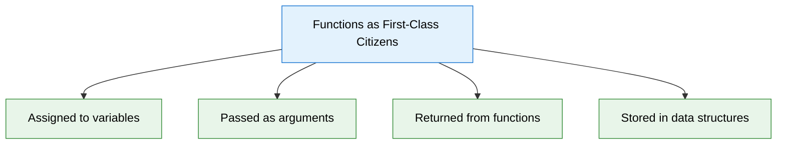

> **🔍 Real-world analogy:** Think of functions as tools. Traditional programming keeps tools in a fixed toolbox (defined in the code), while first-class functions let you hand tools directly to someone (pass functions to other functions), create new toolkits on demand (return functions), or keep specialized tools for specific situations (store functions in data structures).

<a id="callable-type"></a>
## 📞 Callable Type

PHP's `callable` type represents anything that can be invoked like a function. This flexibility allows for various ways to define behavior.

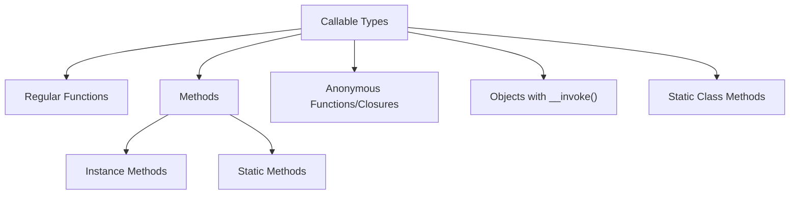

### Example of Different Callable Types

```php
<?php
// Different forms of callables

// Regular function
function addNumbers($a, $b) {
    return $a + $b;
}

// Function stored in variable
$addFunction = 'addNumbers';
echo $addFunction(5, 3); // Output: 8

// Method call
class Calculator {
    public function multiply($a, $b) {
        return $a * $b;
    }
}

$calc = new Calculator();
$multiplyMethod = [$calc, 'multiply'];
echo $multiplyMethod(5, 3); // Output: 15

// Static method
class MathHelper {
    public static function subtract($a, $b) {
        return $a - $b;
    }
}

$subtractMethod = ['MathHelper', 'subtract'];
echo $subtractMethod(5, 3); // Output: 2

// Using call_user_func with any callable
echo call_user_func('addNumbers', 5, 3); // Output: 8
echo call_user_func([$calc, 'multiply'], 5, 3); // Output: 15
```

> **💡 Pro Tip:** PHP provides several functions for working with callables, including `call_user_func()`, `call_user_func_array()`, `is_callable()`, and more. These help you use callables dynamically.

<a id="anonymous-functions-closures"></a>
## 🔒 Anonymous Functions (Closures)

Anonymous functions (also called closures) are functions without a name, created on-the-fly where needed.

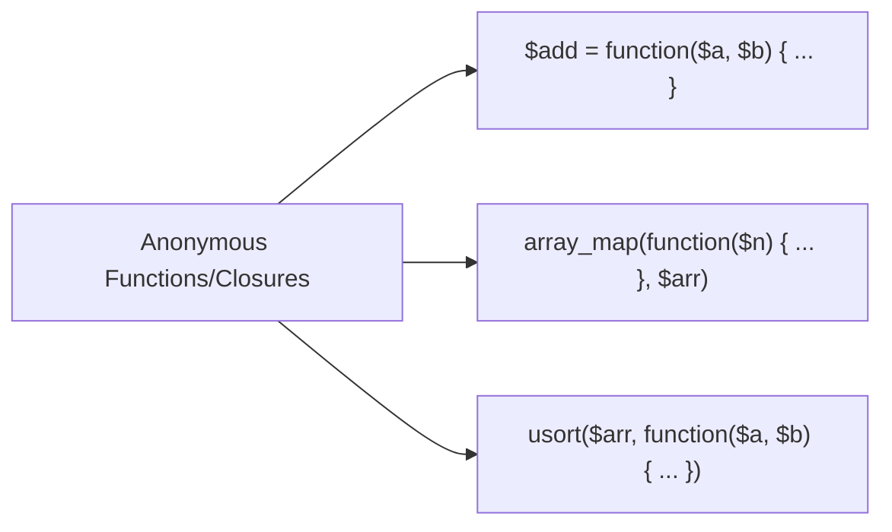

```php
<?php
// Simple anonymous function
$add = function($a, $b) {
    return $a + $b;
};

echo $add(5, 3); // Output: 8

// Anonymous function as a callback for doubling numbers
$numbers = [1, 2, 3, 4, 5];
$doubled = array_map(function($n) {
    return $n * 2;
}, $numbers);
// Result $doubled: [2, 4, 6, 8, 10]

// Closure used for sorting users by age
$users = [
    ['name' => 'John', 'age' => 30],
    ['name' => 'Alice', 'age' => 25],
    ['name' => 'Bob', 'age' => 35]
];

usort($users, function($a, $b) {
    return $a['age'] <=> $b['age']; // Using spaceship operator
});
// Result: $users sorted by age ascending
```

> **🔑 Key Concept:** Anonymous functions are useful when you need a function for a short, specific purpose - especially as callback functions - without cluttering your namespace with named functions.

<a id="capturing-variables-with-closures"></a>
## 🗝️ Capturing Variables with Closures

One of the most powerful features of closures is their ability to capture variables from the surrounding scope.

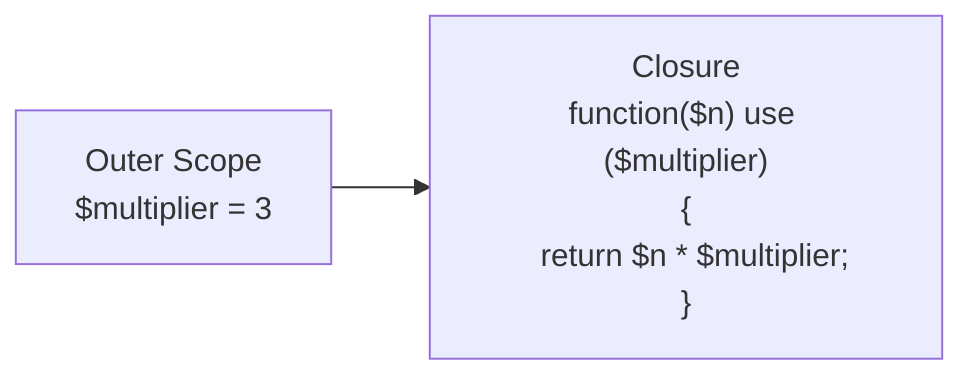

### Using the `use` Keyword

```php
<?php
$multiplier = 3;

// The 'use' keyword captures variables from the outer scope
$multiply = function($n) use ($multiplier) {
    return $n * $multiplier;
};

echo $multiply(5); // Output: 15

// Capturing by reference allows modifying the outer variable
$counter = 0;
$increment = function() use (&$counter) {
    return ++$counter;
};

echo $increment(); // Output: 1
echo $increment(); // Output: 2
echo $counter;     // Output: 2 (the outer variable was modified)
```

> **🔍 Real-world analogy:** Think of a closure like a function that carries a backpack (the `use` statement). The backpack contains items (variables) it needs from its original environment, even when it travels to new contexts.

<a id="closures-as-object-methods"></a>
## 🔗 Closures as Object Methods

Closures can be created within object methods and have access to the object's properties.

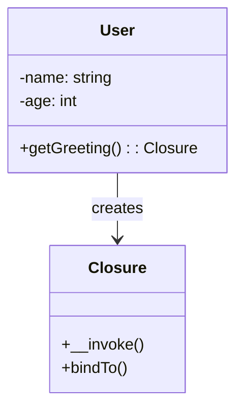

```php
<?php
class User {
    private $name;
    private $age;
    
    public function __construct($name, $age) {
        $this->name = $name;
        $this->age = $age;
    }
    
    public function getGreeting() {
        // This closure has access to $this
        return function() {
            return "Hello, my name is {$this->name} and I'm {$this->age} years old.";
        };
    }
}

$user = new User("John", 30);
$greeting = $user->getGreeting();
echo $greeting(); 
// Output: Hello, my name is John and I'm 30 years old.
```

> **⚠️ Important:** When a closure is created inside a class method, it can access the object instance through `$this`. However, this only works when the closure is used within the same scope or bound appropriately.

<a id="the-closure-class"></a>
## 📦 The `Closure` Class

Anonymous functions in PHP are actually instances of the built-in `Closure` class, which provides methods for controlling binding and scope.

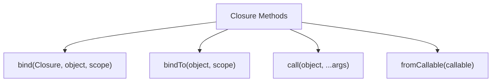

```php
<?php
class Person {
    private $name;
    
    public function __construct($name) {
        $this->name = $name;
    }
}

$john = new Person("John");
$jane = new Person("Jane");

// Create a closure
$getName = function() {
    return $this->name;
};

// Make the closure access $john's private property
$nameGetter = Closure::bind($getName, $john, Person::class);
echo $nameGetter(); // Output: John

// Now make the same closure access $jane's property
$nameGetter = Closure::bind($getName, $jane, Person::class);
echo $nameGetter(); // Output: Jane
```

> **🔑 Key Concept:** `Closure::bind()` allows you to change both the object to which `$this` refers and the class scope that determines what private/protected properties are accessible.

<a id="bindto-method"></a>
## 🔄 `bindTo` Method

The `bindTo` method is an instance method that creates a new closure with a specific object and scope.

```php
<?php
$counter = 0;
$incrementFn = function() {
    return ++$this->counter;
};

// Create an object to bind to
$obj = new class {
    public $counter = 10;
};

// Bind the closure to the object
$incrementFn = $incrementFn->bindTo($obj, get_class($obj));
echo $incrementFn(); // Output: 11
echo $incrementFn(); // Output: 12
echo $obj->counter;  // Output: 12
```

> **💡 Pro Tip:** `bindTo()` is useful for implementing plugins or extension systems where closures need to access internal properties of objects they extend.

<a id="arrow-functions-php-74"></a>
## ➡️ Arrow Functions (PHP 7.4+)

PHP 7.4 introduced arrow functions, a more concise syntax for simple closures that automatically capture variables.

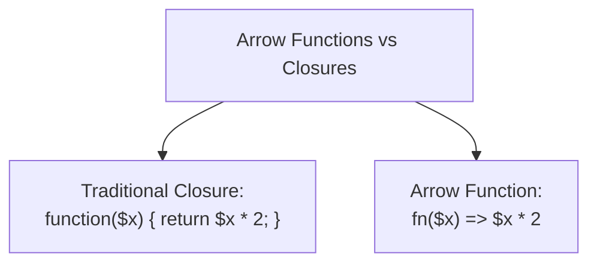

### Example

```php
<?php
// Traditional closure
$double = function($x) {
    return $x * 2;
};

// Arrow function equivalent
$double = fn($x) => $x * 2;

// Arrow functions implicitly capture variables from the parent scope
$factor = 4;
$multiply = fn($x) => $x * $factor;
echo $multiply(3); // Output: 12
```

> **🚀 Key Advantage:** Arrow functions automatically capture variables from the parent scope without needing the `use` keyword, and they're more concise for simple operations.

<a id="callables-as-parameters"></a>
## 📌 Callables as Parameters

Type-hinting with `callable` allows functions to accept any callable type as a parameter.

```php
<?php
function applyOperation(int $a, int $b, callable $operation) {
    return $operation($a, $b);
}

// Using with different callables
echo applyOperation(5, 3, 'addNumbers'); // Output: 8
echo applyOperation(5, 3, function($a, $b) { return $a - $b; }); // Output: 2
echo applyOperation(5, 3, fn($a, $b) => $a / $b); // Output: ~1.6666...

// Using with a method
$calc = new Calculator();
echo applyOperation(5, 3, [$calc, 'multiply']); // Output: 15
```

> **💡 Pro Tip:** When you need to provide polymorphic behavior but a full interface implementation is too heavy, callable parameters offer a lightweight alternative.

<a id="callbacks-in-phps-standard-library"></a>
## 🔄 Callbacks in PHP's Standard Library

Many built-in PHP functions accept callback functions as parameters, especially for array operations.

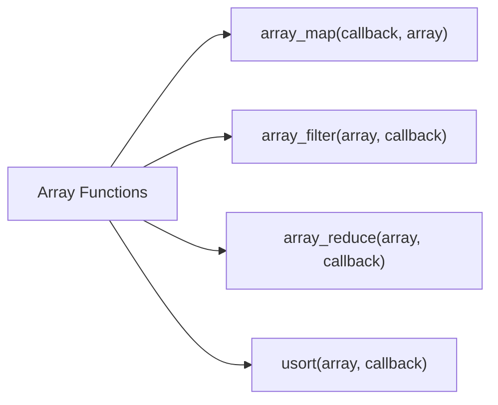

```php
<?php
// Array operations with callbacks
$numbers = [1, 2, 3, 4, 5];

// Filter even numbers
$even = array_filter($numbers, function($n) {
    return $n % 2 === 0;
});
// Result $even: [2, 4]

// Transform each number
$squared = array_map(fn($n) => $n * $n, $numbers);
// Result $squared: [1, 4, 9, 16, 25]

// Accumulate values
$sum = array_reduce($numbers, fn($carry, $n) => $carry + $n, 0);
// Result $sum: 15

// Custom sorting
usort($numbers, fn($a, $b) => $b <=> $a); // Descending order
// Result $numbers: [5, 4, 3, 2, 1]
```

> **🔑 Key Concept:** Callback functions allow standard library functions to be customized for specific use cases without having to rewrite the core functionality.

<a id="higher-order-functions"></a>
## 🔝 Higher-Order Functions

Functions that take other functions as arguments or return functions as results are called higher-order functions.

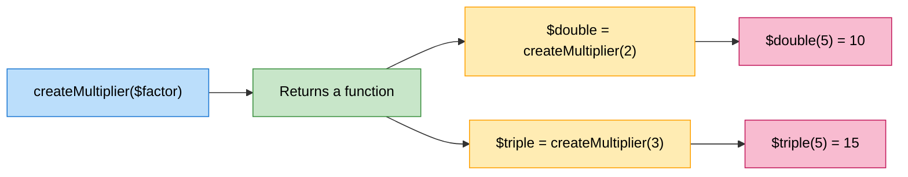

```php
<?php
// Function that returns a function
function createMultiplier($factor) {
    return function($number) use ($factor) {
        return $number * $factor;
    };
}

$double = createMultiplier(2);
$triple = createMultiplier(3);

echo $double(5); // Output: 10
echo $triple(5); // Output: 15
```

> **🔍 Real-world analogy:** Think of higher-order functions like factory machines that produce specialized tools. You configure the factory once (parameters to the higher-order function) and it produces customized tools (new functions) on demand.

<a id="partial-application-and-currying"></a>
## 🔀 Partial Application and Currying

Closures enable functional programming techniques like partial application and currying:

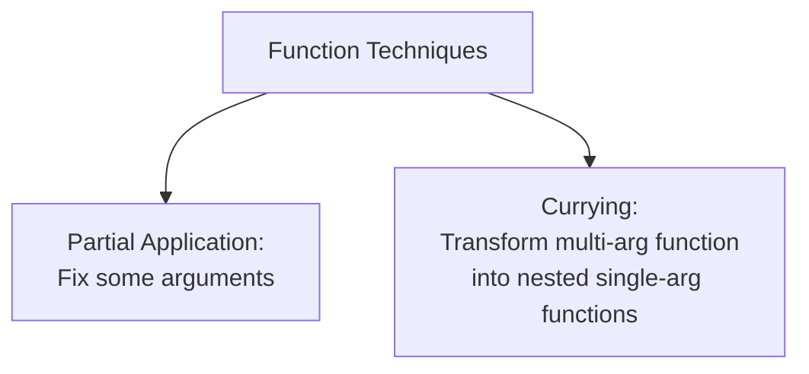

```php
<?php
// Partial application
function partial($function, ...$partialArgs) {
    return function(...$args) use ($function, $partialArgs) {
        return call_user_func_array($function, array_merge($partialArgs, $args));
    };
}

function divide($a, $b) {
    return $a / $b;
}

// Create a function that always divides by 2
$divideByTwo = partial('divide', 10);
echo $divideByTwo(5); // Output: 2

// Manual currying example
function curry($function, $numArgs) {
    return function($arg) use ($function, $numArgs) {
        if ($numArgs <= 1) {
            return $function($arg);
        }
        return curry(
            function($b) use ($function, $arg) {
                return $function($arg, $b);
            }, 
            $numArgs - 1
        );
    };
}

$curriedAdd = curry(function($a, $b) { return $a + $b; }, 2);
$add5 = $curriedAdd(5);
echo $add5(3); // Output: 8
```

> **🧠 Advanced Concept:** Partial application fixes some arguments of a function, returning a new function with fewer parameters. Currying transforms a multi-argument function into a sequence of single-argument functions, allowing for more flexible application.

<a id="closures-with-objects-closurefromcallable"></a>
## 👉 Closures with Objects (`Closure::fromCallable()`)

PHP 7.1+ provides `Closure::fromCallable()` to convert any callable into a `Closure` object:

```php
<?php
class StringProcessor {
    public function prefix($string, $prefix) {
        return $prefix . $string;
    }
}

$processor = new StringProcessor();

// Convert method to a closure
$prefixer = Closure::fromCallable([$processor, 'prefix']);

// Use the closure
echo $prefixer('World', 'Hello '); // Output: Hello World
```

> **💡 Pro Tip:** `fromCallable()` is useful when you need to guarantee you're working with a `Closure` object, which provides additional methods like `bindTo()`.

<a id="invokable-objects"></a>
## 🧲 Invokable Objects

Objects with the `__invoke` method can be used as if they were functions:

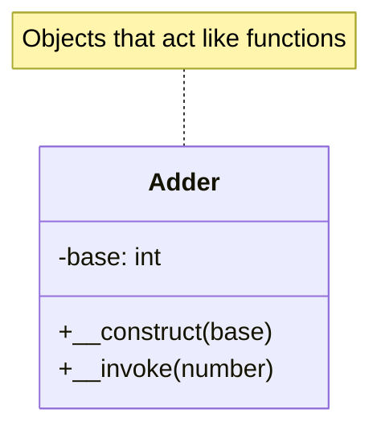

```php
<?php
class Adder {
    private $base;
    
    public function __construct($base = 0) {
        $this->base = $base;
    }
    
    public function __invoke($number) {
        return $this->base + $number;
    }
}

$add5 = new Adder(5);
echo $add5(3); // Output: 8
echo $add5(10); // Output: 15

// Can be used anywhere a callable is expected
$numbers = [1, 2, 3, 4];
$result = array_map($add5, $numbers); // Result: [6, 7, 8, 9]
```

> **🔑 Key Concept:** Invokable objects combine the powers of objects (state, multiple methods) with the convenience of functions (direct invocation). They're perfect for stateful callbacks.

<a id="real-world-example-strategy-pattern-with-closures"></a>
## ✨ Real-world Example: Strategy Pattern with Closures

The Strategy pattern is typically implemented with classes, but closures provide a more lightweight approach:

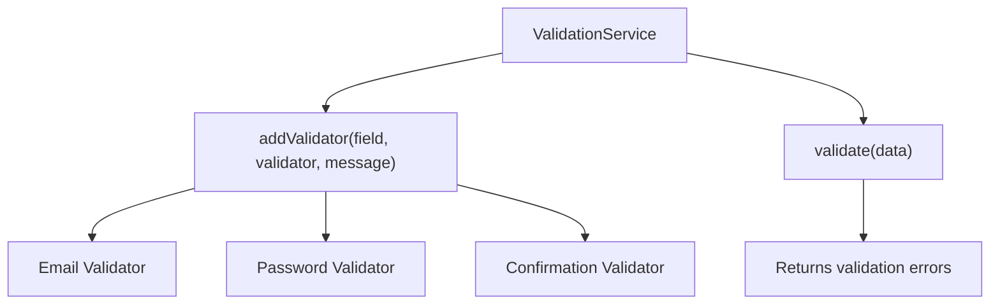

```php
<?php
class ValidationService {
    private $validators = [];
    
    public function addValidator(string $field, callable $validator, string $message) {
        if (!isset($this->validators[$field])) {
            $this->validators[$field] = [];
        }
        
        $this->validators[$field][] = [
            'validator' => $validator,
            'message' => $message
        ];
        
        return $this;
    }
    
    public function validate(array $data) {
        $errors = [];
        
        foreach ($this->validators as $field => $fieldValidators) {
            $value = $data[$field] ?? null;
            
            foreach ($fieldValidators as $validator) {
                if (!call_user_func($validator['validator'], $value, $data)) {
                    if (!isset($errors[$field])) {
                        $errors[$field] = [];
                    }
                    $errors[$field][] = $validator['message'];
                }
            }
        }
        
        return $errors;
    }
}

// Usage
$validator = new ValidationService();
$validator
    ->addValidator('email', 
        fn($val) => filter_var($val, FILTER_VALIDATE_EMAIL) !== false,
        'Invalid email format'
    )
    ->addValidator('password', 
        fn($val) => strlen($val) >= 8,
        'Password must be at least 8 characters'
    )
    ->addValidator('password_confirmation', 
        function($val, $data) {
            return isset($data['password']) && $val === $data['password'];
        },
        'Password confirmation doesn\'t match'
    );

$errors = $validator->validate([
    'email' => 'invalid-email',
    'password' => 'short',
    'password_confirmation' => 'different'
]);

// $errors will contain validation failures
```

<a id="event-systems-with-closures"></a>
## 🎉 Event Systems with Closures

Closures are perfect for event-driven programming:

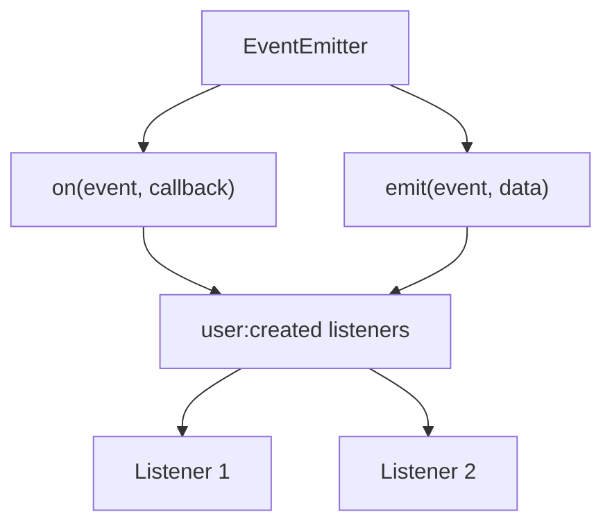

```php
<?php
class EventEmitter {
    private $events = [];
    
    public function on($event, callable $callback) {
        if (!isset($this->events[$event])) {
            $this->events[$event] = [];
        }
        
        $this->events[$event][] = $callback;
        
        return $this;
    }
    
    public function emit($event, ...$args) {
        if (!isset($this->events[$event])) {
            return false;
        }
        
        foreach ($this->events[$event] as $callback) {
            call_user_func_array($callback, $args);
        }
        
        return true;
    }
}

// Usage
$emitter = new EventEmitter();

$emitter->on('user:created', function($user) {
    echo "User {$user['name']} was created\n";
});

$emitter->on('user:created', function($user) {
    echo "Sending welcome email to {$user['email']}\n";
});

$emitter->emit('user:created', [
    'name' => 'John Doe',
    'email' => 'john@example.com'
]);

// Output:
// User John Doe was created
// Sending welcome email to john@example.com
```

<a id="performance-considerations"></a>
## ⚡ Performance Considerations

When working with closures, keep these performance aspects in mind:

| Consideration | Impact | Recommendation |
|---------------|--------|----------------|
| **Creating closures in loops** | High overhead | Create outside loops |
| **Variable binding** | Memory usage | Bind only needed variables |
| **Arrow functions** | Slightly better performance | Use for simple cases |
| **Callable resolution** | Takes time | Cache `Closure::fromCallable()` results |

> **⚠️ Warning:** Creating closures inside loops can significantly impact performance since each iteration creates a new function object. Define them outside the loop when possible.

<a id="best-practices"></a>
## ✅ Best Practices

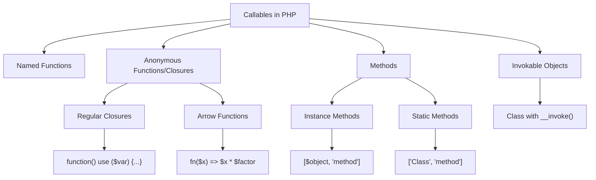

1. **📏 Use arrow functions** for simple, short closures to improve readability
2. **🚫 Avoid deep nesting** of closures which can create callback hell
3. **🔍 Be careful with variable capture**: Only capture what you need to avoid memory issues
4. **📚 Document parameter types** since closures don't support type declarations in their signatures
5. **⚠️ Use `use` by reference** only when necessary to avoid unexpected side effects
6. **👓 Consider readability**: Very complex closures might be better as named functions
7. **🏷️ Name your callback variables** meaningfully (e.g., `$filterInactiveUsers` instead of `$fn`)
8. **🌳 Use closures for short callbacks**, classes for complex, stateful behaviors

<a id="practice-exercise"></a>
## 🏋️ Practice Exercise

Create a `QueryBuilder` class that uses closures for:

1. Filtering data based on custom conditions
2. Mapping data to transform results
3. Sorting data with custom comparators
4. Implementing a method chaining API

**Sample Solution**

```php
<?php
class QueryBuilder {
    private $data = [];
    private $filters = [];
    private $mappers = [];
    private $sorter = null;
    
    public function __construct(array $data) {
        $this->data = $data;
    }
    
    // Add a filter using a closure
    public function where(callable $filter) {
        $this->filters[] = $filter;
        return $this;
    }
    
    // Add a mapper using a closure
    public function map(callable $mapper) {
        $this->mappers[] = $mapper;
        return $this;
    }
    
    // Set a sorter using a closure
    public function sortBy(callable $sorter) {
        $this->sorter = $sorter;
        return $this;
    }
    
    // Execute the query and return results
    public function get() {
        $result = $this->data;
        
        // Apply filters
        foreach ($this->filters as $filter) {
            $result = array_filter($result, $filter);
        }
        
        // Apply sort
        if ($this->sorter) {
            usort($result, $this->sorter);
        }
        
        // Apply mappers
        foreach ($this->mappers as $mapper) {
            $result = array_map($mapper, $result);
        }
        
        return $result;
    }
}

// Usage example
$users = [
    ['id' => 1, 'name' => 'John', 'age' => 30, 'active' => true],
    ['id' => 2, 'name' => 'Jane', 'age' => 25, 'active' => true],
    ['id' => 3, 'name' => 'Bob', 'age' => 40, 'active' => false],
    ['id' => 4, 'name' => 'Alice', 'age' => 35, 'active' => true],
    ['id' => 5, 'name' => 'Mike', 'age' => 20, 'active' => false],
];

$results = (new QueryBuilder($users))
    // Only include active users
    ->where(fn($user) => $user['active'] === true)
    // Only include users 30 or older
    ->where(fn($user) => $user['age'] >= 30)
    // Sort by name
    ->sortBy(fn($a, $b) => $a['name'] <=> $b['name'])
    // Format the output
    ->map(function($user) {
        return [
            'full_name' => $user['name'] . ' (ID: ' . $user['id'] . ')',
            'age' => $user['age'] . ' years old',
            'status' => $user['active'] ? 'Active' : 'Inactive'
        ];
    })
    ->get();

// Display results
foreach ($results as $user) {
    echo "{$user['full_name']} - {$user['age']} - {$user['status']}\n";
}

// Expected output:
// Alice (ID: 4) - 35 years old - Active
// John (ID: 1) - 30 years old - Active
```

## Up Next

Now that you understand closures and callables, you've completed the Advanced OOP section. Consider exploring the [SOLID Principles](../03-solid-principles/README.md) next.

[Back to Advanced OOP](./README.md) | [Previous: Iterators and Generators](./09-iterators-generators.md)
