# 🧩 Single Responsibility Principle (SRP)

> **💡 Pro Tip:** "Classes should do one thing, and do it well. If a class has more than one reason to change, it's doing too much."

## 📋 Table of Contents

| Emoji | Topic | Description |
|:---:|---|---|
| ✅ | [Definition](#definition) | What is SRP? |
| 🚫 | [Problem Without SRP](#problem-without-srp) | Common anti-patterns |
| 🎨 | [Solution with SRP](#solution-with-srp) | Implementing SRP properly |
| 🔄 | [Usage](#usage-with-srp) | How to use SRP in practice |
| 📊 | [Visualization](#visualization) | Diagram of SRP |
| 📈 | [Benefits](#benefits-of-srp) | Advantages of using SRP |
| 🔍 | [SRP at Different Levels](#srp-at-different-levels) | Applying SRP beyond classes |
| 🧠 | [Identifying Violations](#how-to-identify-srp-violations) | Signs of SRP violations |
| 🌍 | [Real-world Example](#real-world-example-order-processing-system) | Practical application |

<a id="definition"></a>
## ✅ Definition

The Single Responsibility Principle states that **a class should have only one reason to change**, meaning it should have only one responsibility. This principle was introduced by Robert C. Martin (Uncle Bob) as part of the SOLID principles.

> **🔍 Key Insight:** When a class handles multiple responsibilities, changes to one aspect of the system can affect unrelated functionality, leading to unexpected bugs.

<a id="problem-without-srp"></a>
## 🚫 Problem Without SRP

Consider a class that handles multiple responsibilities:

```php
<?php
class User {
    private $id;
    private $name;
    private $email;
    
    // User properties and basic behavior
    public function __construct($id, $name, $email) {
        $this->id = $id;
        $this->name = $name;
        $this->email = $email;
    }
    
    public function getName() {
        return $this->name;
    }
    
    public function getEmail() {
        return $this->email;
    }
    
    // Database operations
    public function save() {
        // Connect to database
        $db = new Database();
        $db->connect();
        
        // Save user data
        $db->query("INSERT INTO users (name, email) VALUES ('{$this->name}', '{$this->email}')");
        $this->id = $db->getLastInsertId();
        
        $db->close();
        
        return $this->id;
    }
    
    public function delete() {
        // Connect to database
        $db = new Database();
        $db->connect();
        
        // Delete user
        $db->query("DELETE FROM users WHERE id = {$this->id}");
        
        $db->close();
        
        return true;
    }
    
    // Email operations
    public function sendWelcomeEmail() {
        $subject = "Welcome to our platform";
        $message = "Hi {$this->name},\n\nWelcome to our platform. Your account has been created successfully.\n\nBest regards,\nThe Team";
        
        return mail($this->email, $subject, $message);
    }
    
    public function sendPasswordResetEmail($token) {
        $subject = "Password reset requested";
        $message = "Hi {$this->name},\n\nYou requested a password reset. Use this token: {$token}.\n\nBest regards,\nThe Team";
        
        return mail($this->email, $subject, $message);
    }
    
    // Validation operations
    public function validateEmail() {
        return filter_var($this->email, FILTER_VALIDATE_EMAIL) !== false;
    }
    
    public function validateName() {
        return strlen($this->name) >= 2;
    }
}
```

**Usage example:**
```php
<?php
$user = new User(null, "John Doe", "john@example.com");

// Validate user data
if ($user->validateEmail() && $user->validateName()) {
    // Save to database
    $userId = $user->save();
    
    // Send welcome email
    $user->sendWelcomeEmail();
    
    echo "User created with ID: $userId";
} else {
    echo "Invalid user data";
}
```

**Output:**
```
User created with ID: 1
```

Issues with this approach:
- ❌ The `User` class has multiple reasons to change (violates SRP)
- ❌ It handles user data, database operations, email sending, and validation
- ❌ Changes to database structure would require modifying this class
- ❌ Changes to email format or sending method would also require changes
- ❌ Testing becomes difficult because of multiple dependencies
- ❌ Code reuse is limited - what if another entity needs email validation?

<a id="solution-with-srp"></a>
## 🎨 Solution with SRP

We can split the class into separate classes, each with a single responsibility:

```php
<?php
// User entity - responsible only for user data
class User {
    private $id;
    private $name;
    private $email;
    
    public function __construct($id, $name, $email) {
        $this->id = $id;
        $this->name = $name;
        $this->email = $email;
    }
    
    public function getId() {
        return $this->id;
    }
    
    public function getName() {
        return $this->name;
    }
    
    public function getEmail() {
        return $this->email;
    }
    
    public function setId($id) {
        $this->id = $id;
    }
}

// UserRepository - responsible for database operations
class UserRepository {
    private $db;
    
    public function __construct(Database $db) {
        $this->db = $db;
    }
    
    public function save(User $user) {
        $this->db->connect();
        
        $name = $user->getName();
        $email = $user->getEmail();
        
        // New user
        if (!$user->getId()) {
            $this->db->query("INSERT INTO users (name, email) VALUES ('{$name}', '{$email}')");
            $user->setId($this->db->getLastInsertId());
        } 
        // Existing user
        else {
            $id = $user->getId();
            $this->db->query("UPDATE users SET name = '{$name}', email = '{$email}' WHERE id = {$id}");
        }
        
        $this->db->close();
        
        return $user->getId();
    }
    
    public function delete(User $user) {
        $this->db->connect();
        $id = $user->getId();
        $this->db->query("DELETE FROM users WHERE id = {$id}");
        $this->db->close();
        
        return true;
    }
    
    public function findById($id) {
        $this->db->connect();
        $result = $this->db->query("SELECT * FROM users WHERE id = {$id}");
        $userData = $result->fetch();
        $this->db->close();
        
        if (!$userData) {
            return null;
        }
        
        return new User($userData['id'], $userData['name'], $userData['email']);
    }
}

// UserEmailService - responsible for sending emails
class UserEmailService {
    public function sendWelcomeEmail(User $user) {
        $subject = "Welcome to our platform";
        $message = "Hi {$user->getName()},\n\nWelcome to our platform. Your account has been created successfully.\n\nBest regards,\nThe Team";
        
        return mail($user->getEmail(), $subject, $message);
    }
    
    public function sendPasswordResetEmail(User $user, $token) {
        $subject = "Password reset requested";
        $message = "Hi {$user->getName()},\n\nYou requested a password reset. Use this token: {$token}.\n\nBest regards,\nThe Team";
        
        return mail($user->getEmail(), $subject, $message);
    }
}

// UserValidator - responsible for validation
class UserValidator {
    public function validateUser(User $user) {
        return $this->validateEmail($user->getEmail()) && 
               $this->validateName($user->getName());
    }
    
    public function validateEmail($email) {
        return filter_var($email, FILTER_VALIDATE_EMAIL) !== false;
    }
    
    public function validateName($name) {
        return strlen($name) >= 2;
    }
}
```

<a id="usage-with-srp"></a>
## 🔄 Usage With SRP

```php
<?php
// Create services
$db = new Database();
$repository = new UserRepository($db);
$emailService = new UserEmailService();
$validator = new UserValidator();

// Create and validate a user
$user = new User(null, "John Doe", "john@example.com");

if ($validator->validateUser($user)) {
    // Save to database
    $repository->save($user);
    
    // Send welcome email
    $emailService->sendWelcomeEmail($user);
    
    echo "User created successfully with ID: " . $user->getId();
} else {
    echo "Invalid user data";
}
```
**Output:**
```
User created successfully with ID: 1
```

<a id="visualization"></a>
## 📊 Visualization

```mermaid
classDiagram
    class User {
        -id: int
        -name: string
        -email: string
        +getId()
        +getName()
        +getEmail()
        +setId(id)
    }
    
    class UserRepository {
        -db: Database
        +save(User): int
        +delete(User): bool
        +findById(id): User
    }
    
    class UserEmailService {
        +sendWelcomeEmail(User): bool
        +sendPasswordResetEmail(User, token): bool
    }
    
    class UserValidator {
        +validateUser(User): bool
        +validateEmail(email): bool
        +validateName(name): bool
    }
    
    User --> UserRepository : "uses 🗄️"
    User --> UserEmailService : "uses 📧"
    User --> UserValidator : "uses ✅"
```



<a id="benefits-of-srp"></a>

## 🌟 Benefits of SRP

| Benefit | Description	| Example |
|---------|-------------|---------|
| 📚 **Better organization**	| Each class has a clear purpose	| User class only manages user data |
| 🧪 **Easier to test**	| Classes with single responsibilities are easier to unit test	| You can test validation without a database |
| 🔌 **Reduced coupling**	| Classes are less dependent on each other	| Email service doesn't need database access |
| ♻️ **Better reusability**	| Classes can be reused in different contexts	| UserValidator can validate any email, not just for users |
| 🔄 **Easier to modify**	| When requirements change, only relevant classes need to change	| Changing email templates only affects EmailService |
| 🛠️ **Improved maintainability**	| Smaller, focused classes are easier to maintain	| Each class is simpler and more focused |

<a id="srp-at-different-levels"></a>

## 📐 SRP at Different Levels

The Single Responsibility Principle can be applied at different levels:

###  📦 Class Level

As shown above, each class should have one responsibility.

### ⚙️ Method Level

Methods should also have a single responsibility:

```php
<?php
// 🚫 Bad - method doing multiple things
public function createUser($name, $email, $password) {
    // Validate input
    if (!filter_var($email, FILTER_VALIDATE_EMAIL)) {
        throw new Exception("Invalid email");
    }
    if (strlen($password) < 8) {
        throw new Exception("Password too short");
    }
    
    // Hash password
    $hashedPassword = password_hash($password, PASSWORD_DEFAULT);
    
    // Store in database
    $db = new Database();
    $db->connect();
    $db->query("INSERT INTO users (name, email, password) VALUES ('{$name}', '{$email}', '{$hashedPassword}')");
    $userId = $db->getLastInsertId();
    $db->close();
    
    // Send welcome email
    $subject = "Welcome to our platform";
    $message = "Hi {$name},\n\nWelcome to our platform!";
    mail($email, $subject, $message);
    
    return $userId;
}

// ✅ Better - separate methods for each responsibility
public function validateUserData($email, $password) {
    if (!filter_var($email, FILTER_VALIDATE_EMAIL)) {
        throw new Exception("Invalid email");
    }
    if (strlen($password) < 8) {
        throw new Exception("Password too short");
    }
}

public function hashPassword($password) {
    return password_hash($password, PASSWORD_DEFAULT);
}

public function storeUserInDatabase($name, $email, $hashedPassword) {
    $db = new Database();
    $db->connect();
    $db->query("INSERT INTO users (name, email, password) VALUES ('{$name}', '{$email}', '{$hashedPassword}')");
    $userId = $db->getLastInsertId();
    $db->close();
    return $userId;
}

public function sendWelcomeEmail($name, $email) {
    $subject = "Welcome to our platform";
    $message = "Hi {$name},\n\nWelcome to our platform!";
    return mail($email, $subject, $message);
}

public function createUser($name, $email, $password) {
    $this->validateUserData($email, $password);
    $hashedPassword = $this->hashPassword($password);
    $userId = $this->storeUserInDatabase($name, $email, $hashedPassword);
    $this->sendWelcomeEmail($name, $email);
    return $userId;
}
```

### 🧩 Module Level

The principle also applies to larger units like modules or packages.

<a id="how-to-identify-srp-violations"></a>

## 🔍 How to Identify SRP Violations

Signs that a class might be violating SRP:

| Sign | Description | Example |
| ---- | --- | --- |
📏 **Long class files** | Classes with hundreds of lines of code likely have multiple responsibilities | A 500-line User class |
| 🔢 **Large number of methods** | Classes with many methods often do too many things | A class with 20+ methods |
| 🌈 **Diverse method names** | Methods like `saveUser()`, `sendEmail()`, and `validateInput()` in one class indicate mixed responsibilities | UserManager with database, validation, and notification methods |
| 🧩 **Multiple dependencies** | If a class requires many diverse dependencies to function | A class that needs database, email service, logger, and payment gateway |
| 🤔 **Difficulty naming** | If it's hard to give the class a clear, concise name that describes what it does | "UserManagerProcessorService" |
| 📦 **Long method files** | Methods that are too long likely have multiple responsibilities | A method with 50+ lines of code |

<a id="real-world-example-order-processing-system"></a>

## 🌍 Real-world Example: Order Processing System

Instead of one massive `OrderProcessor`, we can use multiple specialized classes:

```php
<?php
// OrderValidator - validates orders
class OrderValidator {
    public function validate(Order $order) {
        // Validate order details
        if (empty($order->getItems())) {
            return false;
        }
        
        foreach ($order->getItems() as $item) {
            if ($item->getQuantity() <= 0 || $item->getPrice() < 0) {
                return false;
            }
        }
        
        return true;
    }
}

// InventoryManager - checks and updates inventory
class InventoryManager {
    private $database;
    
    public function __construct(Database $database) {
        $this->database = $database;
    }
    
    public function checkAvailability(Order $order) {
        foreach ($order->getItems() as $item) {
            $stockLevel = $this->getStockLevel($item->getProductId());
            if ($stockLevel < $item->getQuantity()) {
                return false;
            }
        }
        return true;
    }
    
    public function updateStock(Order $order) {
        foreach ($order->getItems() as $item) {
            $this->decreaseStock($item->getProductId(), $item->getQuantity());
        }
    }
    
    private function getStockLevel($productId) {
        // Check database for product stock level
        return 100; // Simplified example
    }
    
    private function decreaseStock($productId, $quantity) {
        // Update database to decrease stock
    }
}

// PaymentProcessor - handles payments
class PaymentProcessor {
    public function process(Order $order, PaymentMethod $paymentMethod) {
        $amount = $order->getTotal();
        
        // Process payment based on payment method
        switch ($paymentMethod->getType()) {
            case 'credit_card':
                return $this->processCreditCard($paymentMethod, $amount);
            case 'paypal':
                return $this->processPayPal($paymentMethod, $amount);
            default:
                throw new Exception("Unsupported payment method");
        }
    }
    
    private function processCreditCard($paymentMethod, $amount) {
        // Process credit card payment
        return true; // Simplified example
    }
    
    private function processPayPal($paymentMethod, $amount) {
        // Process PayPal payment
        return true; // Simplified example
    }
}

// OrderRepository - stores orders in the database
class OrderRepository {
    private $database;
    
    public function __construct(Database $database) {
        $this->database = $database;
    }
    
    public function save(Order $order) {
        // Save order to database
        $order->setId(123); // Simplified example
        return $order->getId();
    }
}

// OrderNotifier - sends notifications
class OrderNotifier {
    public function sendConfirmation(Order $order) {
        $customerEmail = $order->getCustomerEmail();
        $subject = "Order Confirmation #{$order->getId()}";
        $message = "Thank you for your order. Your order #{$order->getId()} has been received.";
        
        // Send email
        return mail($customerEmail, $subject, $message);
    }
}

// OrderService - coordinates the order process
class OrderService {
    private $validator;
    private $inventory;
    private $paymentProcessor;
    private $repository;
    private $notifier;
    
    public function __construct(
        OrderValidator $validator,
        InventoryManager $inventory,
        PaymentProcessor $paymentProcessor,
        OrderRepository $repository,
        OrderNotifier $notifier
    ) {
        $this->validator = $validator;
        $this->inventory = $inventory;
        $this->paymentProcessor = $paymentProcessor;
        $this->repository = $repository;
        $this->notifier = $notifier;
    }
    
    public function placeOrder(Order $order, PaymentMethod $paymentMethod) {
        // Validate order
        if (!$this->validator->validate($order)) {
            throw new Exception("Invalid order");
        }
        
        // Check inventory
        if (!$this->inventory->checkAvailability($order)) {
            throw new Exception("Products not available");
        }
        
        // Process payment
        if (!$this->paymentProcessor->process($order, $paymentMethod)) {
            throw new Exception("Payment failed");
        }
        
        // Update inventory
        $this->inventory->updateStock($order);
        
        // Save order
        $this->repository->save($order);
        
        // Send confirmation
        $this->notifier->sendConfirmation($order);
        
        return $order->getId();
    }
}
```

**Usage example:**
```php
<?php
// Setup dependencies
$database = new Database();
$validator = new OrderValidator();
$inventory = new InventoryManager($database);
$paymentProcessor = new PaymentProcessor();
$repository = new OrderRepository($database);
$notifier = new OrderNotifier();

// Create order service
$orderService = new OrderService(
    $validator, 
    $inventory,
    $paymentProcessor,
    $repository,
    $notifier
);

// Create order and payment method
$order = new Order();
$order->addItem(new OrderItem("Product 1", 2, 19.99));
$order->addItem(new OrderItem("Product 2", 1, 29.99));
$order->setCustomerEmail("customer@example.com");

$paymentMethod = new PaymentMethod("credit_card", [
    "number" => "4111111111111111",
    "expiry" => "12/24",
    "cvv" => "123"
]);

try {
    $orderId = $orderService->placeOrder($order, $paymentMethod);
    echo "Order placed successfully with ID: " . $orderId;
} catch (Exception $e) {
    echo "Error: " . $e->getMessage();
}
```
**Output:**
```
Order placed successfully with ID: 123
```
## 📝 Key Takeaways

1. **Single responsibility** means a class should do one thing and do it well
2. **Multiple responsibilities** lead to code that's harder to maintain, test, and reuse
3. **Identify responsibilities** by asking "what is this class's job?"
4. **Separate concerns** into different classes
5. **Apply SRP** at all levels: class, method, and module

## 📚 Further Reading

- "Clean Code" by Robert C. Martin
- "Agile Principles, Patterns, and Practices in C#" by Robert C. Martin
- [SOLID Principles Made Easy](https://www.digitalocean.com/community/conceptual-articles/s-o-l-i-d-the-first-five-principles-of-object-oriented-design)
- [The Single Responsibility Principle](https://blog.cleancoder.com/uncle-bob/2014/05/08/SingleReponsibilityPrinciple.html) by Uncle Bob

## ⏭️ Up Next

Now that you understand the Single Responsibility Principle, learn about the [Open/Closed Principle](./02-open-closed.md).

[Back to SOLID Principles](./README.md) | [Next: Open/Closed Principle](./02-open-closed.md)


