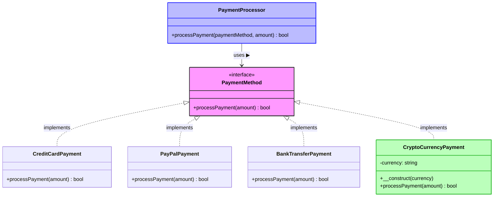

# 🔓 Open/Closed Principle (OCP)

> **💡 Pro Tip:** "Write code that's open for extension but closed for modification. When you need new functionality, add new code rather than changing existing code."

## 📋 Table of Contents

| Emoji | Topic | Description |
|:---:|---|---|
| ✅ | [Definition](#definition) | What is OCP? |
| 🚫 | [Problem Without OCP](#problem-without-ocp) | Common anti-patterns |
| 🎨 | [Solution with OCP](#solution-with-ocp) | Implementing OCP properly |
| 🧩 | [Adding New Functionality](#adding-a-new-payment-method-without-modification) | Extending without modifying |
| 📊 | [Visualization](#visualization) | Diagram of OCP |
| 🌟 | [Another Example](#another-example-shapes-and-area-calculation) | Shapes and area calculation |
| 🛠️ | [Implementation Strategies](#common-ocp-implementation-strategies) | Ways to apply OCP |
| 📈 | [Benefits](#benefits-of-following-ocp) | Advantages of using OCP |
| 🌍 | [Real-world Example](#real-world-example-form-validators) | Form validation example |
| ⚠️ | [When Not to Apply](#when-not-to-apply-ocp) | Practical limitations |

<a id="definition"></a>
## ✅ Definition

The Open/Closed Principle states that **software entities (classes, modules, functions, etc.) should be open for extension, but closed for modification**. This means you should be able to add new functionality without changing existing code.

> **🔍 Key Insight:** OCP helps create more stable software by minimizing changes to existing, tested code while allowing the system to grow with new features.

<a id="problem-without-ocp"></a>
## 🚫 Problem Without OCP

Consider a payment processing system that handles different types of payments:

```php
<?php
class PaymentProcessor {
    public function processPayment($paymentType, $amount) {
        if ($paymentType === 'credit_card') {
            // Process credit card payment
            echo "Processing credit card payment of $amount\n";
            // Credit card-specific logic
        } 
        elseif ($paymentType === 'paypal') {
            // Process PayPal payment
            echo "Processing PayPal payment of $amount\n";
            // PayPal-specific logic
        }
        elseif ($paymentType === 'bank_transfer') {
            // Process bank transfer
            echo "Processing bank transfer of $amount\n";
            // Bank transfer-specific logic
        }
        // If we want to add a new payment method (e.g., cryptocurrency),
        // we need to modify this class by adding another condition
    }
}
```

**Usage example:**
```php
<?php
$processor = new PaymentProcessor();
$processor->processPayment('credit_card', 100);
$processor->processPayment('paypal', 75.50);
$processor->processPayment('bank_transfer', 250);
```

**Output:**
```
Processing credit card payment of 100
Processing PayPal payment of 75.5
Processing bank transfer payment of 250
```

### 🚩 Issues with this approach:

- ❌ Each time we add a new payment method, we have to **modify** the `PaymentProcessor` class
- ❌ The class becomes larger and more complex over time
- ❌ Changes to one payment method could affect others
- ❌ Testing becomes harder as the class grows
- ❌ Violates the Single Responsibility Principle as well

<a id="solution-with-ocp"></a>
## 🎨 Solution with OCP

We can refactor this code to follow the Open/Closed Principle by:

1. Creating an interface for payment methods
2. Implementing concrete payment methods 
3. Making the processor work with any payment method that implements the interface

```php
<?php
// Step 1: Create an interface
interface PaymentMethod {
    public function processPayment($amount);
}

// Step 2: Implement concrete payment methods
class CreditCardPayment implements PaymentMethod {
    public function processPayment($amount) {
        echo "Processing credit card payment of $amount\n";
        // Credit card-specific logic
        return true;
    }
}

class PayPalPayment implements PaymentMethod {
    public function processPayment($amount) {
        echo "Processing PayPal payment of $amount\n";
        // PayPal-specific logic
        return true;
    }
}

class BankTransferPayment implements PaymentMethod {
    public function processPayment($amount) {
        echo "Processing bank transfer payment of $amount\n";
        // Bank transfer-specific logic
        return true;
    }
}

// Step 3: Create a processor that works with any payment method
class PaymentProcessor {
    public function processPayment(PaymentMethod $paymentMethod, $amount) {
        return $paymentMethod->processPayment($amount);
    }
}
```

**Usage example:**
```php
<?php
$processor = new PaymentProcessor();

// Create payment method objects
$creditCard = new CreditCardPayment();
$paypal = new PayPalPayment();
$bankTransfer = new BankTransferPayment();

// Process different payment types
$processor->processPayment($creditCard, 100);
$processor->processPayment($paypal, 75.50);
$processor->processPayment($bankTransfer, 250);
```

**Output:**
```
Processing credit card payment of 100
Processing PayPal payment of 75.5
Processing bank transfer payment of 250
```

## Adding a New Payment Method Without Modification

Now, to add a new payment method (e.g., cryptocurrency), we don't need to modify any existing code:

```php
<?php
// New payment method added without modifying existing classes
class CryptoCurrencyPayment implements PaymentMethod {
    private $currency;
    
    public function __construct($currency = 'BTC') {
        $this->currency = $currency;
    }
    
    public function processPayment($amount) {
        echo "Processing {$this->currency} cryptocurrency payment of $amount\n";
        // Cryptocurrency-specific logic
        return true;
    }
}

// Usage remains the same, no changes needed to PaymentProcessor
$processor = new PaymentProcessor();
$processor->processPayment(new CryptoCurrencyPayment('ETH'), 100);
```

**Output:**
```
Processing ETH cryptocurrency payment of 100
```

> **💡 Pro Tip:** Notice how we added new functionality (cryptocurrency payments) without changing a single line of previously written code? That's the power of OCP!

<a id="visualization"></a>
## 📊 Visualization



## Another Example: Shapes and Area Calculation

### 🚫 Bad approach (violating OCP):

```php
<?php
class AreaCalculator {
    public function calculateArea($shape) {
        if ($shape instanceof Rectangle) {
            return $shape->width * $shape->height;
        } 
        elseif ($shape instanceof Circle) {
            return pi() * $shape->radius * $shape->radius;
        }
        // To add a new shape, we need to modify this class
    }
}

class Rectangle {
    public $width;
    public $height;
    
    public function __construct($width, $height) {
        $this->width = $width;
        $this->height = $height;
    }
}

class Circle {
    public $radius;
    
    public function __construct($radius) {
        $this->radius = $radius;
    }
}
```

**Usage example:**
```php
<?php
$calculator = new AreaCalculator();

$rectangle = new Rectangle(4, 5);
$circle = new Circle(3);

echo "Rectangle area: " . $calculator->calculateArea($rectangle) . "\n";
echo "Circle area: " . $calculator->calculateArea($circle) . "\n";
```

**Output:**
```
Rectangle area: 20
Circle area: 28.274333882308
```

### ✅ Good approach (following OCP):

```php
<?php
interface Shape {
    public function calculateArea();
}

class Rectangle implements Shape {
    private $width;
    private $height;
    
    public function __construct($width, $height) {
        $this->width = $width;
        $this->height = $height;
    }
    
    public function calculateArea() {
        return $this->width * $this->height;
    }
}

class Circle implements Shape {
    private $radius;
    
    public function __construct($radius) {
        $this->radius = $radius;
    }
    
    public function calculateArea() {
        return pi() * $this->radius * $this->radius;
    }
}

class AreaCalculator {
    public function calculateArea(Shape $shape) {
        return $shape->calculateArea();
    }
}
```

**Usage example:**
```php
<?php
$calculator = new AreaCalculator();

$rectangle = new Rectangle(4, 5);
$circle = new Circle(3);

echo "Rectangle area: " . $calculator->calculateArea($rectangle) . "\n";
echo "Circle area: " . $calculator->calculateArea($circle) . "\n";

// Adding a new shape without modifying existing code
class Triangle implements Shape {
    private $base;
    private $height;
    
    public function __construct($base, $height) {
        $this->base = $base;
        $this->height = $height;
    }
    
    public function calculateArea() {
        return ($this->base * $this->height) / 2;
    }
}

$triangle = new Triangle(6, 4);
echo "Triangle area: " . $calculator->calculateArea($triangle) . "\n";
```

**Output:**
```
Rectangle area: 20
Circle area: 28.274333882308
Triangle area: 12
```

## Common OCP Implementation Strategies

| Strategy | Description | When To Use |
|----------|-------------|------------|
| **🧩 Interfaces** | Define contracts that classes implement | When you have multiple implementations of the same behavior |
| **📚 Abstract Classes** | Provide base implementation with extension points | When you need shared functionality with customizable parts |
| **🔌 Plugins/Modules** | Allow functionality to be added via external modules | For highly extensible systems |
| **🎯 Strategy Pattern** | Define a family of algorithms that can be swapped | When behavior varies or needs to be selected at runtime |
| **🧬 Template Method** | Define the skeleton of an algorithm with customizable steps | When the steps of an algorithm vary but overall structure remains the same |
| **🧪 Decorators** | Wrap objects to add new behaviors at runtime | When you need to add features without modifying the class |

## Benefits of Following OCP

| Benefit | Description | Example |
|---------|-------------|---------|
| 🛡️ **Risk Reduction** | Avoid breaking existing functionality | Adding a payment method doesn't risk breaking existing ones |
| 🧪 **Easier Testing** | Test new functionality in isolation | Test cryptocurrency payment without retesting credit card logic |
| 🧩 **Better Modularity** | Code is organized into logical modules | Each payment method is in its own class |
| 🔄 **Smooth Evolution** | System can grow without becoming brittle | Add shapes without modifying the area calculator |
| 🧠 **Simpler Understanding** | Classes have well-defined responsibilities | Payment method classes focus only on their type of payment |
| 📦 **Simpler Deployment** | Can deploy new features with less regression testing | Deploy a new payment method with minimal system impact |

## Real-world Example: Form Validators

### 🚫 Bad approach:

```php
<?php
class FormValidator {
    public function validate($data, $rules) {
        $errors = [];
        
        foreach ($rules as $field => $rule) {
            if ($rule === 'required' && empty($data[$field])) {
                $errors[$field] = "The $field field is required";
            } 
            elseif ($rule === 'email' && !filter_var($data[$field], FILTER_VALIDATE_EMAIL)) {
                $errors[$field] = "The $field must be a valid email";
            }
            elseif ($rule === 'numeric' && !is_numeric($data[$field])) {
                $errors[$field] = "The $field must be a number";
            }
            // To add a new validation rule, we need to modify this class
        }
        
        return $errors;
    }
}
```

**Usage example:**
```php
<?php
$validator = new FormValidator();
$data = [
    'name' => 'John Doe',
    'email' => 'invalid-email',
    'age' => 'thirty'
];

$rules = [
    'name' => 'required',
    'email' => 'email',
    'age' => 'numeric'
];

$errors = $validator->validate($data, $rules);
print_r($errors);
```

**Output:**
```
Array
(
    [email] => The email must be a valid email
    [age] => The age must be a number
)
```

### ✅ Good approach:

```php
<?php
interface ValidationRule {
    public function validate($value): bool;
    public function getMessage($field): string;
}

class RequiredRule implements ValidationRule {
    public function validate($value): bool {
        return !empty($value);
    }
    
    public function getMessage($field): string {
        return "The $field field is required";
    }
}

class EmailRule implements ValidationRule {
    public function validate($value): bool {
        return filter_var($value, FILTER_VALIDATE_EMAIL) !== false;
    }
    
    public function getMessage($field): string {
        return "The $field must be a valid email";
    }
}

class NumericRule implements ValidationRule {
    public function validate($value): bool {
        return is_numeric($value);
    }
    
    public function getMessage($field): string {
        return "The $field must be a number";
    }
}

class FormValidator {
    private $rules = [];
    
    public function addRule($field, ValidationRule $rule) {
        if (!isset($this->rules[$field])) {
            $this->rules[$field] = [];
        }
        
        $this->rules[$field][] = $rule;
        return $this;
    }
    
    public function validate($data) {
        $errors = [];
        
        foreach ($this->rules as $field => $fieldRules) {
            foreach ($fieldRules as $rule) {
                if (!isset($data[$field]) || !$rule->validate($data[$field])) {
                    if (!isset($errors[$field])) {
                        $errors[$field] = [];
                    }
                    $errors[$field][] = $rule->getMessage($field);
                }
            }
        }
        
        return $errors;
    }
}
```

**Usage example:**
```php
<?php
$validator = new FormValidator();
$validator
    ->addRule('name', new RequiredRule())
    ->addRule('email', new RequiredRule())
    ->addRule('email', new EmailRule())
    ->addRule('age', new RequiredRule())
    ->addRule('age', new NumericRule());

$data = [
    'name' => 'John Doe',
    'email' => 'invalid-email',
    'age' => 'thirty'
];

$errors = $validator->validate($data);
print_r($errors);

// Adding a new validation rule without modifying the validator
class MinLengthRule implements ValidationRule {
    private $minLength;
    
    public function __construct($minLength) {
        $this->minLength = $minLength;
    }
    
    public function validate($value): bool {
        return strlen($value) >= $this->minLength;
    }
    
    public function getMessage($field): string {
        return "The $field must be at least {$this->minLength} characters";
    }
}

$validator->addRule('password', new RequiredRule());
$validator->addRule('password', new MinLengthRule(8));

$data['password'] = '1234';
$errors = $validator->validate($data);
print_r($errors);
```

**Output:**
```
Array
(
    [email] => Array
        (
            [0] => The email must be a valid email
        )
    [age] => Array
        (
            [0] => The age must be a number
        )
)

Array
(
    [email] => Array
        (
            [0] => The email must be a valid email
        )
    [age] => Array
        (
            [0] => The age must be a number
        )
    [password] => Array
        (
            [0] => The password must be at least 8 characters
        )
)
```

## When Not to Apply OCP

While the Open/Closed Principle is valuable, it's not always appropriate to apply it:

| Scenario | Explanation | Example |
|----------|-------------|---------|
| 🌱 **Early Development** | When requirements are still evolving rapidly | An MVP (Minimum Viable Product) where features change often |
| 🔧 **Simple, Stable Code** | For code that rarely changes | Basic utility functions that are unlikely to change |
| 📊 **Performance-Critical Systems** | When abstractions would cause significant overhead | High-frequency trading systems where every microsecond counts |
| 🚀 **Small Projects** | For small, short-lived projects | Quick scripts or one-off utilities |
| 🧠 **Over-abstracting** | When it adds unnecessary complexity | Creating elaborate interfaces for simple operations |

> **⚠️ Warning:** Premature abstraction based on OCP can lead to over-engineered systems. Apply the principle when you have a reasonable expectation of change along specific dimensions.

## 📝 Key Takeaways

1. **Extend, don't modify** - design your systems so that new features can be added without changing existing code
2. **Use abstraction** - interfaces and abstract classes are key tools for enabling extension
3. **Identify variation points** - understand what is likely to change and make those areas extensible
4. **Start simple** - don't over-engineer, but refactor toward OCP when you see repeated changes
5. **Balance with YAGNI** - "You Ain't Gonna Need It" - don't add flexibility you won't use

## 📚 Further Reading

- "Design Patterns: Elements of Reusable Object-Oriented Software" by Gang of Four
- "Clean Architecture" by Robert C. Martin
- [The Open/Closed Principle Explained](https://blog.cleancoder.com/uncle-bob/2014/05/12/TheOpenClosedPrinciple.html) by Uncle Bob
- [SOLID: Part 2 - The Open/Closed Principle](https://code.tutsplus.com/tutorials/solid-part-2-the-openclosed-principle--net-36600)
- [Real-World Examples of the Open-Closed Principle](https://dzone.com/articles/solid-principles-openclosed-principle)

## ⏭️ Up Next

Now that you understand the Open/Closed Principle, learn about the [Liskov Substitution Principle](./03-liskov-substitution.md), which ensures that objects of a superclass can be replaced with objects of a subclass without affecting program correctness.

## 🧭 Navigation

[Back to SOLID Principles](./README.md) | [Previous: Single Responsibility Principle](./01-single-responsibility.md) | [Next: Liskov Substitution Principle](./03-liskov-substitution.md)
