# 🔄 Liskov Substitution Principle (LSP)

> **💡 Pro Tip:** "If it looks like a duck, quacks like a duck, but needs batteries – you probably have the wrong abstraction."

## 📋 Table of Contents

| Emoji | Topic | Description |
|:---:|---|---|
| ✅ | [Definition](#definition) | What is LSP? |
| 🧠 | [Key Concepts](#key-concept) | Core ideas behind LSP |
| 🚫 | [Problem Without LSP](#problem-without-lsp) | Common anti-patterns |
| 🎨 | [Solution with LSP](#solution-with-lsp) | Implementing LSP properly |
| 📜 | [Formal Requirements](#formal-requirements-of-lsp) | Theoretical foundation |
| 🦅 | [Real-World Example](#real-world-example-bird-hierarchy) | Bird hierarchy example |
| 📊 | [Visualization](#visualization) | Diagram of LSP |
| ⚠️ | [Common Violations](#common-lsp-violations) | Ways LSP is often broken |
| 🌟 | [Benefits](#benefits-of-following-lsp) | Advantages of using LSP |
| 🛠️ | [Best Practices](#best-practices) | Tips for proper implementation |

<a id="definition"></a>
## ✅ Definition

The Liskov Substitution Principle states that **objects of a superclass should be replaceable with objects of a subclass without affecting the correctness of the program**. In other words, a subclass should behave in such a way that it won't cause problems when used instead of the parent class.

This principle was introduced by Barbara Liskov in 1987 and is a cornerstone of proper object-oriented design.

> **🔍 Key Insight:** Inheritance should guarantee that any property proved about supertype objects also holds for subtype objects.

<a id="key-concept"></a>
## 🧠 Key Concept

If S is a subtype of T, then objects of type T may be replaced with objects of type S without altering any of the desirable properties of the program.

In mathematical terms, if φ(x) is a property provable about objects x of type T, then φ(y) should be true for objects y of type S where S is a subtype of T.

<a id="problem-without-lsp"></a>
## 🚫 Problem Without LSP

Consider this classic example of a Rectangle and Square:

```php
<?php
class Rectangle {
    protected $width;
    protected $height;
    
    public function setWidth($width) {
        $this->width = $width;
    }
    
    public function setHeight($height) {
        $this->height = $height;
    }
    
    public function getWidth() {
        return $this->width;
    }
    
    public function getHeight() {
        return $this->height;
    }
    
    public function calculateArea() {
        return $this->width * $this->height;
    }
}

// Square inherits from Rectangle because, geometrically, a square is a rectangle
class Square extends Rectangle {
    // A square must have equal sides, so override setWidth and setHeight
    public function setWidth($width) {
        $this->width = $width;
        $this->height = $width; // Make sure both sides are equal
    }
    
    public function setHeight($height) {
        $this->height = $height;
        $this->width = $height; // Make sure both sides are equal
    }
}
```

This looks fine at first, but it violates LSP:

```php
<?php
function calculateRectangleArea(Rectangle $rectangle) {
    $rectangle->setWidth(4);
    $rectangle->setHeight(5);
    
    // We expect the area to be 4 * 5 = 20
    $area = $rectangle->calculateArea();
    
    assert($area === 20, "Area should be 20");
    return $area;
}

// This works fine
$rectangle = new Rectangle();
calculateRectangleArea($rectangle); // 20

// This fails!
$square = new Square();
calculateRectangleArea($square); // 25, because setting height also changed the width!
```

**Output:**
```
PHP Fatal error:  Uncaught AssertionError: Area should be 20 in example.php:40
Stack trace:
#0 example.php(40): assert(false, 'Area should be 20')
#1 example.php(48): calculateRectangleArea(Object(Square))
#2 {main}
  thrown in example.php on line 40
```

The assertion fails because `$square->setHeight(5)` also sets the width to 5, so the area becomes 5 * 5 = 25 instead of 4 * 5 = 20.

> **🚩 Warning:** Just because a relationship holds in mathematics (a square is a type of rectangle) doesn't mean it should be modeled with inheritance in code.

<a id="solution-with-lsp"></a>
## 🎨 Solution with LSP

There are several ways to solve this issue:

### 1. Use Composition Instead of Inheritance

```php
<?php
interface Shape {
    public function calculateArea();
}

class Rectangle implements Shape {
    protected $width;
    protected $height;
    
    public function __construct($width, $height) {
        $this->width = $width;
        $this->height = $height;
    }
    
    public function setWidth($width) {
        $this->width = $width;
    }
    
    public function setHeight($height) {
        $this->height = $height;
    }
    
    public function calculateArea() {
        return $this->width * $this->height;
    }
}

class Square implements Shape {
    protected $side;
    
    public function __construct($side) {
        $this->side = $side;
    }
    
    public function setSide($side) {
        $this->side = $side;
    }
    
    public function calculateArea() {
        return $this->side * $this->side;
    }
}
```

**Usage example:**
```php
<?php
$rectangle = new Rectangle(4, 5);
echo "Rectangle area: " . $rectangle->calculateArea() . "\n";

$square = new Square(5);
echo "Square area: " . $square->calculateArea() . "\n";

// We can still use both shapes in a polymorphic way:
function printArea(Shape $shape) {
    echo "Shape area: " . $shape->calculateArea() . "\n";
}

printArea($rectangle);
printArea($square);
```

**Output:**
```
Rectangle area: 20
Square area: 25
Shape area: 20
Shape area: 25
```

### 2. Make the Class Immutable

```php
<?php
class Rectangle {
    protected $width;
    protected $height;
    
    public function __construct($width, $height) {
        $this->width = $width;
        $this->height = $height;
    }
    
    // No setters - dimensions can't be changed after creation
    
    public function getWidth() {
        return $this->width;
    }
    
    public function getHeight() {
        return $this->height;
    }
    
    public function calculateArea() {
        return $this->width * $this->height;
    }
}

class Square extends Rectangle {
    public function __construct($side) {
        parent::__construct($side, $side);
    }
}
```

**Usage example:**
```php
<?php
$rectangle = new Rectangle(4, 5);
echo "Rectangle area: " . $rectangle->calculateArea() . "\n";

$square = new Square(5);
echo "Square area: " . $square->calculateArea() . "\n";

// Function that works with either type
function calculateRectangleArea(Rectangle $rectangle) {
    return $rectangle->calculateArea();
}

echo "Function with rectangle: " . calculateRectangleArea($rectangle) . "\n";
echo "Function with square: " . calculateRectangleArea($square) . "\n";
```

**Output:**
```
Rectangle area: 20
Square area: 25
Function with rectangle: 20
Function with square: 25
```

<a id="formal-requirements-of-lsp"></a>
## 📜 Formal Requirements of LSP

Barbara Liskov's definition includes several properties that must be maintained:

| Requirement | Explanation | Example |
|-------------|-------------|---------|
| **Preconditions** | Preconditions can't be stronger in subtypes | If `Parent` accepts any positive number, `Child` can't require numbers > 100 |
| **Postconditions** | Postconditions can't be weaker in subtypes | If `Parent` guarantees a sorted result, `Child` must also guarantee it |
| **Invariants** | Class invariants must be preserved | If `Parent` maintains a balanced tree, `Child` must too |
| **Contravariance of parameters** | Method parameters should be same type or more general | If `Parent` accepts `Animal`, `Child` can accept `Animal` or `LivingBeing` (more general) |
| **Covariance of return types** | Return types can be same or more specific | If `Parent` returns `Animal`, `Child` can return `Animal` or `Dog` (more specific) |
| **Exception handling** | Subtypes shouldn't throw new exceptions not in supertype | If `Parent` throws `IOException`, `Child` can't throw `SQLException` |

> **📚 Academic Note:** The formal definition was provided in Barbara Liskov's paper "Data Abstraction and Hierarchy" (1988) and in "A Behavioral Notion of Subtyping" by Barbara Liskov and Jeannette Wing (1994).

<a id="real-world-example-bird-hierarchy"></a>
## 🦅 Real-World Example: Bird Hierarchy

Consider a classic example of bird classes:

### ❌ Incorrect implementation:

```php
<?php
// Incorrect implementation
class Bird {
    public function fly() {
        echo "Flying...\n";
    }
}

class Ostrich extends Bird {
    public function fly() {
        throw new Exception("Ostriches can't fly!");
    }
}
```

**Usage example:**
```php
<?php
function makeBirdFly(Bird $bird) {
    try {
        $bird->fly();
    } catch (Exception $e) {
        echo "Error: " . $e->getMessage() . "\n";
    }
}

$sparrow = new Bird();
makeBirdFly($sparrow);

$ostrich = new Ostrich();
makeBirdFly($ostrich);
```

**Output:**
```
Flying...
Error: Ostriches can't fly!
```

This violates LSP because any code that expects birds to fly will fail with Ostriches.

### ✅ Better approach:

```php
<?php
// Correct implementation
interface Bird {
    public function move();
}

class FlyingBird implements Bird {
    public function move() {
        return $this->fly();
    }
    
    protected function fly() {
        return "Flying...";
    }
}

class NonFlyingBird implements Bird {
    public function move() {
        return $this->run();
    }
    
    protected function run() {
        return "Running...";
    }
}

class Sparrow extends FlyingBird {}
class Ostrich extends NonFlyingBird {}
```

**Usage example:**
```php
<?php
function makeBirdMove(Bird $bird) {
    echo $bird->move() . "\n";
}

$sparrow = new Sparrow();
makeBirdMove($sparrow);

$ostrich = new Ostrich();
makeBirdMove($ostrich);
```

**Output:**
```
Flying...
Running...
```

<a id="visualization"></a>
## 📊 Visualization

```mermaid
classDiagram
    Shape <|.. Rectangle : implements
    Shape <|.. Square : implements

    class Shape {
        <<interface>>
        +calculateArea() float
    }
    
    class Rectangle {
        -width: float
        -height: float
        +setWidth(width: float) void
        +setHeight(height: float) void
        +calculateArea() float
    }
    
    class Square {
        -side: float
        +setSide(side: float) void
        +calculateArea() float
    }
    
    note for Rectangle "Area = width × height"
    note for Square "Area = side²"
    
    style Shape fill:#f9f,stroke:#333,stroke-width:2px,color:black
    style Rectangle fill:#bbf,stroke:#33f,stroke-width:2px,color:black
    style Square fill:#bbf,stroke:#33f,stroke-width:2px,color:black
```



<a id="common-lsp-violations"></a>
## ⚠️ Common LSP Violations

### 1. Throwing Unexpected Exceptions

```php
<?php
class Parent {
    public function doSomething($value) {
        // Does something without exceptions
        return "Processed value: $value";
    }
}

class Child extends Parent {
    public function doSomething($value) {
        if ($value < 0) {
            throw new Exception("Value cannot be negative"); // Unexpected!
        }
        // Rest of the implementation
        return parent::doSomething($value);
    }
}
```

**Usage example:**
```php
<?php
function processValue(Parent $processor, $value) {
    try {
        echo $processor->doSomething($value) . "\n";
    } catch (Exception $e) {
        echo "Error: " . $e->getMessage() . "\n";
    }
}

$parent = new Parent();
$child = new Child();

echo "Using Parent:\n";
processValue($parent, 5);
processValue($parent, -5);

echo "\nUsing Child:\n";
processValue($child, 5);
processValue($child, -5);
```

**Output:**
```
Using Parent:
Processed value: 5
Processed value: -5

Using Child:
Processed value: 5
Error: Value cannot be negative
```

### 2. Changing Method Behavior

```php
<?php
class UserRepository {
    public function getAll() {
        // Returns ALL users
        return ["user1", "user2", "user3", "inactiveUser"];
    }
}

class FilteredUserRepository extends UserRepository {
    public function getAll() {
        // Only returns ACTIVE users - violates LSP
        return ["user1", "user2", "user3"];
    }
}
```

**Usage example:**
```php
<?php
function countUsers(UserRepository $repo) {
    $users = $repo->getAll();
    echo "Found " . count($users) . " users\n";
    return count($users);
}

$repo = new UserRepository();
$filteredRepo = new FilteredUserRepository();

echo "Standard repository: ";
countUsers($repo);

echo "Filtered repository: ";
countUsers($filteredRepo);
```

**Output:**
```
Standard repository: Found 4 users
Filtered repository: Found 3 users
```

### 3. Strengthening Preconditions

```php
<?php
class FileProcessor {
    public function process($file) {
        // Processes any file
        return "Processing file: $file";
    }
}

class TextFileProcessor extends FileProcessor {
    public function process($file) {
        // Checks file type - stronger precondition
        $extension = pathinfo($file, PATHINFO_EXTENSION);
        if ($extension !== 'txt') {
            throw new Exception("Only text files allowed, got .$extension");
        }
        // Rest of the implementation
        return parent::process($file);
    }
}
```

**Usage example:**
```php
<?php
function processFile(FileProcessor $processor, $file) {
    try {
        echo $processor->process($file) . "\n";
    } catch (Exception $e) {
        echo "Error: " . $e->getMessage() . "\n";
    }
}

$generalProcessor = new FileProcessor();
$textProcessor = new TextFileProcessor();

echo "General processor:\n";
processFile($generalProcessor, 'document.txt');
processFile($generalProcessor, 'image.jpg');

echo "\nText processor:\n";
processFile($textProcessor, 'document.txt');
processFile($textProcessor, 'image.jpg');
```

**Output:**
```
General processor:
Processing file: document.txt
Processing file: image.jpg

Text processor:
Processing file: document.txt
Error: Only text files allowed, got .jpg
```

### 4. Weakening Postconditions

```php
<?php
class Authenticator {
    public function authenticate($credentials) {
        // Always returns a User object or throws exception
        if ($credentials === 'valid') {
            return new User('John');
        }
        throw new Exception("Invalid credentials");
    }
}

class GuestAuthenticator extends Authenticator {
    public function authenticate($credentials) {
        // Might return null instead of a User - weaker postcondition
        if (empty($credentials)) {
            return null;
        }
        return parent::authenticate($credentials);
    }
}

class User {
    private $name;
    public function __construct($name) {
        $this->name = $name;
    }
    public function getName() {
        return $this->name;
    }
}
```

**Usage example:**
```php
<?php
function welcomeUser(Authenticator $auth, $credentials) {
    try {
        $user = $auth->authenticate($credentials);
        echo "Welcome, " . $user->getName() . "!\n";
    } catch (Exception $e) {
        echo "Authentication failed: " . $e->getMessage() . "\n";
    } catch (Error $e) {
        echo "Error: " . $e->getMessage() . "\n";
    }
}

$standardAuth = new Authenticator();
$guestAuth = new GuestAuthenticator();

echo "Standard authenticator:\n";
welcomeUser($standardAuth, 'valid');
welcomeUser($standardAuth, '');

echo "\nGuest authenticator:\n";
welcomeUser($guestAuth, 'valid');
welcomeUser($guestAuth, '');
```

**Output:**
```
Standard authenticator:
Welcome, John!
Authentication failed: Invalid credentials

Guest authenticator:
Welcome, John!
Error: Call to a member function getName() on null
```

<a id="benefits-of-following-lsp"></a>
## 🌟 Benefits of Following LSP

| Benefit | Description | Example |
|---------|-------------|---------|
| 🧩 **Polymorphism** | Code works correctly with all subtypes | A function can work with any Shape subtype |
| 🔄 **Substitutability** | Subtypes can be used anywhere the parent is expected | A Square can be used wherever a Shape is required |
| 📦 **Reusable code** | Write code once that works with any subtype | One rendering engine for all Shape types |
| 🛡️ **Fewer edge cases** | No special handling for different subtypes | No need to check "if the shape is a Square, then..." |
| 🧪 **Better testability** | Easier to mock and test | Can use any subclass in tests |
| 🧠 **Clearer abstractions** | Forces better understanding of your domain | Better hierarchy design |

<a id="best-practices"></a>
## 🛠️ Best Practices

1. **Design by Contract**: Clearly define the expected behavior of your classes
   
   ```php
   /**
    * Processes a payment
    * @param float $amount Must be positive
    * @return bool True if payment succeeds
    * @throws PaymentException On network errors only
    */
   public function processPayment(float $amount): bool
   ```

2. **Use Interface Segregation**: Create smaller, focused interfaces instead of large, general ones
   
   ```php
   // Instead of one large interface
   interface Bird {
       public function fly();
       public function walk();
       public function swim();
   }
   
   // Create multiple focused interfaces
   interface Flyable {
       public function fly();
   }
   
   interface Walkable {
       public function walk();
   }
   ```

3. **Favor Composition Over Inheritance**: When in doubt, use composition
   
   ```php
   // Instead of inheritance
   class Bird extends Animal {}
   
   // Use composition
   class Bird {
       private $animalBehavior;
       
       public function __construct(AnimalBehavior $animalBehavior) {
           $this->animalBehavior = $animalBehavior;
       }
   }
   ```

4. **Create Immutable Objects**: When possible, make objects immutable to avoid state issues
   
   ```php
   class Rectangle {
       private $width;
       private $height;
       
       public function __construct($width, $height) {
           $this->width = $width;
           $this->height = $height;
       }
       
       // No setters, only getters and methods that return new instances
       public function withWidth($newWidth) {
           return new Rectangle($newWidth, $this->height);
       }
   }
   ```

5. **Use "Tell, Don't Ask" Principle**: Focus on behavior rather than state
   
   ```php
   // Don't:
   if ($user->getRole() === 'admin') {
       $user->performAdminAction();
   }
   
   // Do:
   $user->performAction(); // Let the User object decide what action to take
   ```

6. **Write Acceptance Tests**: Test that all implementations satisfy the requirements of their interfaces
   
   ```php
   function testAllShapesCalculateArea() {
       $shapes = [
           new Rectangle(4, 5),
           new Square(5),
           new Circle(3)
       ];
       
       foreach ($shapes as $shape) {
           $this->assertIsNumeric($shape->calculateArea());
           $this->assertGreaterThan(0, $shape->calculateArea());
       }
   }
   ```

## 📝 Key Takeaways

1. **Behavioral subtyping**: Subtypes must behave like their parent types
2. **Substitution**: A subtype should be replaceable anywhere its parent type is used
3. **Contracts**: Maintain the guarantees (contracts) made by the parent type
4. **Abstraction**: A good abstraction represents what objects *do*, not what they *are*
5. **Class hierarchies**: Sometimes the intuitive hierarchy isn't the right one for code
6. **Test substitution**: You can test LSP by trying to use subtypes in place of parent types

## 📚 Further Reading

- "Liskov Substitution Principle" by Robert C. Martin in "Agile Software Development, Principles, Patterns, and Practices"
- "Data Abstraction and Hierarchy" by Barbara Liskov (1988)
- "A Behavioral Notion of Subtyping" by Barbara Liskov and Jeannette Wing (1994)
- [The Circle-Ellipse Problem](https://en.wikipedia.org/wiki/Circle-ellipse_problem) - Another classic LSP example
- [Design by Contract](https://en.wikipedia.org/wiki/Design_by_contract) - A methodology related to LSP
- [Tell, Don't Ask Principle](https://pragprog.com/articles/tell-dont-ask) - A complementary principle

## ⏭️ Up Next

Now that you understand the Liskov Substitution Principle, learn about the [Interface Segregation Principle](./04-interface-segregation.md), which helps you create focused interfaces that clients can depend on.

## 🧭 Navigation

[Back to SOLID Principles](./README.md) | [Previous: Open/Closed Principle](./02-open-closed.md) | [Next: Interface Segregation Principle](./04-interface-segregation.md)
