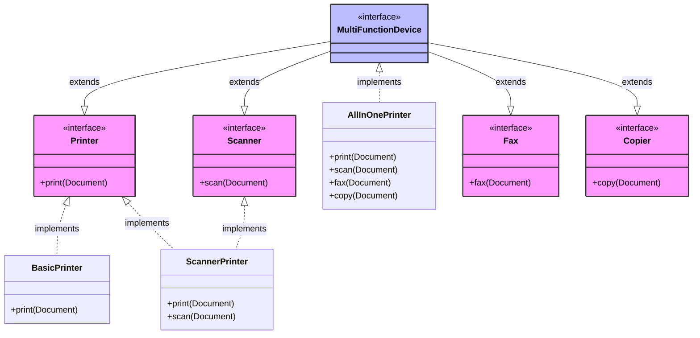

# 🧩 Interface Segregation Principle (ISP)

> **💡 Pro Tip:** "Clients should not be forced to depend on interfaces they don't use. Create focused, specific interfaces instead of large general-purpose ones."

## 📋 Table of Contents

| Emoji | Topic | Description |
|:---:|---|---|
| ✅ | [Definition](#definition) | What is ISP? |
| 🚫 | [Problem Without ISP](#problem-without-isp) | Common anti-patterns |
| 🎨 | [Solution with ISP](#solution-with-isp) | Implementing ISP properly |
| 🔄 | [Client Code](#client-code-with-isp) | How to use ISP in practice |
| 📊 | [Visualization](#visualization) | Diagram of ISP |
| 🌍 | [Real-world Example](#real-world-example-user-repository) | Repository pattern example |
| 🛠️ | [More Examples](#more-practical-examples) | Additional ISP examples |
| 📈 | [Benefits](#benefits-of-following-isp) | Advantages of using ISP |
| 🔍 | [Identifying Violations](#how-to-identify-isp-violations) | Signs your interfaces may be too large |
| 🧪 | [Refactoring Strategies](#refactoring-strategies) | How to fix ISP violations |
| 🔗 | [ISP and Other SOLID Principles](#isp-and-other-solid-principles) | How ISP relates to other principles |

<a id="definition"></a>
## ✅ Definition

The Interface Segregation Principle states that **no client should be forced to depend on methods it does not use**. In other words, many client-specific interfaces are better than one general-purpose interface.

> **🔍 Key Insight:** Fat interfaces create unnecessary coupling. When a class implements an interface with methods it doesn't need, it becomes vulnerable to changes in those unused methods.

<a id="problem-without-isp"></a>
## 🚫 Problem Without ISP

Consider a multi-functional printer interface:

```php
<?php
interface MultiFunctionDevice {
    public function print(Document $document);
    public function scan(Document $document);
    public function fax(Document $document);
    public function copy(Document $document);
}

// Implementation for an all-in-one device
class AllInOnePrinter implements MultiFunctionDevice {
    public function print(Document $document) {
        echo "Printing document: {$document->getName()}\n";
        // Print implementation
    }
    
    public function scan(Document $document) {
        echo "Scanning document: {$document->getName()}\n";
        // Scan implementation
    }
    
    public function fax(Document $document) {
        echo "Faxing document: {$document->getName()}\n";
        // Fax implementation
    }
    
    public function copy(Document $document) {
        echo "Copying document: {$document->getName()}\n";
        // Copy implementation
    }
}

// Implementation for a basic printer - problem!
class BasicPrinter implements MultiFunctionDevice {
    public function print(Document $document) {
        echo "Printing document: {$document->getName()}\n";
        // Print implementation
    }
    
    public function scan(Document $document) {
        throw new Exception("This printer cannot scan documents");
    }
    
    public function fax(Document $document) {
        throw new Exception("This printer cannot fax documents");
    }
    
    public function copy(Document $document) {
        throw new Exception("This printer cannot copy documents");
    }
}

// Simple document class for our examples
class Document {
    private $name;
    
    public function __construct($name) {
        $this->name = $name;
    }
    
    public function getName() {
        return $this->name;
    }
}
```

**Usage example:**
```php
<?php
$document = new Document("Report.pdf");
$allInOne = new AllInOnePrinter();
$basic = new BasicPrinter();

// Works fine with AllInOnePrinter
try {
    $allInOne->print($document);
    $allInOne->scan($document);
    $allInOne->fax($document);
    $allInOne->copy($document);
} catch (Exception $e) {
    echo "Error: " . $e->getMessage() . "\n";
}

// Problems with BasicPrinter
try {
    $basic->print($document); // This works
    $basic->scan($document);  // This throws exception
} catch (Exception $e) {
    echo "Error: " . $e->getMessage() . "\n";
}
```

**Output:**
```
Printing document: Report.pdf
Scanning document: Report.pdf
Faxing document: Report.pdf
Copying document: Report.pdf
Printing document: Report.pdf
Error: This printer cannot scan documents
```

### 🚩 Issues with this approach:

- ❌ `BasicPrinter` is forced to implement methods it doesn't support
- ❌ Clients using `BasicPrinter` might try to call methods that aren't really supported
- ❌ The interface is not cohesive - it combines multiple responsibilities
- ❌ It's harder to maintain as new functionalities might be added
- ❌ Runtime exceptions instead of compile-time safety
- ❌ Hard to test all possible combinations

<a id="solution-with-isp"></a>
## 🎨 Solution with ISP

Split the interface into smaller, more focused interfaces:

```php
<?php
interface Printer {
    public function print(Document $document);
}

interface Scanner {
    public function scan(Document $document);
}

interface Fax {
    public function fax(Document $document);
}

interface Copier {
    public function copy(Document $document);
}

// For convenience, we can still have a combined interface
interface MultiFunctionDevice extends Printer, Scanner, Fax, Copier {
    // No additional methods needed
}

// Now implementations only implement what they can do
class AllInOnePrinter implements MultiFunctionDevice {
    public function print(Document $document) {
        echo "Printing document: {$document->getName()}\n";
        // Print implementation
    }
    
    public function scan(Document $document) {
        echo "Scanning document: {$document->getName()}\n";
        // Scan implementation
    }
    
    public function fax(Document $document) {
        echo "Faxing document: {$document->getName()}\n";
        // Fax implementation
    }
    
    public function copy(Document $document) {
        echo "Copying document: {$document->getName()}\n";
        // Copy implementation
    }
}

class BasicPrinter implements Printer {
    public function print(Document $document) {
        echo "Printing document: {$document->getName()}\n";
        // Print implementation
    }
}

class ScannerPrinter implements Printer, Scanner {
    public function print(Document $document) {
        echo "Printing document: {$document->getName()}\n";
        // Print implementation
    }
    
    public function scan(Document $document) {
        echo "Scanning document: {$document->getName()}\n";
        // Scan implementation
    }
}
```

<a id="client-code-with-isp"></a>
## 🔄 Client Code with ISP

The client code becomes more robust and maintainable:

```php
<?php
// Simple document class for our examples
class Document {
    private $name;
    
    public function __construct($name) {
        $this->name = $name;
    }
    
    public function getName() {
        return $this->name;
    }
}

// Client that only needs printing functionality
function printDocument(Printer $printer, Document $document) {
    $printer->print($document);
}

// Client that needs both printing and scanning
function scanAndPrint(Printer $printer, Scanner $scanner, Document $document) {
    $scanner->scan($document);
    $printer->print($document);
}

// We can call this with different device types
$document = new Document("Report.pdf");
$basicPrinter = new BasicPrinter();
$scannerPrinter = new ScannerPrinter();
$allInOne = new AllInOnePrinter();

echo "Using basic printer:\n";
printDocument($basicPrinter, $document);

echo "\nUsing scanner printer:\n";
printDocument($scannerPrinter, $document);
scanAndPrint($scannerPrinter, $scannerPrinter, $document);

echo "\nUsing all-in-one device:\n";
printDocument($allInOne, $document);
scanAndPrint($allInOne, $allInOne, $document);

// This line would cause a compile-time error - BasicPrinter is not a Scanner
// scanAndPrint($basicPrinter, $basicPrinter, $document);
```

**Output:**
```
Using basic printer:
Printing document: Report.pdf

Using scanner printer:
Printing document: Report.pdf
Scanning document: Report.pdf
Printing document: Report.pdf

Using all-in-one device:
Printing document: Report.pdf
Scanning document: Report.pdf
Printing document: Report.pdf
```

> **💡 Key benefit:** Notice that the error with the basic printer would now be caught at compile time rather than runtime. The compiler would tell us that `$basicPrinter` doesn't implement the `Scanner` interface.

<a id="visualization"></a>
## 📊 Visualization



<a id="real-world-example-user-repository"></a>
## 🌍 Real-world Example: User Repository

### 🚫 Without ISP:

```php
<?php
interface UserRepository {
    public function findById($id);
    public function findAll();
    public function save(User $user);
    public function update(User $user);
    public function delete($id);
    public function countByStatus($status);
    public function findByEmail($email);
    public function getUsersCreatedBetween($startDate, $endDate);
    public function exportToCSV();
    public function importFromCSV($file);
    public function syncWithExternalSystem();
}

// Now every concrete implementation must implement all methods
class MySQLUserRepository implements UserRepository {
    public function findById($id) {
        // Implementation
        return new User($id, "user{$id}@example.com");
    }
    
    public function findAll() {
        // Implementation
        return [new User(1, "user1@example.com"), new User(2, "user2@example.com")];
    }
    
    // Must implement all 11 methods, even if some aren't needed or supported
    public function save(User $user) { /* ... */ }
    public function update(User $user) { /* ... */ }
    public function delete($id) { /* ... */ }
    public function countByStatus($status) { /* ... */ }
    public function findByEmail($email) { /* ... */ }
    public function getUsersCreatedBetween($startDate, $endDate) { /* ... */ }
    
    // These don't make sense for every implementation
    public function exportToCSV() {
        throw new Exception("Not supported");
    }
    
    public function importFromCSV($file) {
        throw new Exception("Not supported");
    }
    
    public function syncWithExternalSystem() {
        throw new Exception("Not supported");
    }
}

class User {
    private $id;
    private $email;
    
    public function __construct($id, $email) {
        $this->id = $id;
        $this->email = $email;
    }
    
    // Getters/setters
}
```

### ✅ With ISP:

```php
<?php
// Split into role-specific interfaces
interface UserReader {
    public function findById($id);
    public function findAll();
    public function findByEmail($email);
}

interface UserWriter {
    public function save(User $user);
    public function update(User $user);
    public function delete($id);
}

interface UserAnalytics {
    public function countByStatus($status);
    public function getUsersCreatedBetween($startDate, $endDate);
}

interface UserImportExport {
    public function exportToCSV();
    public function importFromCSV($file);
}

interface ExternalSyncable {
    public function syncWithExternalSystem();
}

// Standard repository implements reading and writing only
class StandardUserRepository implements UserReader, UserWriter {
    public function findById($id) {
        // Implementation
        return new User($id, "user{$id}@example.com");
    }
    
    public function findAll() {
        // Implementation
        return [new User(1, "user1@example.com"), new User(2, "user2@example.com")];
    }
    
    public function findByEmail($email) {
        // Implementation
        return new User(1, $email);
    }
    
    public function save(User $user) {
        echo "Saving user...\n";
        // Implementation
    }
    
    public function update(User $user) {
        echo "Updating user...\n";
        // Implementation
    }
    
    public function delete($id) {
        echo "Deleting user with ID: {$id}\n";
        // Implementation
    }
}

// Read-only repository for reporting
class ReadOnlyUserRepository implements UserReader, UserAnalytics {
    public function findById($id) {
        // Implementation
        return new User($id, "user{$id}@example.com");
    }
    
    public function findAll() {
        // Implementation
        return [new User(1, "user1@example.com"), new User(2, "user2@example.com")];
    }
    
    public function findByEmail($email) {
        // Implementation
        return new User(1, $email);
    }
    
    public function countByStatus($status) {
        echo "Counting users with status: {$status}\n";
        return 5; // Example count
    }
    
    public function getUsersCreatedBetween($startDate, $endDate) {
        echo "Finding users created between {$startDate} and {$endDate}\n";
        // Implementation
        return [new User(1, "recent@example.com")];
    }
}

// Full-featured repository
class FullUserRepository implements UserReader, UserWriter, UserAnalytics, UserImportExport, ExternalSyncable {
    // Implements all methods from all interfaces
    // ...
}
```

**Usage example:**
```php
<?php
// Client that only needs read operations
function displayUserDetails(UserReader $repository, $userId) {
    $user = $repository->findById($userId);
    echo "User details for ID {$userId}\n";
    // Display user details
}

// Client that needs analytics
function generateUserReport(UserAnalytics $repository, $status) {
    $count = $repository->countByStatus($status);
    echo "There are {$count} users with status: {$status}\n";
    // Generate report
}

// We can use different repositories based on needs
$standardRepo = new StandardUserRepository();
$readOnlyRepo = new ReadOnlyUserRepository();

displayUserDetails($standardRepo, 1);
displayUserDetails($readOnlyRepo, 2);

// This works with ReadOnlyUserRepository but would fail with StandardUserRepository
generateUserReport($readOnlyRepo, "active");

// This would cause a compile-time error
// generateUserReport($standardRepo, "active");
```

**Output:**
```
User details for ID 1
User details for ID 2
There are 5 users with status: active
```

<a id="more-practical-examples"></a>
## 🛠️ More Practical Examples

### Payment Processing

```php
<?php
// Bad approach - one large interface
interface PaymentProcessor {
    public function processCreditCard($cardNumber, $expiry, $cvv, $amount);
    public function processPayPal($email, $password, $amount);
    public function processBankTransfer($accountNumber, $routingNumber, $amount);
    public function processCryptocurrency($walletId, $amount);
    public function getTransactionHistory();
    public function refund($transactionId);
}

// Better approach - segregated interfaces
interface CreditCardProcessor {
    public function processCreditCard($cardNumber, $expiry, $cvv, $amount);
}

interface PayPalProcessor {
    public function processPayPal($email, $password, $amount);
}

interface BankTransferProcessor {
    public function processBankTransfer($accountNumber, $routingNumber, $amount);
}

interface CryptoProcessor {
    public function processCryptocurrency($walletId, $amount);
}

interface TransactionHistoryProvider {
    public function getTransactionHistory();
}

interface RefundCapable {
    public function refund($transactionId);
}

// Now we can implement specialized processors
class StripeProcessor implements CreditCardProcessor, RefundCapable {
    public function processCreditCard($cardNumber, $expiry, $cvv, $amount) {
        echo "Processing credit card payment of {$amount} via Stripe\n";
        return "tx_" . uniqid();
    }
    
    public function refund($transactionId) {
        echo "Refunding transaction {$transactionId} via Stripe\n";
        return true;
    }
}

class PayPalGateway implements PayPalProcessor, RefundCapable, TransactionHistoryProvider {
    public function processPayPal($email, $password, $amount) {
        echo "Processing PayPal payment of {$amount}\n";
        return "pp_" . uniqid();
    }
    
    public function refund($transactionId) {
        echo "Refunding transaction {$transactionId} via PayPal\n";
        return true;
    }
    
    public function getTransactionHistory() {
        echo "Retrieving PayPal transaction history\n";
        return ["pp_123456", "pp_789012"];
    }
}
```

### File Management

```php
<?php
// Bad approach
interface FileManager {
    public function readFile($path);
    public function writeFile($path, $content);
    public function deleteFile($path);
    public function copyFile($source, $destination);
    public function getFileSize($path);
    public function getFilePermissions($path);
    public function setFilePermissions($path, $permissions);
    public function compressFile($path, $destination);
    public function decompressFile($path, $destination);
    public function encryptFile($path, $key);
    public function decryptFile($path, $key);
}

// Better approach
interface FileReader {
    public function readFile($path);
}

interface FileWriter {
    public function writeFile($path, $content);
}

interface FileDeletion {
    public function deleteFile($path);
}

interface FileCopier {
    public function copyFile($source, $destination);
}

interface FileInfo {
    public function getFileSize($path);
    public function getFilePermissions($path);
}

interface FilePermissionManager {
    public function setFilePermissions($path, $permissions);
}

interface FileCompressor {
    public function compressFile($path, $destination);
    public function decompressFile($path, $destination);
}

interface FileEncryptor {
    public function encryptFile($path, $key);
    public function decryptFile($path, $key);
}

// Now we can create specialized implementations
class BasicFileHandler implements FileReader, FileWriter, FileDeletion {
    public function readFile($path) {
        echo "Reading file: {$path}\n";
        return "file contents";
    }
    
    public function writeFile($path, $content) {
        echo "Writing to file: {$path}\n";
        return true;
    }
    
    public function deleteFile($path) {
        echo "Deleting file: {$path}\n";
        return true;
    }
}

class SecureFileHandler implements FileReader, FileWriter, FileEncryptor {
    public function readFile($path) {
        echo "Reading file: {$path}\n";
        return "file contents";
    }
    
    public function writeFile($path, $content) {
        echo "Writing to file: {$path}\n";
        return true;
    }
    
    public function encryptFile($path, $key) {
        echo "Encrypting file: {$path}\n";
        return true;
    }
    
    public function decryptFile($path, $key) {
        echo "Decrypting file: {$path}\n";
        return "decrypted content";
    }
}
```

<a id="benefits-of-following-isp"></a>
## 📈 Benefits of Following ISP

| Benefit | Description | Example |
|---------|-------------|---------|
| 🧩 **Cleaner dependencies** | Clients depend only on what they need | A print service only depends on `Printer`, not `Scanner` |
| 🛡️ **Compile-time safety** | Errors caught during compilation, not runtime | Trying to use `BasicPrinter` as a `Scanner` fails at compile time |
| 🔄 **Reduced coupling** | Changes to one functionality don't affect unrelated clients | Adding `colorPrint()` to `Printer` won't affect clients using `Scanner` |
| ♻️ **Better reusability** | Specialized interfaces can be reused in different contexts | `FileReader` can be used in multiple systems |
| 📦 **Improved maintainability** | Easier to modify and extend code | Add new printer features without affecting scanning code |
| 🎯 **More focused implementations** | Classes only implement methods that make sense for them | A basic printer doesn't need to worry about scanning |
| 🧪 **Better testability** | Easier to create mocks for smaller, focused interfaces | Mock just the `UserReader` interface instead of the entire repository |
| 📏 **Better organization** | Code organized by capability or responsibility | Payment processing capabilities are clearly separated |

<a id="how-to-identify-isp-violations"></a>
## 🔍 How to Identify ISP Violations

Signs that your interfaces may be violating ISP:

| Sign | Description | Example |
|------|-------------|---------|
| 🚩 **Empty/stub methods** | Methods that throw `NotImplementedException` or return null/default values | `BasicPrinter.scan()` throwing "not supported" exception |
| 📚 **Large interfaces** | Interfaces with many unrelated methods | An interface with both database and email methods |
| 🧪 **Unused dependencies** | Clients import interfaces but only use a fraction of them | A service using 2 of 15 methods from an interface |
| 🌡️ **Method implementation variance** | Some implementations are robust while others are empty/throw exceptions | Different payment processors supporting different methods |
| 🤔 **Interface bloat over time** | Interfaces that keep growing as new features are added | Adding blockchain methods to a payment processor interface |
| 🔌 **Client-specific methods** | Methods that only some clients need | Report generation methods used only by admin users |
| 🧩 **Unrelated method groups** | Methods that fall into distinct functional categories | File reading, compression, and encryption in one interface |

<a id="refactoring-strategies"></a>
## 🧪 Refactoring Strategies

| Strategy | Description | When to Use |
|----------|-------------|------------|
| 🔪 **Split by client** | Group methods by which clients use them together | When different clients use distinct method subsets |
| 🧩 **Split by responsibility** | Group methods by the functionality they provide | When methods fall into clear categories |
| 🌳 **Use interface inheritance** | Create specialized interfaces that extend more general ones | When building hierarchies of related capabilities |
| 🏛️ **Adapter pattern** | Implement larger interfaces using adapters around smaller ones | When integrating with systems requiring large interfaces |
| 🔄 **Delegation** | Implement interfaces using composition of smaller interfaces | When implementations need flexibility in component choice |
| 🔍 **Role interfaces** | Create interfaces based on client-role interactions | When object behavior varies by client role |

### Example: Refactoring by Responsibility

```php
<?php
// Before
interface UserService {
    // Authentication
    public function login($username, $password);
    public function logout();
    public function register($username, $password, $email);
    
    // Profile management
    public function updateProfile($userId, $data);
    public function getProfile($userId);
    
    // Permissions
    public function hasPermission($userId, $permission);
    public function grantPermission($userId, $permission);
}

// After
interface UserAuthService {
    public function login($username, $password);
    public function logout();
    public function register($username, $password, $email);
}

interface UserProfileService {
    public function updateProfile($userId, $data);
    public function getProfile($userId);
}

interface UserPermissionService {
    public function hasPermission($userId, $permission);
    public function grantPermission($userId, $permission);
}
```

<a id="isp-and-other-solid-principles"></a>
## 🔗 ISP and Other SOLID Principles

ISP works hand in hand with the other SOLID principles:

| Principle | Relationship to ISP | Example |
|-----------|---------------------|---------|
| **Single Responsibility (SRP)** | Both promote focused, cohesive units | Split `UserService` into authorization, profile, and permission services |
| **Open/Closed (OCP)** | Small interfaces make extension easier without modification | Add new types of printers without changing existing ones |
| **Liskov Substitution (LSP)** | Focused interfaces make proper substitution easier | All `Printer` implementations can be used interchangeably |
| **Dependency Inversion (DIP)** | Small interfaces make it easier to depend on abstractions | Depend on `FileReader` instead of concrete file classes |

## 🧠 When to Be Pragmatic

While ISP is valuable, consider:

| Consideration | Description | Action |
|---------------|-------------|--------|
| 📏 **Granularity** | Too many tiny interfaces can increase complexity | Don't create a one-method interface for every method |
| 🔄 **Related behaviors** | Methods that are naturally used together | Keep closely related methods in the same interface |
| 👥 **Implementation count** | Number of classes implementing the interface | Fewer implementations may justify larger interfaces |
| 🔮 **Future change** | Likelihood of different parts changing separately | Split when different aspects will evolve differently |
| 🛠️ **Maintenance cost** | Cost of managing many small interfaces | Balance between separation and maintainability |
| 📦 **System complexity** | Overall complexity budget | Use more detailed interfaces in core domain than in utilities |

> **⚖️ Balance Tip:** "Make interfaces as small as they need to be, but no smaller."

## 📝 Key Takeaways

1. **Interface clients come first** - design interfaces from the client's perspective
2. **Prefer many small interfaces** over one large interface
3. **Prevent "empty" implementations** that throw exceptions
4. **Group related methods** that are commonly used together
5. **Look for patterns** in how clients use your interfaces
6. **Refactor interfaces** when you see clients using only parts of them

## 📚 Further Reading

- "Clean Code" by Robert C. Martin - Chapter on interfaces and class design
- ["Interface Segregation Principle"](https://blog.cleancoder.com/uncle-bob/2014/05/08/SingleReponsibilityPrinciple.html) by Robert C. Martin
- ["SOLID: Interface Segregation Principle"](https://stackify.com/interface-segregation-principle/) by Thorben Janssen
- ["Design Patterns: Elements of Reusable Object-Oriented Software"](https://www.amazon.com/Design-Patterns-Elements-Reusable-Object-Oriented/dp/0201633612) by the Gang of Four - Covers adapter pattern
- ["Patterns of Enterprise Application Architecture"](https://martinfowler.com/books/eaa.html) by Martin Fowler - Interface design for enterprise applications

## ⏭️ Up Next

Now that you understand the Interface Segregation Principle, learn about the [Dependency Inversion Principle](./05-dependency-inversion.md), which helps you create more flexible, modular systems through abstractions.

## 🧭 Navigation

[Back to SOLID Principles](./README.md) | [Previous: Liskov Substitution Principle](./03-liskov-substitution.md) | [Next: Dependency Inversion Principle](./05-dependency-inversion.md)

