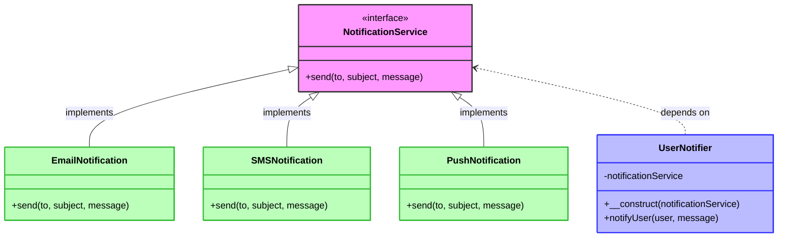

# 🔌 Dependency Inversion Principle (DIP)

> **💡 Pro Tip:** "Depend on abstractions, not on concretions. High-level modules should not depend on low-level modules."

## 📋 Table of Contents

| Emoji | Topic | Description |
|:---:|---|---|
| ✅ | [Definition](#definition) | What is DIP? |
| 🧠 | [Key Concepts](#key-concepts) | Core ideas behind DIP |
| 🚫 | [Problem Without DIP](#problem-without-dip) | Common anti-patterns |
| 🎨 | [Solution with DIP](#solution-with-dip) | Implementing DIP properly |
| 💉 | [Dependency Injection](#dependency-injection) | Different injection methods |
| 📊 | [Visualization](#visualization) | Diagram of DIP |
| 🌍 | [Real-world Example](#real-world-example-database-repository) | Database repository example |
| 🏗️ | [Common Architectures](#common-dip-architectures) | Service locator and DI containers |
| 📈 | [Benefits](#benefits-of-following-dip) | Advantages of using DIP |
| 🛠️ | [Best Practices](#best-practices) | Tips for proper implementation |
| 🔍 | [DIP vs IoC](#dependency-inversion-vs-inversion-of-control) | Understanding the differences |

<a id="definition"></a>
## ✅ Definition

The Dependency Inversion Principle states that:

1. **High-level modules should not depend on low-level modules. Both should depend on abstractions.**
2. **Abstractions should not depend on details. Details should depend on abstractions.**

This principle aims to reduce the coupling between code modules, making the system more modular and easier to change.

> **🔍 Key Insight:** DIP is often confused with Dependency Injection, but they're different concepts. DIP is a principle about the direction of dependencies, while Dependency Injection is a technique often used to implement DIP.

<a id="key-concepts"></a>
## 🧠 Key Concepts

| Concept | Description |
|---------|-------------|
| **High-level modules** | Components that contain complex business rules and policies |
| **Low-level modules** | Components that implement basic operations (database access, network communication, etc.) |
| **Abstractions** | Interfaces or abstract classes that define functionality without specifying how it's implemented |
| **Coupling** | The degree to which one component depends on another |
| **Inversion of control** | A broader principle where traditional control flow is "inverted" - the framework calls your code instead of your code calling the framework |

<a id="problem-without-dip"></a>
## 🚫 Problem Without DIP

Consider a typical notification system that directly depends on a specific implementation:

```php
<?php
// Low-level module - specific implementation
class EmailSender {
    public function sendEmail($to, $subject, $body) {
        // Code to send an email
        echo "Email sent to {$to} with subject '{$subject}'\n";
        return true;
    }
}

// High-level module - directly depends on EmailSender
class UserNotifier {
    private $emailSender;
    
    public function __construct() {
        // Direct instantiation creates tight coupling
        $this->emailSender = new EmailSender();
    }
    
    public function notifyUser($user, $message) {
        $subject = "Notification";
        return $this->emailSender->sendEmail($user->getEmail(), $subject, $message);
    }
}

class User {
    private $email;
    
    public function __construct($email) {
        $this->email = $email;
    }
    
    public function getEmail() {
        return $this->email;
    }
}

// Usage
$notifier = new UserNotifier();
$user = new User("john@example.com");
$notifier->notifyUser($user, "Your account has been created");
```

**Output:**
```
Email sent to john@example.com with subject 'Notification'
```

### 🚩 Issues with this approach:

- ❌ `UserNotifier` is **tightly coupled** to `EmailSender` - it creates and uses the specific implementation directly
- ❌ We can't easily change to a different notification method (SMS, push notification, etc.)
- ❌ **Testing is difficult** because we can't substitute a mock email sender
- ❌ The **high-level policy** (notification logic) depends on a low-level detail (email implementation)
- ❌ **Breaking changes** in `EmailSender` would require changes in `UserNotifier`

<a id="solution-with-dip"></a>
## 🎨 Solution with DIP

We can apply DIP by:
1. Creating an abstraction (interface) for notification
2. Making the high-level module depend on the abstraction
3. Making the low-level implementation depend on the abstraction
4. Using dependency injection to provide the implementation

```php
<?php
// Abstraction
interface NotificationService {
    public function send($to, $subject, $message);
}

// Low-level module - implements the abstraction
class EmailNotification implements NotificationService {
    public function send($to, $subject, $message) {
        // Code to send an email
        echo "Email sent to {$to} with subject '{$subject}'\n";
        return true;
    }
}

// Alternative implementation
class SMSNotification implements NotificationService {
    public function send($to, $subject, $message) {
        // Code to send an SMS
        echo "SMS sent to {$to}: {$message}\n";
        return true;
    }
}

// Another alternative implementation
class PushNotification implements NotificationService {
    public function send($to, $subject, $message) {
        // Code to send a push notification
        echo "Push notification sent to device {$to}: {$subject} - {$message}\n";
        return true;
    }
}

// High-level module - depends on abstraction
class UserNotifier {
    private $notificationService;
    
    // Dependency injection
    public function __construct(NotificationService $notificationService) {
        $this->notificationService = $notificationService;
    }
    
    public function notifyUser($user, $message) {
        $subject = "Notification";
        return $this->notificationService->send(
            $user->getContact(),
            $subject,
            $message
        );
    }
}

class User {
    private $email;
    private $phone;
    private $deviceId;
    
    public function __construct($email, $phone = null, $deviceId = null) {
        $this->email = $email;
        $this->phone = $phone;
        $this->deviceId = $deviceId;
    }
    
    public function getContact() {
        // Returns the appropriate contact info based on notification type
        // For simplicity, we'll just return email
        return $this->email;
    }
}

// Usage
$emailNotifier = new UserNotifier(new EmailNotification());
$smsNotifier = new UserNotifier(new SMSNotification());
$pushNotifier = new UserNotifier(new PushNotification());

$user = new User("john@example.com", "1234567890", "device-xyz-123");

echo "Using email notification:\n";
$emailNotifier->notifyUser($user, "Your account has been created");

echo "\nUsing SMS notification:\n";
$smsNotifier->notifyUser($user, "Your account has been created");

echo "\nUsing push notification:\n";
$pushNotifier->notifyUser($user, "Your account has been created");
```

**Output:**
```
Using email notification:
Email sent to john@example.com with subject 'Notification'

Using SMS notification:
SMS sent to john@example.com: Your account has been created

Using push notification:
Push notification sent to device john@example.com: Notification - Your account has been created
```

> **💡 Key Benefit:** Notice how we can easily swap notification methods without changing the `UserNotifier` class. The high-level module (UserNotifier) and low-level modules (notification implementations) both depend on the abstraction (NotificationService interface).

<a id="visualization"></a>
## 📊 Visualization



> **📝 Note:** The arrow directions in this diagram show the dependency flow. The high-level module (UserNotifier) and the implementations (EmailNotification, etc.) both depend on the abstraction (NotificationService).

<a id="dependency-injection"></a>
## 💉 Dependency Injection

Dependency Injection (DI) is a technique often used to implement DIP. There are several ways to achieve it:

### 1. Constructor Injection

```php
<?php
class UserNotifier {
    private $notificationService;
    
    // Dependencies are provided through the constructor
    public function __construct(NotificationService $notificationService) {
        $this->notificationService = $notificationService;
    }
    
    // Methods use the injected dependency
    public function notifyUser($user, $message) {
        return $this->notificationService->send(
            $user->getContact(), 
            "Notification", 
            $message
        );
    }
}

// Usage
$notifier = new UserNotifier(new EmailNotification());
```

**Best for:** Required dependencies that the class cannot function without.

### 2. Setter Injection

```php
<?php
class UserNotifier {
    private $notificationService;
    
    // Dependencies are set through setter methods
    public function setNotificationService(NotificationService $notificationService) {
        $this->notificationService = $notificationService;
        return $this; // For method chaining
    }
    
    public function notifyUser($user, $message) {
        if (!$this->notificationService) {
            throw new Exception("Notification service not set");
        }
        return $this->notificationService->send(
            $user->getContact(), 
            "Notification", 
            $message
        );
    }
}

// Usage
$notifier = new UserNotifier();
$notifier->setNotificationService(new EmailNotification());
$notifier->notifyUser($user, "Your account has been created");

// Or with method chaining
$notifier = new UserNotifier();
$notifier
    ->setNotificationService(new EmailNotification())
    ->notifyUser($user, "Your account has been created");
```

**Best for:** Optional dependencies or when dependencies need to be changed at runtime.

### 3. Method Injection

```php
<?php
class UserNotifier {
    // Dependencies are passed directly to methods that need them
    public function notifyUser($user, $message, NotificationService $notificationService) {
        return $notificationService->send(
            $user->getContact(), 
            "Notification", 
            $message
        );
    }
}

// Usage
$notifier = new UserNotifier();
$notifier->notifyUser($user, "Your account has been created", new EmailNotification());
```

**Best for:** When a dependency is used by only one method or when different implementations might be needed for different calls.

### 4. Interface Injection

```php
<?php
interface NotificationServiceAware {
    public function setNotificationService(NotificationService $notificationService);
}

class UserNotifier implements NotificationServiceAware {
    private $notificationService;
    
    public function setNotificationService(NotificationService $notificationService) {
        $this->notificationService = $notificationService;
    }
    
    public function notifyUser($user, $message) {
        return $this->notificationService->send(
            $user->getContact(), 
            "Notification", 
            $message
        );
    }
}

// A service that can inject dependencies into objects
class NotificationInjector {
    private $notificationService;
    
    public function __construct(NotificationService $notificationService) {
        $this->notificationService = $notificationService;
    }
    
    public function inject(NotificationServiceAware $aware) {
        $aware->setNotificationService($this->notificationService);
    }
}

// Usage
$notifier = new UserNotifier();
$injector = new NotificationInjector(new EmailNotification());
$injector->inject($notifier);
$notifier->notifyUser($user, "Your account has been created");
```

**Best for:** When implementing a framework where components need to follow a contract for dependency injection.

<a id="real-world-example-database-repository"></a>
## 🌍 Real-World Example: Database Repository

### 🚫 Without DIP:

```php
<?php
class UserRepository {
    private $mysqli;
    
    public function __construct() {
        $this->mysqli = new mysqli("localhost", "user", "password", "database");
        
        if ($this->mysqli->connect_error) {
            die("Connection failed: " . $this->mysqli->connect_error);
        }
    }
    
    public function findById($id) {
        $result = $this->mysqli->query("SELECT * FROM users WHERE id = {$id}");
        return $result->fetch_assoc();
    }
    
    public function save($userData) {
        $this->mysqli->query("INSERT INTO users (name, email) 
                             VALUES ('{$userData['name']}', '{$userData['email']}')");
        return $this->mysqli->insert_id;
    }
}

// Usage
$userRepo = new UserRepository();
$user = $userRepo->findById(1);
echo "Found user: " . $user['name'] . "\n";

$newUserId = $userRepo->save(['name' => 'John Doe', 'email' => 'john@example.com']);
echo "New user created with ID: " . $newUserId . "\n";
```

**Issues:**
- Direct dependency on MySQLi implementation
- Impossible to use a different database
- Hard to unit test (requires a real database)

### ✅ With DIP:

```php
<?php
// Abstraction for database operations
interface DatabaseConnection {
    public function query($sql);
    public function fetch($result);
    public function getLastInsertId();
}

// MySQL implementation
class MySQLConnection implements DatabaseConnection {
    private $mysqli;
    
    public function __construct($host, $user, $password, $database) {
        $this->mysqli = new mysqli($host, $user, $password, $database);
        
        if ($this->mysqli->connect_error) {
            die("Connection failed: " . $this->mysqli->connect_error);
        }
    }
    
    public function query($sql) {
        return $this->mysqli->query($sql);
    }
    
    public function fetch($result) {
        return $result->fetch_assoc();
    }
    
    public function getLastInsertId() {
        return $this->mysqli->insert_id;
    }
}

// SQLite implementation
class SQLiteConnection implements DatabaseConnection {
    private $pdo;
    
    public function __construct($filename) {
        $this->pdo = new PDO("sqlite:{$filename}");
        $this->pdo->setAttribute(PDO::ATTR_ERRMODE, PDO::ERRMODE_EXCEPTION);
    }
    
    public function query($sql) {
        return $this->pdo->query($sql);
    }
    
    public function fetch($result) {
        return $result->fetch(PDO::FETCH_ASSOC);
    }
    
    public function getLastInsertId() {
        return $this->pdo->lastInsertId();
    }
}

// High-level module depends on abstraction
class UserRepository {
    private $db;
    
    public function __construct(DatabaseConnection $db) {
        $this->db = $db;
    }
    
    public function findById($id) {
        $result = $this->db->query("SELECT * FROM users WHERE id = {$id}");
        return $this->db->fetch($result);
    }
    
    public function save($userData) {
        $this->db->query("INSERT INTO users (name, email) 
                         VALUES ('{$userData['name']}', '{$userData['email']}')");
        return $this->db->getLastInsertId();
    }
}

// Mock database implementation for testing
class MockDatabaseConnection implements DatabaseConnection {
    private $mockData = [];
    private $lastId = 0;
    
    public function setMockData($data) {
        $this->mockData = $data;
    }
    
    public function query($sql) {
        // For demo, we'll just extract the ID from SELECT queries
        if (strpos($sql, 'SELECT') !== false) {
            preg_match('/id = (\d+)/', $sql, $matches);
            $id = $matches[1] ?? 0;
            return ['mockResult' => isset($this->mockData[$id]) ? $this->mockData[$id] : null];
        }
        // For INSERT, we'll just increment the ID
        elseif (strpos($sql, 'INSERT') !== false) {
            $this->lastId++;
            return true;
        }
        return null;
    }
    
    public function fetch($result) {
        return $result['mockResult'];
    }
    
    public function getLastInsertId() {
        return $this->lastId;
    }
}

// Usage with MySQL
$mysqlDb = new MySQLConnection("localhost", "user", "password", "database");
$userRepo = new UserRepository($mysqlDb);
$user = $userRepo->findById(1);
echo "Found user: " . ($user ? $user['name'] : 'Not found') . "\n";

// Usage with SQLite
$sqliteDb = new SQLiteConnection("users.db");
$userRepo = new UserRepository($sqliteDb);
$newUserId = $userRepo->save(['name' => 'John Doe', 'email' => 'john@example.com']);
echo "New user created with ID: " . $newUserId . "\n";

// Usage with mock for testing
$mockDb = new MockDatabaseConnection();
$mockDb->setMockData([
    1 => ['id' => 1, 'name' => 'Alice', 'email' => 'alice@example.com'],
    2 => ['id' => 2, 'name' => 'Bob', 'email' => 'bob@example.com']
]);

$userRepo = new UserRepository($mockDb);
$user = $userRepo->findById(1);
echo "Found user in mock: " . ($user ? $user['name'] : 'Not found') . "\n";

$newUserId = $userRepo->save(['name' => 'Mock User', 'email' => 'mock@example.com']);
echo "New mock user created with ID: " . $newUserId . "\n";
```

**Sample Output:**
```
Found user: Alice
New user created with ID: 1
Found user in mock: Alice
New mock user created with ID: 1
```

<a id="common-dip-architectures"></a>
## 🏗️ Common DIP Architectures

### Service Locator Pattern

The Service Locator pattern provides a centralized registry where services are registered and can be retrieved by name.

```php
<?php
class ServiceLocator {
    private static $services = [];
    
    public static function register($name, $service) {
        self::$services[$name] = $service;
    }
    
    public static function get($name) {
        if (!isset(self::$services[$name])) {
            throw new Exception("Service '{$name}' not found");
        }
        return self::$services[$name];
    }
}

// Register services
ServiceLocator::register('database', new MySQLConnection("localhost", "user", "pass", "db"));
ServiceLocator::register('notification', new EmailNotification());
ServiceLocator::register('logger', new FileLogger("/var/log/app.log"));

// Use services
class UserService {
    public function createUser($name, $email) {
        $db = ServiceLocator::get('database');
        $notification = ServiceLocator::get('notification');
        $logger = ServiceLocator::get('logger');
        
        try {
            // Create user in database
            $userId = $db->query("INSERT INTO users (name, email) VALUES ('$name', '$email')");
            $db->getLastInsertId();
            
            // Send notification
            $notification->send($email, "Welcome", "Welcome to our platform, $name!");
            
            // Log success
            $logger->log("User created: $name ($email)");
            
            return $userId;
        } catch (Exception $e) {
            $logger->log("Error creating user: " . $e->getMessage());
            throw $e;
        }
    }
}

$userService = new UserService();
try {
    $userId = $userService->createUser("John Doe", "john@example.com");
    echo "User created with ID: $userId\n";
} catch (Exception $e) {
    echo "Error: " . $e->getMessage() . "\n";
}
```

**Pros and cons of Service Locator:**
- ✅ Simple to implement and use
- ✅ Services can be easily swapped for testing
- ❌ Dependencies are hidden (not explicit in constructor/methods)
- ❌ More difficult to track service dependencies
- ❌ Global state can lead to issues in large applications

### Dependency Injection Container

A DI container manages the creation and injection of dependencies:

```php
<?php
class DIContainer {
    private $services = [];
    private $instances = [];
    
    public function register($name, $definition, $shared = true) {
        $this->services[$name] = [
            'definition' => $definition,
            'shared' => $shared
        ];
    }
    
    public function get($name) {
        if (!isset($this->services[$name])) {
            throw new Exception("Service '{$name}' not found");
        }
        
        // Return existing instance if it's a shared service
        if ($this->services[$name]['shared'] && isset($this->instances[$name])) {
            return $this->instances[$name];
        }
        
        // Create new instance
        $definition = $this->services[$name]['definition'];
        $instance = null;
        
        // If definition is a closure, call it passing the container
        if (is_callable($definition)) {
            $instance = $definition($this);
        } 
        // If it's a class name, instantiate it
        else if (is_string($definition) && class_exists($definition)) {
            $instance = $this->createInstance($definition);
        } 
        // If it's already an object, use it directly
        else if (is_object($definition)) {
            $instance = $definition;
        }
        
        // Store instance if it's a shared service
        if ($this->services[$name]['shared']) {
            $this->instances[$name] = $instance;
        }
        
        return $instance;
    }
    
    private function createInstance($className) {
        $reflection = new ReflectionClass($className);
        
        if (!$reflection->isInstantiable()) {
            throw new Exception("Class {$className} is not instantiable");
        }
        
        $constructor = $reflection->getConstructor();
        
        // If there's no constructor, just instantiate
        if (is_null($constructor)) {
            return new $className();
        }
        
        // Get constructor parameters
        $parameters = $constructor->getParameters();
        $dependencies = [];
        
        // Try to resolve each parameter
        foreach ($parameters as $parameter) {
            $dependency = null;
            $type = $parameter->getType();
            
            if ($type && !$type->isBuiltin()) {
                $dependencyClassName = $type->getName();
                // Try to get from container
                try {
                    $dependency = $this->get($dependencyClassName);
                } catch (Exception $e) {
                    // Try to create it
                    try {
                        $dependency = $this->createInstance($dependencyClassName);
                    } catch (Exception $e2) {
                        if ($parameter->isOptional()) {
                            $dependency = $parameter->getDefaultValue();
                        } else {
                            throw new Exception("Could not resolve dependency: {$dependencyClassName}");
                        }
                    }
                }
            } else if ($parameter->isOptional()) {
                $dependency = $parameter->getDefaultValue();
            } else {
                throw new Exception("Could not resolve parameter: {$parameter->getName()}");
            }
            
            $dependencies[] = $dependency;
        }
        
        // Create instance with resolved dependencies
        return $reflection->newInstanceArgs($dependencies);
    }
}

// Usage
$container = new DIContainer();

// Register services
$container->register(DatabaseConnection::class, function($c) {
    return new MySQLConnection("localhost", "user", "password", "database");
});

$container->register(NotificationService::class, EmailNotification::class);

$container->register(UserRepository::class, function($c) {
    return new UserRepository($c->get(DatabaseConnection::class));
});

$container->register(UserService::class, function($c) {
    return new UserService(
        $c->get(UserRepository::class),
        $c->get(NotificationService::class)
    );
});

// Use services
$userService = $container->get(UserService::class);
$userService->createUser("John", "john@example.com");
```

**Pros and cons of DI Container:**
- ✅ Centralizes dependency management
- ✅ Makes complex dependency graphs manageable
- ✅ Supports automatic dependency resolution
- ✅ Can support different lifetimes (singleton, transient, etc.)
- ❌ More complex to implement
- ❌ Can make debugging more difficult
- ❌ May have performance overhead

<a id="benefits-of-following-dip"></a>
## 📈 Benefits of Following DIP

| Benefit | Description | Example |
|---------|-------------|---------|
| 🔄 **Reduced coupling** | High-level modules are not directly dependent on low-level implementations | `UserNotifier` doesn't need to change when switching notification methods |
| 🧩 **Increased flexibility** | Implementations can be swapped without changing the high-level modules | Switch from MySQL to PostgreSQL without changing repositories |
| 🧪 **Better testability** | Dependencies can be easily mocked for testing | Test `UserNotifier` with a mock `NotificationService` |
| 👥 **Parallel development** | Teams can work on different modules independently once interfaces are defined | Team A works on business logic while Team B implements database access |
| ♻️ **More reusable code** | Code is more modular and can be reconfigured in different ways | Use `EmailNotification` in multiple services |
| 🛡️ **Protection from changes** | Changes in low-level modules don't affect high-level modules | Updating email sending logic doesn't impact business logic |

<a id="best-practices"></a>
## 🛠️ Best Practices

1. **Define interfaces based on high-level policy needs**, not implementation details
   ```php
   // Good - defined by high-level needs
   interface UserStorage {
       public function findById($id);
       public function save(User $user);
   }
   
   // Bad - leaking implementation details
   interface UserStorage {
       public function executeQuery($sql);
       public function getLastInsertedId();
   }
   ```

2. **Use constructor injection for required dependencies**
   ```php
   // Good - dependencies are explicit
   class UserService {
       private $repository;
       
       public function __construct(UserRepository $repository) {
           $this->repository = $repository;
       }
   }
   ```

3. **Use setter injection for optional dependencies**
   ```php
   class Logger {
       private $formatter;
       
       public function setFormatter(LogFormatter $formatter) {
           $this->formatter = $formatter;
           return $this;
       }
   }
   ```

4. **Avoid service locator in application code** (it's an anti-pattern for DIP)
   ```php
   // Avoid this pattern when possible
   class UserService {
       public function getUser($id) {
           $repository = ServiceLocator::get('userRepository');
           return $repository->findById($id);
       }
   }
   ```

5. **Keep abstractions focused**
   ```php
   // Good - focused interface
   interface EmailSender {
       public function sendEmail($to, $subject, $body);
   }
   
   // Bad - too many responsibilities
   interface Communicator {
       public function sendEmail($to, $subject, $body);
       public function sendSMS($phone, $message);
       public function makePhoneCall($phone, $message);
       public function sendPushNotification($deviceId, $message);
   }
   ```

6. **Use factories for complex object creation**
   ```php
   interface ConnectionFactory {
       public function createConnection($config);
   }
   
   class MySQLConnectionFactory implements ConnectionFactory {
       public function createConnection($config) {
           return new MySQLConnection(
               $config['host'],
               $config['user'],
               $config['password'],
               $config['database']
           );
       }
   }
   ```

<a id="dependency-inversion-vs-inversion-of-control"></a>
## 🔍 Dependency Inversion vs. Inversion of Control

These related concepts are often confused:

| Concept | Definition | Focus |
|---------|------------|-------|
| **Dependency Inversion** | A design principle that states high-level modules should not depend on low-level modules | Direction of dependencies |
| **Inversion of Control** | A design pattern where the control flow is "inverted" compared to traditional programming | Control flow of the program |
| **Dependency Injection** | A technique where dependencies are provided to a class rather than created inside | How dependencies are provided |

**Example of IoC vs. traditional programming:**

Traditional:
```php
class UserController {
    public function registerUser() {
        $validator = new UserValidator();
        $repository = new UserRepository();
        
        // Controller controls the flow
        if ($validator->validate($_POST)) {
            $user = new User($_POST['name'], $_POST['email']);
            $repository->save($user);
            echo "User registered successfully";
        } else {
            echo "Invalid user data";
        }
    }
}
```

IoC with a framework:
```php
class UserController {
    private $validator;
    private $repository;
    
    public function __construct(UserValidator $validator, UserRepository $repository) {
        $this->validator = $validator;
        $this->repository = $repository;
    }
    
    // Framework calls this method (IoC)
    public function registerUser(Request $request, Response $response) {
        if ($this->validator->validate($request->all())) {
            $user = new User(
                $request->get('name'), 
                $request->get('email')
            );
            $this->repository->save($user);
            return $response->withJson(['message' => 'User registered successfully']);
        } else {
            return $response->withJson(['error' => 'Invalid user data'], 400);
        }
    }
}
```

## 📝 Key Takeaways

1. **Depend on abstractions** - both high and low-level modules should depend on interfaces
2. **Ownership matters** - abstractions should be owned by the high-level modules
3. **Invert the dependency direction** - make dependencies point toward higher-level components
4. **Use dependency injection** - provide dependencies rather than creating them internally
5. **Design abstractions around policies** - not around implementation details
6. **Separate construction from use** - use factories or DI containers for object creation

## 📚 Further Reading

- "Clean Architecture" by Robert C. Martin
- "Dependency Injection in .NET" by Mark Seemann (concepts apply to PHP as well)
- [Martin Fowler's article on Dependency Injection](https://martinfowler.com/articles/injection.html)
- [PHP-DI documentation](http://php-di.org/doc/) - A powerful DI container for PHP
- ["SOLID Architecture in PHP" by Kristopher Wilson](https://leanpub.com/solid-architecture-php)
- [Object Design Style Guide](https://www.manning.com/books/object-design-style-guide) by Matthias Noback

## ⏭️ Up Next

Now that you've completed learning about all the SOLID principles, you're ready to explore [Design Patterns](../04-design-patterns/README.md), which build upon these principles to provide reusable solutions to common problems in software design.

## 🧭 Navigation

[Back to SOLID Principles](./README.md) | [Previous: Interface Segregation Principle](./04-interface-segregation.md) | [Next: Design Patterns](../04-design-patterns/README.md)
