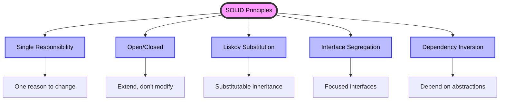

# 🌟 SOLID Principles in PHP

> **💡 Pro Tip:** "SOLID principles are the foundation of scalable, maintainable object-oriented design."

## 📋 Table of Contents

| Emoji | Topic | Description |
|:---:|---|---|
| 📚 | [Introduction](#introduction) | Overview of SOLID principles |
| 🧩 | [Single Responsibility](./01-single-responsibility.md) | One class, one responsibility |
| 🔓 | [Open/Closed](./02-open-closed.md) | Open for extension, closed for modification |
| 🔄 | [Liskov Substitution](./03-liskov-substitution.md) | Substitutable inheritance |
| 🧪 | [Interface Segregation](./04-interface-segregation.md) | Client-specific interfaces |
| 🛠️ | [Dependency Inversion](./05-dependency-inversion.md) | Depend on abstractions |
| ❓ | [Why Learn SOLID](#why-learn-solid-principles) | Benefits of mastering SOLID |
| 📖 | [How to Use This Section](#how-to-use-this-section) | Guide to this resource |

## 📚 Introduction

SOLID is an acronym for five design principles intended to make software designs more understandable, flexible, and maintainable. These principles were introduced by Robert C. Martin (Uncle Bob) and have become fundamental guidelines for good object-oriented design.

## 🔍 Overview of SOLID Principles

| Principle | Description | Key Benefit |
|:----------|:------------|:------------|
| [🧩 **S**ingle Responsibility (SRP)](./01-single-responsibility.md) | A class should have only one reason to change, meaning it should have only one job or responsibility. | Code that is easier to understand, maintain, and test. ✨ |
| [🔓 **O**pen/Closed (OCP)](./02-open-closed.md) | Software entities (classes, modules, functions) should be open for extension but closed for modification. | New functionality can be added without changing existing code, reducing the risk of regressions. 🚀 |
| [🔄 **L**iskov Substitution (LSP)](./03-liskov-substitution.md) | Objects of a superclass should be replaceable with objects of its subclasses without affecting the correctness of the program. | Better inheritance hierarchies and more reliable polymorphism. 🎯 |
| [🧪 **I**nterface Segregation (ISP)](./04-interface-segregation.md) | A client should not be forced to depend on methods it does not use. Many client-specific interfaces are better than one general-purpose interface. | More focused and cohesive interfaces that are easier to implement and maintain. 📐 |
| [🛠️ **D**ependency Inversion (DIP)](./05-dependency-inversion.md) | High-level modules should not depend on low-level modules. Both should depend on abstractions. | Loose coupling between components, making them easier to replace and test. 🔌 |

## 📊 SOLID Visualization

## ❓ Why Learn SOLID Principles?

| Benefit | Description |
|:--------|:------------|
| 🏆 **Better Code Quality** | Write cleaner, more maintainable code that's easier to understand |
| 🧠 **Improved Design Skills** | Develop a deeper understanding of object-oriented design patterns |
| 📉 **Reduced Technical Debt** | Avoid common pitfalls that lead to brittle and inflexible code |
| ✅ **Easier Testing** | Create code that's naturally more testable and less prone to bugs |
| 🌐 **Industry Standard** | Master principles used by professional developers worldwide |

## 📖 How to Use This Section

Each principle is explained in detail with:

- 📌 Clear definition and purpose
- 💻 PHP code examples showing violations and proper implementations
- 🌍 Real-world use cases
- ✨ Best practices
- ⚠️ Common pitfalls to avoid

**Recommended Learning Path:**

1. Start with [Single Responsibility Principle](./01-single-responsibility.md)
2. Then learn [Open/Closed Principle](./02-open-closed.md)
3. Continue to [Liskov Substitution Principle](./03-liskov-substitution.md)
4. Move on to [Interface Segregation Principle](./04-interface-segregation.md)
5. Finish with [Dependency Inversion Principle](./05-dependency-inversion.md)

---

## 🧭 Navigation

[Back to main index](../README.md) | [Next: Single Responsibility Principle](./01-single-responsibility.md)

## 📚 Further Reading

- "Clean Code" by Robert C. Martin
- "Agile Software Development, Principles, Patterns, and Practices" by Robert C. Martin
- [SOLID Principles Explained by Examples on the Web](https://www.baeldung.com/solid-principles)
