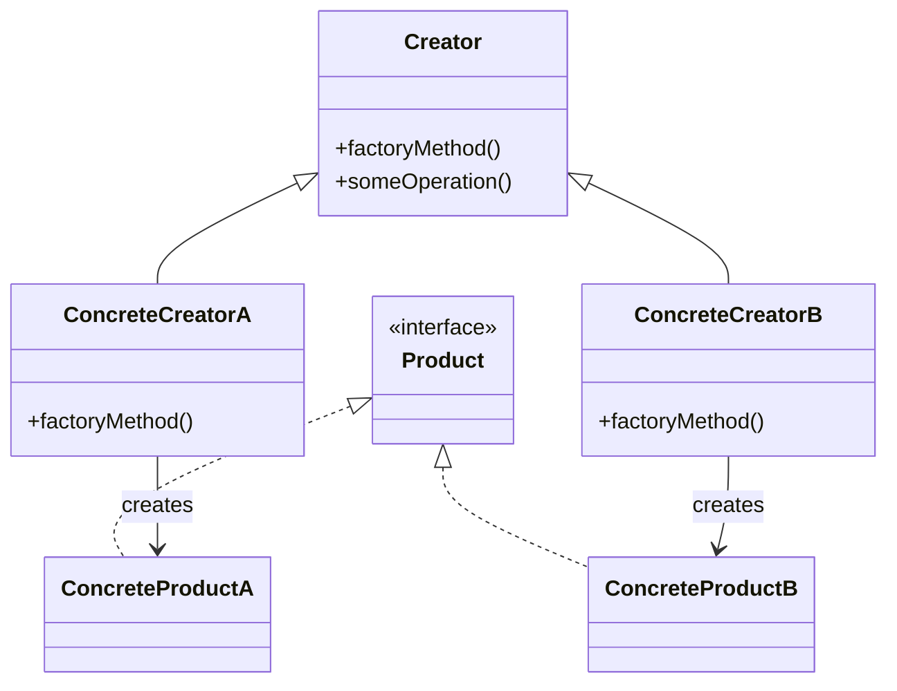

# 🏭 Factory Method Pattern

## 🎯 Intent

The Factory Method pattern provides an interface for creating objects in a superclass, but allows subclasses to alter the type of objects that will be created. It's a creational pattern that uses factory methods to deal with the problem of creating objects without specifying the exact class of object that will be created.

## ❓ Problem It Solves

Imagine you're building a logistics management application. In the beginning, the app only handles truck transportation, so most of your code lives in the `Truck` class. After a while, you need to add ships for sea transportation. However, adding this directly would require changing the existing codebase, which might introduce bugs.

## ✅ Solution

The Factory Method pattern suggests that you replace direct object construction calls with calls to a special factory method. Objects returned by a factory method are often referred to as products.

## 📊 Structure



## 💻 Implementation in PHP

```php
<?php
// Product interface
interface Transport {
    public function deliver(): string;
}

// Concrete products
class Truck implements Transport {
    public function deliver(): string {
        return "Deliver by land in a box";
    }
}

class Ship implements Transport {
    public function deliver(): string {
        return "Deliver by sea in a container";
    }
}

// Creator abstract class
abstract class Logistics {
    abstract public function createTransport(): Transport;
    
    public function planDelivery(): string {
        $transport = $this->createTransport();
        return "Logistics: Planning delivery using " . $transport->deliver();
    }
}

// Concrete creators
class RoadLogistics extends Logistics {
    public function createTransport(): Transport {
        return new Truck();
    }
}

class SeaLogistics extends Logistics {
    public function createTransport(): Transport {
        return new Ship();
    }
}

// Client code
echo "🚚 Using Road Logistics:\n";
$roadLogistics = new RoadLogistics();
echo $roadLogistics->planDelivery() . "\n\n";

echo "🚢 Using Sea Logistics:\n";
$seaLogistics = new SeaLogistics();
echo $seaLogistics->planDelivery();
```

**Output:**
```
🚚 Using Road Logistics:
Logistics: Planning delivery using Deliver by land in a box

🚢 Using Sea Logistics:
Logistics: Planning delivery using Deliver by sea in a container
```

## 🛒 Real-world Example: Payment Methods

```php
<?php
// Simplified payment processing example
interface PaymentMethod {
    public function processPayment(float $amount): string;
}

class CreditCardPayment implements PaymentMethod {
    public function processPayment(float $amount): string {
        return "Processing credit card payment of $" . $amount;
    }
}

class PayPalPayment implements PaymentMethod {
    public function processPayment(float $amount): string {
        return "Processing PayPal payment of $" . $amount;
    }
}

abstract class PaymentProcessor {
    abstract public function createPaymentMethod(): PaymentMethod;
    
    public function processOrder(float $amount): string {
        $paymentMethod = $this->createPaymentMethod();
        return $paymentMethod->processPayment($amount) . " - Success!";
    }
}

class CreditCardProcessor extends PaymentProcessor {
    public function createPaymentMethod(): PaymentMethod {
        return new CreditCardPayment();
    }
}

class PayPalProcessor extends PaymentProcessor {
    public function createPaymentMethod(): PaymentMethod {
        return new PayPalPayment();
    }
}

// Usage
$ccProcessor = new CreditCardProcessor();
echo $ccProcessor->processOrder(99.95) . "\n";

$ppProcessor = new PayPalProcessor();
echo $ppProcessor->processOrder(59.99);
```

**Output:**
```
Processing credit card payment of $99.95 - Success!
Processing PayPal payment of $59.99 - Success!
```

## 🛠️ Simple Factory Variation

```php
<?php
class PaymentMethodFactory {
    public static function createPaymentMethod(string $type): PaymentMethod {
        return match($type) {
            'credit_card' => new CreditCardPayment(),
            'paypal' => new PayPalPayment(),
            default => throw new InvalidArgumentException("Payment method $type not supported")
        };
    }
}

// Usage
$ccPayment = PaymentMethodFactory::createPaymentMethod('credit_card');
echo $ccPayment->processPayment(99.95);
```

**Output:**
```
Processing credit card payment of $99.95
```

## 🌟 Benefits

1. ✅ **Avoids tight coupling** between the creator and the concrete products
2. ✅ **Single Responsibility Principle**: You can move the product creation code into one place in the program
3. ✅ **Open/Closed Principle**: You can introduce new types of products without breaking existing client code

## 🕒 When to Use

- 🔍 When you don't know beforehand the exact types and dependencies of the objects your code should work with
- 🔍 When you want to provide users of your library or framework with a way to extend its internal components
- 🔍 When you want to save system resources by reusing existing objects instead of rebuilding them each time

## 🔄 Related Patterns

- **Abstract Factory**: Often implemented using Factory Methods
- **Template Method**: Factory Method is a specialization of Template Method
- **Prototype**: Doesn't require subclassing but might require complex initialization

---

## ⏭️ Up Next

Learn about the [Abstract Factory Pattern](./02-abstract-factory.md), which provides an interface for creating families of related or dependent objects.

[Back to Design Patterns](../README.md) | [Next: Abstract Factory](./02-abstract-factory.md)
