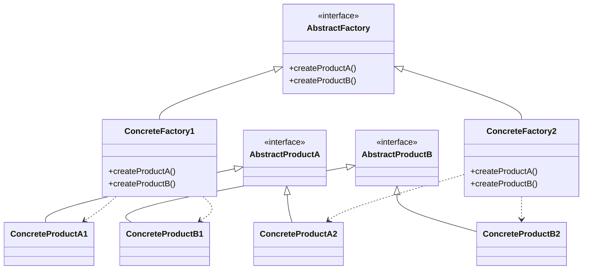

# 🏭 Abstract Factory Pattern

## 🎯 Intent

The Abstract Factory Pattern provides an interface for creating families of related or dependent objects without specifying their concrete classes. It's a higher-level version of the Factory Method pattern that deals with families of objects rather than individual objects.

## ❓ Problem It Solves

Imagine you're developing a UI toolkit that must work across multiple operating systems (Windows, macOS, Linux). Each OS has its own look and feel for UI components like buttons, checkboxes, and menus. You need a way to create UI components that automatically match the operating system, without hard-coding the OS-specific details throughout your application.

## ✅ Solution

The Abstract Factory pattern suggests defining an interface or abstract class for creating families of related objects. Each concrete implementation of this interface corresponds to a specific family or theme of objects (like a specific OS UI style).

## 📊 Structure



## 💻 Implementation in PHP

```php
<?php
// Abstract Products
interface Button {
    public function render(): string;
}

interface Checkbox {
    public function render(): string;
}

// Windows products
class WindowsButton implements Button {
    public function render(): string {
        return "Rendering a Windows-styled button";
    }
}

class WindowsCheckbox implements Checkbox {
    public function render(): string {
        return "Rendering a Windows-styled checkbox";
    }
}

// macOS products
class MacOSButton implements Button {
    public function render(): string {
        return "Rendering a macOS-styled button";
    }
}

class MacOSCheckbox implements Checkbox {
    public function render(): string {
        return "Rendering a macOS-styled checkbox";
    }
}

// Abstract Factory
interface GUIFactory {
    public function createButton(): Button;
    public function createCheckbox(): Checkbox;
}

// Concrete Factories
class WindowsFactory implements GUIFactory {
    public function createButton(): Button {
        return new WindowsButton();
    }
    
    public function createCheckbox(): Checkbox {
        return new WindowsCheckbox();
    }
}

class MacOSFactory implements GUIFactory {
    public function createButton(): Button {
        return new MacOSButton();
    }
    
    public function createCheckbox(): Checkbox {
        return new MacOSCheckbox();
    }
}

// Client code
function renderUI(GUIFactory $factory) {
    $button = $factory->createButton();
    $checkbox = $factory->createCheckbox();
    
    echo $button->render() . "\n";
    echo $checkbox->render() . "\n";
}

// Usage with Windows
echo "🪟 Windows UI:\n";
renderUI(new WindowsFactory());

echo "\n";

// Usage with macOS
echo "🍎 macOS UI:\n";
renderUI(new MacOSFactory());
```

**Output:**
```
🪟 Windows UI:
Rendering a Windows-styled button
Rendering a Windows-styled checkbox

🍎 macOS UI:
Rendering a macOS-styled button
Rendering a macOS-styled checkbox
```

## 💾 Real-world Example: Database Connections

```php
<?php
// Simplified database abstraction example
interface Connection {
    public function connect(): string;
    public function query(string $sql): string;
}

interface Statement {
    public function prepare(string $query): string;
    public function execute(array $params = []): string;
}

// MySQL implementations
class MySQLConnection implements Connection {
    public function connect(): string {
        return "Connected to MySQL database";
    }
    
    public function query(string $sql): string {
        return "Executing MySQL query: $sql";
    }
}

class MySQLStatement implements Statement {
    public function prepare(string $query): string {
        return "Preparing MySQL statement: $query";
    }
    
    public function execute(array $params = []): string {
        return "Executing MySQL statement with " . count($params) . " parameters";
    }
}

// PostgreSQL implementations
class PostgreSQLConnection implements Connection {
    public function connect(): string {
        return "Connected to PostgreSQL database";
    }
    
    public function query(string $sql): string {
        return "Executing PostgreSQL query: $sql";
    }
}

class PostgreSQLStatement implements Statement {
    public function prepare(string $query): string {
        return "Preparing PostgreSQL statement: $query";
    }
    
    public function execute(array $params = []): string {
        return "Executing PostgreSQL statement with " . count($params) . " parameters";
    }
}

// Abstract Database Factory
interface DatabaseFactory {
    public function createConnection(): Connection;
    public function createStatement(): Statement;
}

// Concrete Database Factories
class MySQLFactory implements DatabaseFactory {
    public function createConnection(): Connection {
        return new MySQLConnection();
    }
    
    public function createStatement(): Statement {
        return new MySQLStatement();
    }
}

class PostgreSQLFactory implements DatabaseFactory {
    public function createConnection(): Connection {
        return new PostgreSQLConnection();
    }
    
    public function createStatement(): Statement {
        return new PostgreSQLStatement();
    }
}

// Client code
function useDatabase(DatabaseFactory $factory) {
    $connection = $factory->createConnection();
    $statement = $factory->createStatement();
    
    echo $connection->connect() . "\n";
    echo $statement->prepare("SELECT * FROM users WHERE id = ?") . "\n";
    echo $statement->execute([1]) . "\n";
}

// Usage with MySQL
echo "🐬 MySQL Database:\n";
useDatabase(new MySQLFactory());

echo "\n";

// Usage with PostgreSQL
echo "🐘 PostgreSQL Database:\n";
useDatabase(new PostgreSQLFactory());
```

**Output:**
```
🐬 MySQL Database:
Connected to MySQL database
Preparing MySQL statement: SELECT * FROM users WHERE id = ?
Executing MySQL statement with 1 parameters

🐘 PostgreSQL Database:
Connected to PostgreSQL database
Preparing PostgreSQL statement: SELECT * FROM users WHERE id = ?
Executing PostgreSQL statement with 1 parameters
```

## 🌟 Benefits

1. ✅ **Isolates concrete classes**: The client code works with factories and products through abstract interfaces
2. ✅ **Ensures consistency**: Products created by the same factory are compatible with each other
3. ✅ **Single Responsibility Principle**: Product creation code is isolated from the business logic
4. ✅ **Open/Closed Principle**: New variants of products can be introduced without breaking existing client code
5. ✅ **Family switching**: You can swap entire product families with minimal changes

## 🕒 When to Use

- 🔍 When your system needs to work with multiple families of related products
- 🔍 When you want to provide a library of products without exposing concrete implementations
- 🔍 When you need to ensure that products work together as a cohesive family
- 🔍 When you want to emphasize product compatibility within each family

## 🔄 Related Patterns

- **Factory Method**: Abstract Factory often uses Factory Methods internally
- **Builder**: Focuses on constructing complex objects step by step
- **Prototype**: Sometimes implemented using the prototype pattern if families share similar structures
- **Singleton**: Abstract factories are often implemented as singletons

---

## ⏭️ Up Next

Learn about the [Builder Pattern](./03-builder.md), which allows you to construct complex objects step by step.

[Back to Design Patterns](../README.md) | [Previous: Factory Method](./01-factory-method.md) | [Next: Builder](./03-builder.md)
