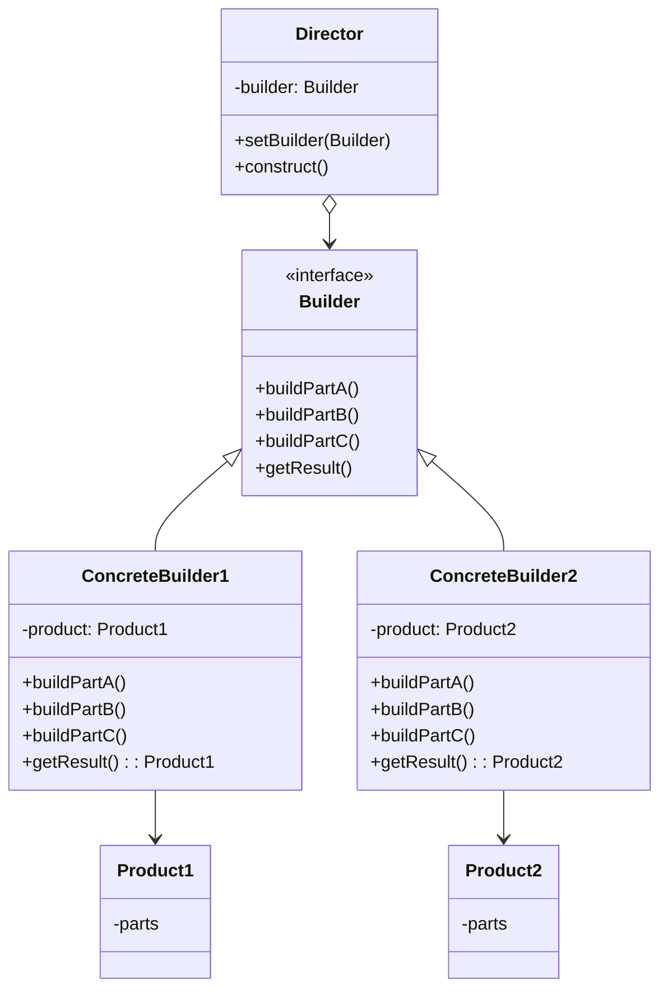

# 🏗️ Builder Pattern

## 🎯 Intent

The Builder Pattern separates the construction of a complex object from its representation, allowing the same construction process to create different representations. It helps create complex objects step by step, and it's particularly useful when an object requires many optional parameters or complex initialization.

## ❓ Problem It Solves

When an object's constructor has too many parameters, it becomes cumbersome to use and maintain. Additionally, some objects might be composed of multiple parts that need to be assembled in specific ways.

Problems addressed:
- 😵 Too many constructor parameters (telescoping constructor anti-pattern)
- 🔄 Optional parameters leading to multiple constructor overloads
- 📋 Different representations of the same object
- 🧩 Step-by-step creation of complex objects where steps might vary

## ✅ Solution

The Builder Pattern suggests extracting the object construction code into separate objects called builders. Each builder implements the same interface but performs the building steps differently, resulting in different object representations.

## 📊 Structure



## 💻 Implementation in PHP

```php
<?php
// Product class with many configurable parts
class Pizza {
    private $size;
    private $cheese = false;
    private $pepperoni = false;
    private $mushrooms = false;
    private $sauce = 'tomato';
    
    // Setters for all properties
    public function setSize(string $size): void { $this->size = $size; }
    public function setCheese(bool $cheese): void { $this->cheese = $cheese; }
    public function setPepperoni(bool $pepperoni): void { $this->pepperoni = $pepperoni; }
    public function setMushrooms(bool $mushrooms): void { $this->mushrooms = $mushrooms; }
    public function setSauce(string $sauce): void { $this->sauce = $sauce; }
    
    public function describe(): string {
        $description = "A {$this->size} pizza with {$this->sauce} sauce";
        $toppings = [];
        
        if ($this->cheese) $toppings[] = "cheese";
        if ($this->pepperoni) $toppings[] = "pepperoni";
        if ($this->mushrooms) $toppings[] = "mushrooms";
        
        if (!empty($toppings)) {
            $description .= ", topped with " . implode(", ", $toppings);
        }
        
        return $description . ".";
    }
}

// Builder interface
interface PizzaBuilder {
    public function setSize(string $size): PizzaBuilder;
    public function addCheese(): PizzaBuilder;
    public function addPepperoni(): PizzaBuilder;
    public function addMushrooms(): PizzaBuilder;
    public function setSauce(string $sauce): PizzaBuilder;
    public function build(): Pizza;
}

// Concrete builder
class ConcretePizzaBuilder implements PizzaBuilder {
    private $pizza;
    
    public function __construct() {
        $this->pizza = new Pizza();
    }
    
    public function setSize(string $size): PizzaBuilder {
        $this->pizza->setSize($size);
        return $this;
    }
    
    public function addCheese(): PizzaBuilder {
        $this->pizza->setCheese(true);
        return $this;
    }
    
    public function addPepperoni(): PizzaBuilder {
        $this->pizza->setPepperoni(true);
        return $this;
    }
    
    public function addMushrooms(): PizzaBuilder {
        $this->pizza->setMushrooms(true);
        return $this;
    }
    
    public function setSauce(string $sauce): PizzaBuilder {
        $this->pizza->setSauce($sauce);
        return $this;
    }
    
    public function build(): Pizza {
        return $this->pizza;
    }
}

// Director
class PizzaDirector {
    public function createMargherita(PizzaBuilder $builder): Pizza {
        return $builder
            ->setSize('medium')
            ->addCheese()
            ->setSauce('tomato')
            ->build();
    }
    
    public function createPepperoni(PizzaBuilder $builder): Pizza {
        return $builder
            ->setSize('large')
            ->addCheese()
            ->addPepperoni()
            ->setSauce('tomato')
            ->build();
    }
}

// Client code
$builder = new ConcretePizzaBuilder();
$director = new PizzaDirector();

// Using director to create pizzas
$margherita = $director->createMargherita($builder);
echo "🧀 Margherita: " . $margherita->describe() . "\n";

$pepperoni = $director->createPepperoni($builder);
echo "🍕 Pepperoni: " . $pepperoni->describe() . "\n";

// Creating custom pizza directly with builder
$customPizza = $builder
    ->setSize('extra large')
    ->addCheese()
    ->addMushrooms()
    ->setSauce('bbq')
    ->build();
    
echo "🍄 Custom: " . $customPizza->describe();
```

**Output:**
```
🧀 Margherita: A medium pizza with tomato sauce, topped with cheese.
🍕 Pepperoni: A large pizza with tomato sauce, topped with cheese, pepperoni.
🍄 Custom: A extra large pizza with bbq sauce, topped with cheese, mushrooms.
```

## 🔍 Real-world Example: Query Builder

```php
<?php
class QueryBuilder {
    private $select = ['*'];
    private $from = '';
    private $where = [];
    private $orderBy = [];
    private $limit = null;
    
    public function select(array $columns): self {
        $this->select = $columns;
        return $this;
    }
    
    public function from(string $table): self {
        $this->from = $table;
        return $this;
    }
    
    public function where(string $column, string $operator, $value): self {
        $this->where[] = [$column, $operator, $value];
        return $this;
    }
    
    public function orderBy(string $column, string $direction = 'ASC'): self {
        $this->orderBy[] = [$column, strtoupper($direction)];
        return $this;
    }
    
    public function limit(int $limit): self {
        $this->limit = $limit;
        return $this;
    }
    
    public function build(): string {
        $query = "SELECT " . implode(', ', $this->select) . " FROM " . $this->from;
        
        // Add where clauses
        if (!empty($this->where)) {
            $query .= " WHERE ";
            $whereParts = [];
            
            foreach ($this->where as $condition) {
                $whereParts[] = "{$condition[0]} {$condition[1]} " . 
                               (is_string($condition[2]) ? "'{$condition[2]}'" : $condition[2]);
            }
            
            $query .= implode(' AND ', $whereParts);
        }
        
        // Add order by
        if (!empty($this->orderBy)) {
            $query .= " ORDER BY ";
            $orderByParts = [];
            
            foreach ($this->orderBy as $order) {
                $orderByParts[] = "{$order[0]} {$order[1]}";
            }
            
            $query .= implode(', ', $orderByParts);
        }
        
        // Add limit
        if ($this->limit !== null) {
            $query .= " LIMIT " . $this->limit;
        }
        
        return $query;
    }
}

// Usage example
$query = (new QueryBuilder())
    ->select(['id', 'name', 'email'])
    ->from('users')
    ->where('status', '=', 'active')
    ->where('age', '>', 18)
    ->orderBy('name')
    ->limit(10)
    ->build();

echo "Generated SQL: " . $query;
```

**Output:**
```
Generated SQL: SELECT id, name, email FROM users WHERE status = 'active' AND age > 18 ORDER BY name ASC LIMIT 10
```

## 📨 Fluent Builder Pattern

```php
<?php
class Email {
    private $from;
    private $to = [];
    private $subject;
    private $body;
    
    private function __construct() {}
    
    public static function create(): EmailBuilder {
        return new EmailBuilder(new self());
    }
    
    // Friend class setter methods
    public function setFrom(string $from): void { $this->from = $from; }
    public function addTo(string $to): void { $this->to[] = $to; }
    public function setSubject(string $subject): void { $this->subject = $subject; }
    public function setBody(string $body): void { $this->body = $body; }
    
    public function send(): string {
        return "Sending email from {$this->from} to " . 
               implode(', ', $this->to) . " with subject '{$this->subject}'";
    }
}

class EmailBuilder {
    private $email;
    
    public function __construct(Email $email) {
        $this->email = $email;
    }
    
    public function from(string $from): self {
        $this->email->setFrom($from);
        return $this;
    }
    
    public function to(string $to): self {
        $this->email->addTo($to);
        return $this;
    }
    
    public function subject(string $subject): self {
        $this->email->setSubject($subject);
        return $this;
    }
    
    public function body(string $body): self {
        $this->email->setBody($body);
        return $this;
    }
    
    public function build(): Email {
        return $this->email;
    }
}

// Client code
$email = Email::create()
    ->from('sender@example.com')
    ->to('recipient1@example.com')
    ->to('recipient2@example.com')
    ->subject('Meeting Tomorrow')
    ->body('Hi Team, let\'s meet tomorrow at 10 AM.')
    ->build();

echo $email->send();
```

**Output:**
```
Sending email from sender@example.com to recipient1@example.com, recipient2@example.com with subject 'Meeting Tomorrow'
```

## 💡 Builder Pattern with PHP's Named Arguments (PHP 8+)

PHP 8 introduced named arguments, which can reduce the need for builders in simple cases:

```php
<?php
// PHP 8+ example without a builder
class User {
    public function __construct(
        private string $name,
        private string $email,
        private ?string $phone = null,
        private ?string $address = null,
        private ?string $company = null,
        private ?string $position = null,
        private ?array $permissions = []
    ) {}
    
    // Getters...
}

// Using named arguments (PHP 8+)
$user = new User(
    name: 'John Doe',
    email: 'john@example.com',
    company: 'ACME Inc.',
    // We can skip other parameters
);

// However, for more complex objects or when construction needs multiple steps,
// builders are still valuable even with named arguments
```

## 🌟 Benefits

1. ✅ **Step-by-step construction**: Build complex objects one piece at a time
2. ✅ **Encapsulate construction logic**: Hide the construction process from the client
3. ✅ **Separate representation from building process**: Use different builders for different representations
4. ✅ **Isolate complex construction code**: Keep object creation code organized
5. ✅ **Fluent interface**: Create readable code chains with method calls

## 🕒 When to Use

- 🔍 When an object has many constructor parameters, especially optional ones
- 🔍 When construction involves multiple steps that should be executed in specific order
- 🔍 When you need different representations of the same product
- 🔍 When you need to build complex composite objects
- 🔍 When construction should be independent of how the object is put together

## 🔄 Related Patterns

- **Factory Method**: Builder focuses on constructing complex objects step-by-step, while Factory Method focuses on creating objects via inheritance
- **Abstract Factory**: Abstract Factory creates families of related objects, while Builder focuses on constructing complex objects step-by-step
- **Composite**: Builder can be used to create complex Composite structures
- **Fluent Interface**: Often used with Builder to create readable method chains

---

## ⏭️ Up Next

Learn about the [Singleton Pattern](./04-singleton.md), which ensures a class has only one instance and provides a global point of access to it.

[Back to Design Patterns](../README.md) | [Previous: Abstract Factory](./02-abstract-factory.md) | [Next: Singleton](./04-singleton.md)
