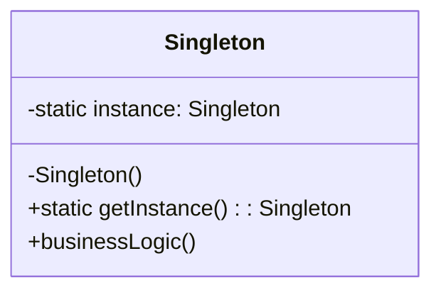

# 🔒 Singleton Pattern

## 🎯 Intent

The Singleton Pattern ensures that a class has only one instance and provides a global point of access to that instance. It's used when exactly one object is needed to coordinate actions across the system.

## ❓ Problem It Solves

Sometimes, having multiple instances of a class can lead to problems, such as:
- 💥 Inconsistent state across the system
- 💢 Resource conflicts
- 🔋 Unnecessary resource consumption
- 🐛 Incorrect program behavior

Examples include a configuration manager, a connection pool, or a file manager.

## ✅ Solution

The Singleton Pattern involves:
1. 🔒 Making the constructor private to prevent direct instantiation
2. 🔧 Creating a static creation method that acts as a constructor
3. 🏠 Implementing a static reference to the single instance

## 📊 Structure



## 💻 Implementation in PHP

```php
<?php
class DatabaseConnection {
    // The single instance
    private static ?DatabaseConnection $instance = null;
    
    // Connection details
    private $connection;
    private string $host;
    private string $username;
    
    // Private constructor
    private function __construct(string $host, string $username) {
        $this->host = $host;
        $this->username = $username;
        echo "✅ Database connection established to {$this->host}\n";
    }
    
    // Prevent cloning and unserialization
    private function __clone() {}
    private function __wakeup() {}
    
    // The getInstance method
    public static function getInstance(string $host = 'localhost', string $username = 'root'): self {
        if (self::$instance === null) {
            self::$instance = new self($host, $username);
        }
        
        return self::$instance;
    }
    
    // Example method
    public function query(string $sql): string {
        return "Executing query on {$this->host}: {$sql}";
    }
}

// Client code
echo "First connection:\n";
$db1 = DatabaseConnection::getInstance('db.example.com', 'user1');

echo "\nSecond connection (note that parameters are ignored):\n";
$db2 = DatabaseConnection::getInstance('another-db.example.com', 'user2');

echo "\nAre both variables the same instance? ";
echo ($db1 === $db2) ? "Yes!\n" : "No!\n";

echo "\nRunning a query:\n";
echo $db1->query("SELECT * FROM users");
```

**Output:**
```
First connection:
✅ Database connection established to db.example.com

Second connection (note that parameters are ignored):

Are both variables the same instance? Yes!

Running a query:
Executing query on db.example.com: SELECT * FROM users
```

## 🧵 Thread-Safety in PHP

In multi-threaded environments, we need to ensure that only one instance is created:

```php
<?php
class ThreadSafeSingleton {
    private static ?ThreadSafeSingleton $instance = null;
    private static $mutex = null;
    
    private function __construct() {
        // Initialization code
    }
    
    private function __clone() {}
    private function __wakeup() {}
    
    public static function getInstance(): ThreadSafeSingleton {
        if (self::$mutex === null) {
            // In a real multi-threaded environment, you would use actual mutex mechanism
            // This is pseudo-code for demonstration
            self::$mutex = true;
        }
        
        // Acquire lock
        // lock(self::$mutex);
        
        if (self::$instance === null) {
            self::$instance = new self();
        }
        
        // Release lock
        // unlock(self::$mutex);
        
        return self::$instance;
    }
    
    public function someBusinessLogic() {
        // Business logic code
    }
}

// Note: PHP's standard deployment with mod_php or php-fpm is single-threaded per request, 
// so thread safety is typically not an issue unless using extensions like pthreads
```

## 🦥 Lazy Initialization

```php
<?php
class ConfigManager {
    private static ?ConfigManager $instance = null;
    private array $settings = [];
    
    private function __construct() {
        // Expensive loading operation
        echo "⚙️ Loading configuration...\n";
        $this->settings = [
            'debug' => true,
            'site_name' => 'My Website',
            'api_key' => 'secret_key'
        ];
    }
    
    private function __clone() {}
    
    public static function getInstance(): self {
        if (self::$instance === null) {
            self::$instance = new self();
        }
        
        return self::$instance;
    }
    
    public function get(string $key, $default = null) {
        return $this->settings[$key] ?? $default;
    }
}

// Nothing happens yet - lazy loading
echo "Before first getInstance call\n";

// Config is loaded on first access
$debug = ConfigManager::getInstance()->get('debug');
echo "Debug mode: " . ($debug ? "On" : "Off") . "\n";

// Reusing the same instance - no loading happens
$siteName = ConfigManager::getInstance()->get('site_name');
echo "Site name: {$siteName}";
```

**Output:**
```
Before first getInstance call
⚙️ Loading configuration...
Debug mode: On
Site name: My Website
```

## 📚 Registry of Singletons

When you need multiple singletons, you can use a registry pattern:

```php
<?php
class SingletonRegistry {
    private static array $instances = [];
    
    // Prevent instantiation
    private function __construct() {}
    
    public static function getInstance(string $className) {
        if (!isset(self::$instances[$className])) {
            if (!class_exists($className)) {
                throw new Exception("Class $className not found");
            }
            
            self::$instances[$className] = new $className();
        }
        
        return self::$instances[$className];
    }
}

// Usage with instantiable singletons
class Logger {
    public function log(string $message): void {
        echo "LOG: $message\n";
    }
}

class UserService {
    public function getCurrentUser(): string {
        return "John Doe";
    }
}

// Get instances from registry
$logger = SingletonRegistry::getInstance(Logger::class);
$userService = SingletonRegistry::getInstance(UserService::class);

$logger->log("User: " . $userService->getCurrentUser());
```

## ⚖️ Singleton vs. Static Class

Here's a comparison between a Singleton and a static utility class:

```php
<?php
// Singleton approach
class DatabaseSingleton {
    private static ?DatabaseSingleton $instance = null;
    private $connection;
    
    private function __construct() {
        $this->connection = new PDO(/* connection details */);
    }
    
    public static function getInstance(): self {
        if (self::$instance === null) {
            self::$instance = new self();
        }
        return self::$instance;
    }
    
    public function query($sql) {
        // Use $this->connection to query
    }
}

// Static class approach
class DatabaseStatic {
    private static $connection;
    
    // Cannot instantiate
    private function __construct() {}
    
    // Initialize connection
    public static function initialize(): void {
        if (!isset(self::$connection)) {
            self::$connection = new PDO(/* connection details */);
        }
    }
    
    public static function query($sql) {
        // Use self::$connection to query
    }
}
```

### Key differences:

1. 🧩 **Inheritance and polymorphism**: Singleton instances can be passed as objects, implement interfaces, and support inheritance. Static classes cannot.
2. 🦥 **Lazy initialization**: Both can support it, but singletons make it more explicit.
3. 🧪 **Testing**: Singletons are easier to mock for testing (by injecting mock instances).
4. 🧠 **State management**: Singletons explicitly manage their instance state; static classes have implicit state.

## 📝 Real-World Example: Logger

```php
<?php
class Logger {
    private static ?Logger $instance = null;
    private string $logFile;
    private int $logLevel;
    
    // Log levels
    const ERROR = 3;
    const INFO = 1;
    
    private function __construct(string $logFile, int $logLevel) {
        $this->logFile = $logFile;
        $this->logLevel = $logLevel;
        echo "📝 Logger initialized with level: " . $this->getLevelName($logLevel) . "\n";
    }
    
    private function getLevelName(int $level): string {
        return match($level) {
            self::ERROR => 'ERROR',
            self::INFO => 'INFO',
            default => 'UNKNOWN'
        };
    }
    
    private function __clone() {}
    
    public static function getInstance(string $logFile = 'app.log', int $logLevel = self::INFO): self {
        if (self::$instance === null) {
            self::$instance = new self($logFile, $logLevel);
        }
        
        return self::$instance;
    }
    
    public function log(string $message, int $level = self::INFO): string {
        if ($level >= $this->logLevel) {
            $levelStr = $this->getLevelName($level);
            return "[{$levelStr}] - {$message}";
        }
        return ""; // Message below log level
    }
    
    public function error(string $message): string {
        return $this->log($message, self::ERROR);
    }
    
    public function info(string $message): string {
        return $this->log($message, self::INFO);
    }
}

// Create logger with ERROR level
$logger = Logger::getInstance('system.log', Logger::ERROR);

// Log messages
echo $logger->info("This is an info message") . "\n";
echo $logger->error("This is an error message") . "\n";

// Same instance is reused
$sameLogger = Logger::getInstance(); 
echo $sameLogger->error("Another error message");
```

**Output:**
```
📝 Logger initialized with level: ERROR
[ERROR] - This is an error message
[ERROR] - Another error message
```

## 💉 Dependency Injection Alternative

Singleton can lead to tight coupling. Dependency Injection offers an alternative:

```php
<?php
// Service class - not a singleton
class DatabaseService {
    private $connection;
    
    public function __construct(PDO $connection) {
        $this->connection = $connection;
    }
    
    public function query($sql, array $params = []) {
        $stmt = $this->connection->prepare($sql);
        $stmt->execute($params);
        return $stmt->fetchAll(PDO::FETCH_ASSOC);
    }
}

// Container to manage dependencies
class ServiceContainer {
    private $services = [];
    
    public function register(string $name, $service): void {
        $this->services[$name] = $service;
    }
    
    public function get(string $name) {
        if (!isset($this->services[$name])) {
            throw new Exception("Service $name not found");
        }
        
        return $this->services[$name];
    }
}

// Create container and register services
$container = new ServiceContainer();

// Register database connection
$pdo = new PDO("mysql:host=localhost;dbname=mydb", "user", "password");
$container->register('connection', $pdo);

// Register database service
$dbService = new DatabaseService($pdo);
$container->register('database', $dbService);

// Use services
$userService = new UserService($container->get('database'));
$users = $userService->getAllUsers();
```

## 🌟 Benefits

1. ✅ **Controlled access**: Single access point to the instance
2. ✅ **Lazy initialization**: Instance is created only when needed
3. ✅ **Reduced memory usage**: Only one instance exists
4. ✅ **Global state management**: Provides a way to maintain global state
5. ✅ **Avoids redundant operations**: Operations like connection establishment happen only once

## ⚠️ Drawbacks

1. ❌ **Global state**: Introduces global state, which can be harder to test
2. ❌ **Tight coupling**: Code using the singleton becomes coupled to it
3. ❌ **Concurrency issues**: Requires special handling in multi-threaded environments
4. ❌ **Lifetime management**: Singleton lifecycle spans the entire application
5. ❌ **Hidden dependencies**: Dependencies are hidden within the code rather than explicitly injected

## 🕒 When to Use

Use the Singleton pattern when:

1. 🔍 **Shared resources**: When you need to manage a shared resource like database connections
2. 🔍 **Global configuration**: For application-wide settings that should be accessed from anywhere
3. 🔍 **Single coordination point**: When you need a single point of coordination
4. 🔍 **State caching**: When you want to cache state in memory and ensure it's consistent

## 🚫 When to Avoid

Consider alternatives to Singleton when:

1. 🔍 **Testability**: When testing concerns are paramount
2. 🔍 **Multiple instances**: When you might need multiple instances in the future
3. 🔍 **Complex dependency graphs**: When you have many interdependent components
4. 🔍 **Multithreaded applications**: When dealing with complex threading scenarios

---

## ⏭️ Up Next

Learn about the [Prototype Pattern](./05-prototype.md), which enables creating new objects by copying existing ones.

[Back to Design Patterns](../README.md) | [Previous: Builder](./03-builder.md) | [Next: Prototype](./05-prototype.md)
