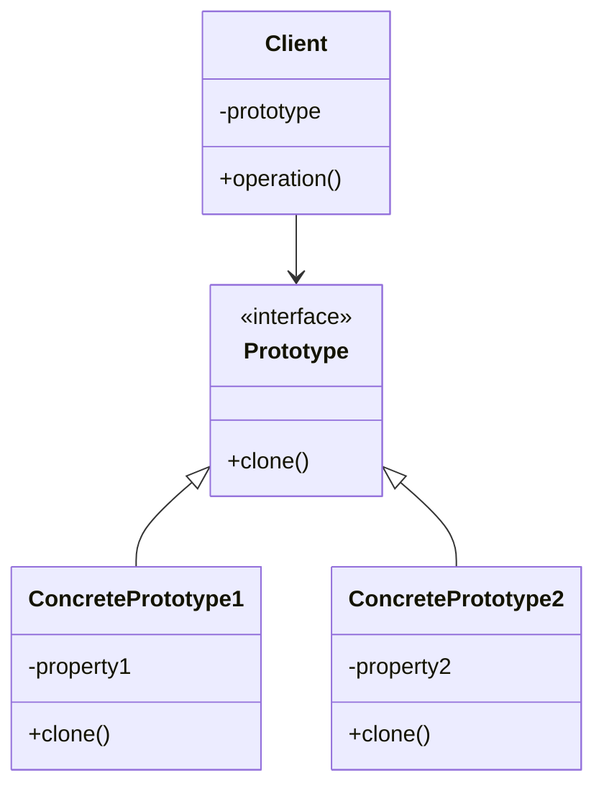

# 🧬 Prototype Pattern

## 🎯 Intent

The Prototype Pattern creates new objects by copying existing ones, providing a way to create objects without coupling to their specific classes. It allows creating new instances by cloning a prototypical instance, avoiding the complexity of creating new instances from scratch.

## ❓ Problem It Solves

When creating an object is costly (in terms of time or computational resources), or more complex than copying an existing one. For example:
- 🕒 When instantiation is expensive (e.g., loading from a database)
- 🔄 When classes are created at runtime and you can't anticipate which ones you'll need
- 🏭 When you want to avoid building a factory hierarchy that mirrors your class hierarchy
- 🧩 When instances of a class can have only a few different combinations of state

## ✅ Solution

The Prototype Pattern declares an interface for cloning itself. In PHP, this is implemented through the built-in `__clone()` magic method, which allows customizing how objects are copied.

## 📊 Structure



## 💻 Implementation in PHP

```php
<?php
// Prototype interface
interface Prototype {
    public function clone(): Prototype;
}

// Concrete prototype
class Document implements Prototype {
    private string $title;
    private string $content;
    private array $metadata = [];
    
    public function __construct(string $title, string $content) {
        $this->title = $title;
        $this->content = $content;
        $this->metadata['created_at'] = date('Y-m-d H:i:s');
    }
    
    public function addMetadata(string $key, string $value): void {
        $this->metadata[$key] = $value;
    }
    
    public function getTitle(): string {
        return $this->title;
    }
    
    public function setTitle(string $title): void {
        $this->title = $title;
    }
    
    public function getContent(): string {
        return $this->content;
    }
    
    public function setContent(string $content): void {
        $this->content = $content;
    }
    
    public function getMetadata(): array {
        return $this->metadata;
    }
    
    // Deep copy implementation
    public function clone(): Prototype {
        $copy = new Document($this->title, $this->content);
        
        // Copy metadata except created_at
        foreach ($this->metadata as $key => $value) {
            if ($key !== 'created_at') {
                $copy->addMetadata($key, $value);
            }
        }
        
        // Add a modified timestamp
        $copy->addMetadata('modified_from_original', date('Y-m-d H:i:s'));
        
        return $copy;
    }
    
    public function __toString(): string {
        return "Document: '{$this->title}' [Created: {$this->metadata['created_at']}]";
    }
}

// Client code
$original = new Document("Design Patterns in PHP", "Learn design patterns...");
$original->addMetadata("author", "John Doe");
$original->addMetadata("category", "Programming");

echo "Original: " . $original . "\n";
echo "Original metadata: " . json_encode($original->getMetadata()) . "\n\n";

// Clone and modify the document
$clone = $original->clone();
$clone->setTitle("Modified Design Patterns");
$clone->setContent("Extended content about design patterns...");
$clone->addMetadata("editor", "Jane Smith");

echo "Clone: " . $clone . "\n";
echo "Clone metadata: " . json_encode($clone->getMetadata());
```

**Example Output:**
```
Original: Document: 'Design Patterns in PHP' [Created: 2023-07-01 15:30:45]
Original metadata: {"created_at":"2023-07-01 15:30:45","author":"John Doe","category":"Programming"}

Clone: Document: 'Modified Design Patterns' [Created: 2023-07-01 15:30:45]
Clone metadata: {"created_at":"2023-07-01 15:30:45","author":"John Doe","category":"Programming","modified_from_original":"2023-07-01 15:30:45","editor":"Jane Smith"}
```

## 🔄 Using PHP's Built-in Cloning

```php
<?php
class Product {
    private string $id;
    private string $name;
    private float $price;
    
    public function __construct(string $name, float $price) {
        $this->id = uniqid('prod_');
        $this->name = $name;
        $this->price = $price;
    }
    
    // Magic method called when clone is used
    public function __clone() {
        // Generate a new ID for the clone
        $this->id = uniqid('prod_');
    }
    
    public function getId(): string { return $this->id; }
    public function getName(): string { return $this->name; }
    public function setName(string $name): void { $this->name = $name; }
    public function getPrice(): float { return $this->price; }
    public function setPrice(float $price): void { $this->price = $price; }
    
    public function __toString(): string {
        return "Product {$this->id}: {$this->name} - \${$this->price}";
    }
}

// Create original product
$original = new Product("Basic Phone", 299.99);
echo "Original: " . $original . "\n";

// Clone and modify
$clone = clone $original;
$clone->setName("Premium Phone");
$clone->setPrice(599.99);
echo "Clone: " . $clone;
```

**Output:**
```
Original: Product prod_64c4e3a18bd5f: Basic Phone - $299.99
Clone: Product prod_64c4e3a18bd60: Premium Phone - $599.99
```

## 📋 Prototype Registry

```php
<?php
// Simplified Prototype Registry
class DocumentRegistry {
    private array $prototypes = [];
    
    public function addPrototype(string $key, Document $prototype): void {
        $this->prototypes[$key] = $prototype;
    }
    
    public function getPrototype(string $key): ?Document {
        if (!isset($this->prototypes[$key])) {
            return null;
        }
        
        // Return a clone of the stored prototype
        return clone $this->prototypes[$key];
    }
}

class Document {
    private string $template;
    private string $title = "Untitled";
    
    public function __construct(string $template) {
        $this->template = $template;
    }
    
    public function setTitle(string $title): void {
        $this->title = $title;
    }
    
    public function __toString(): string {
        return "📄 {$this->title}\n{$this->template}";
    }
}

// Create registry
$registry = new DocumentRegistry();

// Register document templates
$registry->addPrototype("report", new Document(
    "## Title\n\n## Summary\n\n## Details\n\n## Conclusion"
));

$registry->addPrototype("letter", new Document(
    "Dear [Recipient],\n\nContent goes here.\n\nSincerely,\n[Sender]"
));

// Create documents from templates
$salesReport = $registry->getPrototype("report");
$salesReport->setTitle("Q2 Sales Report");

$jobApplication = $registry->getPrototype("letter");
$jobApplication->setTitle("Job Application");

echo $salesReport . "\n\n";
echo $jobApplication;
```

**Output:**
```
📄 Q2 Sales Report
## Title

## Summary

## Details

## Conclusion

📄 Job Application
Dear [Recipient],

Content goes here.

Sincerely,
[Sender]
```

## 🖥️ Real-world Example: UI Elements

```php
<?php
// UI Element prototype example
class Button {
    private string $text;
    private string $color;
    private string $size;
    
    public function __construct(string $text, string $color = 'blue', string $size = 'medium') {
        $this->text = $text;
        $this->color = $color;
        $this->size = $size;
    }
    
    public function setText(string $text): void {
        $this->text = $text;
    }
    
    public function setColor(string $color): void {
        $this->color = $color;
    }
    
    public function render(): string {
        return "<button class=\"btn btn-{$this->color} btn-{$this->size}\">{$this->text}</button>";
    }
}

// Create prototype buttons
$primaryButton = new Button("Button", "primary");
$dangerButton = new Button("Button", "danger");

// Clone and customize for specific uses
$saveButton = clone $primaryButton;
$saveButton->setText("Save");

$deleteButton = clone $dangerButton;
$deleteButton->setText("Delete");

$cancelButton = clone $primaryButton;
$cancelButton->setText("Cancel");
$cancelButton->setColor("secondary");

// Render all buttons
echo "Save button: " . $saveButton->render() . "\n";
echo "Delete button: " . $deleteButton->render() . "\n";
echo "Cancel button: " . $cancelButton->render();
```

**Output:**
```
Save button: <button class="btn btn-primary btn-medium">Save</button>
Delete button: <button class="btn btn-danger btn-medium">Delete</button>
Cancel button: <button class="btn btn-secondary btn-medium">Cancel</button>
```

## 🌟 Benefits

1. ✅ **Reduced subclassing**: You can clone existing objects instead of creating new ones
2. ✅ **Runtime configuration**: You can add and remove objects at runtime
3. ✅ **Reduced initialization code**: Cloning can be simpler than complex initialization
4. ✅ **Alternative to factory**: Can replace factory methods with a more flexible approach
5. ✅ **Complex object creation**: Simplifies the creation of complex objects

## 🕒 When to Use

- 🔍 When your code shouldn't depend on the concrete classes of objects to be copied
- 🔍 When you want to reduce the number of subclasses that only differ in initialization
- 🔍 When objects have many shared configurations with only slight differences
- 🔍 When creating an object is more expensive than copying it

## 🔄 Related Patterns

- **Factory Method**: Prototype can be used as an alternative to Factory when you want to avoid creating hierarchies of factory classes
- **Abstract Factory**: May use Prototype pattern to implement factory methods
- **Composite**: Prototypes can be used with Composite to make cloning of complex structures more convenient
- **Memento**: Can be used together with Prototype to implement undo mechanisms

---

## ⏭️ Up Next

Learn about the [Facade Pattern](../02-structural/05-facade.md), which provides a simplified interface to a complex system.

[Back to Design Patterns](../README.md) | [Previous: Singleton](./04-singleton.md) | [Next: Facade](../02-structural/05-facade.md)
