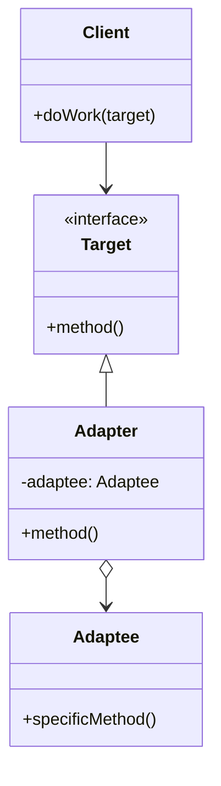

# 🔌 Adapter Pattern

## 🎯 Intent

The Adapter Pattern allows objects with incompatible interfaces to work together. It acts as a bridge between two incompatible interfaces, converting the interface of a class into another interface that clients expect.

## ❓ Problem It Solves

Sometimes, you need to use a class that doesn't have the interface your code requires. For example, you might want to use a third-party library or a legacy component, but its interface doesn't match what your existing code expects. Rewriting the client code might not be an option.

## ✅ Solution

The Adapter Pattern creates a wrapper class (the adapter) that translates the interface of one class into another interface that clients expect. The adapter implements the interface that the client expects, while internally using the incompatible service's interface.

## 🏗️ Structure



## 💻 Implementation in PHP

```php
// Target interface that the client expects
interface MediaPlayer {
    public function play(string $audioType, string $fileName): void;
}

// Adaptee (incompatible interface)
class AdvancedMediaPlayer {
    public function playVlc(string $fileName): void {
        echo "Playing vlc file: $fileName\n";
    }
    
    public function playMp4(string $fileName): void {
        echo "Playing mp4 file: $fileName\n";
    }
}

// Adapter class
class MediaAdapter implements MediaPlayer {
    private $advancedMediaPlayer;
    
    public function __construct(string $audioType) {
        $this->advancedMediaPlayer = new AdvancedMediaPlayer();
    }
    
    public function play(string $audioType, string $fileName): void {
        if ($audioType === 'vlc') {
            $this->advancedMediaPlayer->playVlc($fileName);
        } elseif ($audioType === 'mp4') {
            $this->advancedMediaPlayer->playMp4($fileName);
        }
    }
}

// Client code
$audioPlayer = new AudioPlayer();
$audioPlayer->play('mp3', 'song.mp3');
$audioPlayer->play('vlc', 'movie.vlc');
```

**Output:**
```
Playing mp3 file: song.mp3
Playing vlc file: movie.vlc
```

## 🔄 Object Adapter vs. Class Adapter

There are two ways to implement the Adapter pattern:

### 1️⃣ Object Adapter (Composition)

```php
class MediaAdapter implements MediaPlayer {
    private $advancedMediaPlayer; // Using composition
    
    public function __construct(string $audioType) {
        $this->advancedMediaPlayer = new AdvancedMediaPlayer();
    }
    // ...
}
```

### 2️⃣ Class Adapter (Multiple Inheritance)

```php
// Using traits since PHP doesn't support multiple inheritance
trait AdvancedMediaPlayerTrait {
    public function playVlc(string $fileName): void {
        echo "Playing vlc file: $fileName\n";
    }
}

class MediaClassAdapter implements MediaPlayer {
    use AdvancedMediaPlayerTrait; // Using trait as inheritance
    
    public function play(string $audioType, string $fileName): void {
        if ($audioType === 'vlc') {
            $this->playVlc($fileName);
        }
    }
}
```

## 🛒 Real-world Example: Payment Gateway Adapter

```php
// Target interface - what our application expects
interface PaymentProcessor {
    public function processPayment(float $amount, array $details): bool;
    public function refundPayment(string $transactionId, float $amount): bool;
}

// PayPal API (adaptee)
class PayPalAPI {
    public function makePayment(array $paymentData): array {
        echo "PayPal: Processing payment of {$paymentData['amount']}\n";
        return ['success' => true, 'transaction_id' => 'PP-' . uniqid()];
    }
    
    public function reverseTransaction(string $transactionId): array {
        echo "PayPal: Reversing transaction $transactionId\n";
        return ['success' => true];
    }
}

// PayPal Adapter
class PayPalAdapter implements PaymentProcessor {
    private $paypal;
    
    public function __construct() {
        $this->paypal = new PayPalAPI();
    }
    
    public function processPayment(float $amount, array $details): bool {
        $result = $this->paypal->makePayment(['amount' => $amount]);
        return $result['success'] ?? false;
    }
    
    public function refundPayment(string $transactionId, float $amount): bool {
        $result = $this->paypal->reverseTransaction($transactionId);
        return $result['success'] ?? false;
    }
}

// Usage
$paypalProcessor = new PayPalAdapter();
$orderProcessor = new OrderProcessor($paypalProcessor);
$orderProcessor->checkout(99.99, ['description' => 'Order #12345']);
```

**Output:**
```
Processing order checkout...
PayPal: Processing payment of 99.99
```

## 🌉 Two-Way Adapter

```php
interface NewSystem {
    public function newMethod(string $data): string;
}

class OldSystem {
    public function oldMethod(string $data): string {
        return "Old system processed: " . $data;
    }
}

// Two-way adapter
class TwoWayAdapter implements NewSystem, OldSystemInterface {
    private $oldSystem;
    
    public function __construct(OldSystem $oldSystem) {
        $this->oldSystem = $oldSystem;
    }
    
    public function newMethod(string $data): string {
        return $this->oldSystem->oldMethod($data);
    }
    
    public function oldMethod(string $data): string {
        return $this->oldSystem->oldMethod($data);
    }
}

// Usage
$oldSystem = new OldSystem();
$adapter = new TwoWayAdapter($oldSystem);
echo newClient($adapter); // "Old system processed: Hello World"
```

## ✅ Benefits

1. **🔄 Separation of concerns**: Client code doesn't need to change to use a new service
2. **♻️ Increased reusability**: Allows reuse of existing classes with incompatible interfaces
3. **📏 Single Responsibility**: Keeps interface translation logic separate from business logic
4. **📐 Open/Closed**: Add new types of adapters without changing client code

## 🕒 When to Use

- When you want to use an existing class with an incompatible interface
- When you need to use classes that do similar functionality without a common interface
- When interfacing with third-party libraries, legacy systems, or future components

## 🔄 Related Patterns

- **Bridge**: Separates interface from implementation up front
- **Decorator**: Enhances an object without changing its interface
- **Facade**: Simplifies a complex interface
- **Proxy**: Controls access to an object while maintaining the same interface

## ⏭️ Up Next

Learn about the [Bridge Pattern](./02-bridge.md), which allows you to separate abstraction from implementation.

[Back to Design Patterns](../README.md) | [Next: Bridge](./02-bridge.md)
