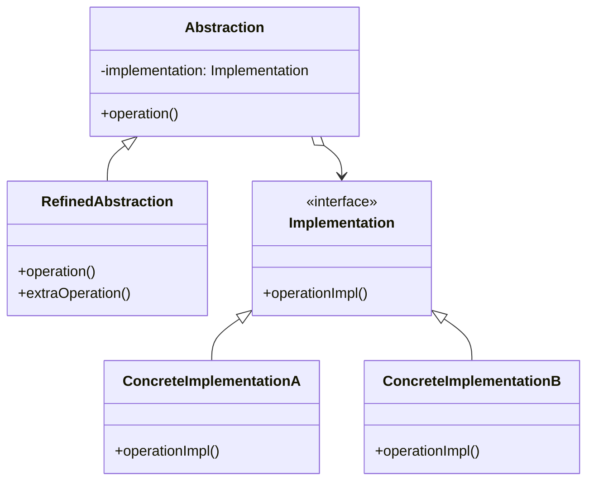

# 🌉 Bridge Pattern

## 🎯 Intent

The Bridge Pattern separates an abstraction from its implementation so that both can vary independently. It decouples an abstraction from its implementation by putting them in separate class hierarchies.

## ❓ Problem It Solves

When a class hierarchy needs to evolve in two different dimensions (e.g., shape types and rendering methods), a traditional inheritance approach leads to an exponential explosion of subclasses. The Bridge Pattern addresses this by separating these dimensions.

## ✅ Solution

The Bridge Pattern suggests splitting a large class or a set of closely related classes into two separate hierarchies:
1. **Abstraction**: Defines the interface and maintains a reference to an implementation
2. **Implementation**: Provides the underlying implementation details

## 🏗️ Structure



## 💻 Implementation in PHP

```php
// Implementation interface
interface Renderer {
    public function renderCircle(float $radius, float $x, float $y): void;
}

// Concrete Implementations
class VectorRenderer implements Renderer {
    public function renderCircle(float $radius, float $x, float $y): void {
        echo "Drawing a circle of radius $radius at position ($x, $y) as vectors\n";
    }
}

class RasterRenderer implements Renderer {
    public function renderCircle(float $radius, float $x, float $y): void {
        echo "Drawing a circle of radius $radius at position ($x, $y) as pixels\n";
    }
}

// Abstraction
abstract class Shape {
    protected $renderer;
    
    public function __construct(Renderer $renderer) {
        $this->renderer = $renderer;
    }
    
    abstract public function draw(): void;
}

// Refined Abstraction
class Circle extends Shape {
    private $radius;
    private $x;
    private $y;
    
    public function __construct(Renderer $renderer, float $radius, float $x = 0, float $y = 0) {
        parent::__construct($renderer);
        $this->radius = $radius;
        $this->x = $x;
        $this->y = $y;
    }
    
    public function draw(): void {
        $this->renderer->renderCircle($this->radius, $this->x, $this->y);
    }
}

// Client code
$vectorRenderer = new VectorRenderer();
$circle = new Circle($vectorRenderer, 5);
$circle->draw();

$rasterRenderer = new RasterRenderer();
$circle = new Circle($rasterRenderer, 5);
$circle->draw();
```

**Output:**
```
Drawing a circle of radius 5 at position (0, 0) as vectors
Drawing a circle of radius 5 at position (0, 0) as pixels
```

## 📱 Real-world Example: Device and Remote Control

```php
// Implementation interface
interface Device {
    public function isEnabled(): bool;
    public function enable(): void;
    public function disable(): void;
    public function getVolume(): int;
    public function setVolume(int $percent): void;
}

// Concrete implementations
class TV implements Device {
    private $on = false;
    private $volume = 30;
    
    public function isEnabled(): bool {
        return $this->on;
    }
    
    public function enable(): void {
        $this->on = true;
        echo "TV turned on\n";
    }
    
    public function disable(): void {
        $this->on = false;
        echo "TV turned off\n";
    }
    
    public function getVolume(): int {
        return $this->volume;
    }
    
    public function setVolume(int $percent): void {
        $this->volume = max(0, min(100, $percent));
        echo "TV volume set to {$this->volume}%\n";
    }
}

// Abstraction
abstract class RemoteControl {
    protected $device;
    
    public function __construct(Device $device) {
        $this->device = $device;
    }
    
    public function togglePower(): void {
        if ($this->device->isEnabled()) {
            $this->device->disable();
        } else {
            $this->device->enable();
        }
    }
    
    public function volumeUp(): void {
        $this->device->setVolume($this->device->getVolume() + 10);
    }
}

// Usage
$tv = new TV();
$remote = new BasicRemoteControl($tv);
$remote->togglePower();
$remote->volumeUp();
```

**Output:**
```
TV turned on
TV volume set to 40%
```

## ✅ Benefits

1. **🔢 Decoupling**: Changes to the implementation don't affect the abstraction and vice versa
2. **🔄 Improved extensibility**: You can extend abstraction and implementation classes independently
3. **🔒 Hiding implementation details**: Clients only work with high-level abstractions
4. **🎯 Single responsibility**: Abstraction and implementation focus on their specific concerns

## 🕒 When to Use

- When you want to avoid a permanent binding between an abstraction and its implementation
- When both abstractions and implementations should be extensible through subclasses
- When changes in implementation shouldn't impact client code
- When you want to share an implementation among multiple objects and hide this fact

## 📊 Bridge vs. Adapter Pattern

| Bridge | Adapter |
|--------|---------|
| Designed up-front | Makes incompatible classes work together after design |
| Preventive design | Reactive design (fixing incompatibilities) |
| Part of initial design | Often used with existing code |

## ⏭️ Up Next

Learn about the [Composite Pattern](./03-composite.md), which allows you to compose objects into tree structures.

[Back to Design Patterns](../README.md) | [Previous: Adapter](./01-adapter.md) | [Next: Composite](./03-composite.md)
