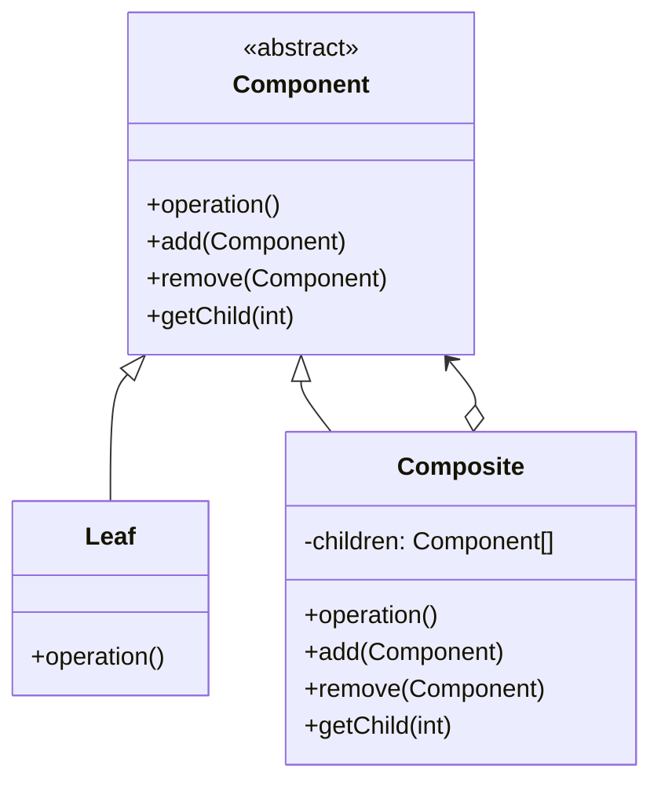

# 🌳 Composite Pattern

## 🎯 Intent

The Composite Pattern allows you to compose objects into tree structures to represent part-whole hierarchies. It lets clients treat individual objects and compositions of objects uniformly.

## ❓ Problem It Solves

When you need to represent hierarchical structures where both individual objects and groups of objects must be treated the same way. For example, in a file system, both files (leaf objects) and directories (composite objects) share common operations but implement them differently.

## ✅ Solution

The Composite Pattern suggests that you:
1. Create a common interface/abstract class for all objects
2. Implement "leaf" objects that don't have children
3. Implement "composite" objects that can contain children
4. Let composite objects forward operations to their children

## 🏗️ Structure



## 💻 Implementation in PHP

```php
// Component Interface
interface Component {
    public function operation(): string;
}

// Leaf Class
class Leaf implements Component {
    private $name;
    
    public function __construct(string $name) {
        $this->name = $name;
    }
    
    public function operation(): string {
        return "Leaf " . $this->name;
    }
}

// Composite Class
class Composite implements Component {
    private $name;
    private $children = [];
    
    public function __construct(string $name) {
        $this->name = $name;
    }
    
    public function operation(): string {
        $results = ["Branch: " . $this->name];
        foreach ($this->children as $child) {
            $results[] = $child->operation();
        }
        return implode(PHP_EOL, $results);
    }
    
    public function add(Component $component): void {
        $this->children[] = $component;
    }
    
    public function remove(Component $component): void {
        $position = array_search($component, $this->children, true);
        if ($position !== false) {
            unset($this->children[$position]);
            $this->children = array_values($this->children);
        }
    }
}

// Usage
$leaf1 = new Leaf("A");
$leaf2 = new Leaf("B");
$composite = new Composite("C");
$composite->add($leaf1);
$composite->add($leaf2);
echo $composite->operation();
```

**Output:**
```
Branch: C
Leaf A
Leaf B
```

## 📂 Real-world Example: File System

```php
// Component Interface
interface FileSystemComponent {
    public function getName(): string;
    public function getSize(): int;
    public function printStructure(int $depth = 0): string;
}

// Leaf: File class
class File implements FileSystemComponent {
    private $name;
    private $size;
    
    public function __construct(string $name, int $size) {
        $this->name = $name;
        $this->size = $size;
    }
    
    public function getName(): string {
        return $this->name;
    }
    
    public function getSize(): int {
        return $this->size;
    }
    
    public function printStructure(int $depth = 0): string {
        return str_repeat('  ', $depth) . "- {$this->name} ({$this->size} bytes)\n";
    }
}

// Composite: Directory class
class Directory implements FileSystemComponent {
    private $name;
    private $components = [];
    
    public function __construct(string $name) {
        $this->name = $name;
    }
    
    public function getName(): string {
        return $this->name;
    }
    
    public function getSize(): int {
        $totalSize = 0;
        foreach ($this->components as $component) {
            $totalSize += $component->getSize();
        }
        return $totalSize;
    }
    
    public function add(FileSystemComponent $component): void {
        $this->components[] = $component;
    }
    
    public function printStructure(int $depth = 0): string {
        $result = str_repeat('  ', $depth) . "+ {$this->name}/\n";
        foreach ($this->components as $component) {
            $result .= $component->printStructure($depth + 1);
        }
        return $result;
    }
}

// Usage
$file1 = new File("doc.txt", 200);
$file2 = new File("image.jpg", 500);
$docs = new Directory("Documents");
$docs->add($file1);
$root = new Directory("Root");
$root->add($docs);
$root->add($file2);

echo $root->printStructure();
echo "Total size: " . $root->getSize() . " bytes\n";
```

**Output:**
```
+ Root/
  + Documents/
    - doc.txt (200 bytes)
  - image.jpg (500 bytes)
Total size: 700 bytes
```

## 📋 Menu Example

```php
// Component Interface
interface MenuComponent {
    public function render(): string;
}

// Leaf: MenuItem class
class MenuItem implements MenuComponent {
    private $name;
    private $url;
    private $isActive;
    
    public function __construct(string $name, string $url, bool $isActive = false) {
        $this->name = $name;
        $this->url = $url;
        $this->isActive = $isActive;
    }
    
    public function render(): string {
        $activeClass = $this->isActive ? ' class="active"' : '';
        return "<li$activeClass><a href=\"{$this->url}\">{$this->name}</a></li>\n";
    }
}

// Composite: Menu class
class Menu implements MenuComponent {
    private $name;
    private $components = [];
    private $isActive;
    
    public function __construct(string $name, bool $isActive = false) {
        $this->name = $name;
        $this->isActive = $isActive;
    }
    
    public function add(MenuComponent $component): void {
        $this->components[] = $component;
    }
    
    public function render(): string {
        $activeClass = $this->isActive ? ' class="active"' : '';
        $output = "<li$activeClass>\n  <span>{$this->name}</span>\n";
        
        if (count($this->components) > 0) {
            $output .= "  <ul>\n";
            foreach ($this->components as $component) {
                $output .= "    " . $component->render();
            }
            $output .= "  </ul>\n";
        }
        
        $output .= "</li>\n";
        return $output;
    }
}

// Usage
$home = new MenuItem("Home", "/", true);
$services = new Menu("Services");
$services->add(new MenuItem("Web Dev", "/services/web"));
$services->add(new MenuItem("App Dev", "/services/app"));

$mainNav = new Menu("Main Nav");
$mainNav->add($home);
$mainNav->add($services);

echo "<ul id=\"main-nav\">\n" . $mainNav->render() . "</ul>";
```

**Output:**
```html
<ul id="main-nav">
<li>
  <span>Main Nav</span>
  <ul>
    <li class="active"><a href="/">Home</a></li>
    <li>
  <span>Services</span>
  <ul>
    <li><a href="/services/web">Web Dev</a></li>
    <li><a href="/services/app">App Dev</a></li>
  </ul>
</li>
  </ul>
</li>
</ul>
```

## ✅ Benefits

1. **🔄 Unified interface**: Individual objects and compositions treated the same way
2. **📝 Simplified client code**: Clients work with complex structures through simple interface
3. **➕ Easy to add new types**: Both leaf and composite classes fit into the existing structure
4. **🌳 Tree representation**: Natural representation of hierarchies
5. **📐 Open/Closed**: Add new elements without breaking existing code

## 🕒 When to Use

- When you need to represent part-whole hierarchies
- When clients should ignore differences between compositions and individual objects
- When the structure can have any level of complexity and nesting
- When you want client code to work with all objects in the hierarchy uniformly

## ⚠️ Common Pitfalls

1. **🔄 Reference cycles**: Be careful of creating circular references
2. **⚡ Performance concerns**: Operations might be inefficient for deep hierarchies
3. **🔀 Responsibilities**: Challenging to define common operations for both leaf and composite

## 🔄 Related Patterns

- **Decorator**: Adds responsibilities without changing interface
- **Chain of Responsibility**: Often combined with Composite for request handling
- **Iterator**: Used to traverse complex Composite structures
- **Visitor**: Used to add operations to Composite structures

## ⏭️ Up Next

Learn about the [Decorator Pattern](./04-decorator.md), which allows behavior to be added to individual objects dynamically.

[Back to Design Patterns](../README.md) | [Previous: Bridge](./02-bridge.md) | [Next: Decorator](./04-decorator.md)
