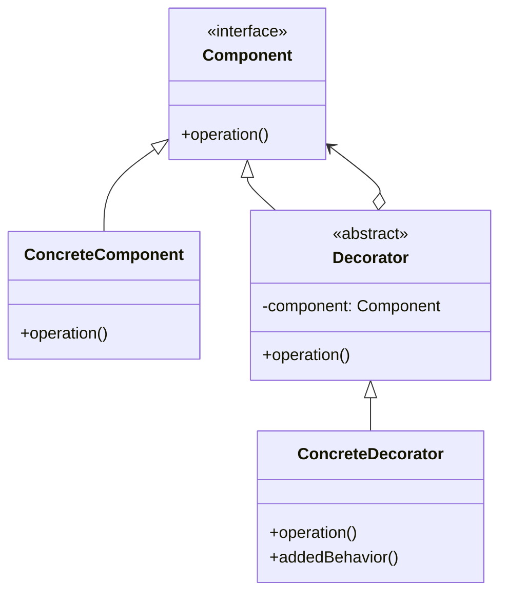

# 🎨 Decorator Pattern

## 🎯 Intent

The Decorator Pattern attaches additional responsibilities to an object dynamically. Decorators provide a flexible alternative to subclassing for extending functionality.

## ❓ Problem It Solves

Sometimes we want to add behaviors to individual objects, not to an entire class. Using inheritance to add responsibilities can lead to many subclasses and a rigid class hierarchy. The Decorator Pattern offers a more flexible solution.

## ✅ Solution

The Decorator Pattern suggests creating a set of decorator classes that are used to wrap concrete components. Decorators mirror the type of the components they decorate but add or override behavior. Multiple decorators can be stacked to combine behaviors.

## 🏗️ Structure



## 💻 Implementation in PHP

```php
// Component interface
interface Coffee {
    public function getCost(): float;
    public function getDescription(): string;
}

// Concrete component
class SimpleCoffee implements Coffee {
    public function getCost(): float {
        return 10.00;
    }
    
    public function getDescription(): string {
        return "Simple coffee";
    }
}

// Base decorator
abstract class CoffeeDecorator implements Coffee {
    protected $decoratedCoffee;
    
    public function __construct(Coffee $coffee) {
        $this->decoratedCoffee = $coffee;
    }
}

// Concrete decorator
class MilkDecorator extends CoffeeDecorator {
    public function getCost(): float {
        return $this->decoratedCoffee->getCost() + 2.00;
    }
    
    public function getDescription(): string {
        return $this->decoratedCoffee->getDescription() . ", with milk";
    }
}

// Usage
$simpleCoffee = new SimpleCoffee();
echo $simpleCoffee->getDescription() . ": $" . $simpleCoffee->getCost() . "\n";

$milkCoffee = new MilkDecorator($simpleCoffee);
echo $milkCoffee->getDescription() . ": $" . $milkCoffee->getCost() . "\n";
```

**Output:**
```
Simple coffee: $10
Simple coffee, with milk: $12
```

## 📝 Real-world Example: Text Formatting

```php
// Component Interface
interface Text {
    public function render(): string;
}

// Concrete Component
class PlainText implements Text {
    private $content;
    
    public function __construct(string $content) {
        $this->content = $content;
    }
    
    public function render(): string {
        return $this->content;
    }
}

// Base Decorator
abstract class TextDecorator implements Text {
    protected $text;
    
    public function __construct(Text $text) {
        $this->text = $text;
    }
}

// Concrete Decorators
class BoldText extends TextDecorator {
    public function render(): string {
        return "<b>" . $this->text->render() . "</b>";
    }
}

class ItalicText extends TextDecorator {
    public function render(): string {
        return "<i>" . $this->text->render() . "</i>";
    }
}

// Usage
$text = new PlainText("Hello, world!");
$boldText = new BoldText($text);
$italicBoldText = new ItalicText($boldText);

echo $text->render() . "\n";
echo $boldText->render() . "\n";
echo $italicBoldText->render() . "\n";
```

**Output:**
```
Hello, world!
<b>Hello, world!</b>
<i><b>Hello, world!</b></i>
```

## 🌐 Web Service Logging Decorator

```php
// Component interface
interface WebService {
    public function request(string $endpoint, array $data = []): array;
}

// Concrete component
class RESTApiService implements WebService {
    private $baseUrl;
    
    public function __construct(string $baseUrl) {
        $this->baseUrl = $baseUrl;
    }
    
    public function request(string $endpoint, array $data = []): array {
        echo "Making request to {$this->baseUrl}/{$endpoint}\n";
        return ['status' => 'success', 'data' => ['id' => 123]];
    }
}

// Logging decorator
class LoggingWebService implements WebService {
    private $service;
    
    public function __construct(WebService $service) {
        $this->service = $service;
    }
    
    public function request(string $endpoint, array $data = []): array {
        // Log before request
        $this->log("Request to $endpoint with data: " . json_encode($data));
        
        // Make the request
        $result = $this->service->request($endpoint, $data);
        
        // Log after request
        $this->log("Response from $endpoint - Status: {$result['status']}");
        
        return $result;
    }
    
    private function log(string $message): void {
        $timestamp = date('Y-m-d H:i:s');
        echo "[$timestamp] $message\n";
    }
}

// Usage
$api = new RESTApiService('https://api.example.com');
$loggingApi = new LoggingWebService($api);
$loggingApi->request('users', ['id' => 1]);
```

**Output:**
```
[2023-11-08 14:30:45] Request to users with data: {"id":1}
Making request to https://api.example.com/users
[2023-11-08 14:30:45] Response from users - Status: success
```

## ✅ Benefits

1. **🔄 Flexibility**: More flexible than inheritance for adding responsibilities
2. **🏗️ Composition over inheritance**: Favors object composition over class inheritance
3. **⚡ Runtime behavior extension**: Add or remove responsibilities at runtime
4. **📏 Single Responsibility**: Each decorator focuses on one aspect
5. **📐 Open/Closed**: Add new decorators without changing existing code
6. **🔀 Sequential wrapping**: Apply decorators in a specific order

## 🕒 When to Use

- When you need to add responsibilities to objects dynamically and transparently
- When extension by subclassing is impractical
- When you want to add responsibilities that can be withdrawn
- When you need to combine multiple behaviors in flexible ways

## ⚠️ Common Pitfalls

1. **🔀 Complexity**: Too many decorators can lead to complex code
2. **🔢 Order dependency**: The order of decorators can matter
3. **🔄 Interface conformance**: All decorators must maintain the component interface
4. **🆔 Identity issues**: Multiple decorators can make identity comparisons challenging

## 🔄 Related Patterns

- **Composite**: Often used with Composite to add behaviors to component hierarchies
- **Strategy**: Both change behavior, but Strategy uses delegation while Decorator uses composition
- **Adapter**: Both wrap objects, but Adapter changes interface, Decorator enhances it
- **Proxy**: Both wrap objects, but Proxy controls access, Decorator adds responsibilities

## ⏭️ Up Next

Learn about the [Facade Pattern](./05-facade.md), which provides a simplified interface to a complex subsystem.

[Back to Design Patterns](../README.md) | [Previous: Composite](./03-composite.md) | [Next: Facade](./05-facade.md)
