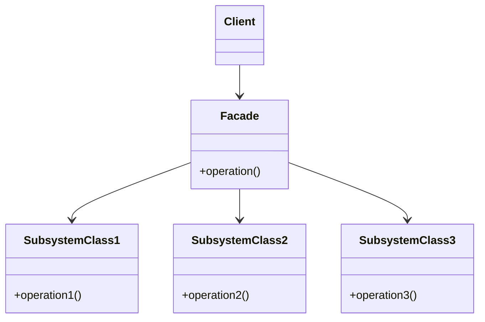

# 🏢 Facade Pattern

## 🎯 Intent

The Facade Pattern provides a simplified interface to a complex subsystem of classes, library, or framework. It defines a higher-level interface that makes the subsystem easier to use by reducing complexity and hiding implementation details.

## ❓ Problem It Solves

When working with a complex system with many components:
- Client code becomes tightly coupled to the subsystem classes
- Understanding how to use the subsystem requires deep knowledge of its implementation
- Code that uses the subsystem becomes complex and hard to maintain
- Changes in the subsystem may affect client code directly

## ✅ Solution

The Facade Pattern suggests creating a new class that provides a simplified interface to the complex functionality of the subsystem. The facade doesn't completely hide the subsystem; it just provides a more convenient way to use it.

## 🏗️ Structure



## 💻 Implementation in PHP

```php
// Subsystem classes
class VideoConverter {
    public function convertFile(string $filename, string $format): void {
        echo "Converting video file {$filename} to {$format}...\n";
    }
}

class AudioExtractor {
    public function extractAudio(string $videoFile, string $audioFormat): string {
        echo "Extracting audio from {$videoFile} to {$audioFormat}...\n";
        return "audio_" . pathinfo($videoFile, PATHINFO_FILENAME) . "." . $audioFormat;
    }
}

class CompressionCodec {
    public function compress(string $filename): void {
        echo "Compressing file {$filename}...\n";
    }
}

// Facade class
class VideoConversionFacade {
    public function convertVideo(string $filename, string $format): string {
        echo "VideoConversionFacade: Starting video conversion...\n";
        
        $codecFactory = new CompressionCodec();
        $videoConverter = new VideoConverter();
        $videoConverter->convertFile($filename, $format);
        
        $audioExtractor = new AudioExtractor();
        $result = $audioExtractor->extractAudio($filename, "mp3");
        
        $codecFactory->compress($result);
        
        echo "VideoConversionFacade: Conversion completed.\n";
        
        return $result;
    }
}

// Client code
$converter = new VideoConversionFacade();
$convertedFile = $converter->convertVideo("video.mp4", "avi");
echo "Client: Conversion done. File: {$convertedFile}\n";
```

**Output:**
```
VideoConversionFacade: Starting video conversion...
Converting video file video.mp4 to avi...
Extracting audio from video.mp4 to mp3...
Compressing file audio_video.mp3...
VideoConversionFacade: Conversion completed.
Client: Conversion done. File: audio_video.mp3
```

## 🛒 Real-world Example: Order Processing

```php
// Subsystem components
class PaymentProcessor {
    public function processPayment(string $method, float $amount): bool {
        echo "Processing payment of \${$amount} via {$method}...\n";
        return true;
    }
}

class InventoryManager {
    public function checkStock(array $items): bool {
        echo "Checking stock for " . count($items) . " items...\n";
        return true;
    }
    
    public function updateInventory(array $items): void {
        echo "Updating inventory for " . count($items) . " items...\n";
    }
}

class EmailService {
    public function sendOrderConfirmation(string $orderId, string $email): void {
        echo "Sending order confirmation email for order {$orderId} to {$email}...\n";
    }
}

// Facade
class OrderProcessingFacade {
    private $paymentProcessor;
    private $inventoryManager;
    private $emailService;
    
    public function __construct() {
        $this->paymentProcessor = new PaymentProcessor();
        $this->inventoryManager = new InventoryManager();
        $this->emailService = new EmailService();
    }
    
    public function processOrder(
        string $customerId,
        array $items,
        array $paymentDetails,
        string $email
    ): string {
        // Check if items are in stock
        if (!$this->inventoryManager->checkStock($items)) {
            throw new \Exception("Some items are out of stock");
        }
        
        // Process payment
        $total = $this->calculateTotal($items);
        $paymentSuccess = $this->paymentProcessor->processPayment(
            $paymentDetails['method'],
            $total
        );
        
        if (!$paymentSuccess) {
            throw new \Exception("Payment processing failed");
        }
        
        // Create order ID
        $orderId = 'ORD-' . uniqid();
        
        // Update inventory
        $this->inventoryManager->updateInventory($items);
        
        // Send confirmation email
        $this->emailService->sendOrderConfirmation($orderId, $email);
        
        echo "Order processed successfully!\n";
        
        return $orderId;
    }
    
    private function calculateTotal(array $items): float {
        $total = 0;
        foreach ($items as $item) {
            $total += $item['price'] * $item['quantity'];
        }
        return $total;
    }
}

// Client code
$orderFacade = new OrderProcessingFacade();

$items = [
    ['id' => 101, 'name' => 'Product A', 'price' => 29.99, 'quantity' => 2],
    ['id' => 102, 'name' => 'Product B', 'price' => 49.99, 'quantity' => 1]
];

try {
    $orderId = $orderFacade->processOrder(
        'CUST-123',
        $items,
        ['method' => 'credit_card'],
        'customer@example.com'
    );
    echo "Order ID: {$orderId}\n";
} catch (\Exception $e) {
    echo "Error: " . $e->getMessage() . "\n";
}
```

**Output:**
```
Checking stock for 2 items...
Processing payment of $109.97 via credit_card...
Updating inventory for 2 items...
Sending order confirmation email for order ORD-5fb8c123a4e7b to customer@example.com...
Order processed successfully!
Order ID: ORD-5fb8c123a4e7b
```

## ✅ Benefits

1. **🔄 Simplifies interface**: Provides a simple interface to a complex subsystem
2. **🔀 Reduces coupling**: Clients are decoupled from subsystem components
3. **🏗️ Promotes layering**: Helps organize code into layers with the facade as an entry point
4. **🚪 Hides complexity**: Encapsulates complex interactions between components
5. **📚 Improves readability**: Makes client code more readable and focused on business logic

## 🕒 When to Use

- When you want to provide a simple interface to a complex subsystem
- When you want to layer your system and provide entry points to each layer
- When there are many dependencies between clients and implementation classes
- When you're building a library or framework that needs a simple entry point

## 🔄 Related Patterns

- **Adapter**: Makes incompatible interfaces work together, while Facade simplifies an existing interface
- **Mediator**: Similar to Facade but with two-way communication between components
- **Abstract Factory**: Can be used with Facade to provide a simple interface for object creation
- **Singleton**: Facades are often implemented as singletons

## ⏭️ Up Next

Learn about the [Flyweight Pattern](./06-flyweight.md), which allows you to fit more objects into the available memory by sharing common parts of state.

[Back to Design Patterns](../README.md) | [Previous: Decorator](./04-decorator.md) | [Next: Flyweight](./06-flyweight.md)
