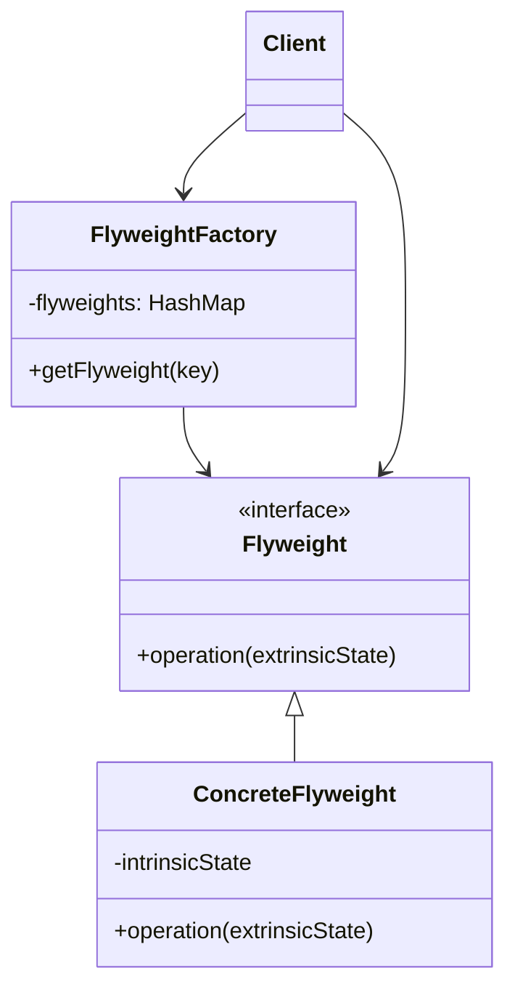

# 🪶 Flyweight Pattern

## 🎯 Intent

The Flyweight Pattern minimizes memory usage by sharing as much data as possible with related objects. It's particularly useful when you need to create a large number of similar objects that would otherwise consume significant memory.

## ❓ Problem It Solves

When working with a large number of objects that contain overlapping state, you face:
- Excessive memory usage
- Reduced performance due to garbage collection
- Long loading times
- High CPU utilization

## ✅ Solution

The Flyweight Pattern suggests separating an object's state into:
- **Intrinsic State**: The shared, immutable part stored in a flyweight object
- **Extrinsic State**: The variable, context-specific part passed to flyweight methods when needed

## 🏗️ Structure



## 💻 Implementation in PHP

```php
// Flyweight interface
interface CharacterFlyweight {
    public function render(string $font, int $size, string $color): void;
}

// Concrete Flyweight
class ConcreteCharacter implements CharacterFlyweight {
    // Intrinsic state - shared and immutable
    private $symbol;
    
    public function __construct(string $symbol) {
        $this->symbol = $symbol;
        echo "Creating flyweight for character '$symbol'\n";
    }
    
    // Operates on extrinsic state passed by the client
    public function render(string $font, int $size, string $color): void {
        echo "Rendering '$this->symbol' in $font, size $size, color $color\n";
    }
}

// Flyweight Factory
class CharacterFactory {
    private $characters = [];
    
    public function getCharacter(string $symbol): CharacterFlyweight {
        if (!isset($this->characters[$symbol])) {
            $this->characters[$symbol] = new ConcreteCharacter($symbol);
        }
        return $this->characters[$symbol];
    }
    
    public function countCharacters(): int {
        return count($this->characters);
    }
}

// Client code
$factory = new CharacterFactory();
$text = "Hello";

echo "Rendering text: \"$text\"\n";

// Loop through each character in the text
foreach (str_split($text) as $i => $char) {
    $character = $factory->getCharacter($char);
    $font = "Arial";
    $size = 12;
    $color = "black";
    $character->render($font, $size, $color);
}

echo "Total unique character flyweights: " . $factory->countCharacters() . "\n";
```

**Output:**
```
Rendering text: "Hello"
Creating flyweight for character 'H'
Rendering 'H' in Arial, size 12, color black
Creating flyweight for character 'e'
Rendering 'e' in Arial, size 12, color black
Creating flyweight for character 'l'
Rendering 'l' in Arial, size 12, color black
Rendering 'l' in Arial, size 12, color black
Creating flyweight for character 'o'
Rendering 'o' in Arial, size 12, color black
Total unique character flyweights: 4
```

## 🎮 Game Particle System Example

```php
// Flyweight interface
interface ParticleType {
    public function render(float $x, float $y, float $scale, string $tint): void;
}

// Concrete Flyweight
class ConcreteParticleType implements ParticleType {
    // Intrinsic state
    private $texture;
    private $shape;
    
    public function __construct(string $texture, string $shape) {
        $this->texture = $texture;
        $this->shape = $shape;
        echo "Loading particle: $texture, $shape\n";
    }
    
    // Operates on extrinsic state
    public function render(float $x, float $y, float $scale, string $tint): void {
        echo "Rendering {$this->shape} at ($x, $y), scale: $scale, tint: $tint\n";
    }
}

// Context class that uses the flyweight
class Particle {
    // Extrinsic state - different for each particle
    private $x;
    private $y;
    private $scale;
    private $tint;
    
    // Reference to the flyweight
    private $particleType;
    
    public function __construct(ParticleType $particleType, 
                               float $x, float $y, 
                               float $scale = 1.0,
                               string $tint = 'white') {
        $this->particleType = $particleType;
        $this->x = $x;
        $this->y = $y;
        $this->scale = $scale;
        $this->tint = $tint;
    }
    
    public function render(): void {
        $this->particleType->render($this->x, $this->y, $this->scale, $this->tint);
    }
}

// Flyweight factory
class ParticleFactory {
    private $particleTypes = [];
    
    public function getParticleType(string $texture, string $shape): ParticleType {
        $key = "$texture-$shape";
        
        if (!isset($this->particleTypes[$key])) {
            $this->particleTypes[$key] = new ConcreteParticleType($texture, $shape);
        }
        
        return $this->particleTypes[$key];
    }
    
    public function getCount(): int {
        return count($this->particleTypes);
    }
}

// Usage
$factory = new ParticleFactory();

// Create 1000 particles but with only 2 flyweight types
$particles = [];
for ($i = 0; $i < 50; $i++) {
    $type = $i % 2 === 0 ? 
        $factory->getParticleType("explosion.png", "circle") : 
        $factory->getParticleType("smoke.png", "cloud");
        
    $particles[] = new Particle(
        $type,
        rand(0, 100), // x
        rand(0, 100), // y
        rand(50, 150) / 100, // scale
        ["red", "orange", "yellow", "white"][rand(0, 3)] // tint
    );
}

echo "Created " . count($particles) . " particles using " . 
     $factory->getCount() . " flyweight types\n";

// Render first 3 particles
for ($i = 0; $i < 3; $i++) {
    $particles[$i]->render();
}
```

**Output:**
```
Loading particle: explosion.png, circle
Loading particle: smoke.png, cloud
Created 50 particles using 2 flyweight types
Rendering circle at (42, 73), scale: 1.32, tint: yellow
Rendering cloud at (18, 95), scale: 0.78, tint: red
Rendering circle at (67, 11), scale: 1.45, tint: orange
```

## 🗃️ Database Connection Pool Example

```php
// Flyweight interface
interface DatabaseConnection {
    public function query(string $sql): void;
}

// Concrete Flyweight
class MySQLConnection implements DatabaseConnection {
    // Intrinsic state
    private $host;
    private $database;
    
    public function __construct(string $host, string $database) {
        $this->host = $host;
        $this->database = $database;
        echo "Creating new connection to {$this->host}/{$this->database}\n";
    }
    
    public function query(string $sql): void {
        echo "Executing on {$this->host}/{$this->database}: $sql\n";
    }
}

// Connection Pool (Flyweight Factory)
class ConnectionPool {
    private $connections = [];
    private $inUse = [];
    private $maxConnections;
    
    public function __construct(int $maxConnections = 3) {
        $this->maxConnections = $maxConnections;
    }
    
    public function getConnection(string $host, string $database): ?DatabaseConnection {
        $key = "$host/$database";
        
        // Check if we have an available connection
        if (isset($this->connections[$key]) && !empty($this->connections[$key])) {
            $connection = array_pop($this->connections[$key]);
            $this->inUse[$key][] = $connection;
            echo "Reusing existing connection to $key\n";
            return $connection;
        }
        
        // Check if we can create a new connection
        $totalConnections = 
            (isset($this->connections[$key]) ? count($this->connections[$key]) : 0) +
            (isset($this->inUse[$key]) ? count($this->inUse[$key]) : 0);
        
        if ($totalConnections < $this->maxConnections) {
            $connection = new MySQLConnection($host, $database);
            if (!isset($this->inUse[$key])) {
                $this->inUse[$key] = [];
            }
            $this->inUse[$key][] = $connection;
            return $connection;
        }
        
        echo "Cannot create more connections - maximum reached\n";
        return null;
    }
    
    public function releaseConnection(DatabaseConnection $connection): void {
        // Implementation simplified for brevity
        echo "Connection released back to pool\n";
    }
}

// Usage
$pool = new ConnectionPool(3);

echo "First user request:\n";
$conn1 = $pool->getConnection('db.example.com', 'customers');
$conn1->query("SELECT * FROM users");

echo "\nSecond user request:\n";
$conn2 = $pool->getConnection('db.example.com', 'customers');
$conn2->query("SELECT * FROM orders");

echo "\nThird user request:\n";
$conn3 = $pool->getConnection('db.example.com', 'customers');
$conn3->query("SELECT * FROM products");

echo "\nFourth user request (should fail):\n";
$conn4 = $pool->getConnection('db.example.com', 'customers');

// Release and reuse
$pool->releaseConnection($conn1);
echo "\nFifth user request (after release):\n";
$conn5 = $pool->getConnection('db.example.com', 'customers');
$conn5->query("SELECT * FROM inventory");
```

**Output:**
```
First user request:
Creating new connection to db.example.com/customers
Executing on db.example.com/customers: SELECT * FROM users

Second user request:
Creating new connection to db.example.com/customers
Executing on db.example.com/customers: SELECT * FROM orders

Third user request:
Creating new connection to db.example.com/customers
Executing on db.example.com/customers: SELECT * FROM products

Fourth user request (should fail):
Cannot create more connections - maximum reached

Connection released back to pool

Fifth user request (after release):
Reusing existing connection to db.example.com/customers
Executing on db.example.com/customers: SELECT * FROM inventory
```

## ✅ Benefits

1. **📊 Reduced memory**: Shared data means fewer duplicate objects
2. **⚡ Improved performance**: Less memory allocation and garbage collection
3. **🚀 Better cache utilization**: Shared objects stay in CPU cache
4. **📈 Scalability**: Can work with vastly more objects than otherwise practical

## 🕒 When to Use

- When an application needs a large number of objects
- When object storage costs are high (memory-intensive objects)
- When most object state can be made extrinsic
- When objects contain significant duplicate state
- When object identity is not important to the application

## ⚠️ Drawbacks

1. **🔀 Complexity**: Separating intrinsic and extrinsic state adds complexity
2. **💬 Context overhead**: Passing extrinsic state can be cumbersome
3. **🔒 Concurrency issues**: Shared flyweights must be thread-safe
4. **⚖️ Performance trade-offs**: Calculating extrinsic state might offset memory savings

## 🔄 Related Patterns

- **Factory Method**: Often used to create flyweights
- **Singleton**: Flyweight factories are often implemented as singletons
- **Composite**: Can use Flyweight to share component states
- **State**: Flyweight objects may act as states

## ⏭️ Up Next

Learn about the [Proxy Pattern](./07-proxy.md), which provides a surrogate or placeholder for another object to control access to it.

[Back to Design Patterns](../README.md) | [Previous: Facade](./05-facade.md) | [Next: Proxy](./07-proxy.md)
