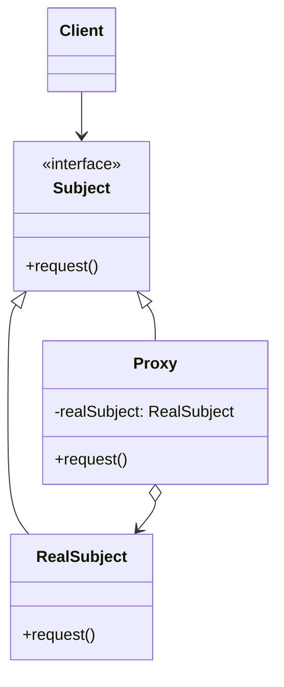

# 🔐 Proxy Pattern

## 🎯 Intent

The Proxy Pattern provides a surrogate or placeholder for another object to control access to it. It creates a representative object that controls access to another object, which may be remote, expensive to create, or in need of access control.

## ❓ Problem It Solves

There are several situations where controlling direct access to objects is necessary:
- When an object is resource-intensive to instantiate (Lazy Loading)
- When access control to the original object is needed (Protection)
- When additional functionality is needed before or after operations (Smart Reference)
- When the real object resides remotely (Remote Proxy)
- When you need to cache results of expensive operations (Caching Proxy)

## ✅ Solution

The Proxy Pattern suggests creating a new proxy class with the same interface as an original service object. Upon receiving a request from a client, the proxy creates a real service object and delegates all the work to it.

## 🏗️ Structure



## 💻 Implementation in PHP

```php
// Subject interface
interface Image {
    public function display(): void;
}

// Real Subject
class RealImage implements Image {
    private $filename;
    
    public function __construct(string $filename) {
        $this->filename = $filename;
        $this->loadFromDisk();
    }
    
    private function loadFromDisk(): void {
        echo "Loading image: {$this->filename}\n";
        usleep(500000); // Simulate delay
    }
    
    public function display(): void {
        echo "Displaying image: {$this->filename}\n";
    }
}

// Proxy
class ImageProxy implements Image {
    private $realImage;
    private $filename;
    
    public function __construct(string $filename) {
        $this->filename = $filename;
    }
    
    public function display(): void {
        if ($this->realImage === null) {
            $this->realImage = new RealImage($this->filename);
        }
        $this->realImage->display();
    }
}

// Usage
$image = new RealImage("photo.jpg");  // Loads immediately
$image->display();

echo "\nUsing a proxy:\n";
$imageProxy = new ImageProxy("photo.jpg");
echo "Image proxy created but image not loaded yet.\n";
$imageProxy->display();  // Loads only when needed
```

**Output:**
```
Loading image: photo.jpg
Displaying image: photo.jpg

Using a proxy:
Image proxy created but image not loaded yet.
Loading image: photo.jpg
Displaying image: photo.jpg
```

## 🔒 Types of Proxies

### 1️⃣ Virtual Proxy (Lazy Loading)

```php
// The ImageProxy above is a Virtual Proxy example
```

### 2️⃣ Protection Proxy

```php
interface FileSystem {
    public function readFile(string $path): string;
    public function writeFile(string $path, string $content): void;
}

class RealFileSystem implements FileSystem {
    public function readFile(string $path): string {
        echo "Reading file: $path\n";
        return "File content";
    }
    
    public function writeFile(string $path, string $content): void {
        echo "Writing to file: $path\n";
    }
}

class ProtectionProxy implements FileSystem {
    private $fileSystem;
    private $user;
    private $permissions;
    
    public function __construct(FileSystem $fileSystem, string $user, array $permissions) {
        $this->fileSystem = $fileSystem;
        $this->user = $user;
        $this->permissions = $permissions;
    }
    
    public function readFile(string $path): string {
        if ($this->canRead($path)) {
            return $this->fileSystem->readFile($path);
        }
        throw new Exception("Access denied: $this->user cannot read $path");
    }
    
    public function writeFile(string $path, string $content): void {
        if ($this->canWrite($path)) {
            $this->fileSystem->writeFile($path, $content);
            return;
        }
        throw new Exception("Access denied: $this->user cannot write to $path");
    }
    
    private function canRead(string $path): bool {
        return in_array("read", $this->permissions) || 
               in_array("read:$path", $this->permissions);
    }
    
    private function canWrite(string $path): bool {
        return in_array("write", $this->permissions) || 
               in_array("write:$path", $this->permissions);
    }
}

// Usage
$fs = new RealFileSystem();
$adminProxy = new ProtectionProxy($fs, "admin", ["read", "write"]);
$userProxy = new ProtectionProxy($fs, "user", ["read", "write:user_data.txt"]);

// Admin can read and write any file
$adminProxy->readFile("config.txt");
$adminProxy->writeFile("system.log", "Log entry");

// User has limited access
$userProxy->readFile("config.txt"); // OK - general read permission
$userProxy->writeFile("user_data.txt", "User data"); // OK - specific write permission

try {
    $userProxy->writeFile("system.log", "Unauthorized"); // Should fail
} catch (Exception $e) {
    echo "Error: " . $e->getMessage() . "\n";
}
```

**Output:**
```
Reading file: config.txt
Writing to file: system.log
Reading file: config.txt
Writing to file: user_data.txt
Error: Access denied: user cannot write to system.log
```

### 3️⃣ Remote Proxy

```php
interface WeatherService {
    public function getTemperature(string $city): float;
}

// Real implementation would connect to an actual remote server
class RemoteWeatherService implements WeatherService {
    public function getTemperature(string $city): float {
        echo "Making API call to get temperature for $city\n";
        return 25.5; // Simulated response
    }
}

// Remote proxy with caching
class WeatherServiceProxy implements WeatherService {
    private $service;
    private $temperatureCache = [];
    private $cacheExpiry = 3600; // 1 hour in seconds
    
    private function getService(): WeatherService {
        if ($this->service === null) {
            $this->service = new RemoteWeatherService();
        }
        return $this->service;
    }
    
    public function getTemperature(string $city): float {
        $currentTime = time();
        
        // Check cache first
        if (isset($this->temperatureCache[$city]) && 
            $currentTime - $this->temperatureCache[$city]['time'] < $this->cacheExpiry) {
            echo "Retrieved temperature for $city from cache\n";
            return $this->temperatureCache[$city]['value'];
        }
        
        // Cache miss, get from service
        $temperature = $this->getService()->getTemperature($city);
        
        // Update cache
        $this->temperatureCache[$city] = [
            'value' => $temperature,
            'time' => $currentTime
        ];
        
        return $temperature;
    }
}

// Usage
$weatherService = new WeatherServiceProxy();

echo "First request:\n";
$temp = $weatherService->getTemperature("New York");
echo "Temperature in New York: $temp°C\n\n";

echo "Second request (should use cache):\n";
$temp = $weatherService->getTemperature("New York");
echo "Temperature in New York: $temp°C\n";
```

**Output:**
```
First request:
Making API call to get temperature for New York
Temperature in New York: 25.5°C

Second request (should use cache):
Retrieved temperature for New York from cache
Temperature in New York: 25.5°C
```

### 4️⃣ Smart Proxy

```php
interface Database {
    public function query(string $sql): array;
}

class RealDatabase implements Database {
    public function __construct(string $dsn) {
        echo "Connecting to database with DSN: $dsn\n";
    }
    
    public function query(string $sql): array {
        echo "Executing SQL: $sql\n";
        return ["result1", "result2"]; // Simulated results
    }
}

class LoggingDatabaseProxy implements Database {
    private $realDatabase;
    
    public function __construct(Database $realDatabase) {
        $this->realDatabase = $realDatabase;
    }
    
    public function query(string $sql): array {
        $this->log("Query: $sql");
        $startTime = microtime(true);
        
        $result = $this->realDatabase->query($sql);
        
        $endTime = microtime(true);
        $executionTime = ($endTime - $startTime) * 1000;
        $this->log("Execution time: " . number_format($executionTime, 2) . " ms");
        
        return $result;
    }
    
    private function log(string $message): void {
        $timestamp = date('Y-m-d H:i:s');
        echo "[$timestamp] $message\n";
    }
}

// Usage
$db = new RealDatabase("mysql:host=localhost;dbname=test");
$loggingDb = new LoggingDatabaseProxy($db);
$loggingDb->query("SELECT * FROM users WHERE active = 1");
```

**Output:**
```
Connecting to database with DSN: mysql:host=localhost;dbname=test
[2023-11-08 15:30:45] Query: SELECT * FROM users WHERE active = 1
Executing SQL: SELECT * FROM users WHERE active = 1
[2023-11-08 15:30:45] Execution time: 0.52 ms
```

## ✅ Benefits

1. **⏳ Lazy initialization**: Create expensive objects only when needed
2. **🔒 Access control**: Control when and how a client accesses the real object
3. **📉 Reduced complexity**: Simplify the client's interaction with complex systems
4. **🔄 Reduced coupling**: Client works with the proxy, not the real subject
5. **📐 Open/Closed**: Add new proxies without changing existing code
6. **🔐 Security**: Implement access controls to protect sensitive operations

## 🕒 When to Use

- When you need lazy loading of resource-intensive objects
- When you need access control for security reasons
- When you need to add logging, caching, or other functionality transparently
- When you need to interact with remote resources
- When you need to manage lifecycle of expensive resources

## 🔄 Related Patterns

- **Adapter**: Changes the interface of an object, while Proxy maintains the same interface
- **Decorator**: Adds responsibilities to objects without subclassing, while Proxy controls access
- **Facade**: Simplifies an interface to a subsystem, while Proxy controls access to an object

## 🧰 PHP Specific Examples

1. **Laravel's Facade**: Provides static interface to access services in the container
2. **PHP's PDO**: Acts as a proxy to different database systems
3. **SplFileObject**: Provides an object-oriented interface to a file
4. **Laravel's Eloquent**: Uses proxies for lazy loading relationships
5. **Doctrine's Proxy**: Uses proxy objects for lazy loading entities

## ⏭️ Up Next

Congratulations! You've completed learning about all the Structural Design Patterns. Continue to the [Behavioral Design Patterns](../03-behavioral/README.md) section to learn about patterns that focus on communication between objects.

[Back to Design Patterns](../README.md) | [Previous: Flyweight](./06-flyweight.md) | [Next: Behavioral Patterns](../03-behavioral/README.md)
