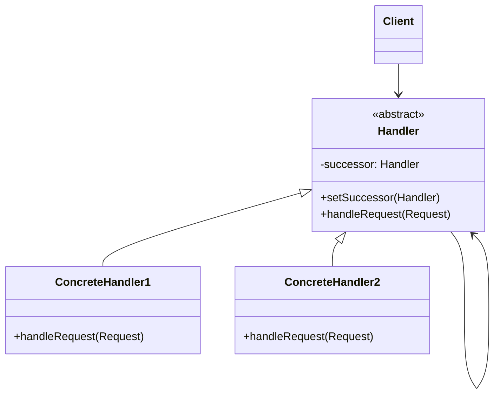

# 🔗 Chain of Responsibility Pattern

## 🎯 Intent

The Chain of Responsibility Pattern creates a chain of receiver objects for a request. This pattern decouples sender and receivers by giving multiple objects a chance to handle the request. The request is passed along the chain until an object handles it or it reaches the end of the chain.

## ❓ Problem It Solves

When you want to:
- Give more than one object a chance to handle a request
- Pass a request along a chain of potential handlers until one processes it
- Issue a request without specifying the handler explicitly
- Avoid coupling the sender of a request to its receiver

## 💡 Solution

The Chain of Responsibility Pattern suggests organizing handlers into a chain where each handler contains a reference to the next handler in the chain. Upon receiving a request:

1. Each handler decides whether to process the request or pass it to the next handler
2. The request travels along the chain until it's handled or reaches the end without being processed

## 🏗️ Structure



## ⚙️ Implementation in PHP

```php
<?php
// Request class
class Request {
    private $type;
    private $amount;
    
    public function __construct(string $type, float $amount) {
        $this->type = $type;
        $this->amount = $amount;
    }
    
    public function getType(): string { return $this->type; }
    public function getAmount(): float { return $this->amount; }
}

// Abstract handler
abstract class Handler {
    protected $successor = null;
    
    public function setSuccessor(Handler $successor): void {
        $this->successor = $successor;
    }
    
    public function handleRequest(Request $request): void {
        if (!$this->processRequest($request) && $this->successor !== null) {
            $this->successor->handleRequest($request);
        }
    }
    
    abstract protected function processRequest(Request $request): bool;
}

// Concrete handlers
class PurchaseHandler extends Handler {
    private $limit;
    
    public function __construct(float $limit) {
        $this->limit = $limit;
    }
    
    protected function processRequest(Request $request): bool {
        if ($request->getType() === "PURCHASE" && $request->getAmount() <= $this->limit) {
            echo "PurchaseHandler: Approved purchase request for $" . $request->getAmount() . "\n";
            return true;
        }
        
        echo "PurchaseHandler: Cannot handle this request.\n";
        return false;
    }
}

class DirectorHandler extends Handler {
    protected function processRequest(Request $request): bool {
        echo "DirectorHandler: Approved request for $" . $request->getAmount() . "\n";
        return true;
    }
}
```

**Output:**
```
PurchaseHandler: Approved purchase request for $800
PurchaseHandler: Cannot handle this request.
DirectorHandler: Approved request for $2500
```

## 🌐 Example: HTTP Request Middleware

A common real-world implementation is middleware in web frameworks:

```php
<?php
// Abstract middleware
abstract class Middleware {
    protected $next;
    
    public function setNext(Middleware $next): Middleware {
        $this->next = $next;
        return $next;
    }
    
    public function handle(HttpRequest $request, HttpResponse $response): void {
        if ($this->process($request, $response) && $this->next !== null) {
            $this->next->handle($request, $response);
        }
    }
    
    abstract protected function process(HttpRequest $request, HttpResponse $response): bool;
}

// Authentication middleware
class AuthenticationMiddleware extends Middleware {
    protected function process(HttpRequest $request, HttpResponse $response): bool {
        $authToken = $request->getHeader('Authorization');
        
        if (!$authToken) {
            echo "Authentication Middleware: No auth token provided\n";
            $response->setStatusCode(401);
            return false;
        }
        
        echo "Authentication Middleware: Valid token, proceeding\n";
        return true;
    }
}

// Usage - create middleware chain
$logging = new LoggingMiddleware();
$auth = new AuthenticationMiddleware();
$router = new RouterMiddleware();

$logging->setNext($auth)->setNext($router);
```

**Output:**
```
Logging Middleware: Request received for GET /api/users
Authentication Middleware: Valid token, proceeding
Router Middleware: Route found for GET /api/users
```

## ✨ Benefits

1. **🔄 Reduced coupling**: The sender only needs to know about the first handler
2. **🎯 Single Responsibility**: Each handler focuses on its specific task
3. **🛠️ Flexibility**: You can add, remove, or reorder handlers dynamically
4. **📝 Open/Closed**: New handlers can be added without changing existing code
5. **🧩 Separation of concerns**: Each handler can focus on its specific processing logic

## 🕒 When to Use

- When more than one object may handle a request, but the handler isn't known in advance
- When you want to issue a request to one of several objects without specifying the recipient
- When the set of objects that can handle a request should be specified dynamically
- When you want to avoid hard-wiring the request sender to its receiver

## 🔄 Related Patterns

| Pattern | Relationship |
|---------|-------------|
| **Composite** | Chain of Responsibility often uses Composite for tree structures |
| **Command** | Commands can be processed by handlers in a chain |
| **Decorator** | Chain of Responsibility is a dynamic form of Decorator |
| **Observer** | Can be combined with Observer to notify multiple handlers |

---

## 🔜 Up Next

Learn about the [Command Pattern](./02-command.md), which encapsulates a request as an object, allowing for parameterized clients, queuing, and logging of requests.

[Back to Design Patterns](../README.md) | [Next: Command](./02-command.md)
