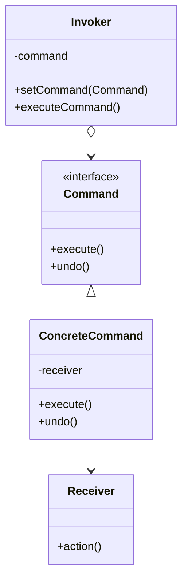

# 📝 Command Pattern

## 🎯 Intent

The Command Pattern encapsulates a request as an object, thereby allowing for parameterization of clients with different requests, queuing of requests, and logging of the operations. It also supports undoable operations.

## ❓ Problem It Solves

- How to decouple the object that invokes an operation from the object that performs it?
- How to implement undo/redo functionality?
- How to queue operations, schedule their execution, or execute them remotely?
- How to support logging and auditing of operations?

## 💡 Solution

The Command Pattern suggests creating a separate object (command) that encapsulates all information needed to perform an action:

1. The object that's the actual target of the command
2. Method names to be called on the target
3. Arguments for those methods

## 🏗️ Structure



## ⚙️ Implementation in PHP

```php
<?php
// Command interface
interface Command {
    public function execute(): void;
    public function undo(): void;
}

// Receiver class
class Light {
    private $isOn = false;
    private $name;
    
    public function __construct(string $name = 'Light') {
        $this->name = $name;
    }
    
    public function turnOn(): void {
        $this->isOn = true;
        echo "{$this->name} is now ON.\n";
    }
    
    public function turnOff(): void {
        $this->isOn = false;
        echo "{$this->name} is now OFF.\n";
    }
}

// Concrete Commands
class LightOnCommand implements Command {
    private $light;
    
    public function __construct(Light $light) {
        $this->light = $light;
    }
    
    public function execute(): void {
        $this->light->turnOn();
    }
    
    public function undo(): void {
        $this->light->turnOff();
    }
}

// Invoker
class RemoteControl {
    private $command;
    
    public function setCommand(Command $command): void {
        $this->command = $command;
    }
    
    public function pressButton(): void {
        $this->command->execute();
    }
    
    public function pressUndo(): void {
        $this->command->undo();
    }
}
```

**Output:**
```
Living Room Light is now ON.
Living Room Light is now OFF.
Living Room Light is now ON.
```

## 🔄 Macro Commands

Combining multiple commands into a single command:

```php
class MacroCommand implements Command {
    private $commands = [];
    
    public function __construct(array $commands) {
        $this->commands = $commands;
    }
    
    public function execute(): void {
        foreach ($this->commands as $command) {
            $command->execute();
        }
    }
    
    public function undo(): void {
        // Execute undo in reverse order
        for ($i = count($this->commands) - 1; $i >= 0; $i--) {
            $this->commands[$i]->undo();
        }
    }
}

// Usage
$homeTheaterOn = new MacroCommand([
    new LightOnCommand($light),
    new TVOnCommand($tv),
    new StereoOnCommand($stereo)
]);

$remote->setCommand($homeTheaterOn);
$remote->pressButton(); // Turns on all devices
```

**Output:**
```
Living Room Light is now ON.
TV is now ON.
Stereo is now ON.
```

## 📋 Command History for Undo/Redo

```php
class CommandHistory {
    private $history = [];
    private $undoneCommands = [];
    
    public function executeCommand(Command $command): void {
        $command->execute();
        $this->history[] = $command;
        $this->undoneCommands = []; // Clear redoable commands
    }
    
    public function undo(): void {
        if (empty($this->history)) return;
        
        $command = array_pop($this->history);
        $command->undo();
        $this->undoneCommands[] = $command;
    }
    
    public function redo(): void {
        if (empty($this->undoneCommands)) return;
        
        $command = array_pop($this->undoneCommands);
        $command->execute();
        $this->history[] = $command;
    }
}
```

## 📝 Real-world Example: Text Editor Commands

```php
class TextDocument {
    private $text = '';
    
    public function getText(): string {
        return $this->text;
    }
    
    public function insertText(string $text, int $position): void {
        $this->text = substr($this->text, 0, $position) . 
                     $text . 
                     substr($this->text, $position);
        echo "Inserted: '{$text}' at position {$position}\n";
    }
    
    public function deleteText(int $position, int $length): string {
        $deletedText = substr($this->text, $position, $length);
        $this->text = substr($this->text, 0, $position) . 
                     substr($this->text, $position + $length);
        echo "Deleted: '{$deletedText}' from position {$position}\n";
        return $deletedText;
    }
}

// Client code
$editor = new TextEditor();
$editor->insertText("Hello", 0);           
$editor->insertText(" World!", 5);         
$editor->deleteText(5, 7);                 
echo "Current content: " . $editor->getContent() . "\n";
$editor->undo();                           
```

**Output:**
```
Inserted: 'Hello' at position 0
Inserted: ' World!' at position 5
Deleted: ' World!' from position 5
Current content: Hello
Deleted text restored: ' World!' at position 5
Current content: Hello World!
```

## ✨ Benefits

1. **🔄 Decoupling**: Separates objects that issue commands from objects that perform operations
2. **🔌 Extensibility**: You can introduce new commands without changing existing code
3. **↩️ Undo/redo**: Provides a straightforward way to implement undo/redo functionality
4. **📋 Command queues**: Makes it possible to queue commands or schedule their execution
5. **🧩 Composable**: Allows creating composite commands (macros) from simple ones
6. **📊 Logging**: Enables persisting commands for logging and auditing purposes

## 🕒 When to Use

- When you need to parameterize objects with operations
- When you need to queue operations, schedule their execution, or execute them remotely
- When you need to implement undo/redo functionality
- When you need to support logging changes for possible recovery
- When you want to structure a system around high-level operations

## 🔄 Related Patterns

| Pattern | Relationship |
|---------|-------------|
| **Composite** | Often used to implement macro commands |
| **Memento** | Can be used with Command for the undo operation |
| **Prototype** | Commands can use prototype for cloning pre-configured commands |
| **Strategy** | Both encapsulate behaviors, but Command also encapsulates the request |
| **Observer** | When a command notifies other objects of changes |

---

## 🔜 Up Next

Learn about the [Iterator Pattern](./03-iterator.md), which provides a way to access elements of an aggregate object sequentially without exposing its underlying representation.

[Back to Design Patterns](../README.md) | [Previous: Chain of Responsibility](./01-chain-of-responsibility.md) | [Next: Iterator](./03-iterator.md)
