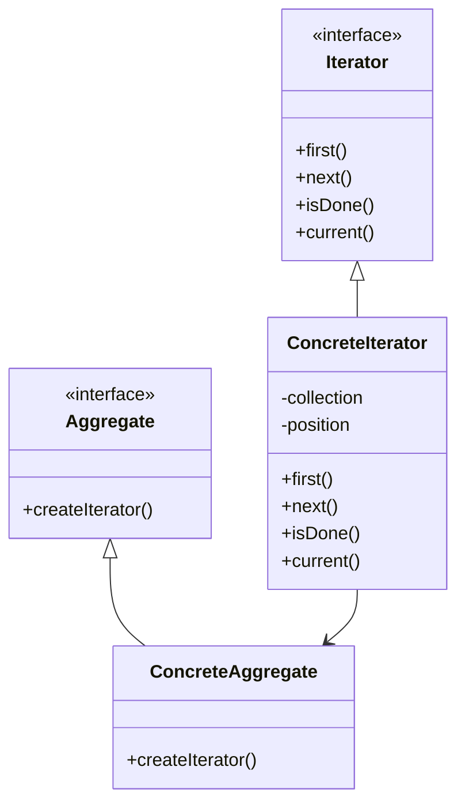

# 🔄 Iterator Pattern

## 🎯 Intent

The Iterator Pattern provides a way to access elements of an aggregate object sequentially without exposing its underlying representation. It separates the traversal behavior from the aggregate object, allowing different traversals to be implemented.

## ❓ Problem It Solves

When working with complex collections of objects, we often need to:
- Traverse the elements without exposing the collection's internal structure
- Provide multiple traversal methods for the same collection
- Use a uniform interface for traversing different types of collections
- Access elements without worrying about the collection's implementation

## 💡 Solution

The Iterator Pattern suggests extracting the traversal behavior of a collection into a separate object called an iterator. This iterator provides a standard interface for traversing the collection, regardless of its internal structure.

## 🏗️ Structure



## ⚙️ Implementation in PHP

### Basic Example

```php
<?php
// Iterator Interface
interface MyIterator {
    public function first(): void;
    public function next(): void;
    public function isDone(): bool;
    public function current();
}

// Aggregate Interface
interface Aggregate {
    public function createIterator(): MyIterator;
}

// Concrete Iterator
class ArrayIterator implements MyIterator {
    private $collection;
    private $position = 0;
    
    public function __construct(array $collection) {
        $this->collection = $collection;
    }
    
    public function first(): void { $this->position = 0; }
    public function next(): void { $this->position++; }
    public function isDone(): bool { return $this->position >= count($this->collection); }
    public function current() { return $this->collection[$this->position]; }
}

// Concrete Aggregate
class WordCollection implements Aggregate {
    private $words = [];
    
    public function addWord(string $word): void {
        $this->words[] = $word;
    }
    
    public function createIterator(): MyIterator {
        return new ArrayIterator($this->words);
    }
}

// Client code
$collection = new WordCollection();
$collection->addWord("First");
$collection->addWord("Second");
$collection->addWord("Third");

$iterator = $collection->createIterator();
for ($iterator->first(); !$iterator->isDone(); $iterator->next()) {
    echo $iterator->current() . "\n";
}
```

**Output:**
```
First
Second
Third
```

## 🔄 Using PHP's Built-in Iterator Interface

```php
<?php
class Book {
    private $title;
    private $author;
    
    public function __construct(string $title, string $author) {
        $this->title = $title;
        $this->author = $author;
    }
    
    public function getTitle(): string { return $this->title; }
    public function getAuthor(): string { return $this->author; }
}

// Using built-in interfaces
class BookCollection implements \IteratorAggregate {
    private $books = [];
    
    public function addBook(Book $book): void {
        $this->books[] = $book;
    }
    
    public function getIterator(): \Iterator {
        return new \ArrayIterator($this->books);
    }
    
    // Custom iterator that filters by author
    public function getAuthorIterator(string $author): \Iterator {
        return new AuthorIterator($this->books, $author);
    }
}

// Client code
$bookCollection = new BookCollection();
$bookCollection->addBook(new Book("Design Patterns", "Erich Gamma"));
$bookCollection->addBook(new Book("Clean Code", "Robert C. Martin"));
$bookCollection->addBook(new Book("The Clean Coder", "Robert C. Martin"));

// Using foreach with built-in iterator
echo "All books:\n";
foreach ($bookCollection as $book) {
    echo "- {$book->getTitle()} by {$book->getAuthor()}\n";
}
```

**Output:**
```
All books:
- Design Patterns by Erich Gamma
- Clean Code by Robert C. Martin
- The Clean Coder by Robert C. Martin
```

## 🌲 Example: Tree Iterator

```php
<?php
// Tree Node
class TreeNode {
    private $value;
    private $children = [];
    
    public function __construct($value) {
        $this->value = $value;
    }
    
    public function addChild(TreeNode $child): void {
        $this->children[] = $child;
    }
    
    public function getValue() { return $this->value; }
    public function getChildren(): array { return $this->children; }
}

// Interface for tree traversal strategies
interface TreeIterator extends \Iterator {
    public function setTree(TreeNode $root): void;
}

// Depth-First Iterator implementation
class DepthFirstIterator implements TreeIterator {
    private $stack = [];
    private $current;
    
    public function setTree(TreeNode $root): void {
        $this->stack = [$root];
        $this->current = null;
    }
    
    public function current() { return $this->current ? $this->current->getValue() : null; }
    public function key() { return count($this->stack); }
    public function next(): void { /* Navigate to next node */ }
    public function rewind(): void { $this->next(); }
    public function valid(): bool { return $this->current !== null; }
}
```

## 📑 External vs Internal Iterators

### External Iterator (client controls iteration)
```php
// External iterator - client controls iteration
$iterator = $collection->getIterator();
while ($iterator->valid()) {
    $item = $iterator->current();
    echo $item . "\n";
    $iterator->next();
}
```

### Internal Iterator (iterator controls iteration)
```php
// Internal iterator
class InternalIterator {
    private $collection;
    
    public function __construct(array $collection) {
        $this->collection = $collection;
    }
    
    public function forEach(callable $callback): void {
        foreach ($this->collection as $item) {
            $callback($item);
        }
    }
}

// Usage
$iterator = new InternalIterator(["Apple", "Banana", "Cherry"]);
$iterator->forEach(function($item) {
    echo "Processing: $item\n";
});
```

**Output:**
```
Processing: Apple
Processing: Banana
Processing: Cherry
```

## 📋 Real-world Example: Paginated Data Iterator

```php
class PaginatedIterator implements \Iterator {
    private $dataProvider;
    private $pageSize;
    private $currentPosition = 0;
    private $currentPage = 1;
    private $currentPageData = null;
    
    public function __construct(callable $dataProvider, int $pageSize = 10) {
        $this->dataProvider = $dataProvider;
        $this->pageSize = $pageSize;
    }
    
    // Implementation methods...
    public function current() { /* Return current item */ }
    public function key() { return $this->currentPosition; }
    public function next(): void { /* Move to next item, load new page if needed */ }
    public function rewind(): void { /* Reset to beginning */ }
    public function valid(): bool { /* Check if current position is valid */ }
}

// Usage example
$userIterator = new PaginatedIterator('fetchUsersFromDatabase', 3);
foreach ($userIterator as $index => $user) {
    echo "{$index}: {$user['name']}\n";
}
```

**Output:**
```
0: Alice
1: Bob
2: Charlie
3: David
4: Eve
5: Frank
6: Grace
```

## ✨ Benefits

1. **🔄 Single Responsibility**: Separates traversal algorithm from collection implementation
2. **📝 Open/Closed**: Add new traversal methods without changing collection classes
3. **🧩 Interface simplification**: Collections don't need to expose multiple traversal methods
4. **⏩ Parallel iteration**: Multiple iterations over the same collection can proceed simultaneously 
5. **🔄 Different traversal strategies**: Collections can support various traversal algorithms
6. **⏱️ Lazy evaluation**: Iterators can calculate the next item on demand

## 🕒 When to Use

- When you need to access collection elements without exposing the internal structure
- When you need multiple ways to traverse a collection
- When you want a uniform interface for traversing different collections
- When you need to provide multiple concurrent iterations over the same collection

## 🔄 Related Patterns

| Pattern | Relationship |
|---------|-------------|
| **Composite** | Iterators are often applied to traverse composite tree structures |
| **Factory Method** | Can be used to create appropriate iterators for different collections |
| **Memento** | Can be used with Iterator to capture and restore iteration state |
| **Visitor** | Often uses iterators to traverse object structures |

---

## 🔜 Up Next

Learn about the [Mediator Pattern](./04-mediator.md), which defines an object that encapsulates how a set of objects interact.

[Back to Design Patterns](../README.md) | [Previous: Command](./02-command.md) | [Next: Mediator](./04-mediator.md)
