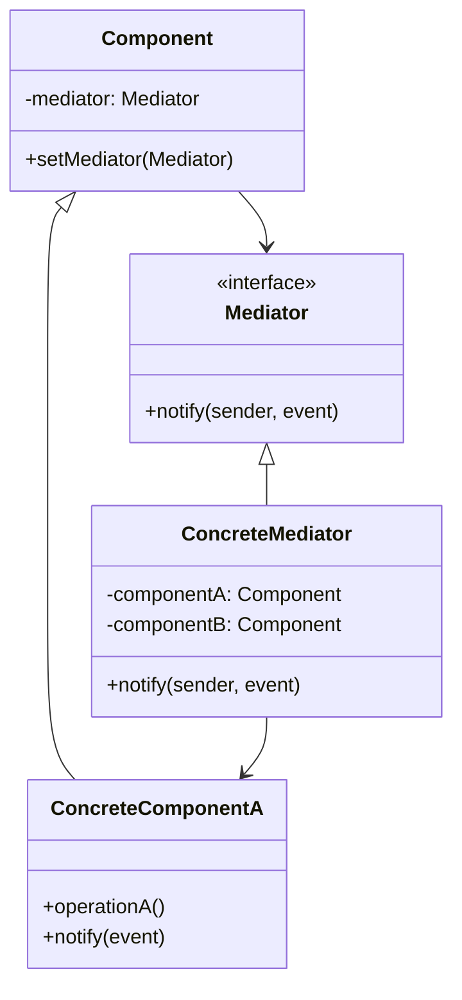

# 🔄 Mediator Pattern

## 🎯 Intent

The Mediator Pattern defines an object that encapsulates how a set of objects interact. It promotes loose coupling by keeping objects from referring to each other explicitly, letting you vary their interaction independently.

## ❓ Problem It Solves

When you have a set of objects that communicate with each other, their relationships can become complex and difficult to maintain. Direct connections between objects can lead to:
- Tight coupling between components
- Difficult-to-reuse components
- Hard-to-modify system behavior
- Complex interaction logic spread across multiple objects

## 💡 Solution

The Mediator Pattern suggests:
1. Define a separate object (mediator) that encapsulates the interaction between a set of objects
2. Objects communicate with each other through the mediator, rather than directly
3. This reduces the dependencies between communicating objects, thereby reducing coupling

## 🏗️ Structure



## ⚙️ Implementation in PHP

```php
<?php
// Mediator interface
interface Mediator {
    public function notify(object $sender, string $event): void;
}

// Base Component
abstract class Component {
    protected $mediator;
    
    public function setMediator(Mediator $mediator): void {
        $this->mediator = $mediator;
    }
}

// Concrete Components
class Button extends Component {
    public function click(): void {
        echo "Button: Click!\n";
        $this->mediator->notify($this, "click");
    }
}

class Textbox extends Component {
    private $text = "";
    
    public function setText(string $text): void {
        $this->text = $text;
        echo "Textbox: Text changed to '$text'\n";
        $this->mediator->notify($this, "textChanged");
    }
    
    public function getText(): string { return $this->text; }
    public function clear(): void {
        $this->text = "";
        echo "Textbox: Cleared\n";
    }
}

// Concrete Mediator
class DialogMediator implements Mediator {
    private $loginButton;
    private $usernameTextbox;
    private $passwordTextbox;
    
    public function __construct(Button $loginButton, Textbox $usernameTextbox, Textbox $passwordTextbox) {
        $this->loginButton = $loginButton;
        $this->loginButton->setMediator($this);
        
        $this->usernameTextbox = $usernameTextbox;
        $this->usernameTextbox->setMediator($this);
        
        $this->passwordTextbox = $passwordTextbox;
        $this->passwordTextbox->setMediator($this);
    }
    
    public function notify(object $sender, string $event): void {
        // Handle login button click
        if ($sender === $this->loginButton && $event === "click") {
            $username = $this->usernameTextbox->getText();
            $password = $this->passwordTextbox->getText();
            
            $this->handleLogin($username, $password);
        }
        
        // Enable login button only when both fields have text
        if (($sender === $this->usernameTextbox || $sender === $this->passwordTextbox) && $event === "textChanged") {
            $this->validateForm();
        }
    }
    
    private function handleLogin(string $username, string $password): void {
        if (empty($username) || empty($password)) {
            echo "Dialog: Login failed. Username and password required.\n";
            return;
        }
        
        echo "Dialog: Attempting login for user '$username'\n";
        echo "Dialog: Login successful!\n";
    }
    
    private function validateForm(): void {
        $username = $this->usernameTextbox->getText();
        $password = $this->passwordTextbox->getText();
        
        $formValid = !empty($username) && !empty($password);
        
        if ($formValid) {
            echo "Dialog: Form is valid, enabling login button\n";
        } else {
            echo "Dialog: Form is incomplete, login button disabled\n";
        }
    }
}

// Client code
$loginButton = new Button();
$usernameTextbox = new Textbox();
$passwordTextbox = new Textbox();

// Create mediator and connect all components
$dialog = new DialogMediator($loginButton, $usernameTextbox, $passwordTextbox);

// Simulate user actions
$usernameTextbox->setText("john_doe");
$passwordTextbox->setText("secret123");
$loginButton->click();
```

**Output:**
```
Textbox: Text changed to 'john_doe'
Dialog: Form is incomplete, login button disabled
Textbox: Text changed to 'secret123'
Dialog: Form is valid, enabling login button
Button: Click!
Dialog: Attempting login for user 'john_doe'
Dialog: Login successful!
```

## 💬 Example: Chat Room

A classic example of the Mediator pattern is a chat room where multiple users can communicate:

```php
<?php
// Mediator interface
interface ChatRoomMediator {
    public function showMessage(User $user, string $message): void;
    public function addUser(User $user): void;
}

// Concrete Mediator
class ChatRoom implements ChatRoomMediator {
    private $users = [];
    
    public function showMessage(User $user, string $message): void {
        $time = date('H:i');
        $sender = $user->getName();
        echo "$time [$sender]: $message\n";
    }
    
    public function addUser(User $user): void {
        $this->users[$user->getName()] = $user;
        echo "{$user->getName()} has joined the chat.\n";
    }
}

// Colleague class
class User {
    private $name;
    private $mediator;
    
    public function __construct(string $name, ChatRoomMediator $mediator) {
        $this->name = $name;
        $this->mediator = $mediator;
        $this->mediator->addUser($this);
    }
    
    public function getName(): string { return $this->name; }
    
    public function send(string $message): void {
        $this->mediator->showMessage($this, $message);
    }
}

// Client code
$chatroom = new ChatRoom();

$john = new User('John', $chatroom);
$jane = new User('Jane', $chatroom);
$bob = new User('Bob', $chatroom);

$john->send("Hey everyone!");
$jane->send("Hi John, how are you?");
$bob->send("Hello everyone!");
```

**Output:**
```
John has joined the chat.
Jane has joined the chat.
Bob has joined the chat.
14:25 [John]: Hey everyone!
14:25 [Jane]: Hi John, how are you?
14:25 [Bob]: Hello everyone!
```

## ✈️ Air Traffic Control Example

Another excellent example of the Mediator pattern is an air traffic control system:

```php
<?php
// Mediator Interface
interface AirTrafficControl {
    public function registerAircraft(Aircraft $aircraft): void;
    public function requestLanding(Aircraft $aircraft): void;
    public function requestTakeoff(Aircraft $aircraft): void;
}

// Colleague Base Class
abstract class Aircraft {
    protected $id;
    protected $mediator;
    
    public function __construct(string $id) {
        $this->id = $id;
    }
    
    public function setMediator(AirTrafficControl $mediator): void {
        $this->mediator = $mediator;
        $this->mediator->registerAircraft($this);
    }
    
    public function getId(): string { return $this->id; }
    
    abstract public function requestLanding(): void;
    abstract public function land(): void;
}

// Concrete Colleague Classes
class Airplane extends Aircraft {
    public function requestLanding(): void {
        echo "Airplane {$this->id} requests permission to land.\n";
        $this->mediator->requestLanding($this);
    }
    
    public function land(): void {
        echo "Airplane {$this->id} is landing.\n";
    }
}

// Concrete Mediator
class ControlTower implements AirTrafficControl {
    private $aircraft = [];
    private $runway = true; // true means runway is available
    
    public function registerAircraft(Aircraft $aircraft): void {
        $this->aircraft[$aircraft->getId()] = $aircraft;
        echo "Control Tower: {$aircraft->getId()} is now registered.\n";
    }
    
    public function requestLanding(Aircraft $aircraft): void {
        if ($this->runway) {
            $this->runway = false;
            echo "Control Tower: Landing clearance granted for {$aircraft->getId()}.\n";
            
            if ($aircraft instanceof Airplane) {
                $aircraft->land();
            }
            
            $this->runway = true;
        } else {
            echo "Control Tower: Please hold. Runway occupied.\n";
        }
    }
    
    public function requestTakeoff(Aircraft $aircraft): void {
        // Similar implementation to requestLanding
    }
}
```

**Output:**
```
Control Tower: Flight101 is now registered.
Control Tower: Flight202 is now registered.
Airplane Flight101 requests permission to land.
Control Tower: Landing clearance granted for Flight101.
Airplane Flight101 is landing.
Airplane Flight202 requests permission to land.
Control Tower: Landing clearance granted for Flight202.
Airplane Flight202 is landing.
```

## ✨ Benefits

1. **🔄 Reduces coupling**: Objects no longer communicate directly with each other
2. **🎯 Centralizes control**: Interactions are managed in one place rather than distributed
3. **🧩 Simplifies object protocols**: Objects only need to know about the mediator
4. **🛠️ Easier maintenance**: Changes to interaction logic are localized to the mediator
5. **♻️ Reusable components**: Components can be reused in different contexts with different mediators

## 🕒 When to Use

- When a set of objects communicate in well-defined but complex ways
- When object reuse is hampered by too many direct interconnections
- When you want to customize interaction behavior without using subclasses
- When multiple objects need to interact in a coordinated way
- When your system has too many relationships between objects that are difficult to understand and maintain

## 🔄 Related Patterns

| Pattern | Relationship |
|---------|-------------|
| **Facade** | Mediator abstracts how objects interact while Facade abstracts a subsystem |
| **Observer** | Mediator often uses Observer to notify objects of changes |
| **Command** | Commands can be used to encapsulate requests to the mediator |

---

## 🔜 Up Next

Learn about the [Memento Pattern](./05-memento.md), which lets you capture and restore an object's internal state without violating encapsulation.

[Back to Design Patterns](../README.md) | [Previous: Iterator](./03-iterator.md) | [Next: Memento](./05-memento.md)
