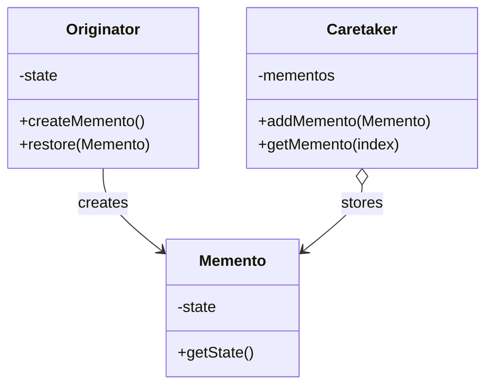

# 📦 Memento Pattern

## 🎯 Intent

The Memento Pattern provides the ability to restore an object to its previous state (undo/rollback). It allows you to save and restore the previous state of an object without revealing the details of its implementation.

## ❓ Problem It Solves

When you need to:
- Implement undo/redo functionality
- Restore an object to a previous state
- Save checkpoints or snapshots of an object's state
- Avoid directly exposing the object's internal structure

## 💡 Solution

The Memento Pattern suggests storing the state of an object in a separate object called a Memento. The original object (Originator) creates the Memento and uses it when needed to restore to a previous state. A Caretaker object manages the collection of Mementos without examining their contents.

## 🏗️ Structure



## ⚙️ Implementation in PHP

```php
<?php
// Memento class - stores the state of the Originator
class EditorMemento {
    private $content;
    private $cursorPosition;
    
    public function __construct(string $content, int $cursorPosition) {
        $this->content = $content;
        $this->cursorPosition = $cursorPosition;
    }
    
    // Protected methods only accessible to the Originator
    protected function getContent(): string {
        return $this->content;
    }
    
    protected function getCursorPosition(): int {
        return $this->cursorPosition;
    }
}

// Originator class
class Editor {
    private $content = "";
    private $cursorPosition = 0;
    
    public function type(string $text): void {
        $this->content = substr($this->content, 0, $this->cursorPosition) .
                    $text .
                    substr($this->content, $this->cursorPosition);
        $this->cursorPosition += strlen($text);
    }
    
    public function delete(): void {
        if ($this->cursorPosition < strlen($this->content)) {
            $this->content = substr($this->content, 0, $this->cursorPosition) .
                        substr($this->content, $this->cursorPosition + 1);
        }
    }
    
    public function getContent(): string {
        return $this->content;
    }
    
    // Create a memento
    public function save(): EditorMemento {
        return new EditorMemento($this->content, $this->cursorPosition);
    }
    
    // Restore from a memento
    public function restore(EditorMemento $memento): void {
        $this->content = $memento->getContent();
        $this->cursorPosition = $memento->getCursorPosition();
    }
}

// Caretaker class
class History {
    private $mementos = [];
    private $currentIndex = -1;
    
    public function push(EditorMemento $memento): void {
        // When adding new state, remove all future states if we've gone back
        if ($this->currentIndex < count($this->mementos) - 1) {
            array_splice($this->mementos, $this->currentIndex + 1);
        }
        
        $this->mementos[] = $memento;
        $this->currentIndex = count($this->mementos) - 1;
    }
    
    public function undo(): ?EditorMemento {
        if ($this->currentIndex <= 0) {
            return null; // Nothing to undo
        }
        
        $this->currentIndex--;
        return $this->mementos[$this->currentIndex];
    }
    
    public function redo(): ?EditorMemento {
        if ($this->currentIndex >= count($this->mementos) - 1) {
            return null; // Nothing to redo
        }
        
        $this->currentIndex++;
        return $this->mementos[$this->currentIndex];
    }
}
```

**Usage:**
```php
// Client code - text editor with undo/redo
$editor = new Editor();
$history = new History();

// Save initial state
$history->push($editor->save());

// Edit text
$editor->type("Hello, world!");
echo "Current content: " . $editor->getContent() . "\n";
$history->push($editor->save());

$editor->type(" How are you?");
echo "Current content: " . $editor->getContent() . "\n";
$history->push($editor->save());

// Undo and display state
if ($memento = $history->undo()) {
    $editor->restore($memento);
    echo "After undo: " . $editor->getContent() . "\n";
}
```

**Output:**
```
Current content: Hello, world!
Current content: Hello, world! How are you?
After undo: Hello, world!
```

## 🎮 Example: Game Character State

```php
class CharacterMemento {
    private $health;
    private $position;
    private $inventory;
    private $timestamp;
    
    public function __construct(int $health, array $position, array $inventory) {
        $this->health = $health;
        $this->position = $position;
        $this->inventory = $inventory;
        $this->timestamp = date('Y-m-d H:i:s');
    }
    
    public function getTimestamp(): string {
        return $this->timestamp;
    }
    
    // Protected methods only accessible to the Originator
    protected function getHealth(): int { return $this->health; }
    protected function getPosition(): array { return $this->position; }
    protected function getInventory(): array { return $this->inventory; }
}

class GameCharacter {
    private $name;
    private $health;
    private $position;
    private $inventory;
    
    public function __construct(string $name) {
        $this->name = $name;
        $this->health = 100;
        $this->position = ['x' => 0, 'y' => 0];
        $this->inventory = [];
    }
    
    public function takeDamage(int $amount): void {
        $this->health = max(0, $this->health - $amount);
        echo "{$this->name} takes {$amount} damage. Health: {$this->health}\n";
    }
    
    public function pickUp(string $item): void {
        $this->inventory[] = $item;
        echo "{$this->name} picked up $item\n";
    }
    
    public function getStatus(): string {
        $status = "{$this->name} - Health: {$this->health}, Position: ({$this->position['x']}, {$this->position['y']}), ";
        $status .= "Inventory: " . (empty($this->inventory) ? "Empty" : implode(", ", $this->inventory));
        return $status;
    }
    
    // Save and restore methods
    public function save(): CharacterMemento {
        echo "{$this->name}'s state saved\n";
        return new CharacterMemento($this->health, $this->position, $this->inventory);
    }
    
    public function restore(CharacterMemento $memento): void {
        $this->health = $memento->getHealth();
        $this->position = $memento->getPosition();
        $this->inventory = $memento->getInventory();
        echo "{$this->name}'s state restored to " . $memento->getTimestamp() . "\n";
    }
}
```

**Output:**
```
Alex's state saved
Alex moves to position (10, 5)
Alex picked up Sword
Alex picked up Health Potion
Alex - Health: 100, Position: (10, 5), Inventory: Sword, Health Potion
Alex's state restored to 2023-07-15 14:30:22
Alex - Health: 100, Position: (0, 0), Inventory: Empty
```

## 📝 Example: Form with Undo Capability

```php
class FormStateMemento {
    private $fields;
    
    public function __construct(array $fields) {
        $this->fields = $fields;
    }
    
    public function getFields(): array {
        return $this->fields;
    }
}

class Form {
    private $fields = [];
    
    public function setField(string $name, $value): void {
        $this->fields[$name] = $value;
        echo "Set $name to " . json_encode($value) . "\n";
    }
    
    public function createMemento(): FormStateMemento {
        return new FormStateMemento(array_map(function($item) {
            return is_object($item) ? clone $item : $item;
        }, $this->fields));
    }
    
    public function restoreFromMemento(FormStateMemento $memento): void {
        $this->fields = $memento->getFields();
        echo "Form restored to previous state\n";
    }
    
    public function displayForm(): void {
        echo "Current form values:\n";
        foreach ($this->fields as $name => $value) {
            echo "- $name: " . json_encode($value) . "\n";
        }
    }
}
```

**Example usage:**
```php
$signupForm = new Form();
$formHistory = new FormHistory();

// Save initial state
$formHistory->save($signupForm->createMemento());

// Fill out the form
$signupForm->setField("name", "John Doe");
$formHistory->save($signupForm->createMemento());

$signupForm->setField("email", "johnwrongemail");
$formHistory->save($signupForm->createMemento());
$signupForm->displayForm();

// Undo to fix error
if ($memento = $formHistory->undo()) {
    $signupForm->restoreFromMemento($memento);
}
$signupForm->displayForm();
```

**Output:**
```
Set name to "John Doe"
Set email to "johnwrongemail"
Current form values:
- name: "John Doe"
- email: "johnwrongemail"
Form restored to previous state
Current form values:
- name: "John Doe"
```

## ✨ Benefits

1. **🛡️ Preserves encapsulation**: The originator's internal state remains hidden
2. **🧩 Simplifies the originator**: The originator doesn't track its history
3. **📋 Clean recovery points**: Allows for clear restoration points
4. **↩️ Easy undo/redo**: Makes undo/redo functionality straightforward
5. **🎯 Single Responsibility**: Separates state storage from business logic

## 🕒 When to Use

- When you need to provide undo/redo functionality
- When you need to save snapshots of an object's state
- When direct access to an object's fields would violate encapsulation
- When you want to create checkpoints that you can revert to

## 🔄 Related Patterns

| Pattern | Relationship |
|---------|-------------|
| **Command** | Often used with Memento for implementing undo/redo |
| **Iterator** | Both provide ways to access an object's contents without exposing its structure |
| **Prototype** | Both involve copying object state, but for different reasons |
| **Singleton** | Caretakers are often implemented as singletons |

---

## 🔜 Up Next

Learn about the [Observer Pattern](./06-observer.md), which defines a one-to-many dependency between objects so that when one object changes state, all its dependents are notified and updated automatically.

[Back to Design Patterns](../README.md) | [Previous: Mediator](./04-mediator.md) | [Next: Observer](./06-observer.md)
