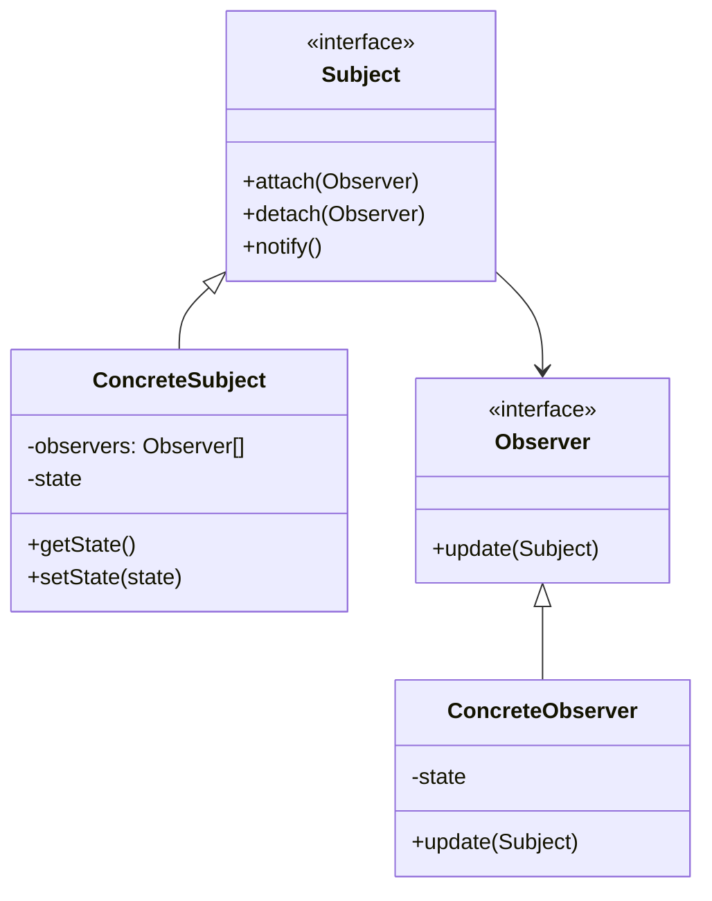

# 👁️ Observer Pattern

## 🎯 Intent

The Observer Pattern defines a one-to-many dependency between objects so that when one object (the subject) changes state, all its dependents (observers) are notified and updated automatically. It's a behavioral pattern that helps implement distributed event handling systems.

## ❓ Problem It Solves

When you have objects that need to be notified about changes in other objects, but:
- You don't want the objects to be tightly coupled
- The number and type of dependent objects may vary at runtime
- A change to one object requires changing many related objects

## 💡 Solution

The Observer Pattern suggests defining a one-to-many relationship between objects by:
1. Creating a Subject interface that allows attaching, detaching, and notifying observers
2. Creating an Observer interface that defines how observers receive notifications
3. Implementing concrete subjects that maintain a list of observers and notify them of state changes
4. Implementing concrete observers that respond to notifications from subjects

## 🏗️ Structure



## ⚙️ Implementation in PHP

```php
// Subject interface
interface Subject {
    public function attach(Observer $observer): void;
    public function detach(Observer $observer): void;
    public function notify(): void;
}

// Observer interface
interface Observer {
    public function update(Subject $subject): void;
}

// Concrete Subject
class WeatherData implements Subject {
    private $observers = [];
    private $temperature;
    private $humidity;
    
    public function attach(Observer $observer): void {
        $this->observers[] = $observer;
    }
    
    public function detach(Observer $observer): void {
        $index = array_search($observer, $this->observers, true);
        if ($index !== false) {
            unset($this->observers[$index]);
            $this->observers = array_values($this->observers);
        }
    }
    
    public function notify(): void {
        foreach ($this->observers as $observer) {
            $observer->update($this);
        }
    }
    
    public function setMeasurements(float $temperature, float $humidity): void {
        $this->temperature = $temperature;
        $this->humidity = $humidity;
        $this->notify();
    }
    
    public function getTemperature(): float { return $this->temperature; }
    public function getHumidity(): float { return $this->humidity; }
}

// Concrete Observer
class CurrentConditionsDisplay implements Observer {
    private $temperature;
    private $humidity;
    
    public function update(Subject $subject): void {
        if ($subject instanceof WeatherData) {
            $this->temperature = $subject->getTemperature();
            $this->humidity = $subject->getHumidity();
            $this->display();
        }
    }
    
    public function display(): void {
        echo "Current conditions: {$this->temperature}°C and {$this->humidity}% humidity\n";
    }
}
```

**Output:**
```
Current conditions: 27.5°C and 65% humidity
Current conditions: 28.2°C and 70% humidity
```

## 🔄 Using PHP's Built-in SplObserver

```php
// Using PHP's built-in interfaces
class StockTicker implements \SplSubject {
    private $observers = [];
    private $symbol;
    private $price;
    
    public function __construct(string $symbol, float $price) {
        $this->symbol = $symbol;
        $this->price = $price;
    }
    
    public function attach(\SplObserver $observer): void {
        $this->observers[] = $observer;
    }
    
    public function detach(\SplObserver $observer): void {
        $index = array_search($observer, $this->observers, true);
        if ($index !== false) {
            unset($this->observers[$index]);
        }
    }
    
    public function notify(): void {
        foreach ($this->observers as $observer) {
            $observer->update($this);
        }
    }
    
    public function updatePrice(float $price): void {
        $this->price = $price;
        $this->notify();
    }
    
    public function getSymbol(): string { return $this->symbol; }
    public function getPrice(): float { return $this->price; }
}

class StockAlert implements \SplObserver {
    private $threshold;
    
    public function __construct(float $threshold) {
        $this->threshold = $threshold;
    }
    
    public function update(\SplSubject $subject): void {
        if ($subject instanceof StockTicker && $subject->getPrice() > $this->threshold) {
            echo "ALERT: {$subject->getSymbol()} has exceeded threshold of \${$this->threshold}!\n";
        }
    }
}
```

**Output:**
```
Logger: AAPL stock price changed to $155.5
Logger: AAPL stock price changed to $162.3
ALERT: AAPL has exceeded threshold of $160!
```

## 🚀 Event-Driven Architecture

```php
// Event class
class Event {
    private $name;
    private $data;
    
    public function __construct(string $name, array $data = []) {
        $this->name = $name;
        $this->data = $data;
    }
    
    public function getName(): string { return $this->name; }
    public function getData(): array { return $this->data; }
}

// Event dispatcher
class EventDispatcher {
    private $listeners = [];
    
    public function addListener(string $eventName, callable $callback): void {
        if (!isset($this->listeners[$eventName])) {
            $this->listeners[$eventName] = [];
        }
        $this->listeners[$eventName][] = $callback;
    }
    
    public function dispatch(Event $event): void {
        $eventName = $event->getName();
        if (!isset($this->listeners[$eventName])) {
            return;
        }
        
        foreach ($this->listeners[$eventName] as $listener) {
            call_user_func($listener, $event);
        }
    }
}
```

**Output:**
```
New user created: John Doe (ID: 1)
Sending welcome email to john@example.com
```

## 🔄 Push vs. Pull Models

### Push Model (Data pushed to observers)
```php
// In the notify method of the Subject:
public function notify(): void {
    foreach ($this->observers as $observer) {
        // Push all data directly to the observer
        $observer->update($this->data);
    }
}
```

### Pull Model (Observers pull what they need)
```php
// In the notify method of the Subject:
public function notify(): void {
    foreach ($this->observers as $observer) {
        // Only pass the subject reference
        $observer->update($this);
    }
}

// In the observer:
public function update(Subject $subject): void {
    // Pull only the data needed
    $this->temperature = $subject->getTemperature();
}
```

## 📝 Form Validation Example

```php
// Form subject class
class Form implements Subject {
    private $observers = [];
    private $fields = [];
    
    public function attach(Observer $observer): void {
        $this->observers[] = $observer;
    }
    
    public function detach(Observer $observer): void {
        $index = array_search($observer, $this->observers, true);
        if ($index !== false) {
            unset($this->observers[$index]);
        }
    }
    
    public function notify(): void {
        foreach ($this->observers as $observer) {
            $observer->update($this);
        }
    }
    
    public function setField(string $name, $value): void {
        $this->fields[$name] = $value;
        $this->notify();
    }
    
    public function getField(string $name) {
        return $this->fields[$name] ?? null;
    }
}

// Email validator observer
class EmailValidator implements Observer {
    private $errors = [];
    
    public function update(Subject $subject): void {
        if (!($subject instanceof Form)) return;
        
        $email = $subject->getField('email');
        $this->errors = [];
        
        if ($email !== null) {
            if (empty($email)) {
                $this->errors[] = "Email cannot be empty";
            } elseif (!filter_var($email, FILTER_VALIDATE_EMAIL)) {
                $this->errors[] = "Email format is invalid";
            }
        }
    }
    
    public function getErrors(): array {
        return $this->errors;
    }
}
```

**Output:**
```
Email validation errors:
- Email format is invalid

Password validation errors:
- Password must be at least 8 characters
- Password must contain at least one uppercase letter

After fixing:
Email has 0 errors
Password has 0 errors
```

## ✨ Benefits

1. **🔄 Loose coupling**: Subjects and observers can vary independently
2. **🔌 Dynamic relationships**: Observer relationships established at runtime
3. **📣 Broadcast communication**: One subject notifies multiple observers
4. **📝 Open/Closed**: New observers can be added without modifying the subject

## 🕒 When to Use

- When changes to one object require changing others, and you don't know how many
- When an object should notify other objects without making assumptions about them
- When a change in one object requires changing many dependent objects
- When an abstraction has two aspects, with one dependent on the other

## ⚠️ Common Pitfalls

1. **🔄 Unexpected updates**: Cascading updates can cause performance issues
2. **🧠 Memory leaks**: Forgotten observers can cause memory leaks
3. **🔢 Update order**: The order of notification might matter
4. **🔄 Concurrency issues**: Multi-threaded environments need careful synchronization
5. **🧩 Complex dependencies**: Too many observer relationships can be confusing

## 🔄 Related Patterns

| Pattern | Relationship |
|---------|-------------|
| **Mediator** | Objects communicate through a mediator instead of directly |
| **Singleton** | Subject often implemented as a singleton |
| **Command** | Commands can encapsulate the update action |
| **Memento** | Can maintain observer state |

---

## 🔜 Up Next

Learn about the [State Pattern](./07-state.md), which allows an object to alter its behavior when its internal state changes.

[Back to Design Patterns](../README.md) | [Previous: Memento](./05-memento.md) | [Next: State](./07-state.md)
