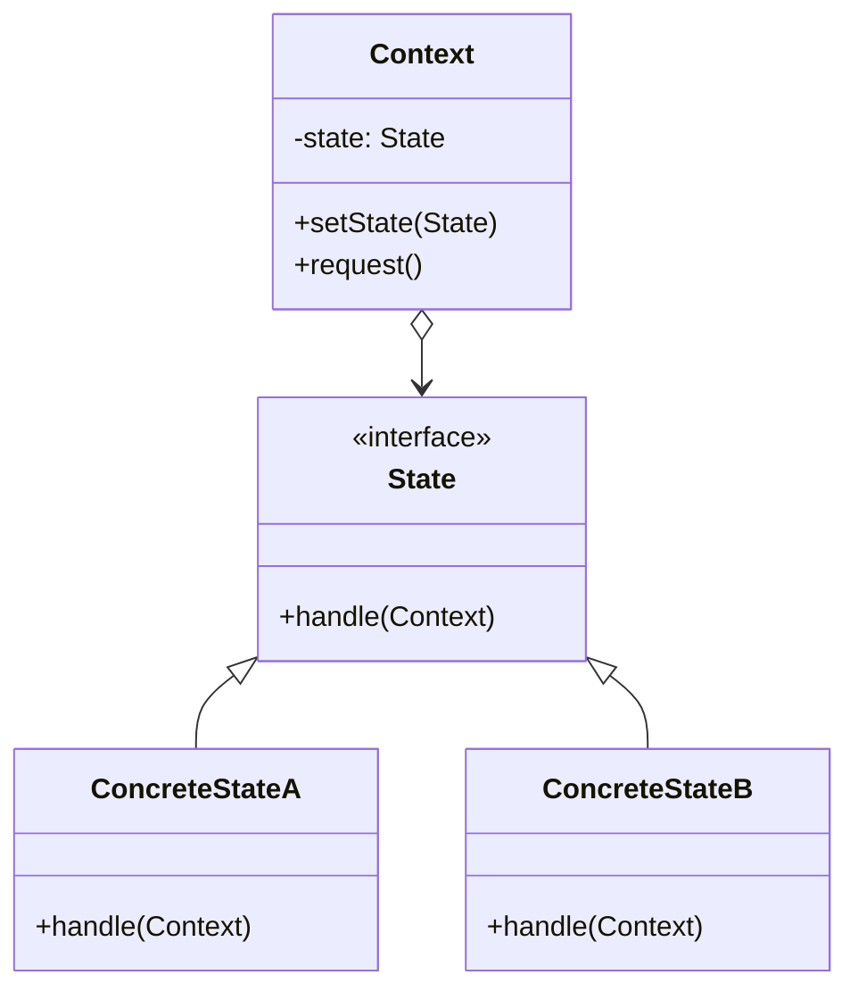

# 🔄 State Pattern

## 🎯 Intent

The State Pattern allows an object to alter its behavior when its internal state changes. The object will appear to change its class as its behavior changes with the state.

## ❓ Problem It Solves

When an object's behavior depends on its state, and it must change its behavior at runtime depending on that state, managing this with conditional statements leads to:
- Bloated and complex code
- Difficult-to-maintain state transitions
- Code that's hard to extend with new states
- State-specific behavior scattered throughout the class

## 💡 Solution

The State Pattern suggests:
1. Define separate state objects for each possible state
2. Delegate state-specific behavior to these state objects
3. Allow the context object to switch between different state objects at runtime

## 🏗️ Structure



## ⚙️ Implementation in PHP

```php
<?php
// Context class
class Document {
    private $state;
    private $content = '';
    private $author = '';
    private $approvers = [];
    private $rejectionReason = '';
    
    public function __construct() {
        // Set initial state
        $this->state = new DraftState();
    }
    
    // Transition to a new state
    public function setState(State $state): void {
        echo "Changing state from " . get_class($this->state) . " to " . get_class($state) . "\n";
        $this->state = $state;
    }
    
    // Delegate to state behavior
    public function render(): void {
        echo "Document content: " . $this->content . "\n";
        $this->state->render($this);
    }
    
    // Actions that trigger state transitions
    public function edit(string $content, string $author): void {
        $this->state->edit($this, $content, $author);
    }
    
    public function submit(): void {
        $this->state->submit($this);
    }
    
    public function review(bool $approved, string $rejectionReason = ''): void {
        $this->state->review($this, $approved, $rejectionReason);
    }
    
    public function publish(): void {
        $this->state->publish($this);
    }
    
    // Getters and setters
    public function getContent(): string {
        return $this->content;
    }
    
    public function setContent(string $content): void {
        $this->content = $content;
    }
    
    public function getAuthor(): string {
        return $this->author;
    }
    
    public function setAuthor(string $author): void {
        $this->author = $author;
    }
    
    public function getApprovers(): array {
        return $this->approvers;
    }
    
    public function addApprover(string $approver): void {
        $this->approvers[] = $approver;
    }
    
    public function getRejectionReason(): string {
        return $this->rejectionReason;
    }
    
    public function setRejectionReason(string $reason): void {
        $this->rejectionReason = $reason;
    }
}

// State interface
interface State {
    public function render(Document $document): void;
    public function edit(Document $document, string $content, string $author): void;
    public function submit(Document $document): void;
    public function review(Document $document, bool $approved, string $rejectionReason = ''): void;
    public function publish(Document $document): void;
}

// Concrete States
class DraftState implements State {
    public function render(Document $document): void {
        echo "State: Draft - Document is being prepared by " . $document->getAuthor() . "\n";
    }
    
    public function edit(Document $document, string $content, string $author): void {
        $document->setContent($content);
        $document->setAuthor($author);
        echo "Document has been edited by " . $author . "\n";
    }
    
    public function submit(Document $document): void {
        if (empty($document->getContent())) {
            echo "Cannot submit empty document\n";
            return;
        }
        
        $document->setState(new ModerationState());
        echo "Document has been submitted for review\n";
    }
    
    public function review(Document $document, bool $approved, string $rejectionReason = ''): void {
        echo "Cannot review a document that hasn't been submitted yet\n";
    }
    
    public function publish(Document $document): void {
        echo "Cannot publish a draft document. It must be reviewed first\n";
    }
}

class ModerationState implements State {
    public function render(Document $document): void {
        echo "State: Under Review - Waiting for approval\n";
    }
    
    public function edit(Document $document, string $content, string $author): void {
        echo "Cannot edit document while it's under review\n";
    }
    
    public function submit(Document $document): void {
        echo "Document is already submitted and under review\n";
    }
    
    public function review(Document $document, bool $approved, string $rejectionReason = ''): void {
        if ($approved) {
            $document->addApprover('Reviewer');
            $document->setState(new ApprovedState());
            echo "Document has been approved\n";
        } else {
            $document->setRejectionReason($rejectionReason);
            $document->setState(new RejectedState());
            echo "Document was rejected: " . $rejectionReason . "\n";
        }
    }
    
    public function publish(Document $document): void {
        echo "Cannot publish a document that is still under review\n";
    }
}

class ApprovedState implements State {
    public function render(Document $document): void {
        echo "State: Approved - Ready for publishing\n";
        echo "Approved by: " . implode(', ', $document->getApprovers()) . "\n";
    }
    
    public function edit(Document $document, string $content, string $author): void {
        echo "Cannot edit an approved document. It must be returned to draft first\n";
    }
    
    public function submit(Document $document): void {
        echo "Document is already approved\n";
    }
    
    public function review(Document $document, bool $approved, string $rejectionReason = ''): void {
        echo "Document has already been approved\n";
    }
    
    public function publish(Document $document): void {
        $document->setState(new PublishedState());
        echo "Document has been published\n";
    }
}

class RejectedState implements State {
    public function render(Document $document): void {
        echo "State: Rejected - Needs revision\n";
        echo "Reason for rejection: " . $document->getRejectionReason() . "\n";
    }
    
    public function edit(Document $document, string $content, string $author): void {
        $document->setContent($content);
        $document->setRejectionReason('');
        $document->setState(new DraftState());
        echo "Document has been revised by " . $author . " and returned to draft state\n";
    }
    
    public function submit(Document $document): void {
        echo "Document must be edited before resubmitting\n";
    }
    
    public function review(Document $document, bool $approved, string $rejectionReason = ''): void {
        echo "Cannot review a rejected document. It must be revised and resubmitted\n";
    }
    
    public function publish(Document $document): void {
        echo "Cannot publish a rejected document\n";
    }
}

class PublishedState implements State {
    public function render(Document $document): void {
        echo "State: Published - Visible to the public\n";
    }
    
    public function edit(Document $document, string $content, string $author): void {
        echo "Creating a new version of the document...\n";
        $document->setContent($content);
        $document->setState(new DraftState());
        echo "New version created and is in draft state\n";
    }
    
    public function submit(Document $document): void {
        echo "Document is already published\n";
    }
    
    public function review(Document $document, bool $approved, string $rejectionReason = ''): void {
        echo "Cannot review a published document\n";
    }
    
    public function publish(Document $document): void {
        echo "Document is already published\n";
    }
}

// Client code
function documentWorkflow() {
    $document = new Document();
    $document->render();
    
    // Edit the document
    $document->edit("This is a sample document content.", "John Doe");
    $document->render();
    
    // Submit for review
    $document->submit();
    $document->render();
    
    // Try to edit while under review (should fail)
    $document->edit("Trying to change content during review", "John Doe");
    
    // Review and approve
    $document->review(true);
    $document->render();
    
    // Publish
    $document->publish();
    $document->render();
    
    // Create a new version
    $document->edit("Updated content for version 2", "John Doe");
    $document->render();
    
    // Submit and get rejected this time
    $document->submit();
    $document->review(false, "Need more details in section 3");
    $document->render();
    
    // Fix and resubmit
    $document->edit("Updated with more details in section 3", "John Doe");
    $document->render();
    $document->submit();
    $document->render();
}

documentWorkflow();
```

## 🛒 Example: Order Processing State Machine

```php
<?php
// Context class
class Order {
    private $state;
    private $orderId;
    private $items = [];
    private $customerInfo;
    private $paymentInfo;
    private $shippingInfo;
    private $trackingNumber;
    
    public function __construct(string $orderId) {
        $this->orderId = $orderId;
        $this->state = new NewOrderState();
    }
    
    public function setState(OrderState $state): void {
        echo "Order #{$this->orderId}: Status changed from " . get_class($this->state) . 
             " to " . get_class($state) . "\n";
        $this->state = $state;
    }
    
    public function getStatus(): string {
        return get_class($this->state);
    }
    
    // Actions
    public function addItem(string $product, int $quantity, float $price): void {
        $this->state->addItem($this, $product, $quantity, $price);
    }
    
    public function addCustomerInfo(array $customerInfo): void {
        $this->state->addCustomerInfo($this, $customerInfo);
    }
    
    public function addPayment(array $paymentInfo): void {
        $this->state->addPayment($this, $paymentInfo);
    }
    
    public function verifyPayment(): void {
        $this->state->verifyPayment($this);
    }
    
    public function ship(array $shippingInfo): void {
        $this->state->ship($this, $shippingInfo);
    }
    
    public function deliver(string $trackingNumber): void {
        $this->state->deliver($this, $trackingNumber);
    }
    
    public function cancel(string $reason): void {
        $this->state->cancel($this, $reason);
    }
    
    public function requestReturn(string $reason): void {
        $this->state->requestReturn($this, $reason);
    }
    
    // Helper methods
    public function calculateTotal(): float {
        $total = 0;
        foreach ($this->items as $item) {
            $total += $item['price'] * $item['quantity'];
        }
        return $total;
    }
    
    // Getters/setters
    public function getOrderId(): string {
        return $this->orderId;
    }
    
    public function getItems(): array {
        return $this->items;
    }
    
    public function addToItems(string $product, int $quantity, float $price): void {
        $this->items[] = [
            'product' => $product,
            'quantity' => $quantity,
            'price' => $price
        ];
    }
    
    public function setCustomerInfo(array $customerInfo): void {
        $this->customerInfo = $customerInfo;
    }
    
    public function getCustomerInfo(): ?array {
        return $this->customerInfo;
    }
    
    public function setPaymentInfo(array $paymentInfo): void {
        $this->paymentInfo = $paymentInfo;
    }
    
    public function getPaymentInfo(): ?array {
        return $this->paymentInfo;
    }
    
    public function setShippingInfo(array $shippingInfo): void {
        $this->shippingInfo = $shippingInfo;
    }
    
    public function getShippingInfo(): ?array {
        return $this->shippingInfo;
    }
    
    public function setTrackingNumber(string $trackingNumber): void {
        $this->trackingNumber = $trackingNumber;
    }
    
    public function getTrackingNumber(): ?string {
        return $this->trackingNumber;
    }
    
    // Display order details
    public function displayDetails(): void {
        echo "\n--- Order #{$this->orderId} Details ---\n";
        echo "Status: " . str_replace("State", "", get_class($this->state)) . "\n";
        
        if (!empty($this->items)) {
            echo "Items:\n";
            foreach ($this->items as $item) {
                echo "- {$item['product']} (x{$item['quantity']}) @ \${$item['price']} each\n";
            }
            echo "Total: \$" . $this->calculateTotal() . "\n";
        }
        
        if ($this->customerInfo) {
            echo "Customer: {$this->customerInfo['name']}, {$this->customerInfo['email']}\n";
        }
        
        if ($this->shippingInfo) {
            echo "Shipping to: {$this->shippingInfo['address']}\n";
        }
        
        if ($this->trackingNumber) {
            echo "Tracking #: {$this->trackingNumber}\n";
        }
        
        echo "-------------------------------\n\n";
    }
}

// State interface
interface OrderState {
    public function addItem(Order $order, string $product, int $quantity, float $price): void;
    public function addCustomerInfo(Order $order, array $customerInfo): void;
    public function addPayment(Order $order, array $paymentInfo): void;
    public function verifyPayment(Order $order): void;
    public function ship(Order $order, array $shippingInfo): void;
    public function deliver(Order $order, string $trackingNumber): void;
    public function cancel(Order $order, string $reason): void;
    public function requestReturn(Order $order, string $reason): void;
}

// Concrete States
class NewOrderState implements OrderState {
    public function addItem(Order $order, string $product, int $quantity, float $price): void {
        $order->addToItems($product, $quantity, $price);
        echo "Added {$quantity}x {$product} to order {$order->getOrderId()}\n";
    }
    
    public function addCustomerInfo(Order $order, array $customerInfo): void {
        $order->setCustomerInfo($customerInfo);
        echo "Customer info added to order {$order->getOrderId()}\n";
        
        if (!empty($order->getItems())) {
            $order->setState(new PendingPaymentState());
        }
    }
    
    public function addPayment(Order $order, array $paymentInfo): void {
        if (empty($order->getCustomerInfo())) {
            echo "Error: Cannot add payment before customer information\n";
            return;
        }
        
        $order->setPaymentInfo($paymentInfo);
        $order->setState(new PaymentProcessingState());
        echo "Payment info added, processing payment for order {$order->getOrderId()}\n";
    }
    
    public function verifyPayment(Order $order): void {
        echo "Error: No payment has been added yet\n";
    }
    
    public function ship(Order $order, array $shippingInfo): void {
        echo "Error: Cannot ship order before payment\n";
    }
    
    public function deliver(Order $order, string $trackingNumber): void {
        echo "Error: Cannot deliver order before shipping\n";
    }
    
    public function cancel(Order $order, string $reason): void {
        $order->setState(new CancelledState());
        echo "Order {$order->getOrderId()} cancelled: {$reason}\n";
    }
    
    public function requestReturn(Order $order, string $reason): void {
        echo "Error: Cannot request return for an order that hasn't been delivered\n";
    }
}

class PendingPaymentState implements OrderState {
    public function addItem(Order $order, string $product, int $quantity, float $price): void {
        $order->addToItems($product, $quantity, $price);
        echo "Added {$quantity}x {$product} to order {$order->getOrderId()}\n";
    }
    
    public function addCustomerInfo(Order $order, array $customerInfo): void {
        $order->setCustomerInfo($customerInfo);
        echo "Updated customer info for order {$order->getOrderId()}\n";
    }
    
    public function addPayment(Order $order, array $paymentInfo): void {
        $order->setPaymentInfo($paymentInfo);
        $order->setState(new PaymentProcessingState());
        echo "Payment info added, processing payment for order {$order->getOrderId()}\n";
    }
    
    public function verifyPayment(Order $order): void {
        echo "Error: No payment has been added yet\n";
    }
    
    public function ship(Order $order, array $shippingInfo): void {
        echo "Error: Cannot ship order before payment\n";
    }
    
    public function deliver(Order $order, string $trackingNumber): void {
        echo "Error: Cannot deliver order before shipping\n";
    }
    
    public function cancel(Order $order, string $reason): void {
        $order->setState(new CancelledState());
        echo "Order {$order->getOrderId()} cancelled: {$reason}\n";
    }
    
    public function requestReturn(Order $order, string $reason): void {
        echo "Error: Cannot request return for an order that hasn't been delivered\n";
    }
}

class PaymentProcessingState implements OrderState {
    public function addItem(Order $order, string $product, int $quantity, float $price): void {
        echo "Error: Cannot add items while payment is being processed\n";
    }
    
    public function addCustomerInfo(Order $order, array $customerInfo): void {
        echo "Error: Cannot modify customer info while payment is being processed\n";
    }
    
    public function addPayment(Order $order, array $paymentInfo): void {
        echo "Error: Payment is already being processed\n";
    }
    
    public function verifyPayment(Order $order): void {
        $order->setState(new PaymentConfirmedState());
        echo "Payment verified for order {$order->getOrderId()}\n";
    }
    
    public function ship(Order $order, array $shippingInfo): void {
        echo "Error: Cannot ship order before payment confirmation\n";
    }
    
    public function deliver(Order $order, string $trackingNumber): void {
        echo "Error: Cannot deliver order before shipping\n";
    }
    
    public function cancel(Order $order, string $reason): void {
        $order->setState(new CancelledState());
        echo "Order {$order->getOrderId()} cancelled during payment processing: {$reason}\n";
    }
    
    public function requestReturn(Order $order, string $reason): void {
        echo "Error: Cannot request return for an order that hasn't been delivered\n";
    }
}

class PaymentConfirmedState implements OrderState {
    public function addItem(Order $order, string $product, int $quantity, float $price): void {
        echo "Error: Cannot add items after payment confirmation\n";
    }
    
    public function addCustomerInfo(Order $order, array $customerInfo): void {
        echo "Error: Cannot modify customer info after payment confirmation\n";
    }
    
    public function addPayment(Order $order, array $paymentInfo): void {
        echo "Error: Payment has already been confirmed\n";
    }
    
    public function verifyPayment(Order $order): void {
        echo "Payment has already been verified\n";
    }
    
    public function ship(Order $order, array $shippingInfo): void {
        $order->setShippingInfo($shippingInfo);
        $order->setState(new ShippedState());
        echo "Order {$order->getOrderId()} has been shipped to {$shippingInfo['address']}\n";
    }
    
    public function deliver(Order $order, string $trackingNumber): void {
        echo "Error: Cannot deliver order before shipping\n";
    }
    
    public function cancel(Order $order, string $reason): void {
        $order->setState(new CancelledState());
        echo "Order {$order->getOrderId()} cancelled after payment: {$reason}\n";
        echo "Refund will be processed.\n";
    }
    
    public function requestReturn(Order $order, string $reason): void {
        echo "Error: Cannot request return for an order that hasn't been delivered\n";
    }
}

class ShippedState implements OrderState {
    public function addItem(Order $order, string $product, int $quantity, float $price): void {
        echo "Error: Cannot add items to an order that has been shipped\n";
    }
    
    public function addCustomerInfo(Order $order, array $customerInfo): void {
        echo "Error: Cannot modify customer info after shipping\n";
    }
    
    public function addPayment(Order $order, array $paymentInfo): void {
        echo "Error: Payment has already been processed\n";
    }
    
    public function verifyPayment(Order $order): void {
        echo "Payment has already been verified\n";
    }
    
    public function ship(Order $order, array $shippingInfo): void {
        echo "Order has already been shipped\n";
    }
    
    public function deliver(Order $order, string $trackingNumber): void {
        $order->setTrackingNumber($trackingNumber);
        $order->setState(new DeliveredState());
        echo "Order {$order->getOrderId()} has been delivered. Tracking #: {$trackingNumber}\n";
    }
    
    public function cancel(Order $order, string $reason): void {
        echo "Error: Cannot cancel an order that has already been shipped\n";
        echo "Please request a return after delivery.\n";
    }
    
    public function requestReturn(Order $order, string $reason): void {
        echo "Error: Cannot request return for an order that hasn't been delivered yet\n";
    }
}

class DeliveredState implements OrderState {
    public function addItem(Order $order, string $product, int $quantity, float $price): void {
        echo "Error: Cannot add items to a delivered order\n";
    }
    
    public function addCustomerInfo(Order $order, array $customerInfo): void {
        echo "Error: Cannot modify customer info after delivery\n";
    }
    
    public function addPayment(Order $order, array $paymentInfo): void {
        echo "Error: Payment has already been processed\n";
    }
    
    public function verifyPayment(Order $order): void {
        echo "Payment has already been verified\n";
    }
    
    public function ship(Order $order, array $shippingInfo): void {
        echo "Order has already been shipped and delivered\n";
    }
    
    public function deliver(Order $order, string $trackingNumber): void {
        echo "Order has already been delivered\n";
    }
    
    public function cancel(Order $order, string $reason): void {
        echo "Error: Cannot cancel an order that has already been delivered\n";
        echo "Please request a return instead.\n";
    }
    
    public function requestReturn(Order $order, string $reason): void {
        $order->setState(new ReturnRequestedState());
        echo "Return requested for order {$order->getOrderId()}: {$reason}\n";
    }
}

class ReturnRequestedState implements OrderState {
    public function addItem(Order $order, string $product, int $quantity, float $price): void {
        echo "Error: Cannot add items to an order with a return request\n";
    }
    
    public function addCustomerInfo(Order $order, array $customerInfo): void {
        echo "Error: Cannot modify customer info for an order with a return request\n";
    }
    
    public function addPayment(Order $order, array $paymentInfo): void {
        echo "Error: Cannot add payment to an order with a return request\n";
    }
    
    public function verifyPayment(Order $order): void {
        echo "Error: Cannot verify payment for an order with a return request\n";
    }
    
    public function ship(Order $order, array $shippingInfo): void {
        echo "Error: Cannot ship an order with a return request\n";
    }
    
    public function deliver(Order $order, string $trackingNumber): void {
        echo "Error: Cannot deliver an order with a return request\n";
    }
    
    public function cancel(Order $order, string $reason): void {
        echo "Error: Cannot cancel an order with a return request\n";
    }
    
    public function requestReturn(Order $order, string $reason): void {
        echo "Return has already been requested for this order\n";
    }
}

class CancelledState implements OrderState {
    public function addItem(Order $order, string $product, int $quantity, float $price): void {
        echo "Error: Cannot add items to a cancelled order\n";
    }
    
    public function addCustomerInfo(Order $order, array $customerInfo): void {
        echo "Error: Cannot modify customer info for a cancelled order\n";
    }
    
    public function addPayment(Order $order, array $paymentInfo): void {
        echo "Error: Cannot add payment to a cancelled order\n";
    }
    
    public function verifyPayment(Order $order): void {
        echo "Error: Cannot verify payment for a cancelled order\n";
    }
    
    public function ship(Order $order, array $shippingInfo): void {
        echo "Error: Cannot ship a cancelled order\n";
    }
    
    public function deliver(Order $order, string $trackingNumber): void {
        echo "Error: Cannot deliver a cancelled order\n";
    }
    
    public function cancel(Order $order, string $reason): void {
        echo "Order is already cancelled\n";
    }
    
    public function requestReturn(Order $order, string $reason): void {
        echo "Error: Cannot request return for a cancelled order\n";
    }
}

// Client code
function orderProcessingExample() {
    $order = new Order("ORD-12345");
    $order->displayDetails();
    
    // Add items to the order
    $order->addItem("Smartphone", 1, 699.99);
    $order->addItem("Phone Case", 1, 29.99);
    $order->displayDetails();
    
    // Add customer information
    $order->addCustomerInfo([
        'name' => 'John Doe',
        'email' => 'john@example.com',
        'phone' => '123-456-7890'
    ]);
    $order->displayDetails();
    
    // Add payment
    $order->addPayment([
        'method' => 'credit_card',
        'card_number' => '**** **** **** 1234',
        'expiry' => '05/2025'
    ]);
    $order->displayDetails();
    
    // Verify payment
    $order->verifyPayment();
    $order->displayDetails();
    
    // Ship the order
    $order->ship([
        'method' => 'UPS',
        'address' => '123 Main St, New York, NY 10001'
    ]);
    $order->displayDetails();
    
    // Deliver the order
    $order->deliver("1Z999AA10123456784");
    $order->displayDetails();
    
    // Request a return
    $order->requestReturn("Received wrong item");
    $order->displayDetails();
    
    // Try to perform invalid operations
    $order->addItem("Headphones", 1, 99.99);
    $order->cancel("Customer changed mind");
}

orderProcessingExample();
```

## 🔄 State vs. Strategy Pattern

The State pattern is often compared to the Strategy pattern:

| State Pattern | Strategy Pattern |
|---------------|-----------------|
| States change behavior AND transition between states | Strategies are interchangeable algorithms |
| States often know about other states | Strategies don't know about each other |
| Context changes state automatically | Client typically changes strategy explicitly |
| Focuses on what an object IS | Focuses on what an object DOES |

```php
<?php
// State Pattern - State transitions are handled within states
interface State {
    public function handle(Context $context): void;
}

class Context {
    private $state;
    
    public function setState(State $state): void {
        $this->state = $state;
    }
    
    public function request(): void {
        $this->state->handle($this); // May change state internally
    }
}

// Strategy Pattern - Client explicitly changes strategies
interface Strategy {
    public function execute(): void;
}

class StrategyContext {
    private $strategy;
    
    public function setStrategy(Strategy $strategy): void {
        $this->strategy = $strategy;
    }
    
    public function executeStrategy(): void {
        $this->strategy->execute();
    }
}
```

## ✨ Benefits

1. **📦 Encapsulation**: Each state encapsulates its own behavior
2. **📝 Open/Closed**: Add new states without changing existing ones
3. **🧩 Eliminates conditionals**: Replaces large if/else chains with polymorphism
4. **🔄 Clear transitions**: State transitions are explicit in state classes 
5. **🧠 Maintainability**: State-specific code is organized in separate classes

## 🕒 When to Use

- When an object's behavior depends on its state and changes at runtime
- When you have a class with many conditional statements that depend on the object's state
- When state-specific behavior should be independent and easily extendable
- When state transitions follow specific rules that need to be enforced

## 🔄 Related Patterns

| Pattern | Relationship |
|---------|-------------|
| **Strategy** | Both change behavior but State typically handles transitions |
| **Singleton** | States are often implemented as Singletons |
| **Flyweight** | States can use Flyweight to share state objects |
| **Command** | Commands can use states to track progress |

---

## 🔜 Up Next

Learn about the [Strategy Pattern](./08-strategy.md), which defines a family of algorithms, encapsulates each one, and makes them interchangeable within the family.

[Back to Design Patterns](../README.md) | [Previous: Observer](./06-observer.md) | [Next: Strategy](./08-strategy.md)
