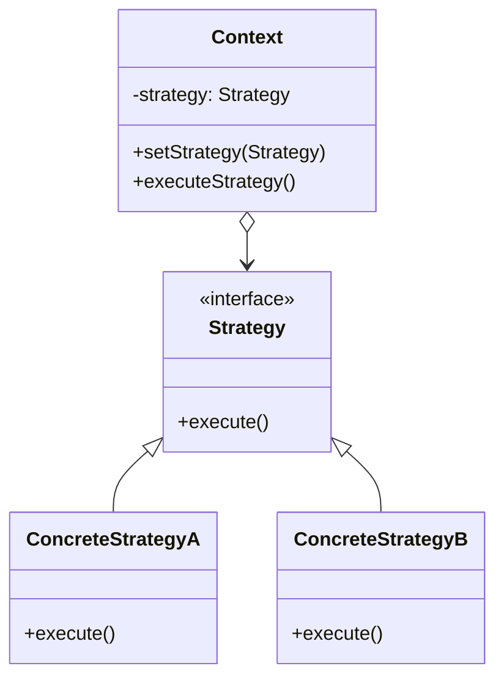

# 🧠 Strategy Pattern

## 🎯 Intent

The Strategy Pattern defines a family of algorithms, encapsulates each one, and makes them interchangeable. It lets the algorithm vary independently from clients that use it.

## ❓ Problem It Solves

When you need to:
- Use different variants of an algorithm within an object
- Switch between different behaviors at runtime
- Hide complex algorithm-specific data structures from clients
- Avoid conditional statements for selecting desired behavior

## 💡 Solution

The Strategy Pattern suggests defining a family of algorithms, encapsulating each one in a separate class that implements a common interface. This allows algorithms to be interchangeable and vary independently from the clients that use them.

## 🏗️ Structure



## ⚙️ Implementation in PHP

```php
<?php
// Strategy interface
interface PaymentStrategy {
    public function pay(float $amount): void;
    public function getName(): string;
}

// Concrete strategies
class CreditCardPayment implements PaymentStrategy {
    private $name;
    private $cardNumber;
    private $cvv;
    private $dateOfExpiry;
    
    public function __construct(string $name, string $cardNumber, string $cvv, string $dateOfExpiry) {
        $this->name = $name;
        $this->cardNumber = $cardNumber;
        $this->cvv = $cvv;
        $this->dateOfExpiry = $dateOfExpiry;
    }
    
    public function pay(float $amount): void {
        echo "Paying $" . number_format($amount, 2) . " using Credit Card ({$this->getMaskedCardNumber()})\n";
        // Logic for credit card payment processing
    }
    
    public function getName(): string {
        return "Credit Card";
    }
    
    private function getMaskedCardNumber(): string {
        $masked = str_repeat("*", strlen($this->cardNumber) - 4) . substr($this->cardNumber, -4);
        return $masked;
    }
}

class PayPalPayment implements PaymentStrategy {
    private $email;
    private $password;
    
    public function __construct(string $email, string $password) {
        $this->email = $email;
        $this->password = $password;
    }
    
    public function pay(float $amount): void {
        echo "Paying $" . number_format($amount, 2) . " using PayPal ({$this->email})\n";
        // Logic for PayPal payment processing
    }
    
    public function getName(): string {
        return "PayPal";
    }
}

class BankTransferPayment implements PaymentStrategy {
    private $bankName;
    private $accountNumber;
    
    public function __construct(string $bankName, string $accountNumber) {
        $this->bankName = $bankName;
        $this->accountNumber = $accountNumber;
    }
    
    public function pay(float $amount): void {
        echo "Paying $" . number_format($amount, 2) . " using Bank Transfer ({$this->bankName})\n";
        echo "Please transfer to Account Number: " . substr($this->accountNumber, 0, 2) . "XXXXX" . substr($this->accountNumber, -2) . "\n";
        // Logic for bank transfer processing
    }
    
    public function getName(): string {
        return "Bank Transfer";
    }
}

// Context class
class ShoppingCart {
    private $items = [];
    private $paymentStrategy;
    
    public function addItem(string $itemName, float $price, int $quantity = 1): void {
        $this->items[] = [
            'name' => $itemName,
            'price' => $price,
            'quantity' => $quantity
        ];
        echo "Added {$quantity} x {$itemName} to cart\n";
    }
    
    public function calculateTotal(): float {
        $sum = 0;
        foreach ($this->items as $item) {
            $sum += $item['price'] * $item['quantity'];
        }
        return $sum;
    }
    
    public function setPaymentStrategy(PaymentStrategy $paymentStrategy): void {
        $this->paymentStrategy = $paymentStrategy;
        echo "Payment strategy set to: " . $paymentStrategy->getName() . "\n";
    }
    
    public function checkout(): void {
        if (empty($this->items)) {
            echo "Your cart is empty. Please add items before checkout.\n";
            return;
        }
        
        if (!$this->paymentStrategy) {
            echo "Please select a payment method before checkout.\n";
            return;
        }
        
        $amount = $this->calculateTotal();
        echo "Checking out. Total amount: $" . number_format($amount, 2) . "\n";
        $this->paymentStrategy->pay($amount);
        $this->items = []; // Clear cart after successful payment
        echo "Checkout completed successfully!\n";
    }
}

// Client code
$cart = new ShoppingCart();

// Add items to the cart
$cart->addItem("Laptop", 999.99);
$cart->addItem("Mouse", 29.99, 2);

// Choose payment strategy
$creditCard = new CreditCardPayment("John Smith", "1234567890123456", "123", "12/2025");
$cart->setPaymentStrategy($creditCard);

// Checkout
$cart->checkout();

echo "\n--- New Order ---\n";
// Another customer with different payment method
$cart->addItem("Monitor", 249.99);
$cart->addItem("Keyboard", 59.99);

$paypal = new PayPalPayment("john.smith@example.com", "password");
$cart->setPaymentStrategy($paypal);

$cart->checkout();
```

## 🔢 Example: Sorting Strategies

```php
<?php
// Strategy Interface
interface SortingStrategy {
    public function sort(array $dataset): array;
    public function getName(): string;
}

// Concrete Strategies
class BubbleSortStrategy implements SortingStrategy {
    public function sort(array $dataset): array {
        echo "Sorting using Bubble Sort...\n";
        $n = count($dataset);
        for ($i = 0; $i < $n; $i++) {
            for ($j = 0; $j < $n - $i - 1; $j++) {
                if ($dataset[$j] > $dataset[$j + 1]) {
                    // Swap elements
                    $temp = $dataset[$j];
                    $dataset[$j] = $dataset[$j + 1];
                    $dataset[$j + 1] = $temp;
                }
            }
        }
        return $dataset;
    }
    
    public function getName(): string {
        return "Bubble Sort";
    }
}

class QuickSortStrategy implements SortingStrategy {
    public function sort(array $dataset): array {
        echo "Sorting using Quick Sort...\n";
        if (count($dataset) <= 1) {
            return $dataset;
        }
        
        $pivot = $dataset[0];
        $left = $right = [];
        
        for ($i = 1; $i < count($dataset); $i++) {
            if ($dataset[$i] < $pivot) {
                $left[] = $dataset[$i];
            } else {
                $right[] = $dataset[$i];
            }
        }
        
        return array_merge(
            $this->sort($left),
            [$pivot],
            $this->sort($right)
        );
    }
    
    public function getName(): string {
        return "Quick Sort";
    }
}

class MergeSortStrategy implements SortingStrategy {
    public function sort(array $dataset): array {
        echo "Sorting using Merge Sort...\n";
        if (count($dataset) <= 1) {
            return $dataset;
        }
        
        $mid = count($dataset) / 2;
        $left = array_slice($dataset, 0, $mid);
        $right = array_slice($dataset, $mid);
        
        $left = $this->sort($left);
        $right = $this->sort($right);
        
        return $this->merge($left, $right);
    }
    
    private function merge(array $left, array $right): array {
        $result = [];
        $leftIndex = $rightIndex = 0;
        
        while ($leftIndex < count($left) && $rightIndex < count($right)) {
            if ($left[$leftIndex] < $right[$rightIndex]) {
                $result[] = $left[$leftIndex];
                $leftIndex++;
            } else {
                $result[] = $right[$rightIndex];
                $rightIndex++;
            }
        }
        
        // Add remaining elements
        while ($leftIndex < count($left)) {
            $result[] = $left[$leftIndex];
            $leftIndex++;
        }
        
        while ($rightIndex < count($right)) {
            $result[] = $right[$rightIndex];
            $rightIndex++;
        }
        
        return $result;
    }
    
    public function getName(): string {
        return "Merge Sort";
    }
}

// Context
class Sorter {
    private $sortingStrategy;
    
    public function __construct(SortingStrategy $sortingStrategy = null) {
        $this->sortingStrategy = $sortingStrategy ?: new BubbleSortStrategy();
    }
    
    public function setStrategy(SortingStrategy $sortingStrategy): void {
        $this->sortingStrategy = $sortingStrategy;
        echo "Sorting strategy changed to: " . $sortingStrategy->getName() . "\n";
    }
    
    public function sort(array $dataset): array {
        $startTime = microtime(true);
        $sorted = $this->sortingStrategy->sort($dataset);
        $endTime = microtime(true);
        
        $time = ($endTime - $startTime) * 1000;
        echo "Sort completed in " . number_format($time, 3) . " ms\n";
        
        return $sorted;
    }
}

// Client code
function testSortingStrategies() {
    // Create a dataset to sort
    $dataset = [];
    for ($i = 0; $i < 100; $i++) {
        $dataset[] = rand(1, 1000);
    }
    
    $sorter = new Sorter();
    
    // Using the default bubble sort strategy
    echo "Original array: [" . implode(", ", array_slice($dataset, 0, 5)) . "...]\n";
    $sorted = $sorter->sort($dataset);
    echo "Sorted array: [" . implode(", ", array_slice($sorted, 0, 5)) . "...]\n\n";
    
    // Change to quick sort strategy
    $sorter->setStrategy(new QuickSortStrategy());
    $sorted = $sorter->sort($dataset);
    echo "Sorted array: [" . implode(", ", array_slice($sorted, 0, 5)) . "...]\n\n";
    
    // Change to merge sort strategy
    $sorter->setStrategy(new MergeSortStrategy());
    $sorted = $sorter->sort($dataset);
    echo "Sorted array: [" . implode(", ", array_slice($sorted, 0, 5)) . "...]\n";
}

testSortingStrategies();
```

## 🗜️ Example: Compression Strategies

```php
<?php
// Strategy Interface
interface CompressionStrategy {
    public function compress(string $data): string;
    public function decompress(string $compressedData): string;
    public function getName(): string;
}

// Concrete Strategies
class ZipCompressionStrategy implements CompressionStrategy {
    public function compress(string $data): string {
        echo "Compressing data using ZIP...\n";
        // In a real application, we'd use actual ZIP compression
        $compressed = base64_encode(gzcompress($data, 9));
        return $compressed;
    }
    
    public function decompress(string $compressedData): string {
        echo "Decompressing ZIP data...\n";
        $decompressed = gzuncompress(base64_decode($compressedData));
        return $decompressed;
    }
    
    public function getName(): string {
        return "ZIP";
    }
}

class GzipCompressionStrategy implements CompressionStrategy {
    public function compress(string $data): string {
        echo "Compressing data using GZIP...\n";
        $compressed = base64_encode(gzencode($data, 9));
        return $compressed;
    }
    
    public function decompress(string $compressedData): string {
        echo "Decompressing GZIP data...\n";
        $decompressed = gzdecode(base64_decode($compressedData));
        return $decompressed;
    }
    
    public function getName(): string {
        return "GZIP";
    }
}

class Bzip2CompressionStrategy implements CompressionStrategy {
    public function compress(string $data): string {
        echo "Compressing data using BZIP2...\n";
        $compressed = base64_encode(bzcompress($data, 9));
        return $compressed;
    }
    
    public function decompress(string $compressedData): string {
        echo "Decompressing BZIP2 data...\n";
        $decompressed = bzdecompress(base64_decode($compressedData));
        return $decompressed;
    }
    
    public function getName(): string {
        return "BZIP2";
    }
}

// Context
class FileCompressor {
    private $compressionStrategy;
    
    public function __construct(CompressionStrategy $compressionStrategy) {
        $this->compressionStrategy = $compressionStrategy;
    }
    
    public function setCompressionStrategy(CompressionStrategy $compressionStrategy): void {
        $this->compressionStrategy = $compressionStrategy;
        echo "Compression strategy changed to: " . $compressionStrategy->getName() . "\n";
    }
    
    public function compressFile(string $source, string $destination): void {
        if (!file_exists($source)) {
            echo "Error: Source file does not exist.\n";
            return;
        }
        
        $data = file_get_contents($source);
        $originalSize = strlen($data);
        
        $startTime = microtime(true);
        $compressed = $this->compressionStrategy->compress($data);
        $endTime = microtime(true);
        
        file_put_contents($destination, $compressed);
        $compressedSize = strlen($compressed);
        
        $ratio = $originalSize > 0 ? ($compressedSize / $originalSize) * 100 : 0;
        $time = ($endTime - $startTime) * 1000;
        
        echo "File compressed using {$this->compressionStrategy->getName()}\n";
        echo "Original size: " . number_format($originalSize) . " bytes\n";
        echo "Compressed size: " . number_format($compressedSize) . " bytes\n";
        echo "Compression ratio: " . number_format($ratio, 2) . "%\n";
        echo "Time taken: " . number_format($time, 2) . " ms\n";
    }
    
    public function decompressFile(string $source, string $destination): void {
        if (!file_exists($source)) {
            echo "Error: Source file does not exist.\n";
            return;
        }
        
        $compressedData = file_get_contents($source);
        
        $startTime = microtime(true);
        $decompressed = $this->compressionStrategy->decompress($compressedData);
        $endTime = microtime(true);
        
        file_put_contents($destination, $decompressed);
        
        echo "File decompressed using {$this->compressionStrategy->getName()}\n";
        echo "Decompressed size: " . strlen($decompressed) . " bytes\n";
        echo "Time taken: " . number_format(($endTime - $startTime) * 1000, 2) . " ms\n";
    }
}

// Client code
function simulateFileCompression() {
    // In a real application, we'd compress actual files
    // For this example, we'll simulate file operations with strings
    
    $data = str_repeat("This is sample text that will be compressed using different algorithms. ", 100);
    file_put_contents("sample_file.txt", $data);
    
    // Test with different compression strategies
    $compressor = new FileCompressor(new ZipCompressionStrategy());
    $compressor->compressFile("sample_file.txt", "sample_file.zip");
    
    $compressor->setCompressionStrategy(new GzipCompressionStrategy());
    $compressor->compressFile("sample_file.txt", "sample_file.gz");
    
    $compressor->setCompressionStrategy(new Bzip2CompressionStrategy());
    $compressor->compressFile("sample_file.txt", "sample_file.bz2");
    
    echo "\nDecompression Test:\n";
    $compressor->decompressFile("sample_file.bz2", "sample_file_restored.txt");
    
    // Clean up
    unlink("sample_file.txt");
    unlink("sample_file.zip");
    unlink("sample_file.gz");
    unlink("sample_file.bz2");
    unlink("sample_file_restored.txt");
}

// simulateFileCompression(); // Commented out to avoid file system operations in example
```

## ✨ Benefits

1. **📦 Encapsulation**: Each algorithm is isolated in its own class
2. **🔄 Runtime flexibility**: Allows switching between behaviors at runtime
3. **🧩 Elimination of conditionals**: Replaces complex conditionals with polymorphism
4. **📝 Open/Closed**: Add new strategies without modifying existing code
5. **🔄 Separation of concerns**: Algorithm implementation is separated from its usage
6. **🧠 Client simplification**: Clients don't need to know algorithm details

## 🕒 When to Use

- When you need to use different variants of an algorithm
- When you have many related classes that differ only in their behavior
- When you need to isolate business logic from implementation details
- When you have conditional statements that select from multiple algorithms
- When you need to hide algorithm-specific data from clients

## 🔄 Strategy vs. State Pattern

| Strategy Pattern | State Pattern |
|-----------------|--------------|
| Focuses on HOW an object performs a task | Focuses on WHAT an object is at a given time |
| Client usually selects the algorithm | State transitions often managed by the states |
| Strategy objects are typically stateless | State objects often maintain state for transitions |
| Strategies don't know about each other | States often know about other states |

## 🔄 Related Patterns

| Pattern | Relationship |
|---------|-------------|
| **Template Method** | Template Method uses inheritance, Strategy uses delegation |
| **State** | Both change behavior, but State focuses on state transitions |
| **Command** | Strategy can parameterize an object with different operations |
| **Decorator** | Decorators add responsibilities; Strategy changes behavior |
| **Factory** | Factory can create different Strategy objects |

---

## 🔜 Up Next

Learn about the [Template Method Pattern](./09-template-method.md), which defines the skeleton of an algorithm in a method, deferring some steps to subclasses.

[Back to Design Patterns](../README.md) | [Previous: State](./07-state.md) | [Next: Template Method](./09-template-method.md)
