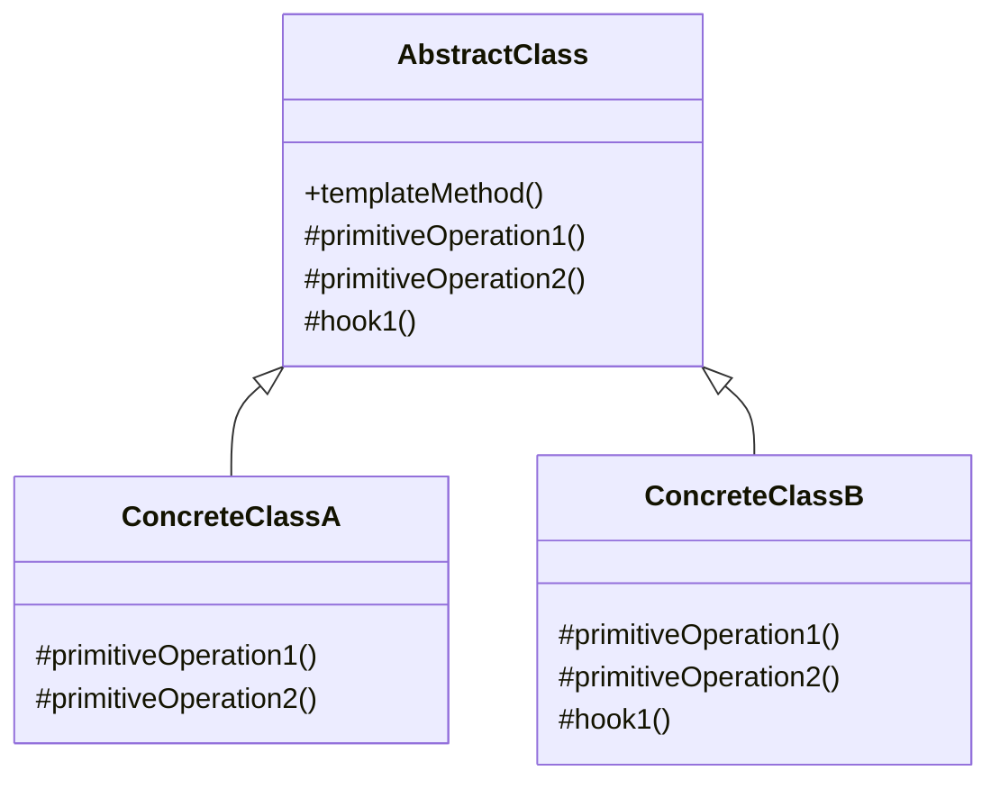

# 📝 Template Method Pattern

## 🎯 Intent

The Template Method Pattern defines the skeleton of an algorithm in a method, deferring some steps to subclasses. It allows subclasses to redefine certain steps of an algorithm without changing the algorithm's structure.

## ❓ Problem It Solves

When you have:
- Multiple classes that implement similar algorithms with identical structure but varying steps
- Duplicate code across related classes
- A need to enforce a certain algorithm structure while allowing variations in specific steps
- A desire to control the points where subclasses can extend behavior

## 💡 Solution

The Template Method Pattern suggests:
1. Breaking down an algorithm into a series of steps
2. Implementing these steps as separate methods
3. Putting a "template method" in the base class that calls these step methods in a specific order
4. Making some steps abstract, forcing subclasses to provide implementations
5. Providing default implementations for other steps that subclasses can override if needed

## 🏗️ Structure



## ⚙️ Implementation in PHP

```php
// Abstract class with the template method
abstract class DocumentGenerator {
    // The template method defines the algorithm structure
    public final function generateDocument(): void {
        $this->openDocument();
        $this->addHeader();
        $this->addContent();
        
        // Hook - may or may not be overridden
        if ($this->shouldAddFooter()) {
            $this->addFooter();
        }
        
        $this->closeDocument();
        $this->saveDocument();
    }
    
    // Steps that must be implemented by subclasses
    protected abstract function openDocument(): void;
    protected abstract function addContent(): void;
    protected abstract function closeDocument(): void;
    protected abstract function saveDocument(): void;
    
    // Default implementation for header
    protected function addHeader(): void {
        echo "Adding default header\n";
    }
    
    // Default implementation for footer
    protected function addFooter(): void {
        echo "Adding default footer\n";
    }
    
    // Hook method - gives subclasses control
    protected function shouldAddFooter(): bool {
        return true;
    }
}

// Concrete class for PDF documents
class PDFDocumentGenerator extends DocumentGenerator {
    private $filename;
    
    public function __construct(string $filename) {
        $this->filename = $filename;
    }
    
    protected function openDocument(): void {
        echo "Opening PDF document\n";
    }
    
    protected function addHeader(): void {
        echo "Adding PDF header with logo\n";
    }
    
    protected function addContent(): void {
        echo "Adding content to PDF document\n";
    }
    
    protected function closeDocument(): void {
        echo "Closing PDF document\n";
    }
    
    protected function saveDocument(): void {
        echo "Saving PDF document to {$this->filename}\n";
    }
}

// Concrete class for HTML documents
class HTMLDocumentGenerator extends DocumentGenerator {
    private $filename;
    
    public function __construct(string $filename) {
        $this->filename = $filename;
    }
    
    protected function openDocument(): void {
        echo "Creating HTML document structure\n";
    }
    
    protected function addContent(): void {
        echo "Adding content to HTML document\n";
    }
    
    protected function closeDocument(): void {
        echo "Closing HTML tags\n";
    }
    
    protected function saveDocument(): void {
        echo "Saving HTML document to {$this->filename}\n";
    }
}

// Concrete class for plain text documents
class PlainTextDocumentGenerator extends DocumentGenerator {
    private $filename;
    
    public function __construct(string $filename) {
        $this->filename = $filename;
    }
    
    protected function openDocument(): void {
        echo "Creating plain text document\n";
    }
    
    protected function addContent(): void {
        echo "Adding content to plain text document\n";
    }
    
    protected function closeDocument(): void {
        echo "Finalizing plain text document\n";
    }
    
    protected function saveDocument(): void {
        echo "Saving plain text document to {$this->filename}\n";
    }
    
    // Override hook to customize behavior
    protected function shouldAddFooter(): bool {
        return false; // Text document doesn't need a footer
    }
}
```

**Output:**
```
Generating PDF Document:
Opening PDF document
Adding PDF header with logo
Adding content to PDF document
Adding default footer
Closing PDF document
Saving PDF document to document.pdf

Generating HTML Document:
Creating HTML document structure
Adding default header
Adding content to HTML document
Adding default footer
Closing HTML tags
Saving HTML document to document.html

Generating Plain Text Document:
Creating plain text document
Adding default header
Adding content to plain text document
Finalizing plain text document
Saving plain text document to document.txt
```

## 📊 Example: Data Export Process

```php
// Abstract base class for data exporters
abstract class DataExporter {
    // Template method
    public final function export(array $data): void {
        $this->beforeExport();
        $this->openFile();
        
        $processedData = $this->prepareData($data);
        
        $this->writeHeader();
        $this->writeData($processedData);
        
        if ($this->includeFooter()) {
            $this->writeFooter();
        }
        
        $this->closeFile();
        $this->afterExport();
    }
    
    // Required abstract operations
    protected abstract function openFile(): void;
    protected abstract function writeHeader(): void;
    protected abstract function writeData(array $data): void;
    protected abstract function closeFile(): void;
    
    // Optional hook methods with default implementations
    protected function beforeExport(): void {
        echo "Starting export process\n";
    }
    
    protected function afterExport(): void {
        echo "Export process completed\n";
    }
    
    protected function prepareData(array $data): array {
        return $data; // Default: return unchanged data
    }
    
    protected function writeFooter(): void {
        echo "Writing default footer\n";
    }
    
    // Hook to control whether to include a footer
    protected function includeFooter(): bool {
        return true;
    }
}

// Concrete exporter for CSV format
class CSVExporter extends DataExporter {
    private $filename;
    
    public function __construct(string $filename) {
        $this->filename = $filename;
    }
    
    protected function openFile(): void {
        echo "Opening CSV file: {$this->filename}\n";
    }
    
    protected function writeHeader(): void {
        echo "Writing CSV header row\n";
    }
    
    protected function writeData(array $data): void {
        echo "Writing " . count($data) . " rows to CSV\n";
    }
    
    protected function closeFile(): void {
        echo "Closing CSV file\n";
    }
}
```

**Output:**
```
Exporting to CSV:
Starting export process
Opening CSV file: users.csv
Writing CSV header row
Writing 3 rows to CSV
Writing default footer
Closing CSV file
Export process completed

Exporting to JSON (with metadata):
Starting export process
Preparing JSON export to: users.json
Transforming data to JSON structure
Writing JSON open bracket
Writing data as JSON
Writing JSON metadata and closing brackets
Finalizing JSON file
Export process completed
JSON export completed successfully
```

## 🔨 Example: Build Process

```php
// Abstract build process template
abstract class BuildProcess {
    // Template method
    public final function build(): void {
        $this->clean();
        $this->compileCode();
        $this->runTests();
        
        if ($this->needsDocumentation()) {
            $this->generateDocumentation();
        }
        
        $this->package();
        $this->deploy();
    }
    
    // Steps that all build processes must implement
    protected abstract function compileCode(): void;
    protected abstract function package(): void;
    protected abstract function deploy(): void;
    
    // Common operations with default implementations
    protected function clean(): void {
        echo "Cleaning previous build artifacts\n";
    }
    
    protected function runTests(): void {
        echo "Running tests\n";
    }
    
    protected function generateDocumentation(): void {
        echo "Generating documentation\n";
    }
    
    // Hook method
    protected function needsDocumentation(): bool {
        return true;
    }
}

// Concrete build process for PHP applications
class PHPBuildProcess extends BuildProcess {
    protected function compileCode(): void {
        echo "Checking PHP syntax\n";
    }
    
    protected function runTests(): void {
        echo "Running PHPUnit tests\n";
    }
    
    protected function package(): void {
        echo "Creating PHP archive with Composer\n";
    }
    
    protected function deploy(): void {
        echo "Deploying PHP application to web server\n";
    }
    
    // Override hook - no documentation needed
    protected function needsDocumentation(): bool {
        return false;
    }
}
```

**Output:**
```
Starting PHP Build Process:
Cleaning previous build artifacts
Checking PHP syntax
Running PHPUnit tests
Creating PHP archive with Composer
Deploying PHP application to web server
```

## ✨ Benefits

1. **🔄 Code reuse**: Common parts of algorithms in one place
2. **🎯 Controlled extension**: Specific points where subclasses can customize behavior
3. **🎬 Inversion of control**: The "Hollywood Principle": "Don't call us, we'll call you"
4. **✅ Consistency**: Ensures all implementations follow the same structure
5. **📝 Reduced duplication**: Common steps implemented once in the base class

## 🕒 When to Use

- When you want to let clients extend only particular steps of an algorithm, not the structure
- When you have several classes with similar algorithms but varying steps
- When you want to pull up common behavior to avoid code duplication
- When you want to control at what points subclassing is allowed

## 📋 Template Method vs. Strategy

| Template Method | Strategy |
|-----------------|----------|
| Uses inheritance | Uses composition |
| Fixed algorithm structure | Completely replaceable algorithm |
| Extensions at predefined points | Complete behavior encapsulation |
| Compile-time flexibility | Runtime flexibility |

## 🔄 Related Patterns

| Pattern | Relationship |
|---------|-------------|
| **Strategy** | Both vary parts of an algorithm, but differently |
| **Factory Method** | Often used in template methods to create objects |
| **Hook Method** | Specialized form of Template Method |
| **Builder** | May use Template Method for construction steps |

---

## 🔜 Up Next

Learn about the [Visitor Pattern](./10-visitor.md), which lets you separate algorithms from the objects on which they operate.

[Back to Design Patterns](../README.md) | [Previous: Strategy](./08-strategy.md) | [Next: Visitor](./10-visitor.md)
