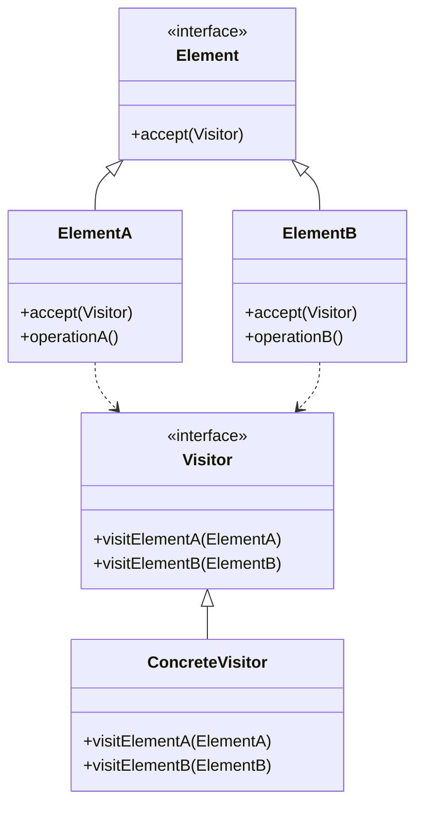

# 🔍 Visitor Pattern

## 🎯 Intent

The Visitor Pattern represents an operation to be performed on elements of an object structure. It lets you define a new operation without changing the classes of the elements on which it operates.

## ❓ Problem It Solves

When you need to:
- Perform operations across a set of objects with different interfaces
- Add new operations to existing object structures without modifying them
- Keep related operations together rather than spreading them across multiple classes
- Separate an algorithm from the objects it operates on

## 💡 Solution

The Visitor Pattern suggests placing the new behavior in a separate class called a "visitor", rather than integrating it into existing classes. The original objects then "accept" the visitor, giving it access to their data, which the visitor uses to perform the desired operation.

## 🏗️ Structure



## ⚙️ Implementation in PHP

```php
// Visitor Interface
interface Visitor {
    public function visitCircle(Circle $circle): void;
    public function visitRectangle(Rectangle $rectangle): void;
    public function visitTriangle(Triangle $triangle): void;
}

// Element Interface
interface Shape {
    public function accept(Visitor $visitor): void;
}

// Concrete Elements
class Circle implements Shape {
    private $radius;
    
    public function __construct(float $radius) {
        $this->radius = $radius;
    }
    
    public function accept(Visitor $visitor): void {
        $visitor->visitCircle($this);
    }
    
    public function getRadius(): float {
        return $this->radius;
    }
}

class Rectangle implements Shape {
    private $width;
    private $height;
    
    public function __construct(float $width, float $height) {
        $this->width = $width;
        $this->height = $height;
    }
    
    public function accept(Visitor $visitor): void {
        $visitor->visitRectangle($this);
    }
    
    public function getWidth(): float {
        return $this->width;
    }
    
    public function getHeight(): float {
        return $this->height;
    }
}

// Concrete Visitors
class AreaCalculator implements Visitor {
    private $totalArea = 0;
    
    public function visitCircle(Circle $circle): void {
        $area = pi() * pow($circle->getRadius(), 2);
        echo "Circle area: " . number_format($area, 2) . "\n";
        $this->totalArea += $area;
    }
    
    public function visitRectangle(Rectangle $rectangle): void {
        $area = $rectangle->getWidth() * $rectangle->getHeight();
        echo "Rectangle area: " . number_format($area, 2) . "\n";
        $this->totalArea += $area;
    }
    
    public function visitTriangle(Triangle $triangle): void {
        // Triangle area calculation
        $points = $triangle->getPoints();
        $area = /* calculation logic */;
        $this->totalArea += $area;
    }
    
    public function getTotalArea(): float {
        return $this->totalArea;
    }
}

class XMLExportVisitor implements Visitor {
    private $xml;
    
    public function __construct() {
        $this->xml = new \SimpleXMLElement('<shapes></shapes>');
    }
    
    public function visitCircle(Circle $circle): void {
        $circleNode = $this->xml->addChild('circle');
        $circleNode->addAttribute('radius', $circle->getRadius());
    }
    
    public function visitRectangle(Rectangle $rectangle): void {
        $rectNode = $this->xml->addChild('rectangle');
        $rectNode->addAttribute('width', $rectangle->getWidth());
        $rectNode->addAttribute('height', $rectangle->getHeight());
    }
    
    public function visitTriangle(Triangle $triangle): void {
        $triNode = $this->xml->addChild('triangle');
        // Add triangle attributes
    }
    
    public function getXML(): string {
        return $this->xml->asXML();
    }
}
```

**Usage example:**
```php
$shapes = [
    new Circle(5),
    new Rectangle(4, 6),
    new Triangle(/* points */)
];

// Calculate area of all shapes
$areaCalculator = new AreaCalculator();
foreach ($shapes as $shape) {
    $shape->accept($areaCalculator);
}
echo "Total area: " . number_format($areaCalculator->getTotalArea(), 2) . "\n";

// Export shapes to XML
$xmlExporter = new XMLExportVisitor();
foreach ($shapes as $shape) {
    $shape->accept($xmlExporter);
}
echo "XML Export:\n" . $xmlExporter->getXML() . "\n";
```

**Output:**
```
Circle area: 78.54
Rectangle area: 24.00
Triangle area: 12.50
Total area: 115.04
XML Export:
<?xml version="1.0"?>
<shapes>
  <circle radius="5"/>
  <rectangle width="4" height="6"/>
  <triangle>...</triangle>
</shapes>
```

## 📄 Example: DOM Visitor

```php
// Element Interface
interface DocumentElement {
    public function accept(DocumentVisitor $visitor): void;
}

// Concrete Elements
class TextElement implements DocumentElement {
    private $text;
    
    public function __construct(string $text) {
        $this->text = $text;
    }
    
    public function accept(DocumentVisitor $visitor): void {
        $visitor->visitText($this);
    }
    
    public function getText(): string {
        return $this->text;
    }
}

class ImageElement implements DocumentElement {
    private $source;
    private $altText;
    
    public function __construct(string $source, string $altText = '') {
        $this->source = $source;
        $this->altText = $altText;
    }
    
    public function accept(DocumentVisitor $visitor): void {
        $visitor->visitImage($this);
    }
    
    public function getSource(): string { return $this->source; }
    public function getAltText(): string { return $this->altText; }
}

// Visitor Interface
interface DocumentVisitor {
    public function visitText(TextElement $text): void;
    public function visitImage(ImageElement $image): void;
}

// Concrete Visitors
class HTMLExportVisitor implements DocumentVisitor {
    private $output = '';
    
    public function visitText(TextElement $text): void {
        $this->output .= htmlspecialchars($text->getText());
    }
    
    public function visitImage(ImageElement $image): void {
        $this->output .= 'getSource()) . '" ';
        if (!empty($image->getAltText())) {
            $this->output .= 'alt="' . htmlspecialchars($image->getAltText()) . '" ';
        }
        $this->output .= '/>';
    }
    
    public function getOutput(): string {
        return $this->output;
    }
}
```

**Output:**
```
<p>Welcome to this <a href="https://example.com">example</a> document.</p>

```

## 🌳 Example: Abstract Syntax Tree Processing

```php
// Element Interface
interface Expression {
    public function accept(ExpressionVisitor $visitor);
}

// Concrete Elements
class NumberExpression implements Expression {
    private $value;
    
    public function __construct(float $value) {
        $this->value = $value;
    }
    
    public function getValue(): float {
        return $this->value;
    }
    
    public function accept(ExpressionVisitor $visitor) {
        return $visitor->visitNumber($this);
    }
}

class AddExpression implements Expression {
    private $left;
    private $right;
    
    public function __construct(Expression $left, Expression $right) {
        $this->left = $left;
        $this->right = $right;
    }
    
    public function getLeft(): Expression { return $this->left; }
    public function getRight(): Expression { return $this->right; }
    
    public function accept(ExpressionVisitor $visitor) {
        return $visitor->visitAddition($this);
    }
}

// Visitor Interface
interface ExpressionVisitor {
    public function visitNumber(NumberExpression $expression);
    public function visitAddition(AddExpression $expression);
}

// Concrete Visitors
class EvaluationVisitor implements ExpressionVisitor {
    public function visitNumber(NumberExpression $expression) {
        return $expression->getValue();
    }
    
    public function visitAddition(AddExpression $expression) {
        return $expression->getLeft()->accept($this) + 
               $expression->getRight()->accept($this);
    }
}

class PrintVisitor implements ExpressionVisitor {
    public function visitNumber(NumberExpression $expression) {
        return (string) $expression->getValue();
    }
    
    public function visitAddition(AddExpression $expression) {
        return '(' . $expression->getLeft()->accept($this) . ' + ' . 
               $expression->getRight()->accept($this) . ')';
    }
}
```

**Example usage:**
```php
// Create an expression: (3 + 4)
$expression = new AddExpression(
    new NumberExpression(3),
    new NumberExpression(4)
);

// Use visitors to evaluate and print
$evaluator = new EvaluationVisitor();
$printer = new PrintVisitor();

echo "Expression: " . $expression->accept($printer) . "\n";
echo "Result: " . $expression->accept($evaluator) . "\n";
```

**Output:**
```
Expression: (3 + 4)
Result: 7
```

## ✨ Benefits

1. **📝 Open/Closed Principle**: Add new operations without modifying element classes
2. **🎯 Single Responsibility**: Operations are grouped in visitors instead of spread across elements
3. **🧮 Accumulating State**: Visitors can maintain state while traversing a structure
4. **🧩 Related Operations**: Related functionality is kept together in one visitor
5. **↔️ Double Dispatch**: Enables operations that depend on both element type and visitor type

## 🕒 When to Use

- When you need to perform operations on all elements of a complex object structure
- When classes in your object structure rarely change, but you often add new operations
- When operations need to access across different classes in the object structure
- When you want to avoid polluting classes with operation-specific code
- When the behavior is not central to the elements, or is auxiliary functionality

## ⚠️ Limitations

1. **🔒 Breaking Encapsulation**: Elements must expose internal state to visitors
2. **🔄 Class Hierarchy Changes**: Adding new elements requires updating all visitors
3. **🔀 Iteration Control**: Standard implementation gives visitors limited control over traversal
4. **🧩 Complexity**: Implementation can be complex for simple structures

## 🔄 Related Patterns

| Pattern | Relationship |
|---------|-------------|
| **Composite** | Visitor is often applied to Composite structures |
| **Iterator** | Can be used with Visitor to traverse a structure |
| **Interpreter** | Visitor can be used to interpret abstract syntax trees |
| **Command** | Visitors can encapsulate operations as commands |

---

## 🔜 Up Next

Learn about the [Interpreter Pattern](./11-interpreter.md), which defines a grammatical representation for a language and provides an interpreter to evaluate sentences in this language.

[Back to Design Patterns](../README.md) | [Previous: Template Method](./09-template-method.md) | [Next: Interpreter](./11-interpreter.md)
