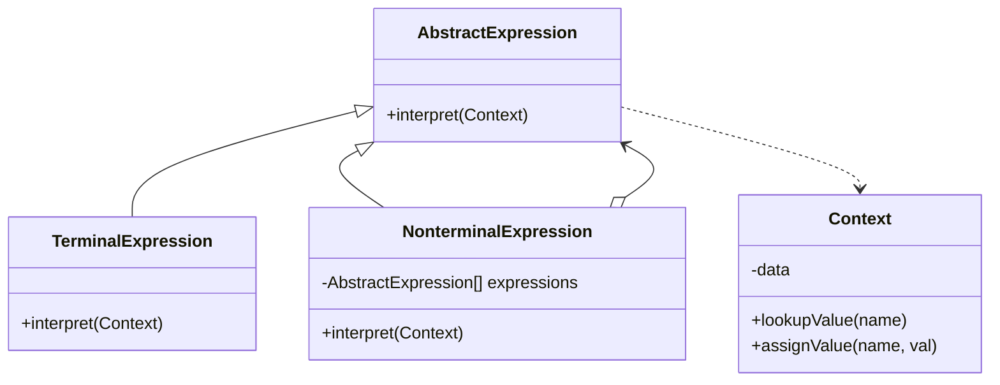

# 🔤 Interpreter Pattern

## 🎯 Intent

The Interpreter Pattern defines a grammatical representation for a language and provides an interpreter to evaluate sentences in this language. It is useful when you have a language to interpret and can represent statements in that language as abstract syntax trees.

## ❓ Problem It Solves

When you need to:
- Interpret sentences in a simple language or notation
- Evaluate expressions in a defined grammar
- Parse structured text or commands
- Build domain-specific languages (DSLs)
- Implement rule engines or validation logic

## 💡 Solution

The Interpreter Pattern suggests:
1. Define a grammar for the language
2. Represent each rule in the grammar as a class
3. Organize these classes into a hierarchy that reflects the syntax of the language
4. Implement an `interpret` operation in each class to evaluate expressions

## 🏗️ Structure



## ⚙️ Implementation in PHP

```php
// Context class that holds variables and their values
class Context {
    private $variables = [];
    
    public function setVariable(string $name, int $value): void {
        $this->variables[$name] = $value;
    }
    
    public function getVariable(string $name): int {
        if (!isset($this->variables[$name])) {
            throw new \Exception("Variable $name not defined");
        }
        return $this->variables[$name];
    }
}

// Abstract expression interface
interface Expression {
    public function interpret(Context $context): int;
}

// Terminal expression for numbers
class NumberExpression implements Expression {
    private $value;
    
    public function __construct(int $value) {
        $this->value = $value;
    }
    
    public function interpret(Context $context): int {
        return $this->value;
    }
}

// Terminal expression for variables
class VariableExpression implements Expression {
    private $name;
    
    public function __construct(string $name) {
        $this->name = $name;
    }
    
    public function interpret(Context $context): int {
        return $context->getVariable($this->name);
    }
}

// Non-terminal expression for addition
class AddExpression implements Expression {
    private $leftExpression;
    private $rightExpression;
    
    public function __construct(Expression $left, Expression $right) {
        $this->leftExpression = $left;
        $this->rightExpression = $right;
    }
    
    public function interpret(Context $context): int {
        return $this->leftExpression->interpret($context) + 
               $this->rightExpression->interpret($context);
    }
}

// Non-terminal expression for subtraction
class SubtractExpression implements Expression {
    private $leftExpression;
    private $rightExpression;
    
    public function __construct(Expression $left, Expression $right) {
        $this->leftExpression = $left;
        $this->rightExpression = $right;
    }
    
    public function interpret(Context $context): int {
        return $this->leftExpression->interpret($context) - 
               $this->rightExpression->interpret($context);
    }
}

// Non-terminal expression for multiplication
class MultiplyExpression implements Expression {
    private $leftExpression;
    private $rightExpression;
    
    public function __construct(Expression $left, Expression $right) {
        $this->leftExpression = $left;
        $this->rightExpression = $right;
    }
    
    public function interpret(Context $context): int {
        return $this->leftExpression->interpret($context) * 
               $this->rightExpression->interpret($context);
    }
}
```

**Client code:**
```php
// Create a context and set variables
$context = new Context();
$context->setVariable('x', 10);
$context->setVariable('y', 5);

// Create expression for: (x + y) * 2
$expression = new MultiplyExpression(
    new AddExpression(
        new VariableExpression('x'),
        new VariableExpression('y')
    ),
    new NumberExpression(2)
);

// Evaluate the expression
$result = $expression->interpret($context);
echo "(x + y) * 2 = $result\n";  // Output: (x + y) * 2 = 30

// Create expression for: x - (y + 2)
$expression = new SubtractExpression(
    new VariableExpression('x'),
    new AddExpression(
        new VariableExpression('y'),
        new NumberExpression(2)
    )
);

// Evaluate the expression
$result = $expression->interpret($context);
echo "x - (y + 2) = $result\n";  // Output: x - (y + 2) = 3
```

**Output:**
```
(x + y) * 2 = 30
x - (y + 2) = 3
```

## 🧩 Example: Boolean Expression Interpreter

```php
// Context for boolean expressions
class BooleanContext {
    private $variables = [];
    
    public function setVariable(string $name, bool $value): void {
        $this->variables[$name] = $value;
    }
    
    public function getVariable(string $name): bool {
        if (!isset($this->variables[$name])) {
            throw new \Exception("Variable $name not defined");
        }
        return $this->variables[$name];
    }
}

// Abstract boolean expression
interface BooleanExpression {
    public function interpret(BooleanContext $context): bool;
    public function toString(): string;
}

// Terminal expression for boolean variables
class VariableBooleanExpression implements BooleanExpression {
    private $name;
    
    public function __construct(string $name) {
        $this->name = $name;
    }
    
    public function interpret(BooleanContext $context): bool {
        return $context->getVariable($this->name);
    }
    
    public function toString(): string {
        return $this->name;
    }
}

// Terminal expression for boolean constants
class ConstantBooleanExpression implements BooleanExpression {
    private $value;
    
    public function __construct(bool $value) {
        $this->value = $value;
    }
    
    public function interpret(BooleanContext $context): bool {
        return $this->value;
    }
    
    public function toString(): string {
        return $this->value ? 'true' : 'false';
    }
}

// Non-terminal expression for AND operation
class AndExpression implements BooleanExpression {
    private $left;
    private $right;
    
    public function __construct(BooleanExpression $left, BooleanExpression $right) {
        $this->left = $left;
        $this->right = $right;
    }
    
    public function interpret(BooleanContext $context): bool {
        return $this->left->interpret($context) && $this->right->interpret($context);
    }
    
    public function toString(): string {
        return "(" . $this->left->toString() . " AND " . $this->right->toString() . ")";
    }
}

// Non-terminal expression for OR operation
class OrExpression implements BooleanExpression {
    private $left;
    private $right;
    
    public function __construct(BooleanExpression $left, BooleanExpression $right) {
        $this->left = $left;
        $this->right = $right;
    }
    
    public function interpret(BooleanContext $context): bool {
        return $this->left->interpret($context) || $this->right->interpret($context);
    }
    
    public function toString(): string {
        return "(" . $this->left->toString() . " OR " . $this->right->toString() . ")";
    }
}

// Non-terminal expression for NOT operation
class NotExpression implements BooleanExpression {
    private $expression;
    
    public function __construct(BooleanExpression $expression) {
        $this->expression = $expression;
    }
    
    public function interpret(BooleanContext $context): bool {
        return !$this->expression->interpret($context);
    }
    
    public function toString(): string {
        return "NOT " . $this->expression->toString();
    }
}
```

**Client code:**
```php
// Create a context and set variables
$context = new BooleanContext();
$context->setVariable('A', true);
$context->setVariable('B', false);
$context->setVariable('C', true);

// Create expression: (A AND (NOT B)) OR C
$expression = new OrExpression(
    new AndExpression(
        new VariableBooleanExpression('A'),
        new NotExpression(new VariableBooleanExpression('B'))
    ),
    new VariableBooleanExpression('C')
);

echo "Expression: " . $expression->toString() . "\n";
echo "Result: " . ($expression->interpret($context) ? "true" : "false") . "\n";
// Output: Result: true

// Change variables and evaluate again
$context->setVariable('C', false);
echo "After changing C to false:\n";
echo "Result: " . ($expression->interpret($context) ? "true" : "false") . "\n";
// Output: Result: true (because A AND (NOT B) is still true)
```

**Output:**
```
Expression: ((A AND NOT B) OR C)
Result: true
After changing C to false:
Result: true
```

## 🔍 Example: SQL-like Query Interpreter

```php
// Context for storing data records
class QueryContext {
    private $records = [];
    
    public function addRecord(array $record): void {
        $this->records[] = $record;
    }
    
    public function getRecords(): array {
        return $this->records;
    }
}

// Abstract expression for query conditions
interface QueryExpression {
    public function interpret(array $record): bool;
    public function toString(): string;
}

// Terminal expression for field equality
class EqualsExpression implements QueryExpression {
    private $field;
    private $value;
    
    public function __construct(string $field, $value) {
        $this->field = $field;
        $this->value = $value;
    }
    
    public function interpret(array $record): bool {
        return isset($record[$this->field]) && $record[$this->field] === $this->value;
    }
    
    public function toString(): string {
        $value = is_string($this->value) ? "'{$this->value}'" : $this->value;
        return "{$this->field} = {$value}";
    }
}

// Terminal expression for greater than comparison
class GreaterThanExpression implements QueryExpression {
    private $field;
    private $value;
    
    public function __construct(string $field, $value) {
        $this->field = $field;
        $this->value = $value;
    }
    
    public function interpret(array $record): bool {
        return isset($record[$this->field]) && $record[$this->field] > $this->value;
    }
    
    public function toString(): string {
        return "{$this->field} > {$this->value}";
    }
}

// Non-terminal expression for AND condition
class AndCondition implements QueryExpression {
    private $left;
    private $right;
    
    public function __construct(QueryExpression $left, QueryExpression $right) {
        $this->left = $left;
        $this->right = $right;
    }
    
    public function interpret(array $record): bool {
        return $this->left->interpret($record) && $this->right->interpret($record);
    }
    
    public function toString(): string {
        return "(" . $this->left->toString() . " AND " . $this->right->toString() . ")";
    }
}

// Query executor class
class QueryExecutor {
    private $context;
    private $whereExpression;
    
    public function __construct(QueryContext $context) {
        $this->context = $context;
    }
    
    public function where(QueryExpression $expression): self {
        $this->whereExpression = $expression;
        return $this;
    }
    
    public function execute(): array {
        $result = [];
        
        foreach ($this->context->getRecords() as $record) {
            if ($this->whereExpression->interpret($record)) {
                $result[] = $record;
            }
        }
        
        return $result;
    }
    
    public function getQuery(): string {
        return "SELECT * WHERE " . $this->whereExpression->toString();
    }
}
```

**Example usage:**
```php
$context = new QueryContext();

// Add sample data
$context->addRecord(['id' => 1, 'name' => 'John', 'age' => 30, 'department' => 'IT']);
$context->addRecord(['id' => 2, 'name' => 'Jane', 'age' => 25, 'department' => 'HR']);
$context->addRecord(['id' => 3, 'name' => 'Bob', 'age' => 40, 'department' => 'IT']);
$context->addRecord(['id' => 4, 'name' => 'Alice', 'age' => 35, 'department' => 'Finance']);

// Create query: department = 'IT' AND age > 30
$query = new QueryExecutor($context);
$query->where(
    new AndCondition(
        new EqualsExpression('department', 'IT'),
        new GreaterThanExpression('age', 30)
    )
);

echo "Query: " . $query->getQuery() . "\n";
$results = $query->execute();

echo "Results:\n";
foreach ($results as $record) {
    echo "ID: {$record['id']}, Name: {$record['name']}, Department: {$record['department']}\n";
}
```

**Output:**
```
Query: SELECT * WHERE (department = 'IT' AND age > 30)
Results:
ID: 3, Name: Bob, Department: IT
```

## 🌐 Real-world PHP Examples

- **Expression languages** in template engines like Twig
- **Query builders** in ORMs like Doctrine
- **Rule engines** for business rules validation
- **Configuration processors** that interpret structured data
- **Pattern matchers** in regular expressions

## ✨ Benefits

1. **🧩 Modularity**: Each grammar rule is encapsulated in its own class
2. **📝 Expressiveness**: Simple expressions combine to create complex ones
3. **📚 Well-defined language**: Makes it easy to define and understand a grammar
4. **🔄 Extensibility**: New expressions can be added without changing existing ones
5. **🔄 Single Responsibility**: Each expression class has one specific purpose

## 🕒 When to Use

- When you need to interpret a simple language or grammar
- When a language can be represented as an abstract syntax tree
- When language expressions need to be evaluated frequently
- For implementing simple domain-specific languages
- When the grammar has clearly defined rules and is relatively stable

## ⚠️ Limitations

1. **🔄 Complex grammars**: Becomes unwieldy for complex languages
2. **📉 Performance**: Can be inefficient for large expressions
3. **🔄 Grammar changes**: Changes to the grammar require significant code changes
4. **📚 Class explosion**: Can create a large number of classes for complex languages

## 🔄 Related Patterns

| Pattern | Relationship |
|---------|-------------|
| **Composite** | Interpreter uses a Composite structure for expressions |
| **Visitor** | Can be used to implement operations on expressions |
| **Flyweight** | Can optimize memory usage for terminal expressions |
| **Iterator** | Often used to traverse the abstract syntax tree |

---

## 🎉 Congratulations!

You've completed the Behavioral Design Patterns section! You now have a solid understanding of how to manage algorithms, object relationships, and responsibilities in your PHP applications.

[Back to Design Patterns](../README.md) | [Previous: Visitor](./10-visitor.md)
