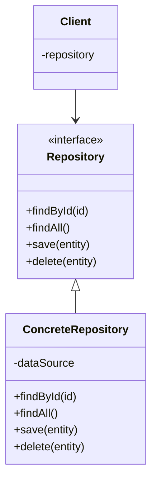

# 🗄️ Repository Pattern

## Definition

The Repository Pattern mediates between the domain model and data mapping layers, acting like an in-memory collection of domain objects. It provides a more object-oriented view of the persistence layer, encapsulating the set of objects stored in the database and the operations performed over them.

## Purpose

- **🧩 Decouple business logic from data access logic**: The domain model doesn't need to know how data is retrieved or stored
- **📋 Provide a consistent API for data access**: Standardize how data is accessed across the application
- **🧪 Improve testability**: Allow for easy mocking of data access in unit tests
- **🔍 Centralize data access logic**: Keep all database queries in one place

## Structure



## Basic Implementation

```php
<?php
// Domain entity
class User {
    private $id;
    private $name;
    private $email;
    
    public function __construct($id, $name, $email) {
        $this->id = $id;
        $this->name = $name;
        $this->email = $email;
    }
    
    public function getId() {
        return $this->id;
    }
    
    public function getName() {
        return $this->name;
    }
    
    public function getEmail() {
        return $this->email;
    }
    
    public function setName($name) {
        $this->name = $name;
    }
    
    public function setEmail($email) {
        $this->email = $email;
    }
}

// Repository interface
interface UserRepositoryInterface {
    public function findById($id): ?User;
    public function findAll(): array;
    public function save(User $user): void;
    public function delete(User $user): void;
}

// Concrete repository implementation using PDO
class MySqlUserRepository implements UserRepositoryInterface {
    private $pdo;
    
    public function __construct(PDO $pdo) {
        $this->pdo = $pdo;
    }
    
    public function findById($id): ?User {
        $statement = $this->pdo->prepare('SELECT * FROM users WHERE id = :id');
        $statement->execute(['id' => $id]);
        $userData = $statement->fetch(PDO::FETCH_ASSOC);
        
        if (!$userData) {
            return null;
        }
        
        return new User(
            $userData['id'],
            $userData['name'],
            $userData['email']
        );
    }
    
    public function findAll(): array {
        $statement = $this->pdo->query('SELECT * FROM users');
        $usersData = $statement->fetchAll(PDO::FETCH_ASSOC);
        $users = [];
        
        foreach ($usersData as $userData) {
            $users[] = new User(
                $userData['id'],
                $userData['name'],
                $userData['email']
            );
        }
        
        return $users;
    }
    
    public function save(User $user): void {
        if ($user->getId()) {
            // Update existing user
            $statement = $this->pdo->prepare(
                'UPDATE users SET name = :name, email = :email WHERE id = :id'
            );
            $statement->execute([
                'id' => $user->getId(),
                'name' => $user->getName(),
                'email' => $user->getEmail()
            ]);
        } else {
            // Insert new user
            $statement = $this->pdo->prepare(
                'INSERT INTO users (name, email) VALUES (:name, :email)'
            );
            $statement->execute([
                'name' => $user->getName(),
                'email' => $user->getEmail()
            ]);
            
            // Set the auto-generated ID back to the user object
            // This assumes the User class has a setId method
            $user->setId($this->pdo->lastInsertId());
        }
    }
    
    public function delete(User $user): void {
        $statement = $this->pdo->prepare('DELETE FROM users WHERE id = :id');
        $statement->execute(['id' => $user->getId()]);
    }
}
```

## Using Repositories in Services

```php
<?php
class UserService {
    private $userRepository;
    
    public function __construct(UserRepositoryInterface $userRepository) {
        $this->userRepository = $userRepository;
    }
    
    public function registerUser($name, $email): User {
        // Check if user with this email already exists
        $existingUser = $this->userRepository->findByEmail($email);
        
        if ($existingUser) {
            throw new DomainException("User with email {$email} already exists");
        }
        
        // Create new user
        $user = new User(null, $name, $email);
        
        // Save to database
        $this->userRepository->save($user);
        
        return $user;
    }
    
    public function getAllUsers(): array {
        return $this->userRepository->findAll();
    }
    
    public function getUserById($id): ?User {
        return $this->userRepository->findById($id);
    }
    
    public function updateUserEmail($userId, $newEmail): User {
        // Find user
        $user = $this->userRepository->findById($userId);
        
        if (!$user) {
            throw new DomainException("User not found");
        }
        
        // Check if email is already used
        $existingUser = $this->userRepository->findByEmail($newEmail);
        if ($existingUser && $existingUser->getId() !== $userId) {
            throw new DomainException("Email {$newEmail} is already in use");
        }
        
        // Update email
        $user->setEmail($newEmail);
        $this->userRepository->save($user);
        
        return $user;
    }
}
```

## Enhanced Repository with Query Specifications

For more complex querying needs, you can implement the Specification pattern with repositories:

```php
<?php
interface Specification {
    public function toSql(): string;
    public function getParameters(): array;
}

class EmailSpecification implements Specification {
    private $email;
    
    public function __construct(string $email) {
        $this->email = $email;
    }
    
    public function toSql(): string {
        return 'email = :email';
    }
    
    public function getParameters(): array {
        return ['email' => $this->email];
    }
}

class NameContainsSpecification implements Specification {
    private $namePart;
    
    public function __construct(string $namePart) {
        $this->namePart = $namePart;
    }
    
    public function toSql(): string {
        return 'name LIKE :name';
    }
    
    public function getParameters(): array {
        return ['name' => '%' . $this->namePart . '%'];
    }
}

// Enhanced repository interface
interface AdvancedUserRepositoryInterface extends UserRepositoryInterface {
    public function matching(Specification $specification): array;
}

class MySqlAdvancedUserRepository extends MySqlUserRepository implements AdvancedUserRepositoryInterface {
    public function matching(Specification $specification): array {
        $sql = 'SELECT * FROM users WHERE ' . $specification->toSql();
        
        $statement = $this->pdo->prepare($sql);
        $statement->execute($specification->getParameters());
        
        $usersData = $statement->fetchAll(PDO::FETCH_ASSOC);
        $users = [];
        
        foreach ($usersData as $userData) {
            $users[] = new User(
                $userData['id'],
                $userData['name'],
                $userData['email']
            );
        }
        
        return $users;
    }
    
    public function findByEmail($email): ?User {
        $users = $this->matching(new EmailSpecification($email));
        return !empty($users) ? $users[0] : null;
    }
}

// Usage
$repository = new MySqlAdvancedUserRepository($pdo);
$usersNamedJohn = $repository->matching(new NameContainsSpecification('John'));
```

## Repository with Caching

Repositories can be enhanced with caching to improve performance:

```php
<?php
class CachedUserRepository implements UserRepositoryInterface {
    private $repository;
    private $cache;
    
    public function __construct(UserRepositoryInterface $repository, CacheInterface $cache) {
        $this->repository = $repository;
        $this->cache = $cache;
    }
    
    public function findById($id): ?User {
        $cacheKey = "user_" . $id;
        
        // Check if user exists in cache
        if ($this->cache->has($cacheKey)) {
            return $this->cache->get($cacheKey);
        }
        
        // Get from database
        $user = $this->repository->findById($id);
        
        // Store in cache if found
        if ($user) {
            $this->cache->set($cacheKey, $user, 3600); // Cache for 1 hour
        }
        
        return $user;
    }
    
    public function findAll(): array {
        $cacheKey = "users_all";
        
        if ($this->cache->has($cacheKey)) {
            return $this->cache->get($cacheKey);
        }
        
        $users = $this->repository->findAll();
        $this->cache->set($cacheKey, $users, 3600);
        
        return $users;
    }
    
    public function save(User $user): void {
        $this->repository->save($user);
        
        // Invalidate cache entries
        $this->cache->delete("user_" . $user->getId());
        $this->cache->delete("users_all");
    }
    
    public function delete(User $user): void {
        $this->repository->delete($user);
        
        // Invalidate cache entries
        $this->cache->delete("user_" . $user->getId());
        $this->cache->delete("users_all");
    }
}
```

## Benefits

✅ **Separation of Concerns**: Isolates data access logic from business logic  
✅ **Abstraction of Data Storage**: Domain code doesn't need to know how data is persisted  
✅ **Improved Testability**: Domain objects can be tested without database dependencies  
✅ **Centralized Data Access Logic**: Prevents duplication of queries  
✅ **Better Organization**: Makes code more maintainable by grouping data access methods  
✅ **Consistent API**: Provides consistent methods for accessing domain objects

## Common Variations

1. **🔍 Generic Repository**: A base repository that can work with any entity
2. **📚 Read-Only Repository**: A repository that only provides query methods
3. **🧩 Command Query Responsibility Segregation (CQRS)**: Separate repositories for reads and writes
4. **📁 Collection-Based Repository**: Repository methods return collection objects instead of arrays
5. **⏳ Lazy-Loading Repository**: Results are loaded on demand as they are accessed

## When to Use Repository Pattern

- 🏛️ Complex domain models with rich behavior
- 🧪 Projects where testability is important
- 🏗️ When implementing Domain-Driven Design
- 🔄 When you want to evolve your data access strategy independently
- 👥 On larger projects with multiple developers

## Up Next

Now that you understand the Repository Pattern, learn about the [Unit of Work Pattern](./02-unit-of-work.md), which complements repositories by tracking changes to domain objects.

[Back to Enterprise Patterns](./README.md) | [Next: Unit of Work](./02-unit-of-work.md)
