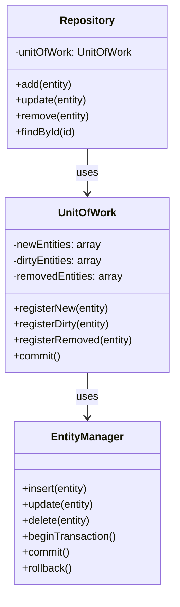

# 📦 Unit of Work Pattern

## Definition

The Unit of Work pattern tracks changes to objects during a business transaction and coordinates writing out these changes when the transaction completes. It ensures that all related operations either succeed together or fail together, maintaining data consistency.

## Purpose

- **🔄 Track entity changes**: Keep track of all created, updated, and deleted entities
- **🛑 Prevent partial updates**: Ensure that either all changes are saved or none
- **⚡ Optimize database operations**: Batch multiple database operations into a single transaction
- **🔐 Maintain consistency**: Ensure the database remains in a consistent state

## Structure



## Basic Implementation

```php
<?php
class UnitOfWork {
    private $newEntities = [];
    private $dirtyEntities = [];
    private $removedEntities = [];
    private $entityManager;
    
    public function __construct(EntityManager $entityManager) {
        $this->entityManager = $entityManager;
    }
    
    public function registerNew($entity): void {
        $this->newEntities[spl_object_hash($entity)] = $entity;
    }
    
    public function registerDirty($entity): void {
        $this->dirtyEntities[spl_object_hash($entity)] = $entity;
    }
    
    public function registerRemoved($entity): void {
        $this->removedEntities[spl_object_hash($entity)] = $entity;
    }
    
    public function commit(): void {
        $this->entityManager->beginTransaction();
        
        try {
            // Insert new entities
            foreach ($this->newEntities as $entity) {
                $this->entityManager->insert($entity);
            }
            
            // Update dirty entities
            foreach ($this->dirtyEntities as $entity) {
                $this->entityManager->update($entity);
            }
            
            // Delete removed entities
            foreach ($this->removedEntities as $entity) {
                $this->entityManager->delete($entity);
            }
            
            $this->entityManager->commit();
            
            // Clear tracked entities
            $this->newEntities = [];
            $this->dirtyEntities = [];
            $this->removedEntities = [];
            
        } catch (Exception $e) {
            $this->entityManager->rollback();
            throw $e;
        }
    }
}

// Simple entity manager
class EntityManager {
    private $pdo;
    
    public function __construct(PDO $pdo) {
        $this->pdo = $pdo;
    }
    
    public function beginTransaction(): void {
        $this->pdo->beginTransaction();
    }
    
    public function commit(): void {
        $this->pdo->commit();
    }
    
    public function rollback(): void {
        $this->pdo->rollBack();
    }
    
    public function insert($entity): void {
        // Implementation depends on entity type
        // This is a simplified example
        if ($entity instanceof User) {
            $stmt = $this->pdo->prepare("INSERT INTO users (name, email) VALUES (?, ?)");
            $stmt->execute([$entity->getName(), $entity->getEmail()]);
            $entity->setId($this->pdo->lastInsertId());
        }
    }
    
    public function update($entity): void {
        // Implementation depends on entity type
        if ($entity instanceof User) {
            $stmt = $this->pdo->prepare("UPDATE users SET name = ?, email = ? WHERE id = ?");
            $stmt->execute([$entity->getName(), $entity->getEmail(), $entity->getId()]);
        }
    }
    
    public function delete($entity): void {
        // Implementation depends on entity type
        if ($entity instanceof User) {
            $stmt = $this->pdo->prepare("DELETE FROM users WHERE id = ?");
            $stmt->execute([$entity->getId()]);
        }
    }
}
```

## Integrating with Repository Pattern

The Unit of Work pattern often works together with the Repository pattern:

```php
<?php
class UserRepository {
    private $unitOfWork;
    private $pdo;
    
    public function __construct(PDO $pdo, UnitOfWork $unitOfWork) {
        $this->pdo = $pdo;
        $this->unitOfWork = $unitOfWork;
    }
    
    public function findById($id): ?User {
        $stmt = $this->pdo->prepare("SELECT * FROM users WHERE id = ?");
        $stmt->execute([$id]);
        $userData = $stmt->fetch(PDO::FETCH_ASSOC);
        
        if (!$userData) {
            return null;
        }
        
        $user = new User($userData['id'], $userData['name'], $userData['email']);
        return $user;
    }
    
    public function add(User $user): void {
        $this->unitOfWork->registerNew($user);
    }
    
    public function update(User $user): void {
        $this->unitOfWork->registerDirty($user);
    }
    
    public function remove(User $user): void {
        $this->unitOfWork->registerRemoved($user);
    }
}
```

## Using Unit of Work in Service Layer

```php
<?php
class UserService {
    private $userRepository;
    private $unitOfWork;
    
    public function __construct(UserRepository $userRepository, UnitOfWork $unitOfWork) {
        $this->userRepository = $userRepository;
        $this->unitOfWork = $unitOfWork;
    }
    
    public function createUser($name, $email): User {
        $user = new User(null, $name, $email);
        $this->userRepository->add($user);
        
        // Changes are tracked but not saved yet
        
        return $user;
    }
    
    public function updateUserEmail($userId, $newEmail): void {
        $user = $this->userRepository->findById($userId);
        
        if (!$user) {
            throw new Exception("User not found");
        }
        
        $user->setEmail($newEmail);
        $this->userRepository->update($user);
        
        // Changes are tracked but not saved yet
    }
    
    public function deleteUser($userId): void {
        $user = $this->userRepository->findById($userId);
        
        if (!$user) {
            throw new Exception("User not found");
        }
        
        $this->userRepository->remove($user);
        
        // Changes are tracked but not saved yet
    }
    
    public function processUserChanges(): void {
        // Save all changes at once
        $this->unitOfWork->commit();
    }
    
    public function complexOperation(): void {
        // Multiple operations in a single transaction
        $user1 = $this->createUser("John", "john@example.com");
        $this->updateUserEmail(2, "jane.new@example.com");
        $this->deleteUser(3);
        
        // All changes are saved in a single transaction
        $this->unitOfWork->commit();
    }
}
```

## Identity Map Extension

A common extension to Unit of Work is the Identity Map pattern, which ensures that each object gets loaded only once:

```php
<?php
class IdentityMap {
    private $entities = [];
    
    public function get(string $class, $id) {
        $key = $this->getEntityKey($class, $id);
        return $this->entities[$key] ?? null;
    }
    
    public function set(string $class, $id, $entity): void {
        $key = $this->getEntityKey($class, $id);
        $this->entities[$key] = $entity;
    }
    
    public function remove(string $class, $id): void {
        $key = $this->getEntityKey($class, $id);
        unset($this->entities[$key]);
    }
    
    private function getEntityKey(string $class, $id): string {
        return $class . ':' . $id;
    }
}

// Enhanced repository using identity map
class EnhancedUserRepository extends UserRepository {
    private $identityMap;
    
    public function __construct(PDO $pdo, UnitOfWork $unitOfWork, IdentityMap $identityMap) {
        parent::__construct($pdo, $unitOfWork);
        $this->identityMap = $identityMap;
    }
    
    public function findById($id): ?User {
        // Check if the user is already in the identity map
        $user = $this->identityMap->get(User::class, $id);
        
        if ($user) {
            return $user;
        }
        
        // Not found in identity map, fetch from database
        $user = parent::findById($id);
        
        if ($user) {
            // Add to identity map
            $this->identityMap->set(User::class, $id, $user);
        }
        
        return $user;
    }
    
    public function remove(User $user): void {
        parent::remove($user);
        $this->identityMap->remove(User::class, $user->getId());
    }
}
```

## Change Tracking Strategies

There are several approaches to track changes in entities:

### 1. Manual tracking (as shown above)

Developers must explicitly register changes.

### 2. Property proxy tracking

```php
<?php
class User {
    private $id;
    private $name;
    private $email;
    private $unitOfWork;
    
    public function __construct($id, $name, $email, UnitOfWork $unitOfWork = null) {
        $this->id = $id;
        $this->name = $name;
        $this->email = $email;
        $this->unitOfWork = $unitOfWork;
    }
    
    public function getId() {
        return $this->id;
    }
    
    public function getName() {
        return $this->name;
    }
    
    public function setName($name) {
        $this->name = $name;
        $this->markDirty();
    }
    
    public function getEmail() {
        return $this->email;
    }
    
    public function setEmail($email) {
        $this->email = $email;
        $this->markDirty();
    }
    
    private function markDirty() {
        if ($this->unitOfWork && $this->id) {
            $this->unitOfWork->registerDirty($this);
        }
    }
}
```

### 3. Snapshot strategy

```php
<?php
class SnapshotUnitOfWork {
    private $snapshots = [];
    private $newEntities = [];
    private $removedEntities = [];
    private $entityManager;
    
    public function __construct(EntityManager $entityManager) {
        $this->entityManager = $entityManager;
    }
    
    public function registerNew($entity): void {
        $this->newEntities[spl_object_hash($entity)] = $entity;
    }
    
    public function registerRemoved($entity): void {
        $this->removedEntities[spl_object_hash($entity)] = $entity;
        $hash = spl_object_hash($entity);
        if (isset($this->snapshots[$hash])) {
            unset($this->snapshots[$hash]);
        }
    }
    
    public function takeSnapshot($entity): void {
        $hash = spl_object_hash($entity);
        $this->snapshots[$hash] = $this->getEntityData($entity);
    }
    
    public function commit(): void {
        $this->entityManager->beginTransaction();
        
        try {
            // Handle new entities
            foreach ($this->newEntities as $entity) {
                $this->entityManager->insert($entity);
                $this->takeSnapshot($entity);
            }
            
            // Find and update dirty entities by comparing with snapshots
            foreach ($this->snapshots as $hash => $originalData) {
                $entity = $this->getEntityByHash($hash);
                if ($entity && $this->isDirty($entity, $originalData)) {
                    $this->entityManager->update($entity);
                    $this->takeSnapshot($entity);
                }
            }
            
            // Handle removed entities
            foreach ($this->removedEntities as $entity) {
                $this->entityManager->delete($entity);
            }
            
            $this->entityManager->commit();
            
            // Clean up
            $this->newEntities = [];
            $this->removedEntities = [];
            
        } catch (Exception $e) {
            $this->entityManager->rollback();
            throw $e;
        }
    }
    
    private function getEntityData($entity): array {
        // Extract entity data (simplified example)
        if ($entity instanceof User) {
            return [
                'name' => $entity->getName(),
                'email' => $entity->getEmail()
            ];
        }
        return [];
    }
    
    private function isDirty($entity, array $originalData): bool {
        $currentData = $this->getEntityData($entity);
        return $currentData != $originalData;
    }
    
    private function getEntityByHash($hash) {
        // In a real implementation, you would need a way to get the entity from the hash
        // This is simplified for the example
        foreach ($this->snapshots as $entityHash => $data) {
            if ($entityHash === $hash) {
                return $entity; // This would be the actual entity in a real implementation
            }
        }
        return null;
    }
}
```

## Handling Relationships

One of the more complex aspects of the Unit of Work pattern is handling relationships between entities:

```php
<?php
class OrderService {
    private $orderRepository;
    private $orderItemRepository;
    private $unitOfWork;
    
    public function __construct(
        OrderRepository $orderRepository, 
        OrderItemRepository $orderItemRepository,
        UnitOfWork $unitOfWork
    ) {
        $this->orderRepository = $orderRepository;
        $this->orderItemRepository = $orderItemRepository;
        $this->unitOfWork = $unitOfWork;
    }
    
    public function createOrder(User $user, array $items): Order {
        // Start a business transaction
        $order = new Order($user);
        $this->orderRepository->add($order);
        
        // Create order items
        foreach ($items as $item) {
            $orderItem = new OrderItem($order, $item['product'], $item['quantity']);
            $this->orderItemRepository->add($orderItem);
            $order->addItem($orderItem);
        }
        
        // All changes are committed as a single transaction
        $this->unitOfWork->commit();
        
        return $order;
    }
}
```

## Integration with ORM Libraries

Most modern ORM libraries already implement the Unit of Work pattern:

### Doctrine ORM Example

```php
<?php
// Using Doctrine's EntityManager which implements Unit of Work
$entityManager = $container->get(EntityManager::class);

// Create a new entity
$user = new User(null, "John", "john@example.com");
$entityManager->persist($user);

// Update an entity
$product = $entityManager->find(Product::class, 1);
$product->setPrice($product->getPrice() * 1.1); // 10% price increase

// Remove an entity
$oldOrder = $entityManager->find(Order::class, 123);
$entityManager->remove($oldOrder);

// Commit all changes in a single transaction
$entityManager->flush();
```

### Laravel Eloquent Example

```php
<?php
// Laravel includes Database transactions for implementing Unit of Work
DB::transaction(function () {
    $user = new User();
    $user->name = "John";
    $user->email = "john@example.com";
    $user->save();
    
    $order = new Order();
    $order->user_id = $user->id;
    $order->total = 99.95;
    $order->save();
    
    OrderItem::create([
        'order_id' => $order->id,
        'product_id' => 1,
        'quantity' => 2
    ]);
});
```

## Benefits of Unit of Work

✅ **Transaction integrity**: Ensures that a group of operations succeed or fail as a unit  
✅ **Performance optimization**: Reduces the number of database operations by batching them  
✅ **Change tracking**: Automatically detects which objects have been changed  
✅ **Cache coherency**: Works well with identity map to ensure that objects are loaded only once  
✅ **Simplified code**: Centralizes the transaction and persistence logic

## Considerations and Tradeoffs

⚠️ **Complexity**: Adds complexity to the application architecture  
⚠️ **Memory usage**: Tracking changes can increase memory usage for large object graphs  
⚠️ **Learning curve**: May be challenging to implement correctly  
⚠️ **Performance overhead**: Tracking changes and comparing states has a cost  
⚠️ **Framework dependence**: May create tight coupling to a specific ORM or framework

## When to Use Unit of Work

- 🔄 **Complex business transactions**: When a single business operation modifies multiple entities
- 🔒 **Data integrity requirements**: When partial updates would leave data in an inconsistent state
- ⚡ **Performance optimization**: When you want to batch database operations for better performance
- 🔄 **Optimistic concurrency**: When you need to detect concurrent modifications to the same data
- 🏛️ **Domain-driven design**: When implementing a rich domain model

## Up Next

Now that you understand the Unit of Work pattern, learn about the [Service Layer](./03-service-layer.md) which organizes business logic and coordinates the work of the domain model and infrastructure.

[Back to Enterprise Patterns](./README.md) | [Previous: Repository Pattern](./01-repository-pattern.md) | [Next: Service Layer](./03-service-layer.md)
