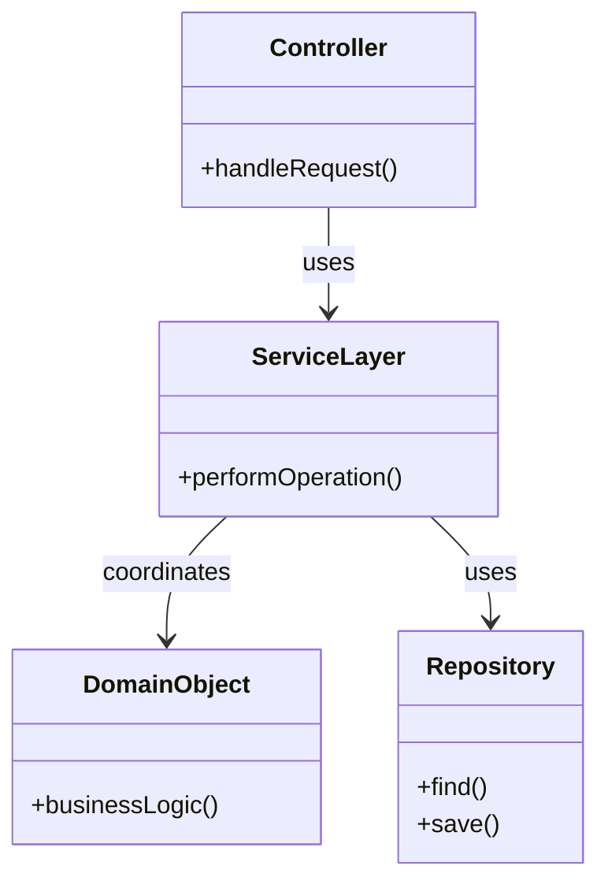

# 🛠️ Service Layer Pattern

## Definition

The Service Layer pattern defines an application's boundary with a layer of services that establishes a set of available operations and coordinates the application's response in each operation.

## Purpose

- **🧩 Separate business logic** from controllers and domain objects
- **🔄 Define application boundaries** through a clear set of operations
- **🔗 Coordinate domain objects** to perform specific tasks
- **🔒 Manage transactions** and ensure business rule consistency
- **📃 Provide a clear API** for client code

## Structure



## Basic Implementation

```php
<?php
// A simple service layer implementation
class UserService {
    private $userRepository;
    private $emailService;
    
    public function __construct(
        UserRepository $userRepository,
        EmailService $emailService
    ) {
        $this->userRepository = $userRepository;
        $this->emailService = $emailService;
    }
    
    /**
     * Register a new user
     */
    public function registerUser(string $name, string $email, string $password): User {
        // Validate input
        if (empty($name) || empty($email) || empty($password)) {
            throw new InvalidArgumentException("Required fields missing");
        }
        
        if (!filter_var($email, FILTER_VALIDATE_EMAIL)) {
            throw new InvalidArgumentException("Invalid email format");
        }
        
        // Check if user already exists
        if ($this->userRepository->findByEmail($email)) {
            throw new DomainException("Email already registered");
        }
        
        // Create user object
        $user = new User();
        $user->setName($name);
        $user->setEmail($email);
        $user->setPassword(password_hash($password, PASSWORD_DEFAULT));
        $user->setStatus('pending');
        $user->setCreatedAt(new DateTime());
        
        // Save user
        $this->userRepository->save($user);
        
        // Send welcome email
        $this->emailService->sendWelcomeEmail($user);
        
        return $user;
    }
    
    /**
     * User login
     */
    public function loginUser(string $email, string $password): ?User {
        $user = $this->userRepository->findByEmail($email);
        
        if (!$user || !password_verify($password, $user->getPassword())) {
            return null;
        }
        
        // Update last login
        $user->setLastLogin(new DateTime());
        $this->userRepository->save($user);
        
        return $user;
    }
}
```

## Service Layer in MVC Architecture

```php
<?php
class UserController {
    private $userService;
    
    public function __construct(UserService $userService) {
        $this->userService = $userService;
    }
    
    public function registerAction(): array {
        $name = $_POST['name'] ?? '';
        $email = $_POST['email'] ?? '';
        $password = $_POST['password'] ?? '';
        
        try {
            $user = $this->userService->registerUser($name, $email, $password);
            return [
                "success" => true,
                "userId" => $user->getId()
            ];
        } catch (Exception $e) {
            return [
                "success" => false,
                "error" => $e->getMessage()
            ];
        }
    }
    
    public function loginAction(): array {
        $email = $_POST['email'] ?? '';
        $password = $_POST['password'] ?? '';
        
        $user = $this->userService->loginUser($email, $password);
        
        if ($user) {
            $_SESSION['user_id'] = $user->getId();
            return ["success" => true];
        } else {
            return [
                "success" => false,
                "error" => "Invalid credentials"
            ];
        }
    }
}
```

## Working with Domain Model

```php
<?php
// Domain Model class
class Order {
    private $id;
    private $customer;
    private $items = [];
    private $status;
    
    public function addItem(Product $product, int $quantity): void {
        if ($this->status !== 'draft') {
            throw new DomainException("Cannot modify a processed order");
        }
        
        $this->items[] = new OrderItem($product, $quantity);
    }
    
    public function calculateTotal(): float {
        $total = 0;
        foreach ($this->items as $item) {
            $total += $item->getSubtotal();
        }
        return $total;
    }
    
    public function submit(): void {
        if (empty($this->items)) {
            throw new DomainException("Cannot submit an empty order");
        }
        $this->status = 'submitted';
    }
    
    // Getters, setters, and other domain methods...
}

// Service Layer coordinating the domain model
class OrderService {
    private $orderRepository;
    private $productRepository;
    private $customerRepository;
    
    public function __construct(
        OrderRepository $orderRepository,
        ProductRepository $productRepository,
        CustomerRepository $customerRepository
    ) {
        $this->orderRepository = $orderRepository;
        $this->productRepository = $productRepository;
        $this->customerRepository = $customerRepository;
    }
    
    public function createOrder(int $customerId, array $orderItems): Order {
        // Find customer
        $customer = $this->customerRepository->findById($customerId);
        if (!$customer) {
            throw new NotFoundException("Customer not found");
        }
        
        // Create order domain object
        $order = new Order();
        $order->setCustomer($customer);
        
        // Add items to order
        foreach ($orderItems as $item) {
            $product = $this->productRepository->findById($item['product_id']);
            if (!$product) {
                throw new NotFoundException("Product not found");
            }
            
            $order->addItem($product, $item['quantity']);
        }
        
        // Save the order
        $this->orderRepository->save($order);
        
        return $order;
    }
    
    public function submitOrder(int $orderId): Order {
        $order = $this->orderRepository->findById($orderId);
        if (!$order) {
            throw new NotFoundException("Order not found");
        }
        
        // Execute domain logic
        $order->submit();
        
        // Save changes
        $this->orderRepository->save($order);
        
        return $order;
    }
}
```

## Types of Services

### 1. Application Services

```php
<?php
// Application service implementing use cases
class CustomerApplicationService {
    private $customerRepository;
    private $emailService;
    private $auditLogger;
    
    // Constructor with dependencies...
    
    public function registerCustomer(RegisterCustomerRequest $request): CustomerResponse {
        // Validate request data
        $this->validateRegistration($request);
        
        // Create domain object
        $customer = new Customer($request->getName(), $request->getEmail());
        
        // Use domain methods
        $customer->setAddress(
            new Address(
                $request->getStreet(), 
                $request->getCity(), 
                $request->getZipCode()
            )
        );
        
        // Save customer
        $this->customerRepository->save($customer);
        
        // Send confirmation email
        $this->emailService->sendWelcomeEmail($customer);
        
        // Log action
        $this->auditLogger->logRegistration($customer);
        
        // Return response DTO
        return CustomerResponse::fromCustomer($customer);
    }
    
    // More use case methods...
}
```

### 2. Domain Services

```php
<?php
// Domain service for operations not belonging to a single entity
class PaymentProcessingService {
    private $paymentGateway;
    private $transactionRepository;
    
    public function processPayment(Order $order, PaymentMethod $paymentMethod): Transaction {
        // Validate payment can be done
        if (!$order->canBePaid()) {
            throw new DomainException("Order cannot be paid in its current state");
        }
        
        // Process payment through gateway
        $paymentResult = $this->paymentGateway->charge(
            $paymentMethod, 
            $order->calculateTotal(), 
            $order->getCurrency()
        );
        
        if (!$paymentResult->isSuccessful()) {
            throw new PaymentFailedException($paymentResult->getErrorMessage());
        }
        
        // Create transaction record
        $transaction = new Transaction(
            $order,
            $paymentResult->getTransactionId(),
            $order->calculateTotal(),
            $order->getCurrency()
        );
        
        // Save transaction
        $this->transactionRepository->save($transaction);
        
        // Update order status
        $order->markAsPaid($transaction);
        
        return $transaction;
    }
}
```

### 3. Infrastructure Services

```php
<?php
// Interface for email service
interface EmailServiceInterface {
    public function sendWelcomeEmail(User $user): void;
    public function sendPasswordReset(User $user, string $token): void;
    public function sendOrderConfirmation(Order $order): void;
}

// Implementation using SendGrid
class SendGridEmailService implements EmailServiceInterface {
    private $apiKey;
    private $fromEmail;
    private $templateEngine;
    
    public function __construct(string $apiKey, string $fromEmail, TemplateEngine $templateEngine) {
        $this->apiKey = $apiKey;
        $this->fromEmail = $fromEmail;
        $this->templateEngine = $templateEngine;
    }
    
    public function sendWelcomeEmail(User $user): void {
        $html = $this->templateEngine->render('email/welcome.html', [
            'name' => $user->getName()
        ]);
        
        $this->sendEmail(
            $user->getEmail(),
            'Welcome to our service',
            $html
        );
    }
    
    // Other email methods...
    
    private function sendEmail(string $to, string $subject, string $html): void {
        // Integration with SendGrid API
    }
}
```

## Service Pattern Variations

### 1. Transaction Script

A simpler form where each service method implements a business transaction directly without a domain model:

```php
<?php
class OrderService {
    private $db;
    private $emailSender;
    
    public function placeOrder($customerId, array $items) {
        // Begin transaction
        $this->db->beginTransaction();
        
        try {
            // Insert order
            $orderId = $this->db->insert('orders', [
                'customer_id' => $customerId,
                'created_at' => date('Y-m-d H:i:s')
            ]);
            
            $total = 0;
            
            // Insert order items
            foreach ($items as $item) {
                $product = $this->db->fetchOne('SELECT * FROM products WHERE id = ?', [$item['product_id']]);
                $price = $product['price'];
                $subtotal = $price * $item['quantity'];
                $total += $subtotal;
                
                $this->db->insert('order_items', [
                    'order_id' => $orderId,
                    'product_id' => $item['product_id'],
                    'quantity' => $item['quantity'],
                    'price' => $price,
                    'subtotal' => $subtotal
                ]);
            }
            
            // Update order total
            $this->db->update('orders', ['total' => $total], ['id' => $orderId]);
            
            // Commit transaction
            $this->db->commit();
            
            // Send confirmation email
            $customer = $this->db->fetchOne('SELECT * FROM customers WHERE id = ?', [$customerId]);
            $this->emailSender->sendOrderConfirmation($customer['email'], $orderId, $total);
            
            return $orderId;
        } catch (Exception $e) {
            $this->db->rollback();
            throw $e;
        }
    }
}
```

### 2. Service Façade

A service acting as a façade over a more complex domain model:

```php
<?php
class OrderFacade {
    private $orderFactory;
    private $orderRepository;
    private $customerRepository;
    private $productRepository;
    
    // Constructor with dependencies...
    
    public function createOrder(int $customerId, array $items): array {
        // This facade method simplifies the complex domain operations
        // for external clients like APIs or user interfaces
        
        $customer = $this->customerRepository->findById($customerId);
        $order = $this->orderFactory->createOrder($customer);
        
        foreach ($items as $item) {
            $product = $this->productRepository->findById($item['product_id']);
            $order->addItem($product, $item['quantity']);
        }
        
        $this->orderRepository->save($order);
        
        // Return simplified data structure, not domain objects
        return [
            'order_id' => $order->getId(),
            'total' => $order->calculateTotal(),
            'status' => $order->getStatus(),
            'items_count' => count($order->getItems())
        ];
    }
}
```

## Benefits

- ✅ **Clear API**: Defines a clear boundary between system layers
- ✅ **Separation of Concerns**: Separates business logic from controllers and models
- ✅ **Reusable Logic**: Centralizes business operations to be used from different entry points
- ✅ **Testability**: Service methods are easy to test in isolation
- ✅ **Transaction Management**: Provides a clear place to manage transactions
- ✅ **Security Enforcement**: Services can implement authorization rules consistently

## Best Practices

1. **🔄 Keep Services Focused**: Each service should have a clear responsibility
2. **💉 Use Dependency Injection**: Inject repositories and other services rather than creating them
3. **🔍 Model Return Types**: Return domain objects, DTOs, or value objects, not database rows
4. **🛡️ Validate Input**: Services should validate all input parameters
5. **🧪 Write Tests**: Service methods are perfect candidates for unit and integration tests
6. **🧩 Use Interfaces**: Define service interfaces to allow different implementations
7. **📝 Document Public API**: Services define your application's API - document it well

## When to Use Service Layer

- 🏢 In enterprise applications with complex business logic
- 🔄 When applications have multiple client types (web, API, CLI)
- 📊 When business operations need to be reused across different parts of the application
- 🏗️ In layered architectures to clearly separate concerns
- 🧪 When you want to improve testability of business logic

## Up Next

Learn about the [Data Mapper Pattern](./04-data-mapper.md), which separates your domain objects from persistence concerns.

[Back to Enterprise Patterns](./README.md) | [Previous: Unit of Work](./02-unit-of-work.md) | [Next: Data Mapper](./04-data-mapper.md)
