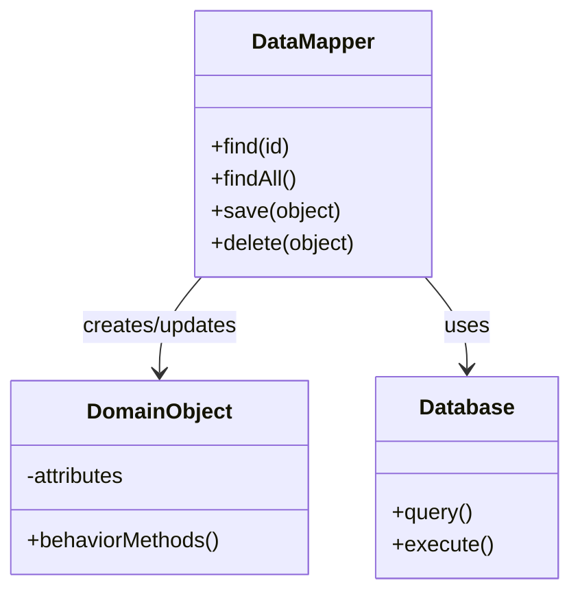

# 🔄 Data Mapper Pattern

## Definition

The Data Mapper pattern separates domain objects from database access code, creating a layer that moves data between the two while keeping them independent of each other. Domain objects have no knowledge of how they're stored.

## Purpose

- **🧩 Separation of Concerns**: Keep domain objects focused on business logic, not persistence
- **🔄 Flexibility**: Allow changes to domain objects without affecting database schema
- **🔌 Database Independence**: Switch databases without changing domain code
- **🧪 Testability**: Test domain objects without requiring a database

## Structure



## Basic Implementation

```php
<?php
// Domain object - has no persistence knowledge
class User {
    private $id;
    private $name;
    private $email;
    
    public function __construct(?int $id, string $name, string $email) {
        $this->id = $id;
        $this->name = $name;
        $this->email = $email;
    }
    
    // Getters and setters
    public function getId(): ?int { return $this->id; }
    public function getName(): string { return $this->name; }
    public function getEmail(): string { return $this->email; }
    public function setName(string $name): void { $this->name = $name; }
    public function setEmail(string $email): void { $this->email = $email; }
    
    // Business logic method 
    public function generateUsername(): string {
        return strtolower(str_replace(' ', '.', $this->name));
    }
}

// Data Mapper
class UserMapper {
    private $pdo;
    
    public function __construct(PDO $pdo) {
        $this->pdo = $pdo;
    }
    
    // Find a user by ID
    public function findById(int $id): ?User {
        $stmt = $this->pdo->prepare("SELECT * FROM users WHERE id = :id");
        $stmt->execute(['id' => $id]);
        $row = $stmt->fetch(PDO::FETCH_ASSOC);
        
        if (!$row) {
            return null;
        }
        
        return $this->mapRowToUser($row);
    }
    
    // Save a user (insert or update)
    public function save(User $user): void {
        if ($user->getId() === null) {
            $this->insert($user);
        } else {
            $this->update($user);
        }
    }
    
    // Helper methods
    private function insert(User $user): void {
        $stmt = $this->pdo->prepare("
            INSERT INTO users (name, email)
            VALUES (:name, :email)
        ");
        
        $stmt->execute([
            'name' => $user->getName(),
            'email' => $user->getEmail()
        ]);
        
        // Update the ID with the auto-generated value
        $id = $this->pdo->lastInsertId();
        $this->setUserId($user, (int) $id);
    }
    
    private function update(User $user): void {
        $stmt = $this->pdo->prepare("
            UPDATE users
            SET name = :name, email = :email
            WHERE id = :id
        ");
        
        $stmt->execute([
            'id' => $user->getId(),
            'name' => $user->getName(),
            'email' => $user->getEmail()
        ]);
    }
    
    private function mapRowToUser(array $row): User {
        return new User(
            (int) $row['id'],
            $row['name'],
            $row['email']
        );
    }
    
    // Using Reflection to set private ID property
    private function setUserId(User $user, int $id): void {
        $reflection = new ReflectionClass(User::class);
        $property = $reflection->getProperty('id');
        $property->setAccessible(true);
        $property->setValue($user, $id);
    }
}

// Usage example
$pdo = new PDO('mysql:host=localhost;dbname=test', 'user', 'pass');
$mapper = new UserMapper($pdo);

// Create a new user
$user = new User(null, 'John Doe', 'john@example.com');
$mapper->save($user);
echo "User saved with ID: " . $user->getId() . "\n";

// Find a user
$foundUser = $mapper->findById($user->getId());
echo "Found user: " . $foundUser->getName() . "\n";

/* Output:
User saved with ID: 1
Found user: John Doe
*/
```

## Collection Mapping

```php
<?php
class UserMapper {
    // ...existing code...
    
    public function findAll(): array {
        $stmt = $this->pdo->query("SELECT * FROM users");
        $users = [];
        
        while ($row = $stmt->fetch(PDO::FETCH_ASSOC)) {
            $users[] = $this->mapRowToUser($row);
        }
        
        return $users;
    }
    
    public function findByEmail(string $email): ?User {
        $stmt = $this->pdo->prepare("SELECT * FROM users WHERE email = :email");
        $stmt->execute(['email' => $email]);
        $row = $stmt->fetch(PDO::FETCH_ASSOC);
        
        if (!$row) {
            return null;
        }
        
        return $this->mapRowToUser($row);
    }
    
    public function delete(User $user): void {
        if ($user->getId() === null) {
            throw new InvalidArgumentException("Cannot delete a user without an ID");
        }
        
        $stmt = $this->pdo->prepare("DELETE FROM users WHERE id = :id");
        $stmt->execute(['id' => $user->getId()]);
    }
}

// Usage example
$users = $mapper->findAll();
echo "Found " . count($users) . " users\n";

/* Output:
Found 3 users
*/
```

## Handling Relationships

```php
<?php
// Domain objects
class User {
    private $id;
    private $name;
    private $email;
    
    // ...existing code...
}

class Post {
    private $id;
    private $title;
    private $content;
    private $authorId;
    
    public function __construct(?int $id, string $title, string $content, int $authorId) {
        $this->id = $id;
        $this->title = $title;
        $this->content = $content;
        $this->authorId = $authorId;
    }
    
    // Getters and setters
    public function getId(): ?int { return $this->id; }
    public function getTitle(): string { return $this->title; }
    public function getContent(): string { return $this->content; }
    public function getAuthorId(): int { return $this->authorId; }
    // ...more getters and setters...
}

// Data Mappers
class PostMapper {
    private $pdo;
    private $userMapper;
    
    public function __construct(PDO $pdo, UserMapper $userMapper) {
        $this->pdo = $pdo;
        $this->userMapper = $userMapper;
    }
    
    public function findById(int $id, bool $withAuthor = false): ?Post {
        $stmt = $this->pdo->prepare("SELECT * FROM posts WHERE id = :id");
        $stmt->execute(['id' => $id]);
        $row = $stmt->fetch(PDO::FETCH_ASSOC);
        
        if (!$row) {
            return null;
        }
        
        $post = $this->mapRowToPost($row);
        
        return $post;
    }
    
    public function findByAuthor(User $author): array {
        $stmt = $this->pdo->prepare("SELECT * FROM posts WHERE author_id = :author_id");
        $stmt->execute(['author_id' => $author->getId()]);
        
        $posts = [];
        while ($row = $stmt->fetch(PDO::FETCH_ASSOC)) {
            $posts[] = $this->mapRowToPost($row);
        }
        
        return $posts;
    }
    
    // Other methods...
    
    private function mapRowToPost(array $row): Post {
        return new Post(
            (int) $row['id'],
            $row['title'],
            $row['content'],
            (int) $row['author_id']
        );
    }
}

// Relationship service
class UserPostService {
    private $userMapper;
    private $postMapper;
    
    public function __construct(UserMapper $userMapper, PostMapper $postMapper) {
        $this->userMapper = $userMapper;
        $this->postMapper = $postMapper;
    }
    
    public function getUserWithPosts(int $userId): array {
        $user = $this->userMapper->findById($userId);
        
        if (!$user) {
            return null;
        }
        
        $posts = $this->postMapper->findByAuthor($user);
        
        return [
            'user' => $user,
            'posts' => $posts
        ];
    }
}

// Usage
$userPostService = new UserPostService($userMapper, $postMapper);
$data = $userPostService->getUserWithPosts(1);
echo "User {$data['user']->getName()} has " . count($data['posts']) . " posts\n";

/* Output:
User John Doe has 3 posts
*/
```

## Identity Map Enhancement

```php
<?php
class IdentityMap {
    private $map = [];
    
    public function get(string $class, int $id) {
        $key = $this->getKey($class, $id);
        return $this->map[$key] ?? null;
    }
    
    public function set(string $class, int $id, $object): void {
        $key = $this->getKey($class, $id);
        $this->map[$key] = $object;
    }
    
    public function remove(string $class, int $id): void {
        $key = $this->getKey($class, $id);
        unset($this->map[$key]);
    }
    
    private function getKey(string $class, int $id): string {
        return $class . ':' . $id;
    }
}

class UserMapperWithIdentityMap {
    private $pdo;
    private $identityMap;
    
    public function __construct(PDO $pdo, IdentityMap $identityMap) {
        $this->pdo = $pdo;
        $this->identityMap = $identityMap;
    }
    
    public function findById(int $id): ?User {
        // Check identity map first
        $user = $this->identityMap->get(User::class, $id);
        if ($user) {
            return $user;
        }
        
        // Not found in map, query database
        $stmt = $this->pdo->prepare("SELECT * FROM users WHERE id = :id");
        $stmt->execute(['id' => $id]);
        $row = $stmt->fetch(PDO::FETCH_ASSOC);
        
        if (!$row) {
            return null;
        }
        
        $user = $this->mapRowToUser($row);
        $this->identityMap->set(User::class, $id, $user);
        
        return $user;
    }
    
    // Other methods...
}

// Usage with identity map
$identityMap = new IdentityMap();
$mapper = new UserMapperWithIdentityMap($pdo, $identityMap);

// First find - hits database
$user1 = $mapper->findById(1);
// Second find - returns cached instance
$user2 = $mapper->findById(1);

echo "Same instance: " . ($user1 === $user2 ? 'Yes' : 'No') . "\n";

/* Output:
Same instance: Yes
*/
```

## Data Mapper in DDD Context

```php
<?php
namespace Domain\Model;

// Rich domain model
class Customer {
    private $id;
    private $name;
    private $email;
    private $status;
    private $membershipLevel;
    
    // Domain methods
    public function upgrade(): void {
        if ($this->status !== 'active') {
            throw new \DomainException('Only active customers can be upgraded');
        }
        
        $this->membershipLevel = 'premium';
    }
    
    public function canReceivePromotion(): bool {
        return $this->status === 'active' && 
               $this->membershipLevel === 'standard';
    }
    
    // Getters and setters...
}

namespace Infrastructure\Persistence;

use Domain\Model\Customer;

// Data Mapper in infrastructure layer
class CustomerMapper {
    private $pdo;
    
    public function __construct(\PDO $pdo) {
        $this->pdo = $pdo;
    }
    
    public function findById(int $id): ?Customer {
        // Implementation...
    }
    
    public function save(Customer $customer): void {
        // Implementation...
    }
}

// Usage
$customer = $customerMapper->findById(1);
if ($customer->canReceivePromotion()) {
    // Send promotion
}
```

## Benefits of Data Mapper

✅ **Separation of Concerns**: Domain objects don't know about database  
✅ **Flexibility**: Change domain or database independently  
✅ **Testability**: Test domain objects with mock mappers  
✅ **DDD Support**: Ideal for Domain-Driven Design approaches  
✅ **Complex Mapping**: Can handle complex transformations between objects and tables

## Challenges of Data Mapper

⚠️ **Complexity**: More complex to implement than Active Record  
⚠️ **Extra Classes**: Requires separate mapper classes for each entity  
⚠️ **Initial Development Time**: Takes longer to set up  
⚠️ **Performance**: Can add overhead for simple CRUD operations  
⚠️ **Learning Curve**: More concepts to understand

## When to Use Data Mapper

- 🧩 Complex domains with rich business logic
- 🔄 Projects where database and objects evolve separately
- 🧪 Applications requiring thorough testing
- 📊 Systems with complex data transformations
- 🏗️ Domain-Driven Design implementations

## Up Next

Learn about the [Active Record Pattern](./05-active-record.md), which offers a different approach to object-relational mapping.

[Back to Enterprise Patterns](./README.md) | [Previous: Service Layer](./03-service-layer.md) | [Next: Active Record](./05-active-record.md)
