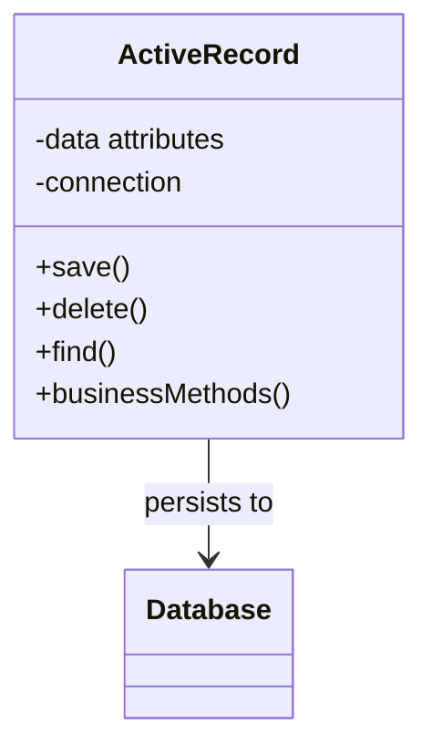

# 📝 Active Record Pattern

## Definition

The Active Record pattern is an architectural pattern that maps database tables or views to objects, combining data access and domain logic in a single class. Each Active Record object is responsible for saving and loading itself from the database.

## Purpose

- **🔄 Simplify data access**: Combine data access and domain logic in one place
- **⚡ Reduce boilerplate**: Eliminate separate data access objects
- **📚 Improve readability**: Make code more intuitive by treating records as objects
- **🚀 Speed development**: Provide a straightforward pattern for database interaction

## Structure



## Basic Implementation

```php
<?php
class User {
    private $id;
    private $name;
    private $email;
    
    // Database connection
    private static $db;
    
    public static function setDatabaseConnection(PDO $db) {
        self::$db = $db;
    }
    
    // Getters and setters
    public function getId() {
        return $this->id;
    }
    
    public function getName() {
        return $this->name;
    }
    
    public function setName($name) {
        $this->name = $name;
        return $this;
    }
    
    public function getEmail() {
        return $this->email;
    }
    
    public function setEmail($email) {
        $this->email = $email;
        return $this;
    }
    
    // Data access methods
    public function save() {
        if ($this->id) {
            return $this->update();
        } else {
            return $this->insert();
        }
    }
    
    private function insert() {
        $stmt = self::$db->prepare('
            INSERT INTO users (name, email) 
            VALUES (:name, :email)
        ');
        
        $stmt->execute([
            'name' => $this->name,
            'email' => $this->email
        ]);
        
        $this->id = self::$db->lastInsertId();
        return $this->id;
    }
    
    private function update() {
        $stmt = self::$db->prepare('
            UPDATE users 
            SET name = :name, email = :email 
            WHERE id = :id
        ');
        
        return $stmt->execute([
            'id' => $this->id,
            'name' => $this->name,
            'email' => $this->email
        ]);
    }
    
    public function delete() {
        if (!$this->id) {
            return false;
        }
        
        $stmt = self::$db->prepare('DELETE FROM users WHERE id = :id');
        return $stmt->execute(['id' => $this->id]);
    }
    
    // Find methods
    public static function find($id) {
        $stmt = self::$db->prepare('SELECT * FROM users WHERE id = :id');
        $stmt->execute(['id' => $id]);
        
        return $stmt->fetchObject(self::class) ?: null;
    }
    
    public static function findAll() {
        $stmt = self::$db->query('SELECT * FROM users');
        return $stmt->fetchAll(PDO::FETCH_CLASS, self::class);
    }
}

// Usage
$pdo = new PDO('mysql:host=localhost;dbname=test', 'user', 'pass');
User::setDatabaseConnection($pdo);

$user = new User();
$user->setName('John Doe')
     ->setEmail('john@example.com')
     ->save();

echo "User created with ID: " . $user->getId() . "\n";

/* Output:
User created with ID: 1
*/
```

## Adding Business Logic

```php
<?php
class User {
    // ...existing properties and data access methods...
    
    // Business logic methods
    public function isValidEmail() {
        return filter_var($this->email, FILTER_VALIDATE_EMAIL) !== false;
    }
    
    public function register($password) {
        // Validate
        if (!$this->isValidEmail()) {
            throw new InvalidArgumentException("Invalid email format");
        }
        
        if (strlen($password) < 8) {
            throw new InvalidArgumentException("Password must be at least 8 characters");
        }
        
        // Hash password
        $this->password = password_hash($password, PASSWORD_DEFAULT);
        $this->status = 'pending';
        $this->created_at = date('Y-m-d H:i:s');
        
        // Save to database
        return $this->save();
    }
    
    public function login($password) {
        if (!password_verify($password, $this->password)) {
            return false;
        }
        
        $this->last_login = date('Y-m-d H:i:s');
        $this->save();
        
        return true;
    }
}

// Usage with business logic
$user = new User();
$user->setName('Jane Doe')
     ->setEmail('jane@example.com');
     
try {
    $user->register('securepassword123');
    echo "User registered successfully!\n";
} catch (Exception $e) {
    echo "Registration error: " . $e->getMessage() . "\n";
}

/* Output:
User registered successfully!
*/
```

## Relationships Between Active Records

```php
<?php
class User {
    // ...existing code...
    
    // One-to-many relationship
    public function getPosts() {
        $stmt = self::$db->prepare('
            SELECT * FROM posts 
            WHERE user_id = :user_id
        ');
        
        $stmt->execute(['user_id' => $this->id]);
        return $stmt->fetchAll(PDO::FETCH_CLASS, Post::class);
    }
    
    // Create related object
    public function createPost($title, $content) {
        $post = new Post();
        $post->setUserId($this->id)
             ->setTitle($title)
             ->setContent($content)
             ->save();
        
        return $post;
    }
}

class Post {
    private $id;
    private $user_id;
    private $title;
    private $content;
    
    // Getters, setters and CRUD methods...
    
    // Many-to-one relationship
    public function getUser() {
        return User::find($this->user_id);
    }
}

// Using relationships
$user = User::find(1);
$post = $user->createPost('Hello World', 'This is my first post!');
$posts = $user->getPosts();
echo $user->getName() . " has " . count($posts) . " posts\n";

/* Output:
John Doe has 1 posts
*/
```

## Base Active Record Class

```php
<?php
abstract class ActiveRecord {
    protected static $table;
    protected static $db;
    protected static $fillable = [];
    
    public static function setDatabaseConnection(PDO $db) {
        static::$db = $db;
    }
    
    public function save() {
        if (isset($this->id) && $this->id) {
            return $this->update();
        } else {
            return $this->insert();
        }
    }
    
    protected function insert() {
        $properties = get_object_vars($this);
        $fields = array_intersect(static::$fillable, array_keys($properties));
        
        $fieldList = implode(', ', $fields);
        $placeholders = ':' . implode(', :', $fields);
        
        $sql = "INSERT INTO " . static::$table . " ({$fieldList}) VALUES ({$placeholders})";
        $stmt = static::$db->prepare($sql);
        
        $values = [];
        foreach ($fields as $field) {
            $values[$field] = $this->$field;
        }
        
        $stmt->execute($values);
        $this->id = static::$db->lastInsertId();
        
        return $this->id;
    }
    
    protected function update() {
        // Implementation...
    }
    
    public static function find($id) {
        $stmt = static::$db->prepare("SELECT * FROM " . static::$table . " WHERE id = :id");
        $stmt->execute(['id' => $id]);
        
        return $stmt->fetchObject(static::class) ?: null;
    }
    
    public static function findAll() {
        $stmt = static::$db->query("SELECT * FROM " . static::$table);
        return $stmt->fetchAll(PDO::FETCH_CLASS, static::class);
    }
}

// Concrete implementation
class User extends ActiveRecord {
    protected static $table = 'users';
    protected static $fillable = ['name', 'email', 'password', 'status'];
    
    private $id;
    private $name;
    private $email;
    private $password;
    private $status;
    
    // Getters, setters, and business methods...
}
```

## Active Record in Laravel

```php
<?php
// Laravel Eloquent model
namespace App\Models;

use Illuminate\Database\Eloquent\Model;

class User extends Model {
    protected $fillable = ['name', 'email'];
    
    // Define relationship
    public function posts() {
        return $this->hasMany(Post::class);
    }
    
    // Add business logic method
    public function isActive() {
        return $this->status === 'active';
    }
}

// Usage
$user = new User();
$user->name = 'John Doe';
$user->email = 'john@example.com';
$user->save();

// Find
$user = User::find(1);
$users = User::where('status', 'active')->get();

// Relationships
$posts = $user->posts;
```

## Benefits and Drawbacks

### ✅ Benefits
- **Simplicity**: Easy to understand and implement
- **Speed of Development**: Rapid application development
- **Intuitiveness**: Direct mapping between tables and objects
- **Reduced Code**: No need for separate data access layer
- **Self-contained**: Each class handles its own persistence

### ⚠️ Drawbacks
- **Tight Coupling**: Business logic tied to persistence
- **Testing Difficulty**: Hard to test without a database
- **Single Table Focus**: Not ideal for complex domain logic
- **Violates SRP**: Single class has multiple responsibilities
- **Schema Changes**: Changes to database require code changes

## When to Use

- 📊 Simple CRUD applications
- 🚀 Rapid prototyping and MVPs
- 🔄 Applications with simple business rules
- 📱 Small to medium projects
- 📊 Direct table-to-object mapping scenarios

## Up Next

Learn about the [Domain Model Pattern](./06-domain-model.md), which focuses on creating a rich model of business concepts and behaviors.

[Back to Enterprise Patterns](./README.md) | [Previous: Data Mapper](./04-data-mapper.md) | [Next: Domain Model](./06-domain-model.md)
