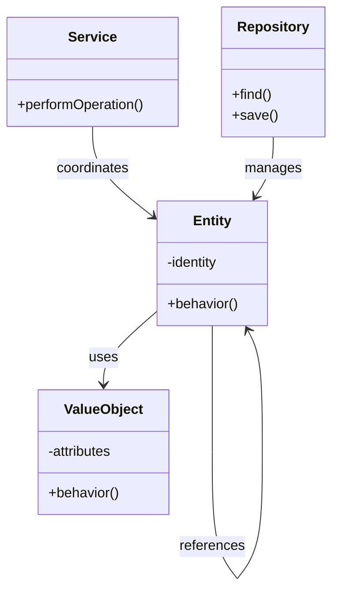

# 🏛️ Domain Model Pattern

## Definition

The Domain Model pattern is a conceptual model of a system that incorporates both data and behavior. It's a structured, object-oriented representation of the entities, relationships, and business rules in a specific domain.

## Purpose

- **🧠 Express business concepts**: Model real-world entities in code
- **📋 Encapsulate business rules**: Place logic directly in relevant domain objects
- **🗣️ Improve domain understanding**: Create shared language between developers and domain experts
- **🧩 Reduce complexity**: Break down complex domains into manageable objects
- **🔒 Enforce constraints**: Ensure business rules are consistently applied

## Structure



## Basic Implementation

```php
<?php
// Value object for money
class Money {
    private $amount;
    private $currency;
    
    public function __construct(float $amount, string $currency) {
        if ($amount < 0) {
            throw new InvalidArgumentException("Amount cannot be negative");
        }
        $this->amount = $amount;
        $this->currency = strtoupper($currency);
    }
    
    public function getAmount(): float {
        return $this->amount;
    }
    
    public function getCurrency(): string {
        return $this->currency;
    }
    
    public function add(Money $other): Money {
        $this->ensureSameCurrency($other);
        return new Money($this->amount + $other->amount, $this->currency);
    }
    
    public function subtract(Money $other): Money {
        $this->ensureSameCurrency($other);
        $newAmount = $this->amount - $other->amount;
        
        if ($newAmount < 0) {
            throw new DomainException("Resulting amount would be negative");
        }
        
        return new Money($newAmount, $this->currency);
    }
    
    private function ensureSameCurrency(Money $other): void {
        if ($this->currency !== $other->currency) {
            throw new DomainException("Cannot operate on different currencies");
        }
    }
}

// Entity example - Account
class Account {
    private $accountNumber;
    private $owner;
    private $balance;
    private $overdraftLimit;
    
    public function __construct(
        string $accountNumber,
        Customer $owner,
        Money $initialBalance,
        ?Money $overdraftLimit = null
    ) {
        $this->accountNumber = $accountNumber;
        $this->owner = $owner;
        $this->balance = $initialBalance;
        $this->overdraftLimit = $overdraftLimit ?? new Money(0, $initialBalance->getCurrency());
    }
    
    public function deposit(Money $amount): void {
        if ($amount->getAmount() <= 0) {
            throw new DomainException("Deposit amount must be positive");
        }
        
        $this->balance = $this->balance->add($amount);
    }
    
    public function withdraw(Money $amount): void {
        if ($amount->getAmount() <= 0) {
            throw new DomainException("Withdrawal amount must be positive");
        }
        
        $maxWithdrawal = $this->balance->add($this->overdraftLimit);
        
        if ($amount->getAmount() > $maxWithdrawal->getAmount()) {
            throw new DomainException("Insufficient funds for this withdrawal");
        }
        
        // Calculate new balance
        try {
            $this->balance = $this->balance->subtract($amount);
        } catch (DomainException $e) {
            // We're into overdraft
            $this->balance = new Money(0, $this->balance->getCurrency());
        }
    }
    
    public function transfer(Account $destinationAccount, Money $amount): void {
        if ($destinationAccount->getAccountNumber() === $this->accountNumber) {
            throw new DomainException("Cannot transfer to the same account");
        }
        
        $this->withdraw($amount);
        $destinationAccount->deposit($amount);
    }
    
    // Getters
    public function getAccountNumber(): string {
        return $this->accountNumber;
    }
    
    public function getBalance(): Money {
        return $this->balance;
    }
    
    public function isOverdrawn(): bool {
        return $this->balance->getAmount() <= 0;
    }
}
```

## Domain Model with Services

```php
<?php
// Domain Service example
class TransferService {
    private $accountRepository;
    private $transactionLogger;
    
    public function __construct(
        AccountRepository $accountRepository,
        TransactionLogger $transactionLogger
    ) {
        $this->accountRepository = $accountRepository;
        $this->transactionLogger = $transactionLogger;
    }
    
    public function transfer(string $fromAccountId, string $toAccountId, Money $amount): void {
        // Retrieve accounts
        $fromAccount = $this->accountRepository->findById($fromAccountId);
        $toAccount = $this->accountRepository->findById($toAccountId);
        
        if (!$fromAccount || !$toAccount) {
            throw new DomainException("One or both accounts not found");
        }
        
        // Execute domain logic
        $fromAccount->transfer($toAccount, $amount);
        
        // Persist changes
        $this->accountRepository->save($fromAccount);
        $this->accountRepository->save($toAccount);
        
        // Log the transaction
        $this->transactionLogger->logTransfer($fromAccount, $toAccount, $amount);
    }
}
```

## Domain Model with Repositories

```php
<?php
interface AccountRepository {
    public function findById(string $id): ?Account;
    public function save(Account $account): void;
    public function findByOwner(Customer $customer): array;
}

class MySqlAccountRepository implements AccountRepository {
    private $connection;
    
    public function __construct(\PDO $connection) {
        $this->connection = $connection;
    }
    
    public function findById(string $id): ?Account {
        $stmt = $this->connection->prepare("
            SELECT a.*, c.id as customer_id, c.name, c.email
            FROM accounts a
            JOIN customers c ON a.customer_id = c.id
            WHERE a.account_number = :id
        ");
        
        $stmt->execute(['id' => $id]);
        $data = $stmt->fetch(PDO::FETCH_ASSOC);
        
        if (!$data) {
            return null;
        }
        
        // Reconstruct the domain objects
        $customer = new Customer($data['customer_id'], $data['name'], $data['email']);
        $balance = new Money($data['balance'], $data['currency']);
        $overdraftLimit = new Money($data['overdraft_limit'], $data['currency']);
        
        return new Account($data['account_number'], $customer, $balance, $overdraftLimit);
    }
    
    public function save(Account $account): void {
        // Implement save logic
    }
    
    public function findByOwner(Customer $customer): array {
        // Implement finding accounts by owner
    }
}
```

## Domain Model with Value Objects

```php
<?php
// Email address value object
class EmailAddress {
    private $email;
    
    public function __construct(string $email) {
        if (!filter_var($email, FILTER_VALIDATE_EMAIL)) {
            throw new InvalidArgumentException("Invalid email format");
        }
        $this->email = $email;
    }
    
    public function getAddress(): string {
        return $this->email;
    }
    
    public function getDomain(): string {
        return substr($this->email, strpos($this->email, '@') + 1);
    }
    
    public function __toString(): string {
        return $this->email;
    }
}

// Using value objects in entities
class Customer {
    private $id;
    private $name;
    private $email; // EmailAddress value object
    
    public function __construct(string $id, string $name, string $emailAddress) {
        $this->id = $id;
        $this->name = $name;
        $this->email = new EmailAddress($emailAddress);
    }
    
    // Getters and domain behavior
    public function getEmail(): EmailAddress {
        return $this->email;
    }
    
    public function isFromDomain(string $domain): bool {
        return $this->email->getDomain() === $domain;
    }
}
```

## Domain Model with Aggregates

```php
<?php
// Order aggregate - root entity that enforces consistency
class Order {
    private $id;
    private $customer;
    private $items = []; // Contains OrderItem entities
    private $status;
    
    public function __construct(string $id, Customer $customer) {
        $this->id = $id;
        $this->customer = $customer;
        $this->status = 'new';
    }
    
    public function addItem(Product $product, int $quantity, Money $unitPrice): void {
        if ($this->status !== 'new') {
            throw new DomainException("Cannot modify items when order is {$this->status}");
        }
        
        $item = new OrderItem($this, $product, $quantity, $unitPrice);
        $this->items[] = $item;
    }
    
    public function removeItem(OrderItem $itemToRemove): void {
        if ($this->status !== 'new') {
            throw new DomainException("Cannot modify items when order is {$this->status}");
        }
        
        $this->items = array_filter($this->items, function($item) use ($itemToRemove) {
            return $item->getId() !== $itemToRemove->getId();
        });
    }
    
    public function checkout(): void {
        if (empty($this->items)) {
            throw new DomainException("Cannot checkout an empty order");
        }
        
        $this->status = 'pending';
    }
    
    public function calculateTotal(): Money {
        $currency = $this->items[0]->getUnitPrice()->getCurrency();
        $total = new Money(0, $currency);
        
        foreach ($this->items as $item) {
            $subtotal = $item->calculateSubtotal();
            $total = $total->add($subtotal);
        }
        
        return $total;
    }
}
```

## Domain Model with Domain Events

```php
<?php
class DomainEvent {
    private $occurredOn;
    
    public function __construct() {
        $this->occurredOn = new DateTime();
    }
    
    public function getOccuredOn(): DateTime {
        return $this->occurredOn;
    }
}

class OrderPlacedEvent extends DomainEvent {
    private $orderId;
    private $customerId;
    
    public function __construct(string $orderId, string $customerId) {
        parent::__construct();
        $this->orderId = $orderId;
        $this->customerId = $customerId;
    }
    
    // Getters
}

// Adding event handling to the Order entity
class Order {
    // ...existing code...
    private $domainEvents = [];
    
    public function checkout(): void {
        if (empty($this->items)) {
            throw new DomainException("Cannot checkout an empty order");
        }
        
        $this->status = 'pending';
        
        // Raise domain event
        $this->addDomainEvent(new OrderPlacedEvent($this->id, $this->customer->getId()));
    }
    
    private function addDomainEvent(DomainEvent $event): void {
        $this->domainEvents[] = $event;
    }
    
    public function clearDomainEvents(): array {
        $events = $this->domainEvents;
        $this->domainEvents = [];
        return $events;
    }
}
```

## Benefits of Domain Model

✅ **Business logic centralization**: Rules are where they belong - in domain objects  
✅ **Rich behavior**: Objects combine data and behavior for accurate domain representation  
✅ **Encapsulation**: Domain rules are enforced within the model  
✅ **Domain-driven design**: Facilitates communication with domain experts  
✅ **Testability**: Business logic can be tested independently of infrastructure

## Challenges of Domain Model

⚠️ **Complexity**: Requires more effort to design and implement  
⚠️ **Learning curve**: Needs understanding of OOP and domain modeling  
⚠️ **Performance**: More complex object graphs can affect performance  
⚠️ **Storage mapping**: More difficult to map to databases (often requires ORM)

## When to Use

- 🧩 Complex business domains with many rules and relationships
- 📈 Long-lived projects expected to evolve over time
- 🤝 When working with domain experts who can help shape the model
- 👥 With larger development teams needing a shared understanding

## Up Next

Explore [Event Sourcing](./07-event-sourcing.md), a pattern that captures all changes to an application state as a sequence of events.

[Back to Enterprise Patterns](./README.md) | [Previous: Active Record](./05-active-record.md) | [Next: Event Sourcing](./07-event-sourcing.md)
