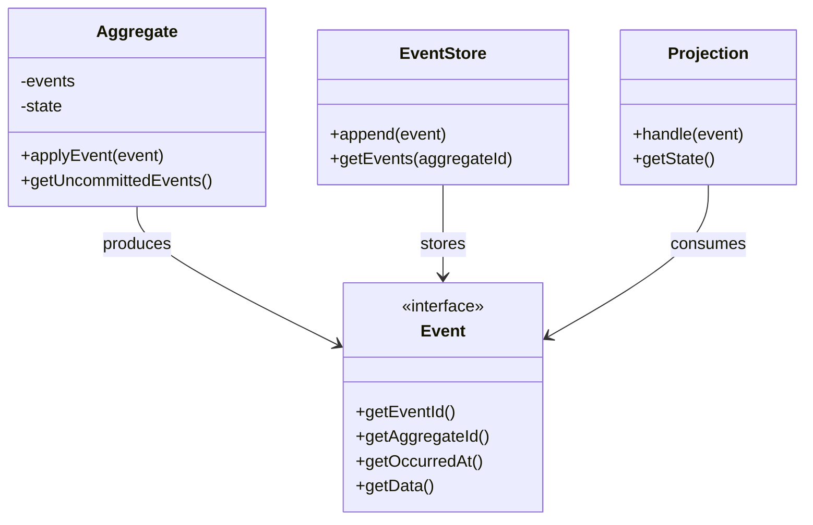

# 📊 Event Sourcing Pattern

## Intent

Event Sourcing ensures that all changes to application state are stored as a sequence of events, providing:
- 🔄 Complete rebuilding of application state
- ⏱️ Determining application state at any point in time
- 📝 Reliable audit logging
- 📊 Analysis of user behavior over time

## Problem It Solves

Traditional CRUD-based systems suffer from:
- 📉 Loss of historical information
- 🔍 Poor auditability
- 🐞 Difficulty debugging complex state changes
- 🔄 Concurrency conflicts
- ⏱️ Limited ability for time-based analysis

## Solution

Event Sourcing addresses these issues by:
1. Capturing all state changes as immutable events
2. Storing these events in an append-only event store
3. Reconstructing application state by replaying these events
4. Creating specialized read models (projections) for efficient querying

## Structure



## Implementation in PHP

```php
<?php
// Base Event interface
interface Event {
    public function getEventId(): string;
    public function getAggregateId(): string;
    public function getEventType(): string;
    public function getOccurredAt(): DateTimeImmutable;
    public function getData(): array;
}

// Events for a bank account
class AccountCreatedEvent implements Event {
    private $eventId;
    private $accountId;
    private $owner;
    private $occurredAt;
    
    public function __construct(string $accountId, string $owner) {
        $this->eventId = uniqid('evt_');
        $this->accountId = $accountId;
        $this->owner = $owner;
        $this->occurredAt = new DateTimeImmutable();
    }
    
    public function getEventId(): string { return $this->eventId; }
    public function getAggregateId(): string { return $this->accountId; }
    public function getEventType(): string { return 'account.created'; }
    public function getOccurredAt(): DateTimeImmutable { return $this->occurredAt; }
    public function getData(): array { return ['owner' => $this->owner]; }
    public function getOwner(): string { return $this->owner; }
}

class MoneyDepositedEvent implements Event {
    // Similar implementation with amount data
}

// Simple in-memory Event Store
class InMemoryEventStore {
    private $events = [];
    
    public function append(Event $event): void {
        $aggregateId = $event->getAggregateId();
        if (!isset($this->events[$aggregateId])) {
            $this->events[$aggregateId] = [];
        }
        $this->events[$aggregateId][] = $event;
    }
    
    public function getEvents(string $aggregateId): array {
        return $this->events[$aggregateId] ?? [];
    }
}

// Bank Account Aggregate
class BankAccount {
    private $id;
    private $owner;
    private $balance = 0;
    private $uncommittedEvents = [];
    
    private function __construct() {
        // Private to enforce factory method usage
    }
    
    // Create a new account
    public static function create(string $accountId, string $owner): BankAccount {
        $account = new self();
        $account->applyEvent(new AccountCreatedEvent($accountId, $owner));
        return $account;
    }
    
    // Rebuild from events
    public static function fromEvents(array $events): BankAccount {
        $account = new self();
        
        foreach ($events as $event) {
            $account->apply($event);
        }
        
        return $account;
    }
    
    // Deposit money
    public function deposit(float $amount): void {
        if ($amount <= 0) {
            throw new InvalidArgumentException("Amount must be positive");
        }
        
        $this->applyEvent(new MoneyDepositedEvent($this->id, $amount));
    }
    
    // Apply an event to the aggregate
    private function applyEvent(Event $event): void {
        $this->uncommittedEvents[] = $event;
        $this->apply($event);
    }
    
    // Apply event logic
    private function apply(Event $event): void {
        if ($event instanceof AccountCreatedEvent) {
            $this->id = $event->getAggregateId();
            $this->owner = $event->getOwner();
        } elseif ($event instanceof MoneyDepositedEvent) {
            $this->balance += $event->getAmount();
        }
        // More event handlers...
    }
    
    // Getters
    public function getId(): string { return $this->id; }
    public function getBalance(): float { return $this->balance; }
    public function getOwner(): string { return $this->owner; }
    
    // Get uncommitted events
    public function getUncommittedEvents(): array {
        $events = $this->uncommittedEvents;
        $this->uncommittedEvents = [];
        return $events;
    }
}

// Usage example
$eventStore = new InMemoryEventStore();
$accountId = 'acc_' . uniqid();

// Create a new account and record events
$account = BankAccount::create($accountId, 'John Doe');
$account->deposit(500.00);
$account->deposit(250.00);

// Store the events
foreach ($account->getUncommittedEvents() as $event) {
    $eventStore->append($event);
}

// Later, rebuild account from events
$events = $eventStore->getEvents($accountId);
$reconstructedAccount = BankAccount::fromEvents($events);

echo "Account {$accountId} balance: \${$reconstructedAccount->getBalance()}\n";

/* Output:
Account acc_60a1f2d3e4b5f balance: $750.00
*/
```

## Account Balance Projection

```php
<?php
class AccountBalanceProjection {
    private $balances = [];
    
    public function handle(Event $event): void {
        if ($event instanceof AccountCreatedEvent) {
            $this->balances[$event->getAggregateId()] = 0;
        } elseif ($event instanceof MoneyDepositedEvent) {
            $accountId = $event->getAggregateId();
            $this->balances[$accountId] += $event->getAmount();
        } elseif ($event instanceof MoneyWithdrawnEvent) {
            $accountId = $event->getAggregateId();
            $this->balances[$accountId] -= $event->getAmount();
        }
    }
    
    public function getBalance(string $accountId): float {
        return $this->balances[$accountId] ?? 0;
    }
    
    public function getAllBalances(): array {
        return $this->balances;
    }
}

// Usage
$projection = new AccountBalanceProjection();
foreach ($eventStore->getEvents($accountId) as $event) {
    $projection->handle($event);
}
echo "Current balance: $" . $projection->getBalance($accountId);
```

## Snapshotting for Performance

```php
<?php
class AccountSnapshot {
    private $accountId;
    private $balance;
    private $owner;
    private $version;
    
    public function __construct(string $accountId, float $balance, string $owner, int $version) {
        $this->accountId = $accountId;
        $this->balance = $balance;
        $this->owner = $owner;
        $this->version = $version;
    }
    
    // Getters...
}

class SnapshotStore {
    private $snapshots = [];
    
    public function save(AccountSnapshot $snapshot): void {
        $this->snapshots[$snapshot->getAccountId()] = $snapshot;
    }
    
    public function get(string $accountId): ?AccountSnapshot {
        return $this->snapshots[$accountId] ?? null;
    }
}

class BankAccountWithSnapshots {
    // Add snapshot functionality to BankAccount
    public static function fromSnapshot(AccountSnapshot $snapshot, array $newEvents): self {
        $account = new self();
        $account->id = $snapshot->getAccountId();
        $account->balance = $snapshot->getBalance();
        $account->owner = $snapshot->getOwner();
        
        // Apply only events after the snapshot version
        foreach ($newEvents as $event) {
            $account->apply($event);
        }
        
        return $account;
    }
    
    public function createSnapshot(int $version): AccountSnapshot {
        return new AccountSnapshot($this->id, $this->balance, $this->owner, $version);
    }
}

// Usage with snapshots
$snapshotStore = new SnapshotStore();
$eventStore = new InMemoryEventStore();

// Rebuild with snapshot if available
$snapshot = $snapshotStore->get($accountId);
$allEvents = $eventStore->getEvents($accountId);

if ($snapshot) {
    $account = BankAccountWithSnapshots::fromSnapshot(
        $snapshot, 
        array_slice($allEvents, $snapshot->getVersion())
    );
} else {
    $account = BankAccount::fromEvents($allEvents);
    if (count($allEvents) > 100) {
        // Create snapshot after 100 events
        $snapshotStore->save($account->createSnapshot(count($allEvents)));
    }
}
```

## Event Evolution

As your system evolves, you'll need to handle changing event schemas:

```php
class EventUpgrader {
    private $upgraders = [];
    
    public function register(string $eventType, int $fromVersion, int $toVersion, callable $upgrader): void {
        $this->upgraders[$eventType][$fromVersion][$toVersion] = $upgrader;
    }
    
    public function upgrade(array $eventData, string $eventType, int $fromVersion, int $toVersion): array {
        if ($fromVersion === $toVersion) {
            return $eventData;
        }
        
        if (!isset($this->upgraders[$eventType][$fromVersion][$toVersion])) {
            throw new RuntimeException("No upgrader found for $eventType from v$fromVersion to v$toVersion");
        }
        
        $upgrader = $this->upgraders[$eventType][$fromVersion][$toVersion];
        return $upgrader($eventData);
    }
}

// Usage
$upgrader = new EventUpgrader();
$upgrader->register('account.created', 1, 2, function(array $data) {
    // Convert v1 to v2 format
    return [
        'owner' => [
            'name' => $data['owner'],
            'email' => $data['email'] ?? 'unknown@example.com'
        ]
    ];
});

// When loading events
$eventData = $event->getData();
if ($event->getVersion() !== CURRENT_VERSION) {
    $eventData = $upgrader->upgrade(
        $eventData, 
        $event->getEventType(), 
        $event->getVersion(), 
        CURRENT_VERSION
    );
}
```

## Benefits

✅ **Complete Audit Trail**: Every change is captured as an immutable event  
✅ **Temporal Queries**: State can be determined for any point in time  
✅ **Event Replay**: System can rebuild state from events  
✅ **Debugging**: Easier debugging through event history  
✅ **Performance**: Append-only stores are optimized for writing  
✅ **Concurrency**: Reduces conflicts by recording intent  
✅ **Event Sourcing**: Natural fit with event-driven architecture

## Challenges and Considerations

⚠️ **Learning Curve**: Requires a significant mindset shift  
⚠️ **Eventual Consistency**: Read models may lag behind event stream  
⚠️ **Event Schema Evolution**: Managing changes to event structures  
⚠️ **Performance of Rebuilding**: Rebuilding state from scratch can be costly  
⚠️ **Complexity**: More complex than traditional CRUD operations

## When to Use

- 📊 Financial systems and accounting
- 🔍 Auditing and compliance-heavy domains
- 📈 Systems requiring historical analysis
- 📱 Collaborative applications
- 🌐 Microservice architectures with complex workflows

## Related Patterns

- **📈 CQRS**: Often used together with Event Sourcing
- **🏛️ Domain-Driven Design**: Event Sourcing works well with DDD aggregates
- **🔄 Saga**: Long-running processes can use events for coordination
- **📡 Event-Driven Architecture**: Natural fit for Event Sourcing
- **📊 Projection**: Creating specialized read models from events

## Up Next

Learn about [CQRS (Command Query Responsibility Segregation)](./08-cqrs.md), a pattern that separates read and write operations to maximize performance, scalability, and security.

[Back to Enterprise Patterns](./README.md) | [Previous: Domain Model](./06-domain-model.md) | [Next: CQRS](./08-cqrs.md)
