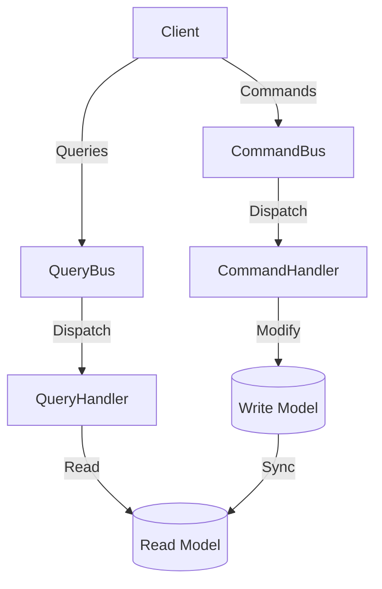

# 📈 Command Query Responsibility Segregation (CQRS)

## Definition

Command Query Responsibility Segregation (CQRS) is an architectural pattern that separates read and write operations for a data store into distinct models:

1. **🖊️ Commands**: Operations that change state (write/update/delete)
2. **🔍 Queries**: Operations that return results without changing state (read)

## Purpose

- **📊 Scalability**: Scale read and write operations independently
- **⚡ Performance**: Optimize read and write models separately
- **📦 Complexity management**: Simplify complex domains by separating concerns
- **🧩 Specialized models**: Create tailored data models for different use cases
- **🔒 Security**: Apply different security policies to commands and queries

## Structure



## Basic CQRS Structure

```php
<?php
// Command side
interface Command {}

interface CommandHandler {
    public function handle(Command $command): void;
}

// Query side
interface Query {}

interface QueryHandler {
    public function handle(Query $query);
}

// Command Bus
class CommandBus {
    private $handlers = [];
    
    public function registerHandler(string $commandClass, CommandHandler $handler): void {
        $this->handlers[$commandClass] = $handler;
    }
    
    public function dispatch(Command $command): void {
        $commandClass = get_class($command);
        
        if (!isset($this->handlers[$commandClass])) {
            throw new RuntimeException("No handler registered for $commandClass");
        }
        
        $this->handlers[$commandClass]->handle($command);
    }
}

// Query Bus
class QueryBus {
    private $handlers = [];
    
    public function registerHandler(string $queryClass, QueryHandler $handler): void {
        $this->handlers[$queryClass] = $handler;
    }
    
    public function dispatch(Query $query) {
        $queryClass = get_class($query);
        
        if (!isset($this->handlers[$queryClass])) {
            throw new RuntimeException("No handler registered for $queryClass");
        }
        
        return $this->handlers[$queryClass]->handle($query);
    }
}
```

## Command Side Implementation

```php
<?php
// Commands
class CreateUserCommand implements Command {
    private $id;
    private $name;
    private $email;
    
    public function __construct(string $id, string $name, string $email) {
        $this->id = $id;
        $this->name = $name;
        $this->email = $email;
    }
    
    // Getters...
}

// Command Handlers
class CreateUserCommandHandler implements CommandHandler {
    private $writeRepository;
    
    public function __construct(UserWriteRepository $writeRepository) {
        $this->writeRepository = $writeRepository;
    }
    
    public function handle(Command $command): void {
        if (!$command instanceof CreateUserCommand) {
            throw new InvalidArgumentException("Expected CreateUserCommand");
        }
        
        $user = new User(
            $command->getId(),
            $command->getName(),
            $command->getEmail()
        );
        
        $this->writeRepository->save($user);
    }
}

// Write Repository
interface UserWriteRepository {
    public function save(User $user): void;
    public function findById(string $id): ?User;
    public function remove(User $user): void;
}

// Write Model
class User {
    private $id;
    private $name;
    private $email;
    
    // Constructor, getters, setters...
    
    public function setEmail(string $email): void {
        if (!filter_var($email, FILTER_VALIDATE_EMAIL)) {
            throw new InvalidArgumentException("Invalid email format");
        }
        
        $this->email = $email;
    }
}
```

## Query Side Implementation

```php
<?php
// Queries
class GetUserByIdQuery implements Query {
    private $id;
    
    public function __construct(string $id) {
        $this->id = $id;
    }
    
    public function getId(): string {
        return $this->id;
    }
}

// Query Handlers
class GetUserByIdQueryHandler implements QueryHandler {
    private $readRepository;
    
    public function __construct(UserReadRepository $readRepository) {
        $this->readRepository = $readRepository;
    }
    
    public function handle(Query $query) {
        if (!$query instanceof GetUserByIdQuery) {
            throw new InvalidArgumentException("Expected GetUserByIdQuery");
        }
        
        return $this->readRepository->getUserById($query->getId());
    }
}

// Read Repository
interface UserReadRepository {
    public function getUserById(string $id): ?UserReadModel;
    public function findUsersByNamePattern(string $pattern): array;
}

// Read Model (DTO)
class UserReadModel {
    public $id;
    public $name;
    public $email;
    public $created_at;
    public $status;
    
    // No setters needed - this is a read-only model
    
    public static function fromArray(array $data): self {
        $model = new self();
        $model->id = $data['id'];
        $model->name = $data['name'];
        $model->email = $data['email'];
        $model->created_at = $data['created_at'];
        $model->status = $data['status'];
        
        return $model;
    }
}
```

## Usage Example

```php
<?php
// Setup
$pdo = new PDO('mysql:host=localhost;dbname=testdb', 'username', 'password');

$writeRepo = new MySqlUserWriteRepository($pdo);
$readRepo = new MySqlUserReadRepository($pdo);

$commandBus = new CommandBus();
$queryBus = new QueryBus();

// Register command handlers
$commandBus->registerHandler(
    CreateUserCommand::class, 
    new CreateUserCommandHandler($writeRepo)
);

// Register query handlers
$queryBus->registerHandler(
    GetUserByIdQuery::class, 
    new GetUserByIdQueryHandler($readRepo)
);

// Create a user
$userId = uniqid('user_');
$commandBus->dispatch(new CreateUserCommand(
    $userId,
    'John Doe',
    'john@example.com'
));

// Retrieve the user
$user = $queryBus->dispatch(new GetUserByIdQuery($userId));
echo "User created: {$user->name}, {$user->email}\n";

/* Output:
User created: John Doe, john@example.com
*/
```

## Synchronization Approaches

### 1. Direct Synchronization

```php
<?php
class CreateUserCommandHandler implements CommandHandler {
    private $writeRepository;
    private $readModelUpdater;
    
    public function __construct(
        UserWriteRepository $writeRepository,
        ReadModelUpdater $readModelUpdater
    ) {
        $this->writeRepository = $writeRepository;
        $this->readModelUpdater = $readModelUpdater;
    }
    
    public function handle(Command $command): void {
        // Create and save user to write model
        $user = new User(
            $command->getId(),
            $command->getName(),
            $command->getEmail()
        );
        
        $this->writeRepository->save($user);
        
        // Update read model directly
        $this->readModelUpdater->createUserReadModel($user);
    }
}
```

### 2. Event-Based Synchronization

```php
<?php
class UserCreatedEvent {
    private $userId;
    private $name;
    private $email;
    
    public function __construct(string $userId, string $name, string $email) {
        $this->userId = $userId;
        $this->name = $name;
        $this->email = $email;
    }
    
    // Getters...
}

class CreateUserCommandHandler implements CommandHandler {
    private $writeRepository;
    private $eventBus;
    
    public function __construct(
        UserWriteRepository $writeRepository, 
        EventBus $eventBus
    ) {
        $this->writeRepository = $writeRepository;
        $this->eventBus = $eventBus;
    }
    
    public function handle(Command $command): void {
        $user = new User(
            $command->getId(),
            $command->getName(),
            $command->getEmail()
        );
        
        $this->writeRepository->save($user);
        
        // Publish event for read model projectors
        $this->eventBus->publish(new UserCreatedEvent(
            $user->getId(),
            $user->getName(),
            $user->getEmail()
        ));
    }
}

class UserReadModelProjector {
    private $pdo;
    
    public function __construct(PDO $pdo) {
        $this->pdo = $pdo;
    }
    
    public function onUserCreated(UserCreatedEvent $event): void {
        $stmt = $this->pdo->prepare(
            "INSERT INTO user_view (id, name, email, created_at, status) 
             VALUES (?, ?, ?, NOW(), 'active')"
        );
        
        $stmt->execute([
            $event->getUserId(),
            $event->getName(),
            $event->getEmail()
        ]);
    }
}
```

## Different Storage Systems

```php
<?php
// Write model in MySQL (for ACID compliance)
class MySqlUserWriteRepository implements UserWriteRepository {
    private $pdo;
    
    // Implementation...
}

// Read model in Redis (for high-speed querying)
class RedisUserReadRepository implements UserReadRepository {
    private $redis;
    
    public function __construct(\Redis $redis) {
        $this->redis = $redis;
    }
    
    public function getUserById(string $id): ?UserReadModel {
        $data = $this->redis->hGetAll("user:$id");
        
        if (empty($data)) {
            return null;
        }
        
        return UserReadModel::fromArray($data);
    }
    
    // Other methods...
}
```

## CQRS with Event Sourcing

```php
<?php
interface DomainEvent {
    public function getAggregateId(): string;
    public function getOccurredAt(): DateTimeImmutable;
}

class UserCreatedEvent implements DomainEvent {
    private $userId;
    private $name;
    private $email;
    private $occurredAt;
    
    // Constructor, getters...
    
    public function getAggregateId(): string {
        return $this->userId;
    }
    
    public function getOccurredAt(): DateTimeImmutable {
        return $this->occurredAt;
    }
}

interface EventStore {
    public function append(DomainEvent $event): void;
    public function getEvents(string $aggregateId): array;
}

// Usage with event sourcing
class CreateUserCommandHandler implements CommandHandler {
    private $eventStore;
    
    public function __construct(EventStore $eventStore) {
        $this->eventStore = $eventStore;
    }
    
    public function handle(Command $command): void {
        // Validate command data
        if (!filter_var($command->getEmail(), FILTER_VALIDATE_EMAIL)) {
            throw new InvalidArgumentException("Invalid email format");
        }
        
        // Create and store the event
        $event = new UserCreatedEvent(
            $command->getId(),
            $command->getName(),
            $command->getEmail()
        );
        
        $this->eventStore->append($event);
    }
}
```

## Benefits of CQRS

1. **✅ Independent scaling**: Scale read and write sides according to their specific loads
2. **✅ Optimized models**: Each model can be optimized for its specific purpose
3. **✅ Simplified queries**: Read models can be structured for efficient querying
4. **✅ Performance**: Caching and other optimizations can be applied to read models
5. **✅ Security**: Different access controls can be applied to read and write operations

## When to Use CQRS

CQRS is most beneficial in the following scenarios:

1. **🧩 Complex domains**: When your domain model has complex business logic
2. **⚡ Performance-critical systems**: When read and write operations have different performance requirements
3. **👥 Collaborative domains**: When multiple users may be updating the same data
4. **🔄 Eventual consistency**: When you can tolerate some delay between writes and reads
5. **🏢 Microservices architecture**: When different services handle different aspects of your system

## When Not to Use CQRS

CQRS may not be appropriate in these cases:

1. **📝 Simple CRUD applications**: The added complexity isn't justified
2. **🏠 Small applications**: When the overhead outweighs the benefits
3. **⚡ Immediate consistency requirements**: When users must immediately see their changes
4. **👨‍💻 Limited development resources**: When you don't have the time to implement and maintain two models

## Up Next

Learn about the [Dependency Injection Container](./09-dependency-injection-container.md) pattern, which helps manage object creation and dependencies in complex applications.

[Back to Enterprise Patterns](./README.md) | [Previous: Event Sourcing](./07-event-sourcing.md) | [Next: Dependency Injection Container](./09-dependency-injection-container.md)
