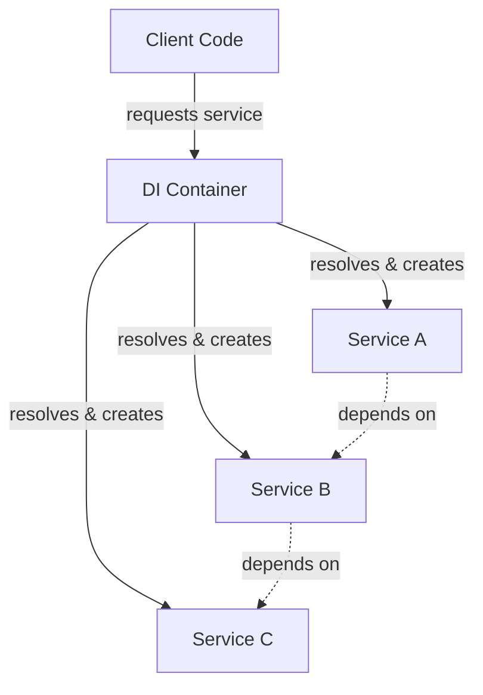

# 💉 Dependency Injection Container

## What It Is

A Dependency Injection Container is a **tool** that automates the process of creating objects and managing their dependencies, making dependency injection more practical in large applications.

> 💡 Looking for an explanation of Dependency Injection as a pattern? See the [Dependency Injection explanation](./09a-dependency-injection-explained.md).

## Problem It Solves 🎯

- 🧩 Manual wiring of dependencies becomes tedious in large applications
- 🔄 Configuration changes often require code modifications
- ⚙️ Complex object lifecycle management is difficult to implement consistently
- 🧪 Setting up test environments with mock dependencies is cumbersome

## Core Concept 💡

The container acts as a central registry that:
1. Knows how to create objects (services)
2. Resolves dependencies automatically
3. Manages object lifecycles (singleton vs new instance)
4. Provides configuration flexibility

## Visual Representation



## Simple Implementation 💻

```php
<?php
class Container {
    private $services = [];
    private $instances = [];
    
    // Register a service definition
    public function register(string $id, $concrete, bool $shared = true): void {
        $this->services[$id] = [
            'concrete' => $concrete,
            'shared' => $shared
        ];
    }
    
    // Get a service from the container
    public function get(string $id) {
        if (!isset($this->services[$id])) {
            throw new Exception("Service '$id' not found");
        }
        
        $concrete = $this->services[$id]['concrete'];
        $shared = $this->services[$id]['shared'];
        
        // Return existing instance if shared
        if ($shared && isset($this->instances[$id])) {
            return $this->instances[$id];
        }
        
        // Create instance
        $instance = is_callable($concrete) ? $concrete($this) : new $concrete();
        
        // Store if shared
        if ($shared) {
            $this->instances[$id] = $instance;
        }
        
        return $instance;
    }
}

// Usage
$container = new Container();

// Register services
$container->register('logger', function() {
    return new FileLogger('/var/log/app.log');
});

$container->register('userService', function($container) {
    return new UserService($container->get('logger'));
});

// Use the service
$userService = $container->get('userService');
$userService->register('john_doe');

// Output:
// [FileLogger] User john_doe registered successfully
```

## Real-World Example with Autowiring 🚀

```php
<?php
// Modern DI Container with autowiring
class Container {
    // ...existing code...
    
    private function autowire(string $className) {
        $reflection = new ReflectionClass($className);
        $constructor = $reflection->getConstructor();
        
        if (!$constructor) {
            return new $className();
        }
        
        $params = [];
        foreach ($constructor->getParameters() as $param) {
            if ($param->getType() && !$param->getType()->isBuiltin()) {
                $type = $param->getType()->getName();
                $params[] = $this->get($type);
            }
        }
        
        return $reflection->newInstanceArgs($params);
    }
}

// Usage with autowiring
$container = new Container();
$container->register(Logger::class, FileLogger::class);
$container->register(UserRepository::class, MySQLUserRepository::class);
$container->register(UserService::class, UserService::class); // Autowired!

$userService = $container->get(UserService::class);
```

## Key Features of Modern DI Containers 🛠️

| Feature | Description | Example |
|---------|-------------|---------|
| **Autowiring** | Automatically resolves dependencies by type | `$container->autowire(UserService::class)` |
| **Singleton Management** | Controls whether objects are shared or recreated | `$container->register('api', ApiClient::class, true)` |
| **Parameter Injection** | Injects scalar values and arrays | `$container->parameter('api.key', 'secret123')` |
| **Tags & Collections** | Groups related services | `$container->tag('logger', [FileLogger::class, DbLogger::class])` |
| **Lazy Loading** | Creates services only when needed | `$container->lazy(ExpensiveService::class)` |
| **Decorators** | Wraps existing services | `$container->decorate(Logger::class, CacheDecorator::class)` |

## Popular PHP DI Containers 🏆

1. **PHP-DI** - Developer-friendly with powerful features
   ```php
   $container = new \DI\Container();
   $container->set(Logger::class, \DI\create(FileLogger::class));
   $logger = $container->get(Logger::class);
   ```

2. **Symfony DI Container** - Feature-rich with performance optimizations
   ```php
   $container = new ContainerBuilder();
   $container->register(Logger::class, FileLogger::class);
   $logger = $container->get(Logger::class);
   ```

3. **Laravel Container** - Pragmatic with excellent framework integration
   ```php
   $container = new \Illuminate\Container\Container();
   $container->bind(Logger::class, FileLogger::class);
   $logger = $container->make(Logger::class);
   ```

## Benefits ✅

- **🔌 Decoupling** - Objects don't need to know how their dependencies are created
- **⚙️ Centralized configuration** - Service configuration in one place
- **🧪 Testability** - Easy substitution of real services with mocks
- **♻️ Reusability** - Services can be easily composed and reconfigured
- **🛠️ Consistency** - Standardized approach to service creation

## When to Use 🎯

- ✅ Medium to large applications with many dependencies
- ✅ When you need centralized configuration management
- ✅ When you want to decouple service creation from usage
- ✅ When you need sophisticated object lifecycle management

## When Not to Use ⚠️

- ❌ Very small applications with few services
- ❌ Performance-critical sections where direct instantiation is faster
- ❌ When learning dependency injection (start with manual DI first)

## Up Next

Learn about the [Specification Pattern](./10-specification-pattern.md), which encapsulates business rules into modular, composable objects.

[Back to Enterprise Patterns](./README.md) | [Previous: CQRS](./08-cqrs.md) | [Next: Specification Pattern](./10-specification-pattern.md)
