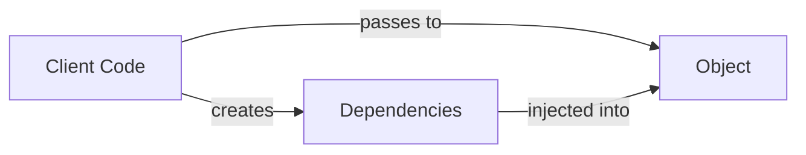
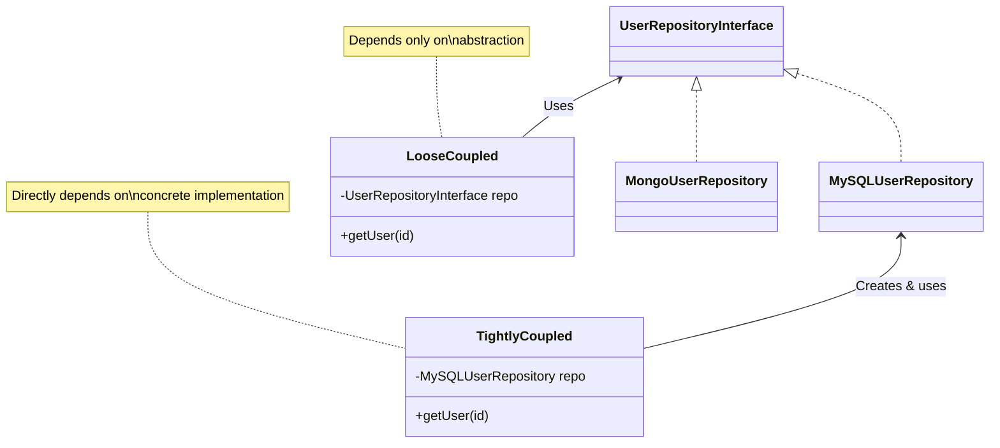

# 💉 Dependency Injection Explained

## What Is Dependency Injection? 🔍

Dependency Injection (DI) is a **design pattern** where objects receive their dependencies from external sources rather than creating them internally. It's a fundamental technique for achieving loose coupling between components.

> 💡 Looking for Dependency Injection Container? See [Dependency Injection Container](./09-dependency-injection-container.md)

## Core Concept 💡

The core principle is elegantly simple:

> **Don't create dependencies inside your class; accept them from outside.**



## Tight Coupling vs. Loose Coupling 🔗

### Tight Coupling ⛓️

When classes are tightly coupled, they depend directly on concrete implementations rather than abstractions:

```php
<?php
class UserService {
    private $repository;
    
    public function __construct() {
        // Direct dependency on concrete implementation
        $this->repository = new MySQLUserRepository();
    }
    
    public function getUser($id) {
        return $this->repository->findById($id);
    }
}

// Using tightly coupled code
$service = new UserService(); // No flexibility in repository choice
$user = $service->getUser(1);
```

### Loose Coupling 🔓

With loose coupling, classes depend on abstractions that can have multiple implementations:

```php
<?php
interface UserRepositoryInterface {
    public function findById($id);
}

class MySQLUserRepository implements UserRepositoryInterface {
    public function findById($id) {
        // MySQL implementation
    }
}

class MongoUserRepository implements UserRepositoryInterface {
    public function findById($id) {
        // MongoDB implementation
    }
}

class UserService {
    private $repository;
    
    // Depends on abstraction, not implementation
    public function __construct(UserRepositoryInterface $repository) {
        $this->repository = $repository;
    }
    
    public function getUser($id) {
        return $this->repository->findById($id);
    }
}

// Using loosely coupled code
$service = new UserService(new MySQLUserRepository());
// Or easily swap implementation:
$service = new UserService(new MongoUserRepository());
```

### Comparison Table

| Aspect | Tight Coupling | Loose Coupling |
|--------|---------------|----------------|
| **Dependency Management** | Hard-coded dependencies | Dependencies injected from outside |
| **Flexibility** | Difficult to change implementations | Easy to swap implementations |
| **Testability** | Hard to mock dependencies | Easy to provide test doubles |
| **Maintenance** | Changes in dependencies require modifying the class | Class remains unchanged when dependencies change |
| **Reusability** | Limited to specific implementations | Works with any compatible implementation |

### Visual Comparison



### Real-World Benefits of Loose Coupling

1. **Database Migration**: Switch from MySQL to PostgreSQL by just changing the injected repository.
2. **Testing**: Use an in-memory repository for unit tests without hitting the database.
3. **Feature Toggles**: Easily swap between implementations based on configuration.
4. **Scaling**: Replace simple implementations with more sophisticated ones as your app grows.
5. **A/B Testing**: Inject different implementations for different user segments.

## The Problem DI Solves ❌

Traditional code often creates its dependencies internally:

```php
<?php
// ❌ Hard dependencies - tightly coupled
class UserService {
    private $repository;
    
    public function __construct() {
        // Dependency created inside
        $this->repository = new MySQLUserRepository();
    }
}

// Usage
$service = new UserService();
```

**Issues with this approach:**
- 🔒 Tight coupling to specific implementations
- 🧪 Difficult to test (can't substitute dependencies)
- 🔄 Hard to change implementations
- 📝 Unclear dependencies (hidden implementation details)

## DI Solution ✅

With Dependency Injection:

```php
<?php
// ✅ Dependencies injected - loosely coupled
class UserService {
    private $repository;
    
    public function __construct(UserRepository $repository) {
        // Dependency provided from outside
        $this->repository = $repository;
    }
}

// Usage
$repository = new MySQLUserRepository(); // Or any implementation
$service = new UserService($repository);
```

**Benefits:**
- 🔓 Loose coupling to interfaces
- 🧪 Easy to test with mock repositories
- 🔄 Swap implementations without changing UserService
- 📝 Clear and explicit dependencies

## Types of Dependency Injection 🧩

### 1. Constructor Injection

```php
<?php
class UserService {
    private $repository;
    private $logger;
    
    // Dependencies injected via constructor
    public function __construct(
        UserRepository $repository,
        Logger $logger
    ) {
        $this->repository = $repository;
        $this->logger = $logger;
    }
}

// Usage
$service = new UserService(
    new MySQLUserRepository(),
    new FileLogger()
);
```

**Best for:** Required dependencies that should be available throughout the object's lifecycle.

### 2. Setter Injection

```php
<?php
class UserService {
    private $repository;
    private $logger;
    
    public function setRepository(UserRepository $repository): void {
        $this->repository = $repository;
    }
    
    public function setLogger(Logger $logger): void {
        $this->logger = $logger;
    }
}

// Usage
$service = new UserService();
$service->setRepository(new MySQLUserRepository());
$service->setLogger(new FileLogger());
```

**Best for:** Optional dependencies or when dependencies may change during the object's lifecycle.

### 3. Method Injection

```php
<?php
class ReportGenerator {
    public function generateReport(
        ReportData $data, 
        ReportFormatter $formatter
    ) {
        $processed = $this->processData($data);
        return $formatter->format($processed);
    }
}

// Usage
$generator = new ReportGenerator();
$report = $generator->generateReport(
    new SalesData(), 
    new PDFFormatter() // Inject formatter when needed
);
```

**Best for:** Dependencies needed for specific operations but not for the entire class.

## Real-World Example 🌟

```php
<?php
// Interfaces define contracts
interface UserRepository {
    public function findById(int $id): ?User;
    public function save(User $user): void;
}

interface Logger {
    public function info(string $message): void;
    public function error(string $message, array $context = []): void;
}

// Implementation with DI
class UserService {
    private $repository;
    private $logger;
    
    public function __construct(
        UserRepository $repository,
        Logger $logger
    ) {
        $this->repository = $repository;
        $this->logger = $logger;
    }
    
    public function registerUser(string $email, string $password): User {
        $this->logger->info("Registering: $email");
        
        $user = new User($email);
        $user->setPassword(password_hash($password, PASSWORD_DEFAULT));
        
        $this->repository->save($user);
        $this->logger->info("User registered: {$user->getId()}");
        
        return $user;
    }
}

// Usage
$service = new UserService(
    new MySQLUserRepository(new PDO('mysql:host=localhost;dbname=app')),
    new FileLogger('/var/log/app.log')
);

$user = $service->registerUser('john@example.com', 'secret123');

// Output:
// [INFO] Registering: john@example.com
// [INFO] User registered: 42
```

## Testing with DI 🧪

One major benefit of DI is testability:

```php
<?php
class UserServiceTest extends TestCase {
    public function testRegisterUser() {
        // Create mock objects
        $repository = $this->createMock(UserRepository::class);
        $logger = $this->createMock(Logger::class);
        
        // Set expectations
        $repository->expects($this->once())
            ->method('save')
            ->with($this->isInstanceOf(User::class));
        
        // Create service with mock dependencies
        $service = new UserService($repository, $logger);
        
        // Execute & verify
        $user = $service->registerUser('test@example.com', 'password');
        $this->assertEquals('test@example.com', $user->getEmail());
    }
}
```

## DI vs Service Locator 🔍

Don't confuse DI with the Service Locator pattern:

```php
<?php
// ❌ Service Locator (dependencies hidden inside)
class UserService {
    public function registerUser($email, $password) {
        $repository = ServiceLocator::get('userRepository');
        // Use the repository...
    }
}

// ✅ Dependency Injection (dependencies explicit)
class UserService {
    private $repository;
    
    public function __construct(UserRepository $repository) {
        $this->repository = $repository;
    }
    
    public function registerUser($email, $password) {
        // Use the injected repository...
    }
}
```

## Best Practices ✨

1. **📏 Depend on abstractions** (interfaces), not implementations
2. **🔨 Use constructor injection** for required dependencies
3. **🔧 Use setter injection** for optional dependencies
4. **🧩 Keep services focused** with clear responsibilities
5. **🔍 Make dependencies explicit** in method signatures
6. **📦 Consider a DI container** for complex applications

## When To Use Manual DI vs Container 🤔

| Manual Dependency Injection | DI Container |
|----------------------------|--------------|
| ✅ Small applications | ✅ Medium/large applications |
| ✅ Learning the pattern | ✅ Complex dependency graphs |
| ✅ Performance-critical code | ✅ When configuration changes often |
| ✅ Simple dependency chains | ✅ Need for lifecycle management |

## Framework Examples 🧰

### Symfony

```php
// services.yaml
services:
  app.user_repository:
    class: App\Repository\MySQLUserRepository
    
  app.user_service:
    class: App\Service\UserService
    arguments: ['@app.user_repository', '@logger']
```

### Laravel

```php
// ServiceProvider
public function register()
{
    $this->app->bind(UserRepository::class, MySQLUserRepository::class);
    
    // Automatic dependency resolution
    // Laravel container will inject dependencies automatically
}

// Controller
public function register(UserService $userService)
{
    // UserService and its dependencies automatically injected
}
```

## Up Next

Learn about the [Specification Pattern](./10-specification-pattern.md), which encapsulates business rules into modular, composable objects.

[Back to Enterprise Patterns](./README.md) | [Dependency Injection Container](./09-dependency-injection-container.md) | [Next: Specification Pattern](./10-specification-pattern.md)
